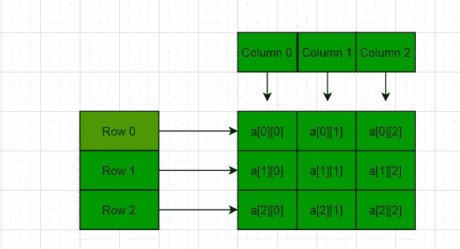
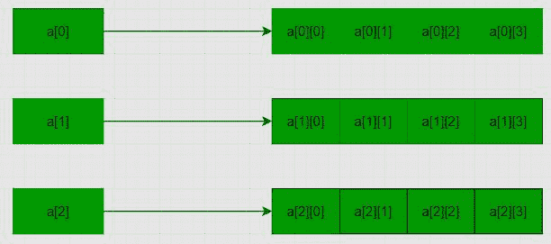

# 如何使用新运算符

在 C++中动态声明 2D 数组

> 原文:[https://www . geesforgeks . org/如何使用新运算符动态声明 2d 数组/](https://www.geeksforgeeks.org/how-to-declare-a-2d-array-dynamically-in-c-using-new-operator/)

**先决条件:** [数组基础](https://www.geeksforgeeks.org/arrays-in-c-language-set-1-introduction/)
在 [C](https://www.geeksforgeeks.org/c-programming-language/) / [C++](https://www.geeksforgeeks.org/c-plus-plus/) ，[多维数组](https://www.geeksforgeeks.org/multidimensional-arrays-c-cpp/)简单来说就是一个[数组](https://www.geeksforgeeks.org/introduction-to-arrays/)组成的数组。多维数组中的数据以表格形式存储(按行主顺序)。以下是声明 **N 维数组**的一般形式:

**<u>多维数组的语法</u> :**

> data _ type array _ name[size 1][size 2]…。[SiZen]；
> 
> **数据类型:**要存储在数组中的数据类型。
> 此处数据类型为有效的 C/C++数据类型
> **数组 _ 名称:**数组名称
> **尺寸 1、尺寸 2、…、尺寸 N:** 尺寸

[2D 阵列](https://www.geeksforgeeks.org/dynamically-allocate-2d-array-c/)是一维阵列的阵列。

**<u>2D 阵的语法</u> :**

> data _ type array _ name[x][y]；
> **数据类型:**要存储的数据类型。有效的 C/C++数据类型。

下面是 2D 阵列的图示:

[](https://media.geeksforgeeks.org/wp-content/uploads/20201119120413/gfg5.JPG)

关于多维和 2D 数组的更多细节，请参考 C++中的[多维数组](https://www.geeksforgeeks.org/multidimensional-arrays-c-cpp/)一文。

**问题:**给定一个 2D 数组，任务是使用 [C++](https://www.geeksforgeeks.org/c-plus-plus/) 中的[新](https://www.geeksforgeeks.org/malloc-vs-new/)为 2D 数组[动态分配内存](https://www.geeksforgeeks.org/what-is-dynamic-memory-allocation/)。

**解决方案:**用 3 行 4 列声明以下 2D 数组，值如下:

```
1 2 3 4
5 6 7 8
9 10 11 12
```

**注:**此处 **M** 为行数， **N** 为列数。

**方法 1:** 使用单个[指针](https://www.geeksforgeeks.org/pointers-in-c-and-c-set-1-introduction-arithmetic-and-array/)–在该方法中，分配大小为 **M*N** 的[存储块](https://www.geeksforgeeks.org/difference-between-malloc-and-calloc-with-examples/)，然后使用[指针算法](https://www.geeksforgeeks.org/pointer-arithmetics-in-c-with-examples/)访问存储块。下面是同样的程序:

## C++

```
// C++ program to dynamically allocate
// the memory for 2D array in C++
// using new operator
#include <iostream>
using namespace std;

// Driver Code
int main()
{
    // Dimensions of the 2D array
    int m = 3, n = 4, c = 0;

    // Declare a memory block of
    // size m*n
    int* arr = new int[m * n];

    // Traverse the 2D array
    for (int i = 0; i < m; i++) {
        for (int j = 0; j < n; j++) {

            // Assign values to
            // the memory block
            *(arr + i * n + j) = ++c;
        }
    }

    // Traverse the 2D array
    for (int i = 0; i < m; i++) {
        for (int j = 0; j < n; j++) {

            // Print values of the
            // memory block
            cout << *(arr + i * n + j)
                 << " ";
        }
        cout << endl;
    }

      //Delete the array created
      delete[] arr;

    return 0;
}
```

**Output:** 

```
1 2 3 4 
5 6 7 8 
9 10 11 12
```

**方法 2:** 使用[指针数组](https://www.geeksforgeeks.org/difference-between-pointer-to-an-array-and-array-of-pointers/):这里创建一个指针数组，然后指向每个内存块。下图说明了这一概念:



下面是同样的程序:

## C++

```
// C++ program to dynamically allocate
// the memory for 3D array in C++
// using new operator
#include <iostream>
using namespace std;

// Driver Code
int main()
{
    // Dimensions of the array
    int m = 3, n = 4, c = 0;

    // Declare memory block of size M
    int** a = new int*[m];

    for (int i = 0; i < m; i++) {

        // Declare a memory block
        // of size n
        a[i] = new int[n];
    }

    // Traverse the 2D array
    for (int i = 0; i < m; i++) {
        for (int j = 0; j < n; j++) {

            // Assign values to the
            // memory blocks created
            a[i][j] = ++c;
        }
    }

    // Traverse the 2D array
    for (int i = 0; i < m; i++) {
        for (int j = 0; j < n; j++) {

            // Print the values of
            // memory blocks created
            cout << a[i][j] << " ";
        }
        cout << endl;
    }

      //Delete the array created
      for(int i=0;i<m;i++)    //To delete the inner arrays
      delete [] a[i];   
      delete [] a;              //To delete the outer array
                              //which contained the pointers
                              //of all the inner arrays

      return 0;
}
```

**Output:** 

```
1 2 3 4 
5 6 7 8 
9 10 11 12
```