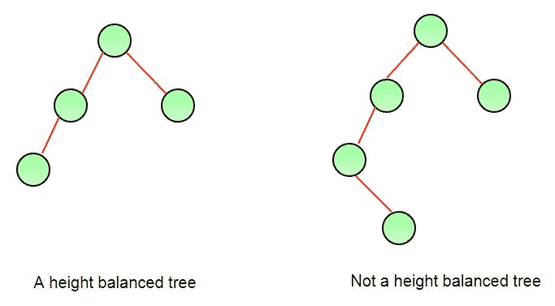

# 如何判断一棵二叉树是否高度平衡？

> 原文:[https://www . geesforgeks . org/如何确定二叉树是否平衡/](https://www.geeksforgeeks.org/how-to-determine-if-a-binary-tree-is-balanced/)

没有一片叶子比其他叶子离根更远的树。不同的平衡方案允许不同的“更远”的定义和不同的工作量来保持平衡。
考虑一个高度平衡方案，其中应检查以下条件以确定二叉树是否平衡。
一棵空树是高度平衡的。非空二叉树 T 是平衡的，如果:
1)T 的左子树是平衡的
2)T 的右子树是平衡的
3)左子树和右子树的高度差不大于 1。
以上高度平衡方案用于 AVL 树木。下图显示了两棵树，其中一棵树是高度平衡的，另一棵树不是。第二棵树是高度不均衡的，因为左边子树的高度比右边子树的高度多 2。



要检查树的高度是否平衡，请获取左右子树的高度。如果高度差不超过 1 且左右子树平衡，则返回 true，否则返回 false。

## C++

```
/* CPP program to check if
a tree is height-balanced or not */
#include <bits/stdc++.h>
using namespace std;

/* A binary tree node has data,
pointer to left child and
a pointer to right child */
class node {
public:
    int data;
    node* left;
    node* right;
};

/* Returns the height of a binary tree */
int height(node* node);

/* Returns true if binary tree
with root as root is height-balanced */
bool isBalanced(node* root)
{
    int lh; /* for height of left subtree */
    int rh; /* for height of right subtree */

    /* If tree is empty then return true */
    if (root == NULL)
        return 1;

    /* Get the height of left and right sub trees */
    lh = height(root->left);
    rh = height(root->right);

    if (abs(lh - rh) <= 1 && isBalanced(root->left) && isBalanced(root->right))
        return 1;

    /* If we reach here then
    tree is not height-balanced */
    return 0;
}

/* UTILITY FUNCTIONS TO TEST isBalanced() FUNCTION */

/* returns maximum of two integers */
int max(int a, int b)
{
    return (a >= b) ? a : b;
}

/* The function Compute the "height"
of a tree. Height is the number of
nodes along the longest path from
the root node down to the farthest leaf node.*/
int height(node* node)
{
    /* base case tree is empty */
    if (node == NULL)
        return 0;

    /* If tree is not empty then
    height = 1 + max of left
        height and right heights */
    return 1 + max(height(node->left),
                   height(node->right));
}

/* Helper function that allocates
a new node with the given data
and NULL left and right pointers. */
node* newNode(int data)
{
    node* Node = new node();
    Node->data = data;
    Node->left = NULL;
    Node->right = NULL;

    return (Node);
}

// Driver code
int main()
{
    node* root = newNode(1);
    root->left = newNode(2);
    root->right = newNode(3);
    root->left->left = newNode(4);
    root->left->right = newNode(5);
    root->left->left->left = newNode(8);

    if (isBalanced(root))
        cout << "Tree is balanced";
    else
        cout << "Tree is not balanced";
    return 0;
}

// This code is contributed by rathbhupendra
```

## C

```
/* C program to check if a tree is height-balanced or not */
#include <stdio.h>
#include <stdlib.h>
#define bool int

/* A binary tree node has data, pointer to left child
   and a pointer to right child */
struct node {
    int data;
    struct node* left;
    struct node* right;
};

/* Returns the height of a binary tree */
int height(struct node* node);

/* Returns true if binary tree with root as root is height-balanced */
bool isBalanced(struct node* root)
{
    int lh; /* for height of left subtree */
    int rh; /* for height of right subtree */

    /* If tree is empty then return true */
    if (root == NULL)
        return 1;

    /* Get the height of left and right sub trees */
    lh = height(root->left);
    rh = height(root->right);

    if (abs(lh - rh) <= 1 && isBalanced(root->left) && isBalanced(root->right))
        return 1;

    /* If we reach here then tree is not height-balanced */
    return 0;
}

/* UTILITY FUNCTIONS TO TEST isBalanced() FUNCTION */

/* returns maximum of two integers */
int max(int a, int b)
{
    return (a >= b) ? a : b;
}

/*  The function Compute the "height" of a tree. Height is the
    number of nodes along the longest path from the root node
    down to the farthest leaf node.*/
int height(struct node* node)
{
    /* base case tree is empty */
    if (node == NULL)
        return 0;

    /* If tree is not empty then height = 1 + max of left
      height and right heights */
    return 1 + max(height(node->left), height(node->right));
}

/* Helper function that allocates a new node with the
   given data and NULL left and right pointers. */
struct node* newNode(int data)
{
    struct node* node = (struct node*)
        malloc(sizeof(struct node));
    node->data = data;
    node->left = NULL;
    node->right = NULL;

    return (node);
}

int main()
{
    struct node* root = newNode(1);
    root->left = newNode(2);
    root->right = newNode(3);
    root->left->left = newNode(4);
    root->left->right = newNode(5);
    root->left->left->left = newNode(8);

    if (isBalanced(root))
        printf("Tree is balanced");
    else
        printf("Tree is not balanced");

    getchar();
    return 0;
}
```

## Java 语言(一种计算机语言，尤用于创建网站)

```
/* Java program to determine if binary tree is
   height balanced or not */

/* A binary tree node has data, pointer to left child,
   and a pointer to right child */
class Node {
    int data;
    Node left, right;
    Node(int d)
    {
        data = d;
        left = right = null;
    }
}

class BinaryTree {
    Node root;

    /* Returns true if binary tree with root as root is height-balanced */
    boolean isBalanced(Node node)
    {
        int lh; /* for height of left subtree */

        int rh; /* for height of right subtree */

        /* If tree is empty then return true */
        if (node == null)
            return true;

        /* Get the height of left and right sub trees */
        lh = height(node.left);
        rh = height(node.right);

        if (Math.abs(lh - rh) <= 1
            && isBalanced(node.left)
            && isBalanced(node.right))
            return true;

        /* If we reach here then tree is not height-balanced */
        return false;
    }

    /* UTILITY FUNCTIONS TO TEST isBalanced() FUNCTION */
    /*  The function Compute the "height" of a tree. Height is the
        number of nodes along the longest path from the root node
        down to the farthest leaf node.*/
    int height(Node node)
    {
        /* base case tree is empty */
        if (node == null)
            return 0;

        /* If tree is not empty then height = 1 + max of left
         height and right heights */
        return 1 + Math.max(height(node.left), height(node.right));
    }

    public static void main(String args[])
    {
        BinaryTree tree = new BinaryTree();
        tree.root = new Node(1);
        tree.root.left = new Node(2);
        tree.root.right = new Node(3);
        tree.root.left.left = new Node(4);
        tree.root.left.right = new Node(5);
        tree.root.left.left.left = new Node(8);

        if (tree.isBalanced(tree.root))
            System.out.println("Tree is balanced");
        else
            System.out.println("Tree is not balanced");
    }
}

// This code has been contributed by Mayank Jaiswal(mayank_24)
```

## 蟒蛇 3

```
"""
Python3 program to check if a tree is height-balanced
"""
# A binary tree Node

class Node:
    # Constructor to create a new Node
    def __init__(self, data):
        self.data = data
        self.left = None
        self.right = None

# function to find height of binary tree
def height(root):

    # base condition when binary tree is empty
    if root is None:
        return 0
    return max(height(root.left), height(root.right)) + 1

# function to check if tree is height-balanced or not
def isBalanced(root):

    # Base condition
    if root is None:
        return True

    # for left and right subtree height
    lh = height(root.left)
    rh = height(root.right)

    # allowed values for (lh - rh) are 1, -1, 0
    if (abs(lh - rh) <= 1) and isBalanced(
    root.left) is True and isBalanced( root.right) is True:
        return True

    # if we reach here means tree is not
    # height-balanced tree
    return False

# Driver function to test the above function
root = Node(1)
root.left = Node(2)
root.right = Node(3)
root.left.left = Node(4)
root.left.right = Node(5)
root.left.left.left = Node(8)
if isBalanced(root):
    print("Tree is balanced")
else:
    print("Tree is not balanced")

# This code is contributed by Shweta Singh
```

## C#

```
using System;

/* C# program to determine if binary tree is
height balanced or not */

/* A binary tree node has data, pointer to left child,
and a pointer to right child */
public class Node {
    public int data;
    public Node left, right;
    public Node(int d)
    {
        data = d;
        left = right = null;
    }
}

public class BinaryTree {
    public Node root;

    /* Returns true if binary tree with root as
    root is height-balanced */
    public virtual bool isBalanced(Node node)
    {
        int lh; // for height of left subtree

        int rh; // for height of right subtree

        /* If tree is empty then return true */
        if (node == null) {
            return true;
        }

        /* Get the height of left and right sub trees */
        lh = height(node.left);
        rh = height(node.right);

        if (Math.Abs(lh - rh) <= 1 && isBalanced(node.left)
            && isBalanced(node.right)) {
            return true;
        }

        /* If we reach here then tree is not height-balanced */
        return false;
    }

    /* UTILITY FUNCTIONS TO TEST isBalanced() FUNCTION */
    /* The function Compute the "height" of a tree. Height is the
        number of nodes along the longest path from the root node
        down to the farthest leaf node.*/
    public virtual int height(Node node)
    {
        /* base case tree is empty */
        if (node == null) {
            return 0;
        }

        /* If tree is not empty then height = 1 + max of left
        height and right heights */
        return 1 + Math.Max(height(node.left), height(node.right));
    }

    public static void Main(string[] args)
    {
        BinaryTree tree = new BinaryTree();
        tree.root = new Node(1);
        tree.root.left = new Node(2);
        tree.root.right = new Node(3);
        tree.root.left.left = new Node(4);
        tree.root.left.right = new Node(5);
        tree.root.left.left.left = new Node(8);

        if (tree.isBalanced(tree.root)) {
            Console.WriteLine("Tree is balanced");
        }
        else {
            Console.WriteLine("Tree is not balanced");
        }
    }
}

// This code is contributed by Shrikant13
```

**输出:**

```
Tree is not balanced
```

**时间复杂度:** O(n^2)在[全二叉树](https://www.geeksforgeeks.org/binary-tree-set-3-types-of-binary-tree/)的情况下。
**优化实现:**上述实现可以通过在同一个递归中计算高度来优化，而不是单独调用 height()函数。感谢 Amar 提出这个优化版本。这种优化将时间复杂度降低到 0(n)。

## C++

```
/* C++ program to check if a tree
is height-balanced or not */
#include <bits/stdc++.h>
using namespace std;
#define bool int

/* A binary tree node has data,
pointer to left child and
a pointer to right child */
class node {
public:
    int data;
    node* left;
    node* right;
};

/* The function returns true if root is
balanced else false The second parameter
is to store the height of tree. Initially,
we need to pass a pointer to a location with
value as 0\. We can also write a wrapper
over this function */
bool isBalanced(node* root, int* height)
{

    /* lh --> Height of left subtree
    rh --> Height of right subtree */
    int lh = 0, rh = 0;

    /* l will be true if left subtree is balanced
    and r will be true if right subtree is balanced */
    int l = 0, r = 0;

    if (root == NULL) {
        *height = 0;
        return 1;
    }

    /* Get the heights of left and right subtrees in lh and rh
    And store the returned values in l and r */
    l = isBalanced(root->left, &lh);
    r = isBalanced(root->right, &rh);

    /* Height of current node is max of heights of left and
    right subtrees plus 1*/
    *height = (lh > rh ? lh : rh) + 1;

    /* If difference between heights of left and right
    subtrees is more than 2 then this node is not balanced
    so return 0 */
    if (abs(lh - rh) >= 2)
        return 0;

    /* If this node is balanced and left and right subtrees
    are balanced then return true */
    else
        return l && r;
}

/* UTILITY FUNCTIONS TO TEST isBalanced() FUNCTION */

/* Helper function that allocates a new node with the
given data and NULL left and right pointers. */
node* newNode(int data)
{
    node* Node = new node();
    Node->data = data;
    Node->left = NULL;
    Node->right = NULL;

    return (Node);
}

// Driver code
int main()
{
    int height = 0;

    /* Constructed binary tree is
            1
            / \
            2 3
            / \ /
            4 5 6
            /
            7
    */
    node* root = newNode(1);
    root->left = newNode(2);
    root->right = newNode(3);
    root->left->left = newNode(4);
    root->left->right = newNode(5);
    root->right->left = newNode(6);
    root->left->left->left = newNode(7);

    if (isBalanced(root, &height))
        cout << "Tree is balanced";
    else
        cout << "Tree is not balanced";

    return 0;
}

// This is code is contributed by rathbhupendra
```

## C

```
/* C program to check if a tree is height-balanced or not */
#include <stdio.h>
#include <stdlib.h>
#define bool int

/* A binary tree node has data, pointer to left child
   and a pointer to right child */
struct node {
    int data;
    struct node* left;
    struct node* right;
};

/* The function returns true if root is balanced else false
   The second parameter is to store the height of tree. 
   Initially, we need to pass a pointer to a location with value
   as 0\. We can also write a wrapper over this function */
bool isBalanced(struct node* root, int* height)
{
    /* lh --> Height of left subtree
     rh --> Height of right subtree */
    int lh = 0, rh = 0;

    /* l will be true if left subtree is balanced
    and r will be true if right subtree is balanced */
    int l = 0, r = 0;

    if (root == NULL) {
        *height = 0;
        return 1;
    }

    /* Get the heights of left and right subtrees in lh and rh
    And store the returned values in l and r */
    l = isBalanced(root->left, &lh);
    r = isBalanced(root->right, &rh);

    /* Height of current node is max of heights of left and
     right subtrees plus 1*/
    *height = (lh > rh ? lh : rh) + 1;

    /* If difference between heights of left and right
     subtrees is more than 2 then this node is not balanced
     so return 0 */
    if (abs(lh - rh) >= 2)
        return 0;

    /* If this node is balanced and left and right subtrees
    are balanced then return true */
    else
        return l && r;
}

/* UTILITY FUNCTIONS TO TEST isBalanced() FUNCTION */

/* Helper function that allocates a new node with the
   given data and NULL left and right pointers. */
struct node* newNode(int data)
{
    struct node* node = (struct node*)
        malloc(sizeof(struct node));
    node->data = data;
    node->left = NULL;
    node->right = NULL;

    return (node);
}

// Driver code
int main()
{
    int height = 0;

    /* Constructed binary tree is
             1
           /   \
         2      3
       /  \    /
     4     5  6
    /
   7
  */
    struct node* root = newNode(1);
    root->left = newNode(2);
    root->right = newNode(3);
    root->left->left = newNode(4);
    root->left->right = newNode(5);
    root->right->left = newNode(6);
    root->left->left->left = newNode(7);

    if (isBalanced(root, &height))
        printf("Tree is balanced");
    else
        printf("Tree is not balanced");

    getchar();
    return 0;
}
```

## Java 语言(一种计算机语言，尤用于创建网站)

```
/* Java program to determine if binary tree is
   height balanced or not */

/* A binary tree node has data, pointer to left child,
   and a pointer to right child */
class Node {

    int data;
    Node left, right;

    Node(int d)
    {
        data = d;
        left = right = null;
    }
}

// A wrapper class used to modify height across
// recursive calls.
class Height {
    int height = 0;
}

class BinaryTree {

    Node root;

    /* Returns true if binary tree with root as root is height-balanced */
    boolean isBalanced(Node root, Height height)
    {
        /* If tree is empty then return true */
        if (root == null) {
            height.height = 0;
            return true;
        }

        /* Get heights of left and right sub trees */
        Height lheight = new Height(), rheight = new Height();
        boolean l = isBalanced(root.left, lheight);
        boolean r = isBalanced(root.right, rheight);
        int lh = lheight.height, rh = rheight.height;

        /* Height of current node is max of heights of
           left and right subtrees plus 1*/
        height.height = (lh > rh ? lh : rh) + 1;

        /* If difference between heights of left and right
           subtrees is more than 2 then this node is not balanced
           so return 0 */
        if (Math.abs(lh - rh) >= 2)
            return false;

        /* If this node is balanced and left and right subtrees
           are balanced then return true */
        else
            return l && r;
    }

    public static void main(String args[])
    {
        Height height = new Height();

        /* Constructed binary tree is
                   1
                 /   \
                2      3
              /  \    /
            4     5  6
            /
           7         */
        BinaryTree tree = new BinaryTree();
        tree.root = new Node(1);
        tree.root.left = new Node(2);
        tree.root.right = new Node(3);
        tree.root.left.left = new Node(4);
        tree.root.left.right = new Node(5);
        tree.root.right.right = new Node(6);
        tree.root.left.left.left = new Node(7);

        if (tree.isBalanced(tree.root, height))
            System.out.println("Tree is balanced");
        else
            System.out.println("Tree is not balanced");
    }
}

// This code has been contributed by Mayank Jaiswal(mayank_24)
```

## 蟒蛇 3

```
"""
Python3 program to check if Binary tree is
height-balanced
"""

# A binary tree node
class Node:

    # constructor to create node of
    # binary tree
    def __init__(self, data):
        self.data = data
        self.left = self.right = None

# utility class to pass height object
class Height:
    def __init__(self):
        self.height = 0

# function to find height of binary tree
def height(root):

    # base condition when binary tree is empty
    if root is None:
        return 0
    return max(height(root.left), height(root.right)) + 1

# helper function to check if binary
# tree is height balanced
def isBalanced(root):
    # Base condition when tree is
    # empty return true
    if root is None:
        return True

    # lh and rh to store height of
    # left and right subtree
    lh = Height()
    rh = Height()

    # Calculating height of left and right tree
    lh.height = height(root.left)
    rh.height = height(root.right)

    # l and r are used to check if left
    # and right subtree are balanced
    l = isBalanced(root.left)
    r = isBalanced(root.right)

    # height of tree is maximum of
    # left subtree height and
    # right subtree height plus 1

    if abs(lh.height - rh.height) <= 1:
        return l and r

    # if we reach here then the tree
    # is not balanced
    return False

# Driver function to test the above function
"""
Constructed binary tree is
            1
        / \
        2     3
    / \ /
    4 5 6 / 7
"""
# to store the height of tree during traversal

root = Node(1)
root.left = Node(2)
root.right = Node(3)
root.left.left = Node(4)
root.left.right = Node(5)
root.right.left = Node(6)
root.left.left.left = Node(7)

if isBalanced(root):
    print('Tree is balanced')
else:
    print('Tree is not balanced')

# This code is contributed by Shubhank Gupta
```

## C#

```
using System;

/* C# program to determine if binary tree is
   height balanced or not */

/* A binary tree node has data, pointer to left child,
   and a pointer to right child */
public class Node {

    public int data;
    public Node left, right;

    public Node(int d)
    {
        data = d;
        left = right = null;
    }
}

// A wrapper class used to modify height across
// recursive calls.
public class Height {
    public int height = 0;
}

public class BinaryTree {

    public Node root;

    /* Returns true if binary tree with root as root is height-balanced */
    public virtual bool isBalanced(Node root, Height height)
    {
        /* If tree is empty then return true */
        if (root == null) {
            height.height = 0;
            return true;
        }

        /* Get heights of left and right sub trees */
        Height lheight = new Height(), rheight = new Height();
        bool l = isBalanced(root.left, lheight);
        bool r = isBalanced(root.right, rheight);
        int lh = lheight.height, rh = rheight.height;

        /* Height of current node is max of heights of
           left and right subtrees plus 1*/
        height.height = (lh > rh ? lh : rh) + 1;

        /* If difference between heights of left and right
           subtrees is more than 2 then this node is not balanced
           so return 0 */
        if (Math.Abs(lh - rh) >= 2) {
            return false;
        }

        /* If this node is balanced and left and right subtrees
           are balanced then return true */
        else {
            return l && r;
        }
    }

    /*  The function Compute the "height" of a tree. Height is the
        number of nodes along the longest path from the root node
        down to the farthest leaf node.*/
    public virtual int height(Node node)
    {
        /* base case tree is empty */
        if (node == null) {
            return 0;
        }

        /* If tree is not empty then height = 1 + max of left
         height and right heights */
        return 1 + Math.Max(height(node.left), height(node.right));
    }

    public static void Main(string[] args)
    {
        Height height = new Height();

        /* Constructed binary tree is
                   1
                 /   \
                2      3
              /  \    /
            4     5  6
            /
           7         */
        BinaryTree tree = new BinaryTree();
        tree.root = new Node(1);
        tree.root.left = new Node(2);
        tree.root.right = new Node(3);
        tree.root.left.left = new Node(4);
        tree.root.left.right = new Node(5);
        tree.root.right.right = new Node(6);
        tree.root.left.left.left = new Node(7);

        if (tree.isBalanced(tree.root, height)) {
            Console.WriteLine("Tree is balanced");
        }
        else {
            Console.WriteLine("Tree is not balanced");
        }
    }
}

// This code is contributed by Shrikant13
```

**输出**T2】

```
Tree is balanced
```

**时间复杂度:**O(n)
T3】辅助空间: O(n)

Asked in: [Amazon](https://practice.geeksforgeeks.org/company/Amazon/), [Belzabar](https://practice.geeksforgeeks.org/company/Belzabar/), [Goldman Sachs](https://practice.geeksforgeeks.org/company/Goldman Sachs/), [InMobi](https://practice.geeksforgeeks.org/company/InMobi/), [Intel](https://practice.geeksforgeeks.org/company/Intel/), [Microsoft](https://practice.geeksforgeeks.org/company/Microsoft/), [Paytm](https://practice.geeksforgeeks.org/company/Paytm/), [Synopsys](https://practice.geeksforgeeks.org/company/Synopsys/), [Walmart](https://practice.geeksforgeeks.org/company/Walmart/), [Zillious](https://practice.geeksforgeeks.org/company/Zillious/)

如果您发现上述任何代码/算法不正确，请写下评论，或者找到其他方法来解决相同的问题。