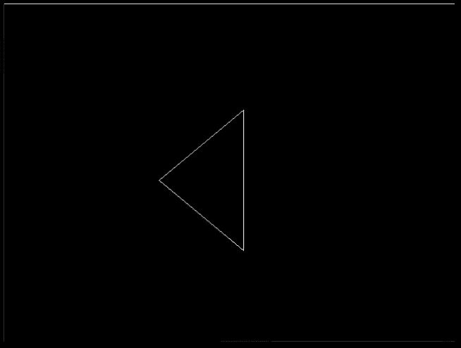
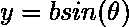
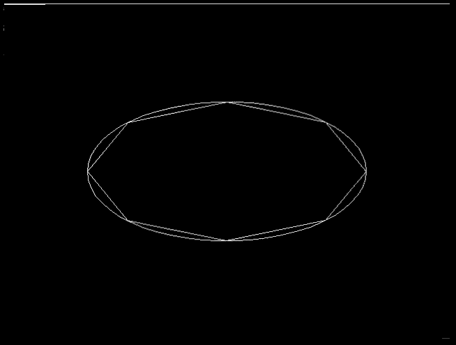

# 如何用 C++ Graphics 将椭圆或圆离散成多边形？

> 原文:[https://www . geeksforgeeks . org/如何使用 c-graphics 将椭圆或圆离散为多边形/](https://www.geeksforgeeks.org/how-to-discretize-an-ellipse-or-circle-to-a-polygon-using-c-graphics/)

在本文中，我们将看到如何将椭圆(或圆)离散成多边形。由于圆只是椭圆的一个特例，我们就不单独讨论如何将圆离散成多边形了！

### 为什么要把椭圆离散成多边形？

离散化有几种应用，其中最重要的两种是:

*   **渲染曲线:**曲线不能直接在屏幕上渲染。它们首先需要近似为多边形(在圆和椭圆的情况下)或链式线段(在贝塞尔曲线和样条的情况下)，离散化服务于该目的！ *****
*   **碰撞检测:**虽然检查像圆和贝塞尔曲线这样的曲线的交点很简单，但是像椭圆这样的曲线太复杂了，精确检查它们的交点效率很低！因此，它们首先被离散为简单的形状，如矩形，多边形等，可以有效地检测碰撞！

> ***** 虽然可以用 Bresengham 的算法一个像素一个像素地渲染曲线，但往往不是最好的做法！由于现代图形处理器已经变得更加强大，他们可以渲染一系列的像素，而没有任何膨胀！还一个像素一个像素地画任何曲线，消除了批处理和 GPU“记忆”的可能性！而且由于现代中央处理器的工作方式[三角函数](https://www.geeksforgeeks.org/trigonometric-functions-in-java-with-examples/)不再“计算昂贵”(至少大多数时候)！

**概念验证:**所以离散化椭圆的主要思想是将椭圆分解成代表多边形的顶点，从而自动计算多边形的线段数或由客户端用户给出！对于这个例子，我们不会自动计算线段数！

我们将使用 C Borland 图形应用编程接口，但同样的原则可以应用于任何图形库！Linux 用户可能想用 [SDL libgraph](https://www.geeksforgeeks.org/add-graphics-h-c-library-gcc-compiler-linux/) 来代替 Borland 图形库！此外，我们将使用 C++而不是 C 来使用 STL 提供的内置`pair`数据结构(以及稍后将派上用场的函数重载)！

### 渲染多边形:

事实证明，博兰图形应用编程接口实际上并不像现代图形库那样具有多格式多边形渲染功能！这里有 [drawPoly](https://www.geeksforgeeks.org/drawpoly-function-c/) 和 [fillPoly](https://www.geeksforgeeks.org/fillpoly-function-c/) 但是多边形的表示对一些人来说可能没有意义，并且它可能会导致我们一些指针问题。所以我们要实现自己的多边形渲染功能！我们将把一个多边形表示为代表多边形顶点的整数对的向量！这样做的主要好处是向量总是知道它的大小，不像数组，它在引擎盖下只是一个未知边界的指针。

无论如何，这是我们在 Borland 图形库中渲染多边形的代码:-

```
#include <algorithm>
#include <graphics.h>
using namespace std;

typedef pair<int, int> vertex;

void polygon(vector<vertex>& vertices)
{
    for (int i = 0, n = vertices.size(); i < n; i++) {

        vertex current = vertices[i], next;
        next = vertices[(i == n - 1) ? 0 : i + 1];
        int x1 = current.first, y1 = current.second;
        int x2 = next.first, y2 = next.second;
        line(x1, y1, x2, y2);
    }
}

// Driver code
int main()
{
    int gd = DETECT, gm;

    // initialize graphics library
    initgraph(&gd, &gm, "");

    vector<vertex> vertices;
    vertices.push_back(vertex(340, 150));
    vertices.push_back(vertex(220, 250));
    vertices.push_back(vertex(340, 350));

    polygon(vertices);
    delay(5000);
}
```

**输出:**
[](https://media.geeksforgeeks.org/wp-content/uploads/20191220133907/polygon3.png)

### 将椭圆离散为多边形:

现在，我们可以渲染多边形，我们准备将一个椭圆离散为一个多边形！

所以离散化椭圆的关键是要有一个移动点，以相等的间隔在椭圆上移动，并在每个这样的点(移动点经过的每个点)上创建一个顶点！为此，必须知道椭圆的参数形式是:-




基于上面的公式，下面的代码片段将我们的椭圆离散为多边形

```
#define TWO_PI 44 / 7.0f

vector<vertex> discretizeEllipse(
    int x, int y,
    int a, int b,
    int seg)
{

    float angle_shift = TWO_PI / seg, phi = 0;
    vector<vertex> vertices;
    for (int i = 0; i < seg; ++i) {
        phi += angle_shift;
        vertices
            .push_back(
                vertex(
                    x + a * cos(phi),
                    y + b * sin(phi)));
    }
    return vertices;
}
```

剩下最后一件事就是*重载*函数，这样就不需要最后一个参数了！我们可以将`segments`设置为某个默认值，但我们希望它基于椭圆的尺寸来计算！这是第二个过载

```
vector<vertex> discretizeEllipse(
    int x, int y,
    int a, int b)
{
    int segments
        = max((int)floor(
                  sqrt(((a + b) / 2) * 20)),
              8);
    return discretizeEllipse(
        x, y,
        a, b,
        segments);
}
```

结束这篇文章，这里是完整的源代码:

```
#include <algorithm>
#include <graphics.h>

#define TWO_PI 44 / 7.0f
typedef pair<int, int> vertex;

void polygon(vector<vertex> vertices)
{
    for (int i = 0, n = vertices.size(); i < n; i++) {
        vertex current = vertices[i], next;
        next = vertices[(i == n - 1) ? 0 : i + 1];
        int x1 = current.first, y1 = current.second;
        int x2 = next.first, y2 = next.second;
        line(x1, y1, x2, y2);
    }
}

vector<vertex> discretizeEllipse(
    int x, int y, int a,
    int b, int seg)
{
    float angle_shift = TWO_PI / seg, phi = 0;
    vector<vertex> vertices;
    for (int i = 0; i < seg; ++i) {
        phi += angle_shift;
        vertices.push_back(
            vertex(
                x + a * cos(phi),
                y + b * sin(phi)));
    }

    return vertices;
}

vector<vertex> discretizeEllipse(
    int x, int y, int a, int b)
{
    int segments
        = max((int)floor(
                  sqrt(((a + b) / 2) * 20)),
              8);

    return discretizeEllipse(
        x, y, a, b, segments);
}

int main()
{
    int gd = DETECT, gm;

    // initialize graphics library
    initgraph(&gd, &gm, "");

    polygon(discretizeEllipse(320, 240, 200, 100));
    polygon(discretizeEllipse(320, 240, 200, 100, 8));

    delay(5000);
}
```

**输出:**
[](https://media.geeksforgeeks.org/wp-content/uploads/20191220122908/ellipse5.png)