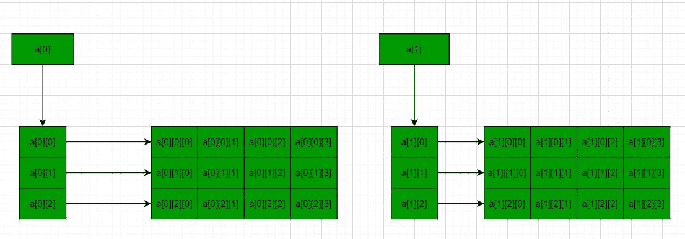

# 如何在 C++中动态分配 3D 数组

> 原文:[https://www . geeksforgeeks . org/如何动态分配 c 中 3d 阵列/](https://www.geeksforgeeks.org/how-to-dynamically-allocate-a-3d-array-in-c/)

**先决条件:** [数组基础](https://www.geeksforgeeks.org/arrays-in-c-language-set-1-introduction/)
在 [C](https://www.geeksforgeeks.org/c-programming-language/) / [C++](https://www.geeksforgeeks.org/c-plus-plus/) ，[多维数组](https://www.geeksforgeeks.org/multidimensional-arrays-c-cpp/)简单来说就是一个[数组](https://www.geeksforgeeks.org/introduction-to-arrays/)组成的数组。多维数组中的数据以表格形式存储(按行主顺序)。以下是声明 **N 维数组**的一般形式:

**<u>多维数组的语法</u> :**

> data _ type array _ name[size 1][size 2]…。[SiZen]；
> 
> **数据类型:**要存储在数组中的数据类型。
> 此处数据类型为有效的 C/C++数据类型
> **数组 _ 名称:**数组名称
> **尺寸 1、尺寸 2、…、尺寸 N:** 尺寸

**<u>三维阵列是二维阵列的阵列</u> :**

**3D 数组的语法:**

> data _ type array _ name[x][y][z]；
> 数据类型:要存储的数据类型。有效的 C/C++数据类型。

关于多维和三维数组的更多细节，请参考 C++中的[多维数组](https://www.geeksforgeeks.org/multidimensional-arrays-c-cpp/)一文。

**<u>问题</u> :** 给定一个 3D 数组，任务是使用 C++中的[新](https://www.geeksforgeeks.org/new-and-delete-operators-in-cpp-for-dynamic-memory/)为 3D 数组动态分配内存。

**解决方案:**在以下方法中，使用的方法是制作两个二维数组，每个二维数组有 3 行 4 列，具有以下值。

```
1 2 3 4
5 6 7 8
9 10 11 12

13 14 15 16
17 18 19 20
21 22 23 24
```

> **X =**2D 阵列数。
> **Y =** 各 2D 阵排数。
> **Z =** 每个 2D 阵列的列数。

**方法 1:** 使用单个[指针](https://www.geeksforgeeks.org/pointers-in-c-and-c-set-1-introduction-arithmetic-and-array/)–在该方法中，分配大小为 **x*y*z** 的[存储块](https://www.geeksforgeeks.org/difference-between-malloc-and-calloc-with-examples/)，然后使用[指针算法](https://www.geeksforgeeks.org/pointer-arithmetics-in-c-with-examples/)访问存储块。下面是同样的程序:

## C++

```
// C++ program to dynamically allocate
// the memory for 3D array in C++
// using new operator
#include <iostream>
using namespace std;

// Driver Code
int main()
{
    // Dimensions of the 3D array
    int x = 2, y = 3, z = 4;
    int count = 0;

    // Allocate memory blocks
    // of size x*y*z
    int* a = new int[x * y * z];

    // Traverse the 3D array
    for (int i = 0; i < x; i++) {
        for (int j = 0; j < y; j++) {
            for (int k = 0; k < z; k++) {

                // Assign values to the
                // memory blocks created
                *(a + i * y * z + j * z + k) = ++count;
            }
        }
    }

    // Traverse the 3D array again
    for (int i = 0; i < x; i++) {
        for (int j = 0; j < y; j++) {
            for (int k = 0; k < z; k++) {

                // Print values of the
                // memory blocks created
                cout << *(a + i * y * z + j * z + k) << " ";
            }
            cout << endl;
        }
        cout << endl;
    }

    // Deallocate memory
    delete[] a;

    return 0;
}
```

**Output:** 

```
1 2 3 4 
5 6 7 8 
9 10 11 12 

13 14 15 16 
17 18 19 20 
21 22 23 24
```

**方法二:**使用三重[指针](https://www.geeksforgeeks.org/pointers-in-c-and-c-set-1-introduction-arithmetic-and-array/)–下图说明了这个概念:



下面是同样的程序:

## C++

```
// C++ program to dynamically allocate
// the memory for 3D array in C++
// using new operator
#include <iostream>
using namespace std;

// Driver Code
int main()
{

    // Dimensions of the 3D array
    int x = 2, y = 3, z = 4;
    int count = 0;

    // Allocate memory blocks of size
    // x i.e., no of 2D Arrays
    int*** a = new int**[x];

    for (int i = 0; i < x; i++) {

        // Allocate memory blocks for
        // rows of each 2D array
        a[i] = new int*[y];

        for (int j = 0; j < y; j++) {

            // Allocate memory blocks for
            // columns of each 2D array
            a[i][j] = new int[z];
        }
    }

    for (int i = 0; i < x; i++) {
        for (int j = 0; j < y; j++) {
            for (int k = 0; k < z; k++) {

                // Assign values to the
                // memory blocks created
                a[i][j][k] = ++count;
            }
        }
    }

    for (int i = 0; i < x; i++) {
        for (int j = 0; j < y; j++) {
            for (int k = 0; k < z; k++) {

                // Print values of the
                // memory blocks created
                cout << a[i][j][k] << " ";
            }
            cout << endl;
        }
        cout << endl;
    }

    // Deallocate memory
    for (int i = 0; i < x; i++) {
        for (int j = 0; j < y; j++) {
            delete[] a[i][j];
        }
        delete[] a[i];
    }
    delete[] a;

    return 0;
}
```

**Output:** 

```
1 2 3 4 
5 6 7 8 
9 10 11 12 

13 14 15 16 
17 18 19 20 
21 22 23 24
```