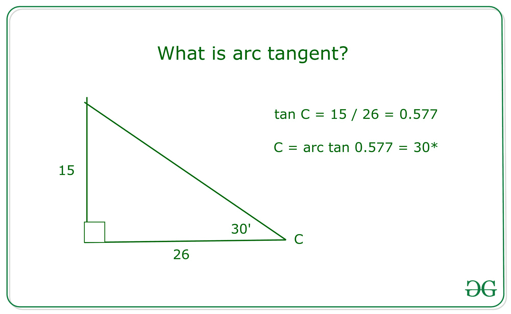

# 如何用例题求反正切

> 原文:[https://www . geesforgeks . org/how-to-arctangent-with-examples/](https://www.geeksforgeeks.org/how-to-find-arctangent-with-examples/)

### **<u>什么是反正切？</u>T3】**

**反正切**是正切函数的倒数。它返回正切为给定数字的角度。

[](https://media.geeksforgeeks.org/wp-content/uploads/20200819061730/arctan.jpg)

***catan()*** 是[***<complex . h>***](https://www.geeksforgeeks.org/complex-h-header-file-in-c-with-examples/)头文件中的一个内置函数，它返回任意常数的复数[反正切(或反正切)](https://en.wiktionary.org/wiki/arctangent)，在闭合区间***【-I，+I】***(其中 I 代表 iota)，用于评估一个复杂对象**说**

| **序列号** | **方法**

 | **返回类型** |
| **1。** | ***atan()*** 函数接受数据类型为 double 的**复数 z** ,确定实数的反正切 | 对于双精度类型的参数，返回位于沿实轴 ***[-PI/2，+PI/2]*** 范围内的复反正切。 |
| **2。** | ***atanf()*** 函数采用数据类型的复数 z 来确定实数的反正切。 | 对于 float 类型的参数，返回位于沿实轴 ***[-PI/2，+PI/2]*** 范围内的复反正切。 |
| **3。** | ***atanl()*** 函数取一个数据类型长双精度的**复数 z** ，它决定了实数的反正切 | 对于长双精度类型的参数，返回位于沿实轴 ***[-PI/2，+PI/2]*** 范围内的复反正切。 |
| **4。**

 | ***catan()*** 函数接受数据类型为 double 的**复数 z** ，这也允许复数的虚部 | 对于类型为 double 的复杂对象，返回位于沿假想轴 ***[-i，+i]*** 的范围内的复反正切 |
| **5。** | ***catanf()*** 函数接受一个数据类型为 float double 的**复数 z** ，它也允许复数的虚部 | 对于浮点类型的复杂对象，返回位于沿假想轴 ***[-i，+i]*** 的范围内的复反正切 |
| **6。** | ***catanl()*** 函数采用数据类型长双精度的**复数 z** ，这也允许复数的虚部 | 对于长双精度类型的复杂对象，返回位于沿假想轴 ***[-i，+i]*** 的范围内的复反正切 |

**语法:**

```
atan(double arg);
atanf(float arg);
atanl(long double arg);
where arg is a floating-point value

catan(double complex z);
catanf(float complex z);
catanl( long double complex z);
where z is a Type – generic macro

```

**参数:**这些函数接受一个强制参数 **z** ，指定反正切。参数可以是[双精度、浮点或长双精度数据类型](https://www.geeksforgeeks.org/c-data-types/)。

**返回值:**该函数根据传递的参数类型返回[复反正切/反正切](https://math.stackexchange.com/questions/2520464/arc-tangent-of-a-complex-number)。

下面是说明上述方法的程序:

**<u>程序 1</u> :** 该程序将说明函数 **atan()** 、 **atanf()** 和 **atanl()** 计算浮点参数反正切的主值。如果由于下溢而出现范围误差，则舍入后返回正确的结果。

## C

```
// C program to illustrate the use
// of functions atan(), atanf(),
// and atanl()
#include <math.h>
#include <stdio.h>

// Driver Code
int main()
{
    // For function atan()
    printf("atan(1) = %lf, ",
           atan(1));
    printf(" 4*atan(1)=%lf\n",
           4 * atan(1));

    printf("atan(-0.0) = %+lf, ",
           atan(-0.0));
    printf("atan(+0.0) = %+lf\n",
           atan(0));

    // For special values INFINITY
    printf("atan(Inf) = %lf, ",
           atan(INFINITY));
    printf("2*atan(Inf) = %lf\n\n",
           2 * atan(INFINITY));

    // For function atanf()
    printf("atanf(1.1) = %f, ",
           atanf(1.1));
    printf("4*atanf(1.5)=%f\n",
           4 * atanf(1.5));

    printf("atanf(-0.3) = %+f, ",
           atanf(-0.3));
    printf("atanf(+0.3) = %+f\n",
           atanf(0.3));

    // For special values INFINITY
    printf("atanf(Inf) = %f, ",
           atanf(INFINITY));
    printf("2*atanf(Inf) = %f\n\n",
           2 * atanf(INFINITY));

    // For function atanl()
    printf("atanl(1.1) = %Lf, ",
           atanl(1.1));
    printf("4*atanl(1.7)=%Lf\n",
           4 * atanl(1.7));

    printf("atanl(-1.3) = %+Lf, ",
           atanl(-1.3));
    printf("atanl(+0.3) = %+Lf\n",
           atanl(0.3));

    // For special values INFINITY
    printf("atanl(Inf) = %Lf, ",
           atanl(INFINITY));
    printf("2*atanl(Inf) = %Lf\n\n",
           2 * atanl(INFINITY));

    return 0;
}
```

**Output:**

```
atan(1) = 0.785398,  4*atan(1)=3.141593
atan(-0.0) = -0.000000, atan(+0.0) = +0.000000
atan(Inf) = 1.570796, 2*atan(Inf) = 3.141593

atanf(1.1) = 0.832981, 4*atanf(1.5)=3.931175
atanf(-0.3) = -0.291457, atanf(+0.3) = +0.291457
atanf(Inf) = 1.570796, 2*atanf(Inf) = 3.141593

atanl(1.1) = 0.832981, 4*atanl(1.7)=4.156289
atanl(-1.3) = -0.915101, atanl(+0.3) = +0.291457
atanl(Inf) = 1.570796, 2*atanl(Inf) = 3.141593

```

**<u>程序 2</u> :** 该程序将说明函数 **catan()** 、 **catanf()** 、 **catanl()** 计算复数反正切的主值作为自变量。

## C

```
// C program to illustrate the use
// of functions catan(), catanf(),
// and catanl()
#include <complex.h>
#include <float.h>
#include <stdio.h>

// Driver Code
int main()
{
    // Given Complex Number
    double complex z1 = catan(2 * I);

    // Function catan()
    printf("catan(+0 + 2i) = %lf + %lfi\n",
           creal(z1), cimag(z1));

    // Complex(0, + INFINITY)
    double complex z2 = 2
                        * catan(2 * I * DBL_MAX);
    printf("2*catan(+0 + i*Inf) = %lf%+lfi\n",
           creal(z2), cimag(z2));

    printf("\n");

    // Function catanf()
    float complex z3 = catanf(2 * I);
    printf("catanf(+0 + 2i) = %f + %fi\n",
           crealf(z3), cimagf(z3));

    // Complex(0, + INFINITY)
    float complex z4 = 2
                       * catanf(2 * I * DBL_MAX);
    printf("2*catanf(+0 + i*Inf) = %f + %fi\n",
           crealf(z4), cimagf(z4));

    printf("\n");

    // Function catanl()
    long double complex z5 = catanl(2 * I);
    printf("catan(+0+2i) = %Lf%+Lfi\n",
           creall(z5), cimagl(z5));

    // Complex(0, + INFINITY)
    long double complex z6 = 2
                             * catanl(2 * I * DBL_MAX);
    printf("2*catanl(+0 + i*Inf) = %Lf + %Lfi\n",
           creall(z6), cimagl(z6));
}
```

**Output:**

```
catan(+0 + 2i) = 1.570796 + 0.549306i
2*catan(+0 + i*Inf) = 3.141593+0.000000i

catanf(+0 + 2i) = 1.570796 + 0.549306i
2*catanf(+0 + i*Inf) = 3.141593 + 0.000000i

catan(+0+2i) = 1.570796+0.549306i
2*catanl(+0 + i*Inf) = 3.141593 + 0.000000i

```

**<u>程序 3</u> :** 该程序将说明函数 **catanh()** 、 **catanhf()** 、 **catanhl()** 计算 **z** 沿实轴和区间**【-I * PI/2、+I * PI/2】**的复弧双曲正切。

## C

```
// C program to illustrate the use
// of functions  catanh(), catanhf(),
// and catanhl()
#include <complex.h>
#include <stdio.h>

// Driver Code
int main()
{
    // Function catanh()
    double complex z1 = catanh(2);
    printf("catanh(+2+0i) = %lf%+lfi\n",
           creal(z1), cimag(z1));

    // for any z, atanh(z) = atan(iz)/i
    // I denotes Imaginary
    // part of the complex number
    double complex z2 = catanh(1 + 2 * I);
    printf("catanh(1+2i) = %lf%+lfi\n\n",
           creal(z2), cimag(z2));

    // Function catanhf()
    float complex z3 = catanhf(2);
    printf("catanhf(+2+0i) = %f%+fi\n",
           crealf(z3), cimagf(z3));

    // for any z, atanh(z) = atan(iz)/i
    float complex z4 = catanhf(1 + 2 * I);
    printf("catanhf(1+2i) = %f%+fi\n\n",
           crealf(z4), cimagf(z4));

    // Function catanh()
    long double complex z5 = catanhl(2);
    printf("catanhl(+2+0i) = %Lf%+Lfi\n",
           creall(z5), cimagl(z5));

    // for any z, atanh(z) = atan(iz)/i
    long double complex z6 = catanhl(1 + 2 * I);
    printf("catanhl(1+2i) = %Lf%+Lfi\n\n",
           creall(z6), cimagl(z6));
}
```

**Output:**

```
catanh(+2+0i) = 0.549306+1.570796i
catanh(1+2i) = 0.173287+1.178097i

catanhf(+2+0i) = 0.549306+1.570796i
catanhf(1+2i) = 0.173287+1.178097i

catanhl(+2+0i) = 0.549306+1.570796i
catanhl(1+2i) = 0.173287+1.178097i

```