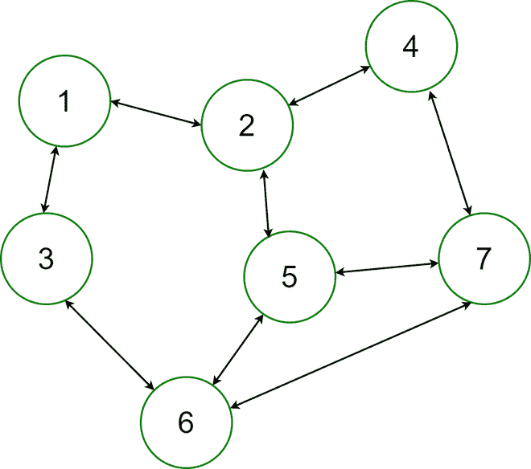

# 如何在 Java 中生成给定边数的随机无向图？

> 原文:[https://www . geesforgeks . org/如何为给定的 java 边数生成随机无向图/](https://www.geeksforgeeks.org/how-to-generate-a-random-undirected-graph-for-a-given-number-of-edges-in-java/)

无向图是[图](https://www.geeksforgeeks.org/graph-and-its-representations/)，即连接在一起的一组对象(称为顶点或节点)，其中所有的边都是双向的。无向图有时被称为无向网络。相反，边指向一个方向的图叫做有向图。



无向图:双向

**示例:**

```
Input:
Enter the number of Edges :
5
Output:
The Generated Random Graph is :
1 -> { 5 2  }
2 -> { 1  }
3 -> { Isolated Vertex! }      
4 -> { 6  }
5 -> { 1  }
6 -> { 4 10  }
7 -> { Isolated Vertex! }      
8 -> { 10  }
9 -> { Isolated Vertex! }      
10 -> { 8 6  }

Input:
Enter the number of Edges :
10
Output:
The Generated Random Graph is :
1 -> { 4 9  }
2 -> { 8  }
3 -> { 8  }
4 -> { 1 6  }
5 -> { 6  }
6 -> { 10 5 8 9 4  }
7 -> { 8  }
8 -> { 7 3 6 2  }
9 -> { 1 6  }
10 -> { 6  }
```

**进场:**

*   输入随机有向无环图的边数。
*   迭代地在两个随机顶点之间建立连接。
*   如果某个顶点的度数为零，则断言“孤立顶点”。

**实施:**

## Java 语言(一种计算机语言，尤用于创建网站)

```
// Java program to Generate a Random Undirected Graph
// for a GivenNumber of Edges

// importing generic packages
import java.util.*;
import java.util.Random;

public class RandomUG {
    static int maxVertex = 10;

    // Function to generate random graph
    public static void generateRandomGraphs(int e)
    {
        int i = 0, j = 0, count = 0;

        int[][] edge = new int[e][2];
        Random rand = new Random();

        // Build a connection between two random vertex
        while (i < e) {
            edge[i][0] = rand.nextInt(maxVertex) + 1;
            edge[i][1] = rand.nextInt(maxVertex) + 1;

            // using rand to pick a random integer in range
            // of (1 - maxVertex)
            i++;
        }

        System.out.println(
            "The Generated Random Graph is :");

        // Print the Graph
        for (i = 0; i < maxVertex; i++) {
            count = 0;

            System.out.print((i + 1) + " -> { ");

            for (j = 0; j < e; j++) {
                if (edge[j][0] == i + 1) {
                    System.out.print(edge[j][1] + " ");
                    count++;
                }

                else if (edge[j][1] == i + 1) {
                    System.out.print(edge[j][0] + " ");
                    count++;
                }

                // print “Isolated vertex” for the vertex
                // having zero degree.
                else if (j == e - 1 && count == 0)
                    System.out.print("Isolated Vertex!");
            }
            System.out.print(" }\n");
        }
    }

    public static void main(String args[]) throws Exception
    {
        int e = 6;
        System.out.println("Enter the number of Edges : " +e);

        // Function to generate a Random unDirected Graph
        generateRandomGraphs(e);
    }
}
```

**Output**

```
Enter the number of Edges : 6
The Generated Random Graph is :
1 -> { 8  }
2 -> { 2  }
3 -> { Isolated Vertex! }
4 -> { 5  }
5 -> { 4 6  }
6 -> { 5  }
7 -> { 9  }
8 -> { 1 10  }
9 -> { 7  }
10 -> { 8  }
```