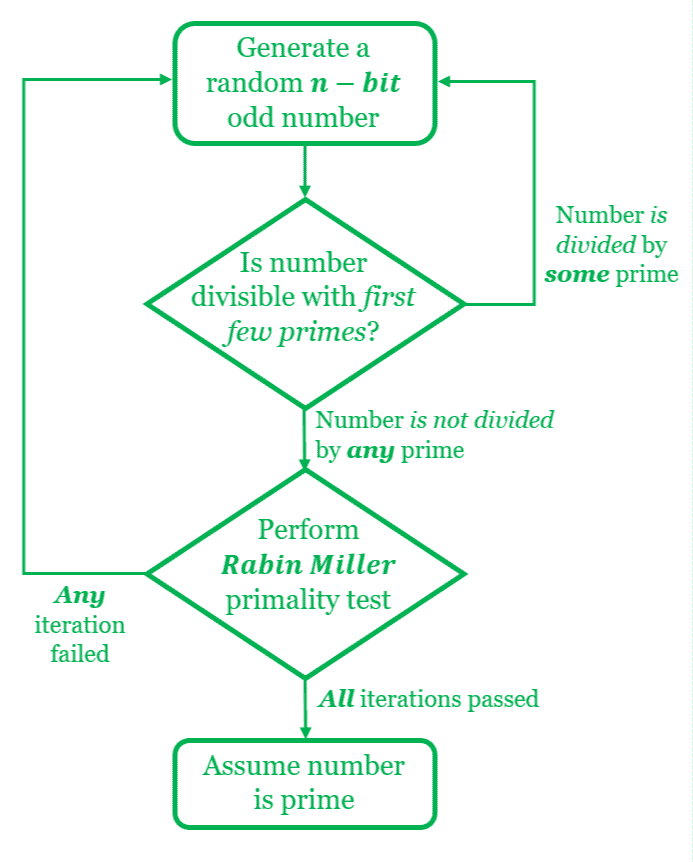
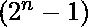
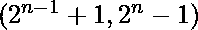

# 如何为 RSA 算法生成大素数

> 原文:[https://www . geesforgeks . org/如何为 rsa 算法生成大素数/](https://www.geeksforgeeks.org/how-to-generate-large-prime-numbers-for-rsa-algorithm/)

[**RSA 算法**](https://www.geeksforgeeks.org/rsa-algorithm-cryptography/) 的安全性是基于分解非常大的数字的难度。一个 RSA 密码系统的建立包括两个大素数的产生，比如说 **p** 和 **q** ，由此计算出 RSA 模为 **n = p * q** 。模数越大，RSA 系统的安全级别越高。大多数设置推荐的 RSA 模数大小为 *2048* 位至 *4096* 位。因此，要生成的素数需要是 *1024* 位到 *2048* 位长。对于如此大的素数的合成，我们依赖于找到具有令人满意的高概率水平的素数，而不是依赖于确定性方法。

## 大型素数生成过程:

*   目标是高效地计算具有指定比特大小的非常大的随机素数。手动实现随机素数生成器的标准方法如下，该生成器可以生成具有令人满意的精度水平的素数:
    1.  用所需的位大小预选一个随机数
    2.  确保所选数字不能被前几百个素数整除(这些素数是预先生成的)
    3.  基于可接受的错误率，应用一定次数的 [**拉宾·米勒素性检验**](https://www.geeksforgeeks.org/primality-test-set-3-miller-rabin/) 迭代，以得到一个可能是素的数

[](https://media.geeksforgeeks.org/wp-content/uploads/20200515202847/flow6-1.png)

**图 1:** 生成 RSA 大素数的步骤

### 以下是实施上述程序的步骤:

**1。选择随机的主要候选人**

*   n 位随机数的产生意味着随机数在 0 和范围内。生成随机数时需要考虑以下几点:
    1.  必须避免挑选小素数，如 3，5，7…，因为 RSA 模的因式分解将变得微不足道。因此，必须注意不要有太多的前导零。这可以通过总是使最高位= 1 来实现
    2.  由于所有素数(> 2)都是奇数，为了获得更好的性能，可以只选择奇数
*   因此，我们选择范围内的任意一个随机数

## 蟒蛇 3

```
def nBitRandom(n):

    # Returns a random number
    # between 2**(n-1)+1 and 2**n-1'''
    return(random.randrange(2**(n-1)+1, 2**n-1))
```

**2。第一素数除法** ***(低级素数测试)***

*   这一步是一个低级素性测试，需要预先计算前几百个素(使用厄拉多塞的 [**筛**](https://www.geeksforgeeks.org/sieve-of-eratosthenes/))。
*   候选素数被预先生成的素数除，以检查可除性。如果候选素数能被这些预先生成的素数完全整除，测试就会失败，必须挑选并测试一个新的候选素数。只要找到一个与我们生成的素数列表中的所有素数互质的值，就重复这个过程

## 蟒蛇 3

```
def getLowLevelPrime(n):
    '''Generate a prime candidate divisible
      by first primes'''

    # Repeat until a number satisfying
    # the test isn't found
    while True: 

        # Obtain a random number
        prime_candidate = nBitRandom(n) 

        for divisor in first_primes_list: 
            if prime_candidate % divisor == 0
            and divisor**2 <= prime_candidate:
                break
            # If no divisor found, return value
            else: return prime_candidate
```

**3。拉宾·米勒素性测试** ***(高级素性测试)***

*   然后，通过低级测试的主要候选人再次使用拉宾米勒主要测试进行测试。
*   对于非常大的数字，例如 RSA 中使用的数字，确定性测试所选值是否为质数是非常不切实际的，因为它需要不合理的计算资源。
*   因此，概率方法是优选的。如果一个输入值通过拉宾米勒检验的一次迭代，该数为素数的概率为 **75%** 。
*   因此，通过测试的候选人，足够的次数，可以被认为是一个概率水平令人满意的质数。
*   通常，在商业应用中，我们要求错误概率小于。

## 蟒蛇 3

```
def isMillerRabinPassed(miller_rabin_candidate):
    '''Run 20 iterations of Rabin Miller Primality test'''

    maxDivisionsByTwo = 0
    evenComponent = miller_rabin_candidate-1

    while evenComponent % 2 == 0:
        evenComponent >>= 1
        maxDivisionsByTwo += 1
    assert(2**maxDivisionsByTwo * evenComponent == miller_rabin_candidate-1)

    def trialComposite(round_tester):
        if pow(round_tester, evenComponent, 
               miller_rabin_candidate) == 1:
            return False
        for i in range(maxDivisionsByTwo):
            if pow(round_tester, 2**i * evenComponent,
                   miller_rabin_candidate) 
            == miller_rabin_candidate-1:
                return False
        return True

    # Set number of trials here
    numberOfRabinTrials = 20
    for i in range(numberOfRabinTrials):
        round_tester = random.randrange(2,
                       miller_rabin_candidate)
        if trialComposite(round_tester):
            return False
    return True
```

**4。结合以上步骤生成代码**

*   最后，我们可以结合上述函数创建一个三步过程来生成大素数。步骤如下
    1.  通过调用**nBitRandom(*****)**生成随机数*
    2.  *通过调用**getlow level prime(***prime _ 候选者* **)** 进行基本除法测试*
    3.  *拉宾·米勒测试通过调用**is millerrabinpassed(*****)****
*   **如果选择的随机值通过了所有素数测试，它将作为 n 位素数返回。否则，在测试失败的情况下，选择一个新的随机值并测试其素性。重复该过程，直到找到所需的素数。**

****以下是上述方法**的完整实现**

## **蟒蛇 3**

```
**# Large Prime Generation for RSA
import random

# Pre generated primes
first_primes_list = [2, 3, 5, 7, 11, 13, 17, 19, 23, 29,
                     31, 37, 41, 43, 47, 53, 59, 61, 67,
                     71, 73, 79, 83, 89, 97, 101, 103,
                     107, 109, 113, 127, 131, 137, 139,
                     149, 151, 157, 163, 167, 173, 179,
                     181, 191, 193, 197, 199, 211, 223,
                     227, 229, 233, 239, 241, 251, 257,
                     263, 269, 271, 277, 281, 283, 293,
                     307, 311, 313, 317, 331, 337, 347, 349]

def nBitRandom(n):
    return random.randrange(2**(n-1)+1, 2**n - 1)

def getLowLevelPrime(n):
    '''Generate a prime candidate divisible
    by first primes'''
    while True:
        # Obtain a random number
        pc = nBitRandom(n)

         # Test divisibility by pre-generated
         # primes
        for divisor in first_primes_list:
            if pc % divisor == 0 and divisor**2 <= pc:
                break
        else: return pc

def isMillerRabinPassed(mrc):
    '''Run 20 iterations of Rabin Miller Primality test'''
    maxDivisionsByTwo = 0
    ec = mrc-1
    while ec % 2 == 0:
        ec >>= 1
        maxDivisionsByTwo += 1
    assert(2**maxDivisionsByTwo * ec == mrc-1)

    def trialComposite(round_tester):
        if pow(round_tester, ec, mrc) == 1:
            return False
        for i in range(maxDivisionsByTwo):
            if pow(round_tester, 2**i * ec, mrc) == mrc-1:
                return False
        return True

    # Set number of trials here
    numberOfRabinTrials = 20
    for i in range(numberOfRabinTrials):
        round_tester = random.randrange(2, mrc)
        if trialComposite(round_tester):
            return False
    return True

if __name__ == '__main__':
    while True:
        n = 1024
        prime_candidate = getLowLevelPrime(n)
        if not isMillerRabinPassed(prime_candidate):
            continue
        else:
            print(n, "bit prime is: \n", prime_candidate)
            break**
```

****Output:** 1024 bit prime is: 178542003245811211274167228297361192303886321036074276889145691522634525820185614278499562592134188995169731066418203258297035264969457638591284906658912408319763156912951486020761069099132619194489006875108217247513715271974383296142805846405783845170862140174184507256128825312324419293575432423822703857091  **

****注:**Python 中大型素数的库生成**

****pycrypto** 库是安全散列函数和各种加密算法的综合集合。它还包括加密/解密设置中通常需要的基本功能，如随机数生成和随机素数生成。使用 **pycrypto getPrime** 模块可以实现生成具有指定比特大小的随机素数的目标。
生成随机 n 位素数的语法是:**

## **蟒蛇 3**

```
**from Crypto.Util import number
number.getPrime(n)**
```