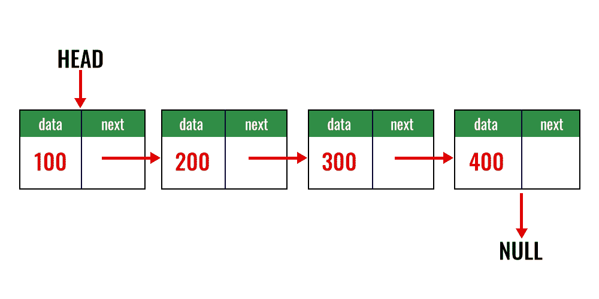

# 如何在 Java 中实现泛型链表？

> 原文:[https://www . geesforgeks . org/如何实现-generic-linked list-in-Java/](https://www.geeksforgeeks.org/how-to-implement-generic-linkedlist-in-java/)

链表是在节点中存储值的线性数据结构。正如我们在这里所知道的，每个节点拥有两个属性，即节点的值和到下一个节点的链接(如果存在的话)。链表不仅可以是整数数据类型，还可以是字符串、布尔、浮点、字符等。我们可以实现这样一个“通用”的链表数据类型，它可以存储任何数据类型的值。

链表有 6 个主要成员函数:E

*   add _data):它在链表的末尾添加了一个柠檬
*   add(位置，数据):它将一个元素添加到链表中的任何有效位置
*   移除(键):它从链表中移除包含键的节点
*   clear():它清除整个链表
*   empty():它检查链表是否为空
*   length():返回链表的长度

> **注意:**时间复杂度对于添加和移除操作为 N 阶，对于其他操作为 1 阶。

**图示:**整数链表{100，200，300，400}表示如下



**实施:**

**例**

## Java 语言(一种计算机语言，尤用于创建网站)

```
// Java Program to Implement Generic  Linked List

// Importing all input output classes
import java.io.*;

// Class 1
// Helper Class (Generic node class for LinkedList)
class node<T> {

    // Data members
    // 1\. Storing value of node
    T data;
    // 2\. Storing address of next node
    node<T> next;

    // Parameterized constructor to assign value
    node(T data)
    {

        // This keyword refers to current object itself
        this.data = data;
        this.next = null;
    }
}

// Class 2
// Helper class ( Generic LinkedList class)
class list<T> {

    // Generic node instance
    node<T> head;
    // Data member to store length of list
    private int length = 0;

    // Default constructor
    list() { this.head = null; }
    // Method
    // To add node at the end of List
    void add(T data)
    {

        // Creating new node with given value
        node<T> temp = new node<>(data);

        // Checking if list is empty
        // and assigning new value to head node
        if (this.head == null) {
            head = temp;
        }

        // If list already exists
        else {

            // Temporary node for traversal
            node<T> X = head;

            // Iterating till end of the List
            while (X.next != null) {
                X = X.next;
            }

            // Adding new valued node at the end of the list
            X.next = temp;
        }

        // Increasing length after adding new node
        length++;
    }

    // Method
    // To add new node at any given position
    void add(int position, T data)
    {

        // Checking if position is valid
        if (position > length + 1) {

            // Display message only
            System.out.println(
                "Position Unavailable in LikedList");
            return;
        }

        // If new position is head then replace head node
        if (position == 1) {

            // Temporary node that stores previous head
            // value
            node<T> temp = head;

            // New valued node stored in head
            head = new node<T>(data);

            // New head node pointing to old head node
            head.next = temp;

            return;
        }

        // Temporary node for traversal
        node<T> temp = head;

        // Dummy node with null value that stores previous
        // node
        node<T> prev = new node<T>(null);
        // iterating to the given position
        while (position - 1 > 0) {
            // assigning previous node
            prev = temp;
            // incrementing next node
            temp = temp.next;
            // decreasing position counter
            position--;
        }
        // previous node now points to new value
        prev.next = new node<T>(data);
        // new value now points to former current node
        prev.next.next = temp;
    }
    // Method
    // To remove a node from list
    void remove(T key)
    {

        //  NOTE
        // dummy node is used to represent the node before
        // the current node Since in a Singly Linked-List we
        // cannot go backwards from a node, we use a dummy
        // node to represent the previous node. In case of
        // head node, since there is no previous node, the
        // previous node is assigned to null.

        // Dummy node with null value
        node<T> prev = new node<>(null);

        // Dummy node pointing to head node
        prev.next = head;

        // Next node that points ahead of current node
        node<T> next = head.next;

        // Temporary node for traversal
        node<T> temp = head;

        // Boolean value that checks whether value to be
        // deleted exists or not
        boolean exists = false;

        // If head node needs to be deleted
        if (head.data == key) {
            head = head.next;

            // Node to be deleted exists
            exists = true;
        }

        // Iterating over LinkedList
        while (temp.next != null) {

            // We convert value to be compared into Strings
            // and then compare using
            // String1.equals(String2) method

            // Comparing value of key and current node
            if (String.valueOf(temp.data).equals(
                    String.valueOf(key))) {

                // If node to be deleted is found previous
                // node now points to next node skipping the
                // current node
                prev.next = next;
                // node to be deleted exists
                exists = true;

                // As soon as we find the node to be deleted
                // we exit the loop
                break;
            }

            // Previous node now points to current node
            prev = temp;

            // Current node now points to next node
            temp = temp.next;

            // Next node points the node ahead of current
            // node
            next = temp.next;
        }

        // Comparing the last node with the given key value
        if (exists == false
            && String.valueOf(temp.data).equals(
                String.valueOf(key))) {

            // If found , last node is skipped over
            prev.next = null;

            // Node to be deleted exists
            exists = true;
        }

        // If node to be deleted exists
        if (exists) {

            // Length of LinkedList reduced
            length--;
        }

        // If node to be deleted does not exist
        else {

            // Print statement
            System.out.println(
                "Given Value is not present in linked list");
        }
    }

    // Method
    // To clear the entire LinkedList
    void clear()
    {

        // Head now points to null
        head = null;
        // length is 0 again
        length = 0;
    }

    // Method
    // Returns whether List is empty or not
    boolean empty()
    {

        // Checking if head node points to null
        if (head == null) {
            return true;
        }
        return false;
    }
    // Method
    // Returning the length of LinkedList
    int length() { return this.length; }

    // Method
    // To display the LinkedList
    // @Override
    public String toString()
    {

        String S = "{ ";

        node<T> X = head;

        if (X == null)
            return S + " }";

        while (X.next != null) {
            S += String.valueOf(X.data) + " -> ";
            X = X.next;
        }

        S += String.valueOf(X.data);
        return S + " }";
    }
}

// Class 3
// Main Class
public class GFG {

    // main driver method
    public static void main(String[] args)
    {

        // Integer List

        // Creating new empty Integer linked list
        list<Integer> list1 = new list<>();
        System.out.println(
            "Integer LinkedList created as list1 :");
        // Adding elements to the above List object

        // Element 1 - 100
        list1.add(100);
        // Element 2 - 200
        list1.add(200);
        // Element 3 - 300
        list1.add(300);

        // Display message only
        System.out.println(
            "list1 after adding 100,200 and 300 :");

        // Print and display the above List elements
        System.out.println(list1);

        // Removing 200 from list1
        list1.remove(200);

        // Display message only
        System.out.println("list1 after removing 200 :");

        // Print and display again updated List elements
        System.out.println(list1);

        // String LinkedList

        // Creating new empty String linked list
        list<String> list2 = new list<>();
        System.out.println(
            "\nString LinkedList created as list2");
        // Adding elements to the above List object

        // Element 1 - hello
        list2.add("hello");

        // Element 2 - world
        list2.add("world");

        // Display message only
        System.out.println(
            "list2 after adding hello and world :");

        // Print current elements only
        System.out.println(list2);

        // Now, adding element 3- "GFG" at position 2
        list2.add(2, "GFG");

        // Display message only
        System.out.println(
            "list2 after adding GFG at position 2 :");

        // now print the updated List again
        // after inserting element at second position
        System.out.println(list2);

        // Float LinkedList

        // Creating new empty Float linked list
        list<Float> list3 = new list<>();

        // Display message only
        System.out.println(
            "\nFloat LinkedList created as list3");

        // Adding elements to the above List

        // Element 1 - 20.25
        list3.add(20.25f);
        // Element 2 - 50.42
        list3.add(50.42f);
        // Element 3 - 30.99
        list3.add(30.99f);

        // Display message only
        System.out.println(
            "list3 after adding 20.25, 50.42 and 30.99 :");

        // Print and display List elements
        System.out.println(list3);

        // Display message only
        System.out.println("Clearing list3 :");

        // Now.clearing this list using clear() method
        list3.clear();

        // Now, print and display the above list again
        System.out.println(list3);
    }
}
```

**输出:-**

```
Integer LinkedList created as list1 :
list1 after adding 100,200 and 300 :
{ 100 -&gt; 200 -&gt; 300 }
list1 after removing 200 :
{ 100 -&gt; 300 }

String LinkedList created as list2
list2 after adding hello and world :
{ hello -&gt; world }
list2 after adding GFG at position 2 :
{ hello -&gt; GFG -&gt; world }

Float LinkedList created as list3
list3 after adding 20.25, 50.42 and 30.99 :
{ 20.25 -&gt; 50.42 -&gt; 30.99 }
Clearing list3 :
{  }
```