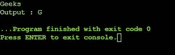
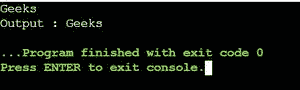
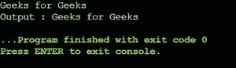
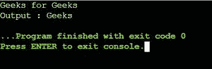
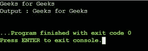

# 如何在 C 语言中输入或读取用户输入的字符、单词和句子？

> 原文:[https://www . geeksforgeeks . org/如何从 c 语言用户输入或读取字符、单词和句子/](https://www.geeksforgeeks.org/how-to-input-or-read-a-character-word-and-a-sentence-from-user-in-c/)

[【C】](https://www.geeksforgeeks.org/c-programming-language/)是一种程序化编程语言。它最初是由丹尼斯·里奇开发的一种系统编程语言，用来编写操作系统。C 语言的主要特点包括对内存的低级访问、一组简单的关键字、一个干净的风格，这些特点使得 C 语言适合像操作系统或编译器开发这样的系统编程。本文主要讨论如何在 c 语言中输入一个字符、一个字符串和一个句子

**读 C 语言中的一个字符**

****问题陈述#1:** 编写一个 C 程序，以 C 语言读取单个字符作为输入**

****语法-****

```
scanf("%c", &charVariable);
```

****进场-****

1.  **[scanf()](https://www.geeksforgeeks.org/scanf-and-fscanf-in-c-simple-yet-poweful/) 需要知道一个变量的存储位置，以便存储用户的输入。**
2.  **因此，将在变量(这里是 ch)前面使用&符号来知道变量的地址。**
3.  **这里使用%c 格式说明符，当使用 scanf()函数进行输入时，编译器可以理解数据的字符类型在变量中**

## **C**

```
// C program to implement
// the above approach
#include <stdio.h>

// Driver code
int main()
{
    char ch;

    // Read a char type variable,
    // store in "ch"
    scanf("%c", &ch);
    printf("Output : %c", ch);
    return 0;
}
```

 **

**用 C 语言读一个单词**

****问题陈述#2:** 编写一个 C 程序来读取用户输入的单词。**

****语法-****

```
scanf("%s", stringvariable);
```

****进场-****

1.  **首先，初始化大小为(大于等于字长)的[字符数组](https://www.geeksforgeeks.org/convert-string-char-array-cpp/)。**
2.  **然后，使用 [%s 格式说明符](https://www.geeksforgeeks.org/format-specifiers-in-c/)使用 scanf()函数获取字符串。**

## **C**

```
// C Program to implement
// the above approach
#include <stdio.h>

// Driver code
int main()
{
    char word[100];

    // word is treated as a pointer
    // to the first element of array
    scanf("%s", word);
    printf("Output : %s", word);
    return 0;
}
```

 **

**注:**
数组名本身表示其地址。word == & word[0]，这两个都是一样的。这是因为变量名字指向数组的第一个元素。所以，没有必要在 scanf()中提到&符号。

**读 C 语言中的一个句子**

****问题陈述#3:** 编写一个 C 程序来读取用户输入的句子。**

****方法 1-****

1.  **scanf()不会将空白字符存储在字符串变量中。**
2.  **它只读取空白以外的字符，并将它们存储在指定的字符数组中，直到遇到空白字符。**

****语法-****

```
scanf("%[^\n]s", sen)
```

## **C**

```
// C program to implement
// the above approach
#include <stdio.h>

// Driver code
int main()
{
    char sen[100];
    scanf("%[^\n]s", sen);
    printf("Output : %s", sen);
    return 0;
}
```

**

**scanf("%[^\n]s，sen)** 表示读取包含空格的字符串，直到接收到下一行，或者读取字符串，直到遇到换行符，即\n，并将其存储在名为“sen”的数组中。

1.  这里，%[ ]是扫描集说明符。
2.  scanf 将只处理属于 scanset 的那些字符。
3.  如果扫描集的第一个字符是'^'，则说明符将在该字符第一次出现后停止读取。
4.  ^\n 代表接受输入，直到没有遇到换行符。

## C

```
// C program to implement
// the above approach
#include <stdio.h>

// Driver code
int main()
{
    char sen[100];
    scanf("%[^f]s", sen);
    printf("Output : %s", sen);
    return 0;
}
```



在第一次出现该字符f(在扫描集中指定)后，它将停止读取。

**方法 2-** 使用 **fgets**

**注意-**get()从不检查输入字符的最大限制。因此，它们可能导致未定义的行为，并可能导致缓冲区溢出错误，最终导致程序崩溃。因此，建议不要使用 get 函数来读取字符串。为了克服上述限制，可以使用 fgets。

**语法-**

```
char *fgets(char *str, int size, FILE *stream)
```

## C

```
// C program to implement
// the above approach
#include <stdio.h>
#define BUFFSIZE 25

// Driver code
int main()
{
    char sen[BUFFSIZE];
    fgets(sen, BUFFSIZE, stdin);
    printf("Output : %s", sen);
    return 0;
}
```

******