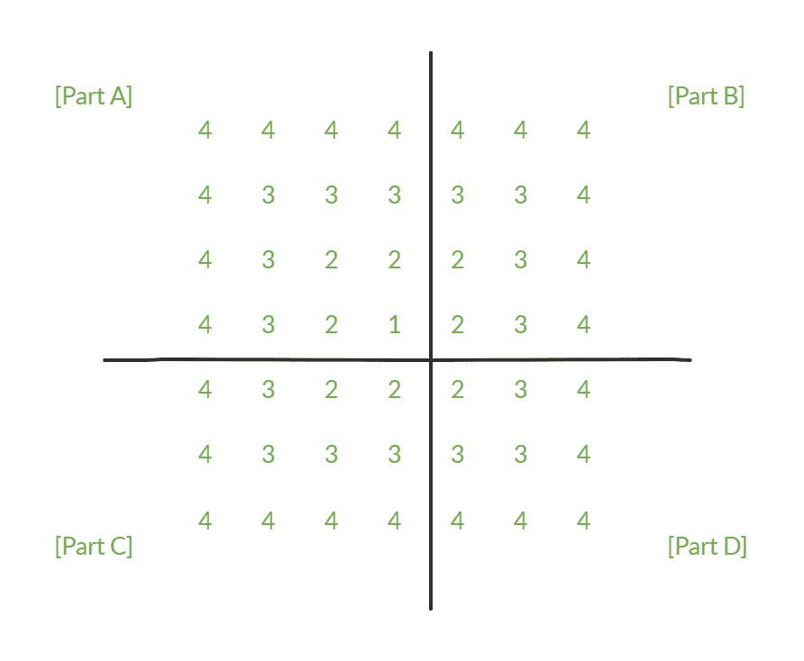
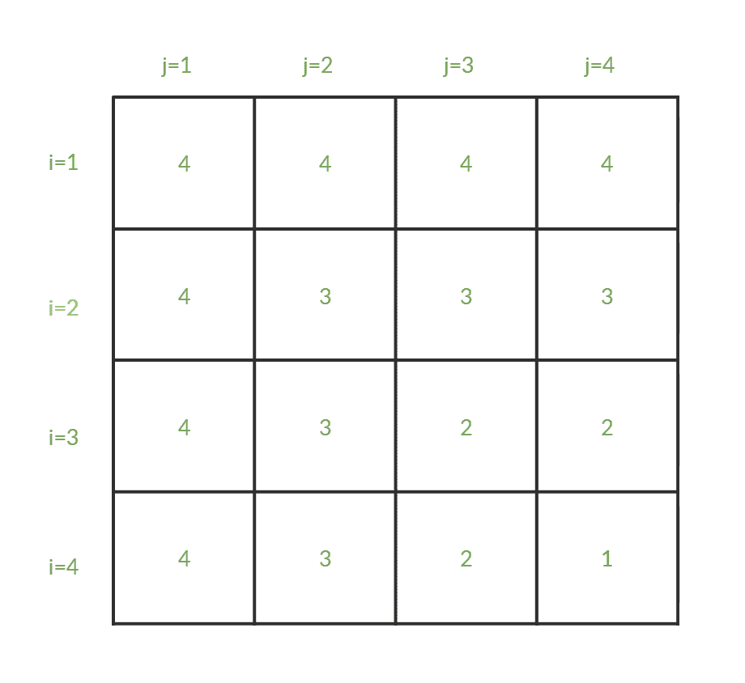
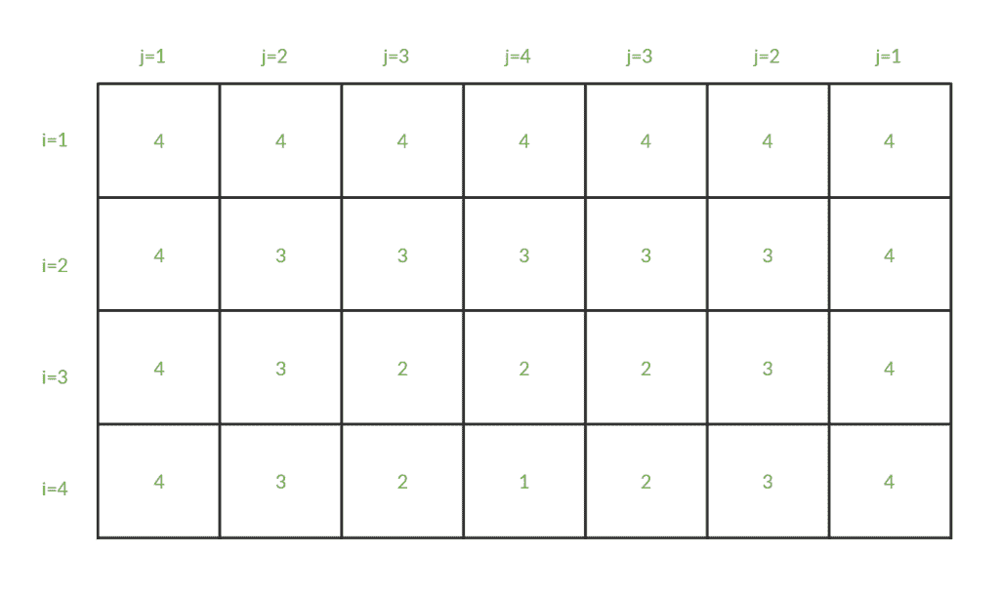
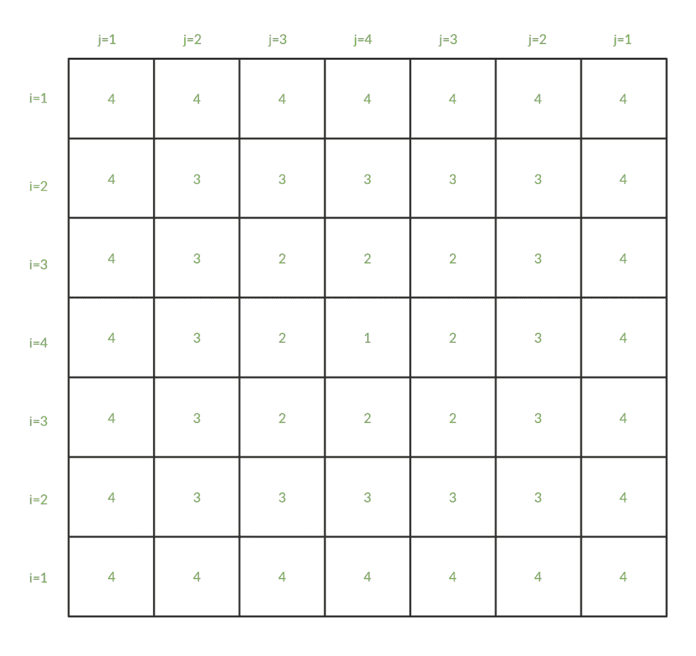

# 如何轻松学习图案印刷？

> 原文:[https://www . geesforgeks . org/how-learn-pattern-printing-easy/](https://www.geeksforgeeks.org/how-to-learn-pattern-printing-easily/)

任务是打印给定整数值的模式，如示例所示。
目标不是只打印这一种模式，而是学习解决这类问题的最佳方法，因为这些问题在编码考试和求职面试中经常被问到。
**例:**

```
Input: N = 4
Output:
4 4 4 4 4 4 4
4 3 3 3 3 3 4
4 3 2 2 2 3 4
4 3 2 1 2 3 4
4 3 2 2 2 3 4
4 3 3 3 3 3 4
4 4 4 4 4 4 4

Input: N = 7
Output:
7 7 7 7 7 7 7 7 7 7 7 7 7
7 6 6 6 6 6 6 6 6 6 6 6 7
7 6 5 5 5 5 5 5 5 5 5 6 7
7 6 5 4 4 4 4 4 4 4 5 6 7
7 6 5 4 3 3 3 3 3 4 5 6 7
7 6 5 4 3 2 2 2 3 4 5 6 7
7 6 5 4 3 2 1 2 3 4 5 6 7
7 6 5 4 3 2 2 2 3 4 5 6 7
7 6 5 4 3 3 3 3 3 4 5 6 7
7 6 5 4 4 4 4 4 4 4 5 6 7
7 6 5 5 5 5 5 5 5 5 5 6 7
7 6 6 6 6 6 6 6 6 6 6 6 7
7 7 7 7 7 7 7 7 7 7 7 7 7
```

教程中使用了 **N = 4** 的例子。

*   **第一步:**首先，分析图案的任何对称线。这里我们的图案是垂直和水平对称的，所以画出这样的对称线，



*   将图案拆分成几个部分后，首先尽量只画左上角的部分，即 a 部分，如果没有任何对称线，跳到步骤 2。
*   **步骤 2:** 现在将每个单元格(即元素)与行号和列号(通常分别由 I 和 j 表示)相关联，就像，



*   从现在开始，一个单元格用 C(i，j)表示，其行号和列号。
*   **第三步:**在这一步中，试着找出 C(i，j)的值与 I 和/或 j 之间的关系，通常 C 的值取决于 N 的值以及 I 和 j 的值相对于彼此的关系。为了详细说明，
    –在第一行，每个元素都是相同的，即 4(=N)。所以帮助不大。
    –在第二行中，可以看到 C 从 4 减少到 3，对于 i > =j，然后对于下一个 i=j，它保持 3，然后对于下一个 i=j，它保持 2。对于 j 的所有值，可以看到 C 从 4 减少到 1。
    所以在每一行中，C 从 N 开始，递减 1，直到 i > =j，然后变成常数。这里，C 的值取决于 I 和 j 之间的较小值，公式可以是:

```
C(i, j) = N - min(i, j) + 1
```

*   所以我们的方法应该是:

## C++

```
#include <iostream>
using namespace std;

int main()
{
    int N = 4, i, j, min;
    cout << "Value of N: " << N << endl;

    for (i = 1; i <= N; i++) {
        for (j = 1; j <= N; j++) {
            min = i < j ? i : j;
            cout << N - min + 1;
        }
        cout << endl;
    }
    return 0;
}
```

## Java 语言(一种计算机语言，尤用于创建网站)

```
// Java program to find triplets 
// a[i]>a[j]>a[k] and i<j<k
import java.util.*;

class GFG
{

// Driver code
public static void main(String[] args)
{
    int N = 4, i, j, min;
    System.out.println("Value of N: " + N);

    for (i = 1; i <= N; i++) 
    {
        for (j = 1; j <= N; j++) 
        {
            min = i < j ? i : j;
            System.out.print(N - min + 1);
        }
        System.out.println();
    }
}
}

// This code is contributed by Princi Singh
```

## 蟒蛇 3

```
# Python3 program to find triplets 
# a[i]>a[j]>a[k] and i<j<k
if __name__ == '__main__':

    N = 4;
    print("Value of N: ", N);

    for i in range(1, N + 1):
        for j in range(1, N + 1):
            min = i if i < j else j;
            print(N - min + 1, end = "");
        print();

# This code is contributed 
# by PrinciRaj1992 
```

## C#

```
// C# program to find triplets 
// a[i]>a[j]>a[k] and i<j<k
using System;

class GFG
{

// Driver code
public static void Main(String[] args)
{
    int N = 4, i, j, min;
    Console.WriteLine("Value of N: " + N);

    for (i = 1; i <= N; i++) 
    {
        for (j = 1; j <= N; j++) 
        {
            min = i < j ? i : j;
            Console.Write(N - min + 1);
        }
        Console.WriteLine();
    }
}
}

// This code is contributed by PrinciRaj1992
```

## java 描述语言

```
<script>

// JavaScript program to find triplets 
// a[i]>a[j]>a[k] and i<j<k

// Driver code
    var N = 4, i, j, min;
    document.write("Value of N: " + N +"<br>");

    for (i = 1; i <= N; i++) 
    {
        for (j = 1; j <= N; j++) 
        {
            min = i < j ? i : j;
            document.write(N - min + 1);
        }
        document.write("<br>");
    }

// This code is contributed by shivanisinghss2110

</script>
```

**Output:** 

```
Value of N: 4
4444
4333
4322
4321
```

*   如果图案没有任何对称性，现在已经完成，工作就完成了。但是对于对称的图案，它们仍然是不完整的，需要进行第 4 步。

*   **第 4 步:**现在将图案的 B 部分包含在图片中，并将这些元素与列号相关联。但是不要按顺序分配列号，而是分配给与 a 部分中镜像列相同的列号。



*   **第 5 步:**现在修改代码追加 b 部分，要做到这一点，只需要重新运行 j = n-1 到 j=1 的内循环。

## C++

```
#include <iostream>
using namespace std;

int main()
{
    int N = 4, i, j, min;
    cout << "Value of N: " << N << endl;

    for (i = 1; i <= N; i++) {
        for (j = 1; j <= N; j++) {
            min = i < j ? i : j;
            cout << N - min + 1;
        }
        for (j = N - 1; j >= 1; j--) {
            min = i < j ? i : j;
            cout << N - min + 1;
        }
        cout << endl;
    }
    return 0;
}
```

## Java 语言(一种计算机语言，尤用于创建网站)

```
class GFG 
{
    public static void main(String[] args) 
    {
        int N = 4, i, j, min;
        System.out.println("Value of N: " + N);

        for (i = 1; i <= N; i++) 
        {
            for (j = 1; j <= N; j++) 
            {
                min = i < j ? i : j;
                System.out.print(N - min + 1);
            }
            for (j = N - 1; j >= 1; j--)
            {
                min = i < j ? i : j;
                System.out.print(N - min + 1);
            }
            System.out.println();
        }
    }
}

// This code is contributed by PrinciRaj1992
```

## 蟒蛇 3

```
N = 4;
print("Value of N: ", N);

for i in range(1, N + 1):
    for j in range(1, N + 1):
        min = i if i < j else j;
        print(N - min + 1, end = "");

    for j in range(N - 1, 0, -1):
        min = i if i < j else j;
        print(N - min + 1, end = "");
    print();

# This code is contributed by Rajput-Ji
```

## C#

```
using System;

class GFG 
{
    public static void Main(String[] args) 
    {
        int N = 4, i, j, min;
        Console.WriteLine("Value of N: " + N);

        for (i = 1; i <= N; i++) 
        {
            for (j = 1; j <= N; j++) 
            {
                min = i < j ? i : j;
                Console.Write(N - min + 1);
            }
            for (j = N - 1; j >= 1; j--)
            {
                min = i < j ? i : j;
                Console.Write(N - min + 1);
            }
            Console.WriteLine();
        }
    }
}

// This code is contributed by Rajput-Ji
```

## java 描述语言

```
<script>
 var N = 4, i, j, min;
        document.write("Value of N: " + N +"<br>");

        for (i = 1; i <= N; i++) 
        {
            for (j = 1; j <= N; j++) 
            {
                min = i < j ? i : j;
                document.write(N - min + 1);
            }
            for (j = N - 1; j >= 1; j--)
            {
                min = i < j ? i : j;
                document.write(N - min + 1);
            }
            document.write("<br>");
        }

// this code is contributed by shivanisinghss2110
</script>
```

**Output:** 

```
Value of N: 4
4444444
4333334
4322234
4321234
```

*   **第 6 步:**现在在图片中包含图案的 C 和 D 部分，并将这些元素与行号相关联，就像在第 4 步中分配列号一样。



*   **第 7 步:**现在，以与第 5 步相同的方式，更改代码以追加 C 和 d 部分。为此，只需要重新运行 i = n-1 到 i=1 的外部循环。

## C++

```
#include <iostream>
using namespace std;

int main()
{
    int N = 4, i, j, min;
    cout << "Value of N: " << N << endl;

    for (i = 1; i <= N; i++) {
        for (j = 1; j <= N; j++) {
            min = i < j ? i : j;
            cout << N - min + 1;
        }
        for (j = N - 1; j >= 1; j--) {
            min = i < j ? i : j;
            cout << N - min + 1;
        }
        cout << endl;
    }
    for (i = N - 1; i >= 1; i--) {
        for (j = 1; j <= N; j++) {
            min = i < j ? i : j;
            cout << N - min + 1;
        }
        for (j = N - 1; j >= 1; j--) {
            min = i < j ? i : j;
            cout << N - min + 1;
        }
        cout << endl;
    }
    return 0;
}
```

## Java 语言(一种计算机语言，尤用于创建网站)

```
// Java implementation of the approach
class GFG 
{
public static void main(String[] args) 
{
    int N = 4, i, j, min;
    System.out.println("Value of N: " + N);

    for (i = 1; i <= N; i++) 
    {
        for (j = 1; j <= N; j++)
        {
            min = i < j ? i : j;
            System.out.print(N - min + 1);
        }
        for (j = N - 1; j >= 1; j--)
        {
            min = i < j ? i : j;
            System.out.print(N - min + 1);
        }
        System.out.println();
    }

    for (i = N - 1; i >= 1; i--) 
    {
        for (j = 1; j <= N; j++) 
        {
            min = i < j ? i : j;
            System.out.print(N - min + 1);
        }
        for (j = N - 1; j >= 1; j--) 
        {
            min = i < j ? i : j;
            System.out.print(N - min + 1);
        }
        System.out.println();
    }
    }
}

// This code is contributed by 29AjayKumar
```

## 蟒蛇 3

```
# Python3 implementation of the approach
N = 4
print("Value of N: ", N) 

for i in range(1, N + 1): 
    for j in range(1, N + 1): 
        min = i if i < j else j 
        print(N - min + 1, end = " ") 

    for j in range(N - 1, 0, -1): 
        min = i if i < j else j 
        print(N - min + 1, end = " ")

    print()

for i in range(N - 1, 0, -1): 
    for j in range(1, N + 1): 
        min = i if i < j else j 
        print(N - min + 1, end = " ") 

    for j in range(N - 1, 0, -1): 
        min = i if i < j else j 
        print(N - min + 1, end = " ")

    print()

# This code is contributed by sai prakash
```

## C#

```
// C# implementation of the approach
using System;

class GFG 
{
public static void Main(String[] args) 
{
    int N = 4, i, j, min;
    Console.WriteLine("Value of N: " + N);

    for (i = 1; i <= N; i++) 
    {
        for (j = 1; j <= N; j++)
        {
            min = i < j ? i : j;
            Console.Write(N - min + 1);
        }
        for (j = N - 1; j >= 1; j--)
        {
            min = i < j ? i : j;
            Console.Write(N - min + 1);
        }
        Console.WriteLine();
    }

    for (i = N - 1; i >= 1; i--) 
    {
        for (j = 1; j <= N; j++) 
        {
            min = i < j ? i : j;
            Console.Write(N - min + 1);
        }
        for (j = N - 1; j >= 1; j--) 
        {
            min = i < j ? i : j;
            Console.Write(N - min + 1);
        }
        Console.WriteLine();
    }
    }
}

// This code is contributed by Rajput-Ji
```

## java 描述语言

```
<script>

// JavaScript implementation of the approach

    var N = 4, i, j, min;
    document.write("Value of N: " + N +"<br>");

    for (i = 1; i <= N; i++) 
    {
        for (j = 1; j <= N; j++)
        {
            min = i < j ? i : j;
            document.write(N - min + 1 );
        }
        for (j = N - 1; j >= 1; j--)
        {
            min = i < j ? i : j;
            document.write(N - min + 1);
        }
        document.write("<br>");
    }

    for (i = N - 1; i >= 1; i--) 
    {
        for (j = 1; j <= N; j++) 
        {
            min = i < j ? i : j;
            document.write(N - min + 1);
        }
        for (j = N - 1; j >= 1; j--) 
        {
            min = i < j ? i : j;
            document.write(N - min + 1);
        }
        document.write("<br>");
    }

// This code is contributed by shivanisinghss2110
</script>
```

**Output:** 

```
Value of N: 4
4444444
4333334
4322234
4321234
4322234
4333334
4444444
```