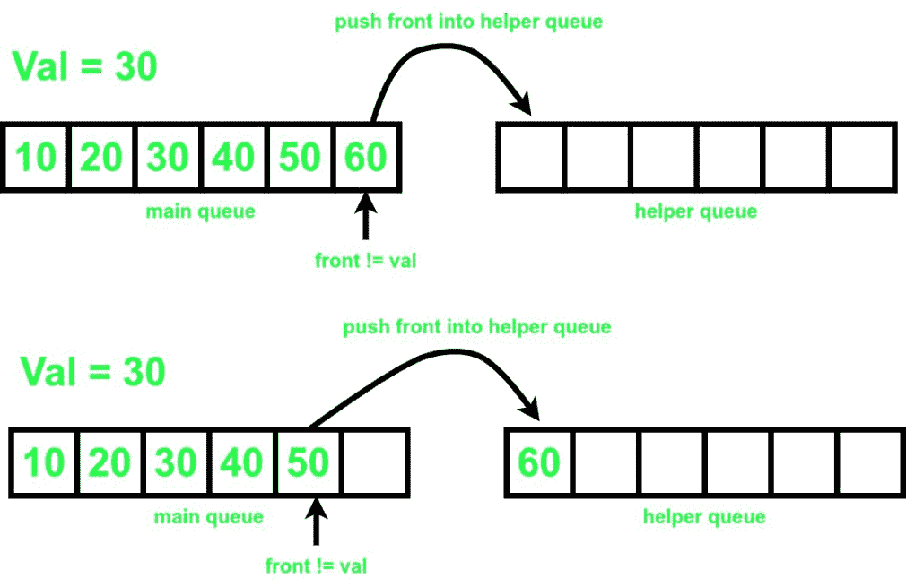
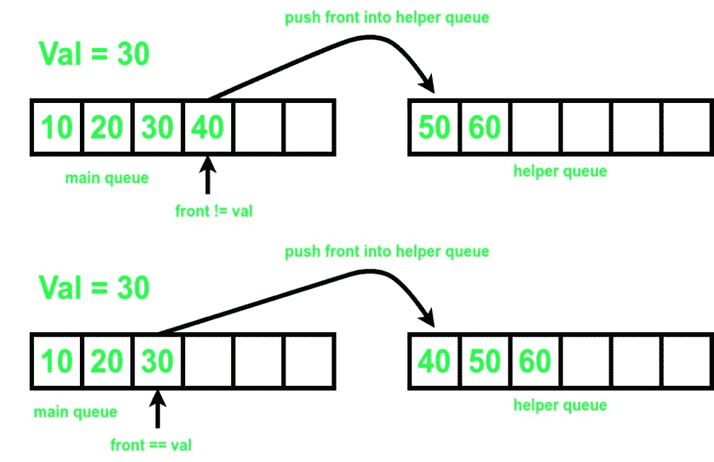
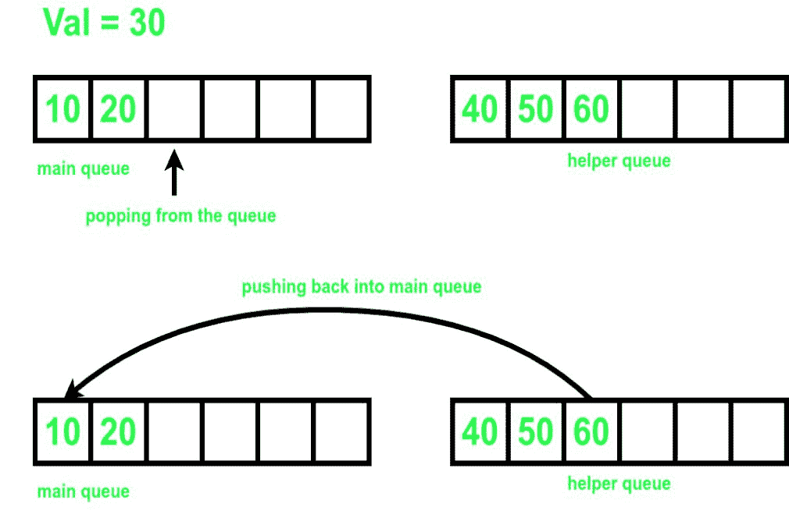
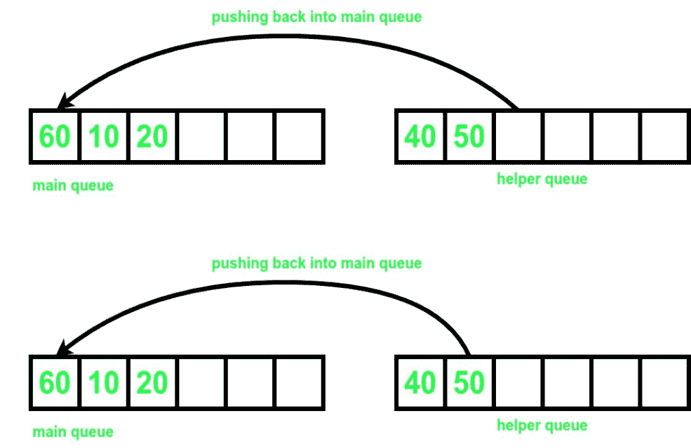
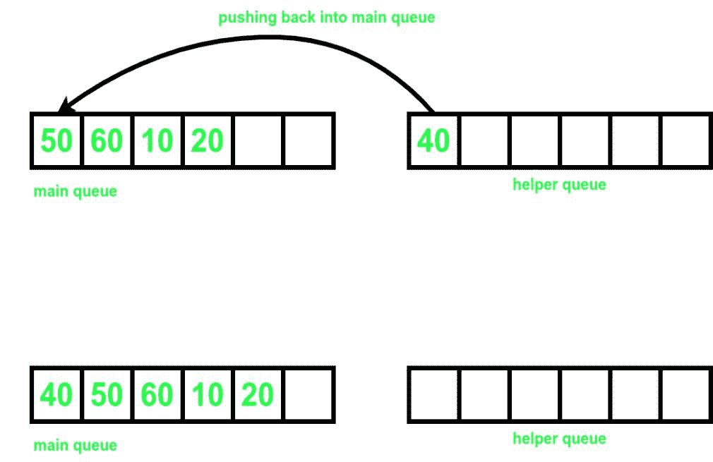
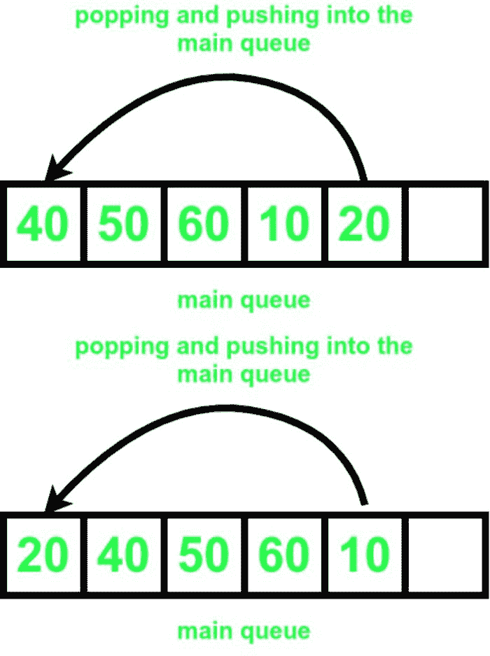
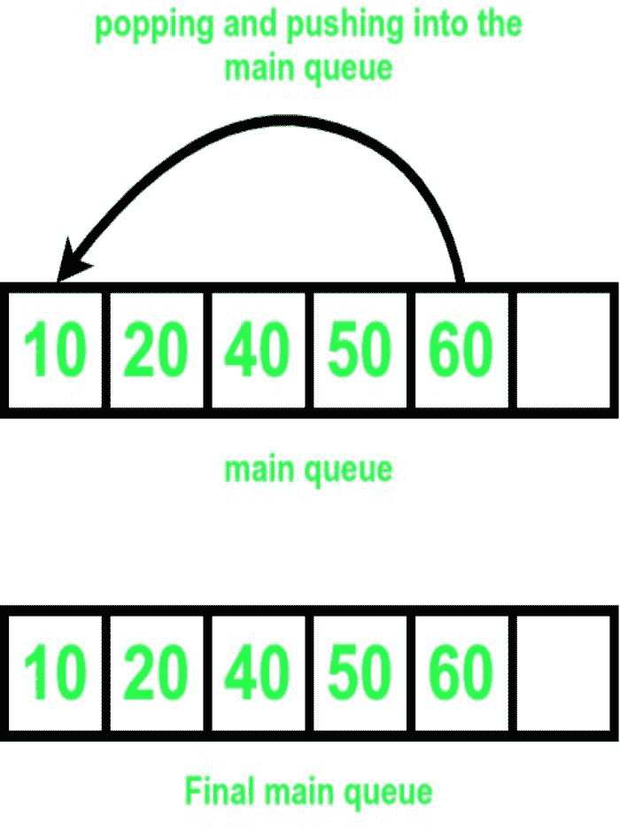

# 如何从队列中移除特定元素

> 原文:[https://www . geesforgeks . org/如何从队列中移除特定元素/](https://www.geeksforgeeks.org/how-to-remove-a-specific-element-from-queue/)

给定一个[队列](https://www.geeksforgeeks.org/queue-data-structure/) **q[]** 和一个整数 **K，**任务是定义一个方法，从[队列](https://www.geeksforgeeks.org/queue-data-structure/) **q[]** 中移除特定元素。如果元素 **K、**出现多次，则从[队列](https://www.geeksforgeeks.org/queue-data-structure/) **q[]中删除第一个。**

**示例:**

> **输入:** q[] = {10，20，30，40，50，60}，K = 30
> **输出:** {10，20，40，50，60}
> **说明:**去掉 30 后，队列变成{10，20，40，50，60}。
> 
> **输入:** q[] = {1，2，3，3}，K = 3
> **输出:** {1，2，3}
> **解释:**删除第一个出现的 3 后，队列变成{1，2，3}。

**方法:**想法是创建一个临时的[队列](https://www.geeksforgeeks.org/queue-data-structure/)**ref【】**并存储其中的所有元素，直到找到 **K** 。然后，从原[队列](https://www.geeksforgeeks.org/queue-data-structure/) **q[]、**中移除 **K** ，将剩余元素插回[队列](https://www.geeksforgeeks.org/queue-data-structure/) **q[]。**按照以下步骤解决问题:

*   初始化一个助手[队列](https://www.geeksforgeeks.org/queue-data-structure/) **ref** 来临时存储[队列](https://www.geeksforgeeks.org/queue-data-structure/)**q【】**的元素。
*   将变量 **s** 初始化为[队列](https://www.geeksforgeeks.org/queue-data-structure/)**q【】**和 **cnt** 的大小为 **0** ，以存储推入帮助者[队列](https://www.geeksforgeeks.org/queue-data-structure/) **的数字计数。**
*   [循环迭代](https://www.geeksforgeeks.org/c-c-while-loop-with-examples/)直到[队列](https://www.geeksforgeeks.org/queue-data-structure/) **q[]** 不为空，并且[队列](https://www.geeksforgeeks.org/queue-data-structure/)的[前面](https://www.geeksforgeeks.org/queuefront-queueback-c-stl/)不等于所需元素 **K:**
    *   [将](https://www.geeksforgeeks.org/queue-set-1introduction-and-array-implementation/)[队列](https://www.geeksforgeeks.org/queue-data-structure/)**q【】**的[前端](https://www.geeksforgeeks.org/queuefront-queueback-c-stl/)元素排入[队列](https://www.geeksforgeeks.org/queue-data-structure/) **参考[]。**
    *   [从](https://www.geeksforgeeks.org/deque-set-1-introduction-applications/)[队列](https://www.geeksforgeeks.org/queue-data-structure/)中取出元素 **q[]。**
    *   将 **cnt** 的值增加 **1。**
*   如果[队列](https://www.geeksforgeeks.org/queue-data-structure/) **q[]** 为空，则元素 **K** 不在[队列](https://www.geeksforgeeks.org/queue-data-structure/)中 **q[]、**所以打印**“元素未找到！!"**并执行以下步骤:
    *   [循环迭代](https://www.geeksforgeeks.org/c-c-while-loop-with-examples/)直到[队列](https://www.geeksforgeeks.org/queue-data-structure/)T4【ref】不为空:
        *   [将](https://www.geeksforgeeks.org/queue-set-1introduction-and-array-implementation/)[队列](https://www.geeksforgeeks.org/queue-data-structure/) **中的[前置](https://www.geeksforgeeks.org/queuefront-queueback-c-stl/)元素加入[队列](https://www.geeksforgeeks.org/queue-data-structure/) **q[]。****
        *   [从](https://www.geeksforgeeks.org/deque-set-1-introduction-applications/)[队列](https://www.geeksforgeeks.org/queue-data-structure/)中取出元素**参考[]。**
*   否则，找到该元素，因此[从](https://www.geeksforgeeks.org/deque-set-1-introduction-applications/)[队列](https://www.geeksforgeeks.org/queue-data-structure/)中取出元素 **q[]** ，并执行以下步骤:
    *   [循环迭代](https://www.geeksforgeeks.org/c-c-while-loop-with-examples/)直到[队列](https://www.geeksforgeeks.org/queue-data-structure/)T4【ref】不为空:
        *   [将](https://www.geeksforgeeks.org/queue-set-1introduction-and-array-implementation/)[队列](https://www.geeksforgeeks.org/queue-data-structure/) **中的[前置](https://www.geeksforgeeks.org/queuefront-queueback-c-stl/)元素加入[队列](https://www.geeksforgeeks.org/queue-data-structure/) **q[]。****
        *   [从](https://www.geeksforgeeks.org/deque-set-1-introduction-applications/)[队列](https://www.geeksforgeeks.org/queue-data-structure/)中取出元素**参考[]。**
*   将变量 **k** 初始化为 **s-cnt-1** ，以标记将[从](https://www.geeksforgeeks.org/deque-set-1-introduction-applications/)[队列](https://www.geeksforgeeks.org/queue-data-structure/)出列 **q[]** 和[再次入队](https://www.geeksforgeeks.org/queue-set-1introduction-and-array-implementation/)回到[队列](https://www.geeksforgeeks.org/queue-data-structure/) **q[]。**
*   [循环迭代](https://www.geeksforgeeks.org/c-c-while-loop-with-examples/)直到 **K** 大于 **0** ，执行以下步骤:
    *   用 **1 减去 **K** 的值。**
    *   [将](https://www.geeksforgeeks.org/queue-set-1introduction-and-array-implementation/)[队列](https://www.geeksforgeeks.org/queue-data-structure/) **q[]** 的[前置](https://www.geeksforgeeks.org/queuefront-queueback-c-stl/)元素排入[队列](https://www.geeksforgeeks.org/queue-data-structure/) **q[]。**
    *   [从](https://www.geeksforgeeks.org/deque-set-1-introduction-applications/)[队列](https://www.geeksforgeeks.org/queue-data-structure/)中取出元素 **q[]。**
*   执行以上步骤后，打印[队列](https://www.geeksforgeeks.org/queue-data-structure/) **q[]的元素。**

       

下面是上述方法的实现。

## C++

```
// C++ program for the above approach.
#include <bits/stdc++.h>
using namespace std;

// Function to remove an element from
// the queue
void remove(int t, queue<int>& q)
{

    // Helper queue to store the elements
    // temporarily.
    queue<int> ref;
    int s = q.size();
    int cnt = 0;

    // Finding the value to be removed
    while (q.front() != t and !q.empty()) {
        ref.push(q.front());
        q.pop();
        cnt++;
    }

    // If element is not found
    if (q.empty()) {
        cout << "element not found!!" << endl;
        while (!ref.empty()) {

            // Pushing all the elements back into q
            q.push(ref.front());
            ref.pop();
        }
    }

    // If element is found
    else {
        q.pop();
        while (!ref.empty()) {

            // Pushing all the elements back into q
            q.push(ref.front());
            ref.pop();
        }
        int k = s - cnt - 1;
        while (k--) {

            // Pushing elements from front of q to its back
            int p = q.front();
            q.pop();
            q.push(p);
        }
    }
}

// Function to print all the elements
// of the queue.
void print(queue<int> qr)
{
    while (!qr.empty()) {
        cout << qr.front() << " ";
        qr.pop();
    }
    cout << endl;
}

// Driver Code
int main()
{
    queue<int> q;

    // Pushing into the queue
    q.push(10);
    q.push(20);
    q.push(30);
    q.push(40);
    q.push(50);
    q.push(60);
    print(q);

    // Removing 39 from the queue
    remove(39, q);
    print(q);

    // Removing 30 from the queue
    remove(30, q);
    print(q);
    return 0;
}
```

## Java 语言(一种计算机语言，尤用于创建网站)

```
// Java program for the above approach.

import java.util.*;

class GFG{

// Function to remove an element from
// the queue
static Queue<Integer> q;
static void remove(int t)
{

    // Helper queue to store the elements
    // temporarily.
    Queue<Integer> ref = new LinkedList<>();
    int s = q.size();
    int cnt = 0;

    // Finding the value to be removed
    while (!q.isEmpty() && q.peek() != t) {
        ref.add(q.peek());
        q.remove();
        cnt++;
    }

    // If element is not found
    if (q.isEmpty()) {
        System.out.print("element not found!!" +"\n");
        while (!ref.isEmpty()) {

            // Pushing all the elements back into q
            q.add(ref.peek());
            ref.remove();
        }
    }

    // If element is found
    else {
        q.remove();
        while (!ref.isEmpty()) {

            // Pushing all the elements back into q
            q.add(ref.peek());
            ref.remove();
        }
        int k = s - cnt - 1;
        while (k-- >0) {

            // Pushing elements from front of q to its back
            int p = q.peek();
            q.remove();
            q.add(p);
        }
    }
}

// Function to print all the elements
// of the queue.
static void print()
{
    Queue<Integer> qr = new LinkedList<>(q);
    while (!qr.isEmpty()) {
        System.out.print(qr.peek()+ " ");
        qr.remove();
    }

    System.out.println();
}

// Driver Code
public static void main(String[] args)
{
    q = new LinkedList<>();

    // Pushing into the queue
    q.add(10);
    q.add(20);
    q.add(30);
    q.add(40);
    q.add(50);
    q.add(60);
    print();

    // Removing 39 from the queue
    remove(39);
    print();

    // Removing 30 from the queue
    remove(30);
    print();
}
}

// This code is contributed by 29AjayKumar
```

## C#

```
// C# program for the above approach.
using System;
using System.Collections;
public class GFG{

      // Function to remove an element from
// the queue
static Queue q = new Queue();
static void remove_(int t)
{

    // Helper queue to store the elements
    // temporarily.
    Queue reff = new Queue();
    int s = q.Count;
    int cnt = 0;

    // Finding the value to be removed
    while ((int)q.Count != 0 && (int)q.Peek() != t) {

        reff.Enqueue(q.Peek());
        q.Dequeue();
        cnt++;
    }

    // If element is not found
    if (q.Count == 0) {
        Console.WriteLine("element not found!!");

        while (reff.Count != 0) {

            // Pushing all the elements back into q
            q.Enqueue(reff.Peek());
            reff.Dequeue();
        }
    }

    // If element is found
    else {
        q.Dequeue();
        while (reff.Count != 0) {

            // Pushing all the elements back into q
            q.Enqueue(reff.Peek());
            reff.Dequeue();
        }
        int k = s - cnt - 1;
        while (k-- >0) {

            // Pushing elements from front of q to its back
            int p = (int)q.Peek();
            q.Dequeue();
            q.Enqueue(p);
        }
    }
}

// Function to print all the elements
// of the queue.
static void print()
{
    Queue qr = (Queue)q.Clone();
    while (qr.Count != 0) {
        Console.Write(qr.Peek()+ " ");
        qr.Dequeue();
    }

    Console.WriteLine();
}

// Driver Code
static public void Main (){

    // Pushing into the queue
    q.Enqueue(10);
    q.Enqueue(20);
    q.Enqueue(30);
    q.Enqueue(40);
    q.Enqueue(50);
    q.Enqueue(60);

    print();

    // Removing 39 from the queue
    remove_(39);
    print();

    // Removing 30 from the queue
    remove_(30);
    print();
}
}

// This code is contributed by Dharanendra L V.
```

**Output**

```
10 20 30 40 50 60 
element not found!!
10 20 30 40 50 60 
10 20 40 50 60 
```

***时间复杂度:**O(N)*
T5**辅助空间:** O(N)