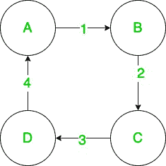

# 在 Java 中如何用关联矩阵表示图形？

> 原文:[https://www . geesforgeks . org/如何用关联矩阵表示图形-in-java/](https://www.geeksforgeeks.org/how-to-represent-graph-using-incidence-matrix-in-java/)

关联矩阵只是一个包含任意两个类的对象(或实例)之间关系信息的矩阵。矩阵的行代表一类对象，而列代表另一类对象。矩阵中的任意坐标 *(x，y)* 表示第一类*x<sup>th</sup>T5【元素】和第二类*y<sup>th</sup>T9】元素之间的关系。**

例如，假设关联矩阵 A 代表汽车和制造商之间的关系。如果我们让行代表汽车，让列代表制造商，那么矩阵中的任何坐标 *(x，y)* 都会给我们关于*x<sup>th</sup>T5】汽车是否由*y<sup>th</sup>T9】制造商制造的信息。**

**图形和关联矩阵**

关联矩阵是一个大小为 *n* x *m* 的矩阵(比如 **A** ，其中 *n* 是顶点的数量， *m* 是图中的边的数量。矩阵中的任意元素 *A <sub>i，j</sub>* 表示顶点 *i* 和边 *j* 之间关系的信息。该值可能会有所不同，具体取决于所表示的图形类型和关系。

让我们看一下将无向图表示为关联矩阵。输入表示将是一个邻接矩阵，但是您可以用简单的逻辑将其修改为任何其他表示。

#### **用 Java 从邻接矩阵中获取关联矩阵**

在大多数地方，最常见的图形表示是邻接矩阵。因此，这里我们展示如何从邻接矩阵获得关联矩阵，其中 *A <sub>i，j</sub>T3】代表连接顶点 *i* 和*j*的边数*

**我们将遵循的将邻接矩阵转换为关联矩阵的方法是:**

1.  通过计算邻接矩阵中非零值的数量来计算图中边的数量。对于无向图，这可以在 **O(n(n-1)/2)** 中完成。
2.  创建一个大小为*顶点×边*的关联矩阵，其中每一列将代表一条边在所有与该列交叉的行上的关联。
3.  类似于步入式步骤 1。，我们再次遍历邻接矩阵，找出各个边连接的顶点。对于邻接矩阵中找到的每条边，我们在关联矩阵中将其入射顶点标记为 *1* 。

举个例子，让我们用关联矩阵来表示下面的图:



一个有 4 个顶点和 4 条边的简单图

## Java 语言(一种计算机语言，尤用于创建网站)

```
// Java program to convert adjacency matrix
// to incidence matrix

import java.io.*;

class GFG {
    public int[][] adjacencyMatToIncidenceMat(int[][] adj)
    {
        int vertices = adj.length, edges = 0;

        // count number of edges in the graph
        for (int i = 0; i < adj.length; i++) {
            for (int j = i + 1; j < adj[i].length; j++) {
                if (adj[i][j] > 0)
                    edges++;
            }
        }

        // construct incidence matrix
        int[][] incidenceMat = new int[adj.length][edges];
        for (int i = 0; i < adj.length; i++) {

            for (int j = i + 1; j < adj[i].length; j++) {
                int edgeNumber = adj[i][j];

                if (edgeNumber > 0) {
                    incidenceMat[i][edgeNumber - 1] = 1;
                    incidenceMat[j][edgeNumber - 1] = 1;
                }
            }

        }

        return incidenceMat;
    }

    // driver code
    public static void main(String[] args)
    {
        GFG gfg = new GFG();
        int[][] adj = {
            { 0, 1, 0, 4 },
            { 1, 0, 2, 0 },
            { 0, 2, 0, 3 },
            { 4, 0, 3, 0 },
        };
        int[][] incidence = gfg.adjacencyMatToIncidenceMat(adj);

        for (int[] row : incidence) {
            for (int val : row) {
                System.out.print(val);
            }
            System.out.println();
        }
    }
}
```

**Output**

```
1001
1100
0110
0011
```

**<u>时间复杂度</u> :** O(n(n-1))其中 n 为顶点数。