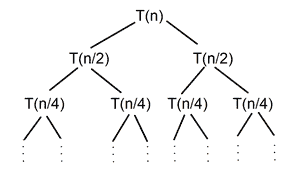
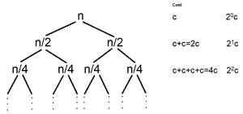
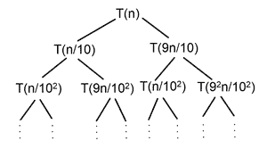
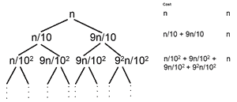

# 如何用递归树方法求解时间复杂度递归关系？

> 原文:[https://www . geeksforgeeks . org/如何求解-时间-复杂性-递归-关系-使用-递归-树-方法/](https://www.geeksforgeeks.org/how-to-solve-time-complexity-recurrence-relations-using-recursion-tree-method/)

[递归树法](https://www.geeksforgeeks.org/analysis-algorithm-set-4-master-method-solving-recurrences/)是求解[递归关系](https://www.geeksforgeeks.org/different-types-recurrence-relations-solutions/)的一种方法。在这种方法中，递归关系被转换成递归树。每个节点代表了不同递归级别的开销。为了找到总成本，所有级别的成本被汇总。

**用递归树法求解递归关系的步骤:**

1.  为给定的递归关系绘制递归[树](https://www.geeksforgeeks.org/tree-traversals-inorder-preorder-and-postorder/)
2.  计算各层级的成本，统计递归树中的层级总数。
3.  计算最后一级的节点总数，并计算最后一级的成本
4.  总结递归树中所有级别的成本

**借助一些例子来看看如何解决这些递归关系:**

**问题 1:** T(n) = 2T(n/2) + c

**解决方案:**

*   **步骤 1:** 绘制递归树

递归树

*   **第二步:**计算每一层完成的工作量或成本，并计算递归树中的总层数

每一级成本的递归树

**计算总层数–**

选择从根节点到叶节点的最长路径

> n/20-→n/21-→n/22-→→n/2k

最后一级问题的大小= n/2 k

在最后一级，问题的大小变为 1

> n/2 k = 1
> 
> 2 k = n
> 
> **k = log 2 (n)**

**递归树中的层次总数= k +1 = log 2 (n) + 1**

*   **第三步:**统计上一级节点总数，计算上一级成本

> 0 级节点数= 2 0 = 1
> 
> 1 级节点数= 2 1 = 2
> 
> ………………………………………………………
> 
> 级别日志 2 (n) = 2 日志T5】2(n)= n日志2(2)= n
> 
> 级别日志 2 (n)(最后一级)= nxT(1) = nx1 = n 的子问题成本

*   **第四步:**在递归树中汇总所有层级的成本

> T(n) = c + 2c + 4c + —- +(层数-1)次+最后一层成本
> 
> = c + 2c + 4c + —- + log 2 (n)次+θ(n)
> 
> = c(1 + 2 + 4 + —- + log 2 (n)次)+θ(n)
> 
> 1+2+4+–+log2(n)次–>20+21+22+–+log 2(n)次–>几何级数(G.P)
> 
> = c(n)+θ(n)

由此可见，***<u>T(n)=θ(n)</u>**T5】*

**问题 2: T(n) = T(n/10) + T(9n/10) + n**

**解决方案:**

*   **步骤 1:** 绘制递归树

递归树

*   **第二步:**计算每一层完成的工作量或成本，并计算递归树中的总层数

每级代价递归树

**计算总层数–**

选择从根节点到叶节点的最长路径

> (9/10)0n–>(9/10)1n–>(9/10)2n–>……–>(9/10)kn
> 
> 最后一级问题的大小= (9/10) k n
> 
> 在最后一级，问题的大小变为 1
> 
> (9/10) k n = 1
> 
> (9/10) k = 1/n
> 
> **k = log 10/9 (n)**

**递归树中的层次总数= k +1 = log 10/9 (n) + 1**

*   **第三步:**统计上一级节点总数，计算上一级成本

> 0 级节点数= 2 0 = 1
> 
> 1 级节点数= 2 1 = 2
> 
> ………………………………………………………
> 
> 级别日志 10/9 (n) = 2 日志T5】10/9(n)= n日志10/9(2)
> 
> log2(n)级子问题成本(最后一级)= nlog10/9(2)x T(1)= nlog10/9(2)x 1 = nlog10/9T22】(2)
> 
> *   **第四步:**将递归树中所有级别的成本相加
> 
> T(n) = n + n + n + —- +(层数–1)次+最后一层成本
> 
> = n+n+n+-+log10/9【n】times+θ(n【10/9】【2】)
> 
> = NLG〔t0〕10/9(n)+θ(n〕T2【日志】【10/9】【2】

由此，**<u>【t(n)=θ(NLG】</u><u>【10/9】</u><u>【n】</u>**