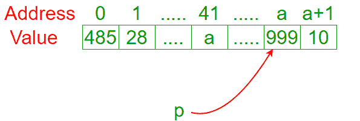
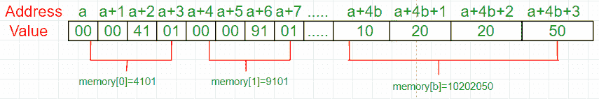
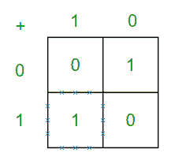
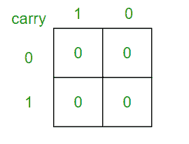

# 如何在 C/C++中不使用算术运算符的情况下对两个整数求和？

> 原文:[https://www . geesforgeks . org/如何在不使用算术运算符的情况下对两个整数求和-in-cc/](https://www.geeksforgeeks.org/how-to-sum-two-integers-without-using-arithmetic-operators-in-cc/)

给定两个整数 a 和 b，在不使用++、-、++、–、…等运算符的情况下，如何计算 a + b 的和？

**Method 1 (Using pointers)**

一个有趣的方法是:

```
// May not work with C++ compilers and
// may produce warnings in C.

// Returns sum of 'a' and 'b'
int sum(int a, int b) 
{
    char *p = a;
    return (int)&p[b];
}
```

尽管乍一看很尴尬，但我们很容易理解正在发生的事情。首先，我们创建了一个指针 p。指针的值是一个内存地址。在这种情况下，p 的值是地址 a.
[](https://media.geeksforgeeks.org/wp-content/uploads/sumArray.png) 
记住:p 指向位置 a .在那个例子中，如果我们想知道位置 a (999)的值，我们要求为*p .如果我们想知道变量 a (41)的地址，我们要求为& a

如果我们计算 p[b]，我们会得到 p + b 位置的内存值。事实上，我们计算&p[b]，这与不访问地址 p + b 的值而获取地址 p+b 是一样的。由于 p = a，&p[b]将返回地址 a + b。

我们不想返回内存地址(int*)。我们想要返回一个整数(int)。因此，我们将&p[b]转换为 int。

如果我们把 p 的类型从 char*改成 int*会发生什么？让我修正一下我之前说的:当我们评估 p[b]时，我们不评估 p + b。我们评估 p + sizeof(*p) * b。为什么？想象一下这个例子:int 类型的变量在内存中占据四个位置。

[](https://media.geeksforgeeks.org/wp-content/uploads/sumArray1.png)

这个 sizeof(*p)考虑了每个变量在内存中占据的位置数量。

我们想计算 p + b。换句话说，我们希望 sizeof(*p)等于 1。因此，如果*p 是一个字符，我们很高兴。

**Method 2 (Using bitwise operators)**

让我们看看总和的真值表(原谅现在的进位):

仔细看，我们注意到求和和异或真值表是相同的。只有当输入不同时才是 1。

现在，我们如何检测进位？让我们看看进位的真值表。

[](https://media.geeksforgeeks.org/wp-content/uploads/sumArray2.png)

仔细看，我们注意到求和和异或真值表是相同的。只有当输入不同时才是 1。

现在，我们如何检测进位？让我们看看进位的真值表。

[](https://media.geeksforgeeks.org/wp-content/uploads/sumArray3.png)

再仔细看一遍，我们注意到进位和逻辑 and 的真值表是相同的。现在，我们必须将 a & 1 向左移动，并用 a ^ b 求和。然而，这些操作也可能有进位。没问题，只要递归地将 a & 1 向左移动，对 a ^ b 求和。

```
// Returns sum of a and b using bitwise
// operators.
int sum(int a, int b) 
{
    int s = a ^ b;
    int carry = a & b;

    if (carry == 0) return s;
    else return sum(s, carry << 1);
}
```

这个解决方案已经在[这里](https://www.geeksforgeeks.org/add-two-numbers-without-using-arithmetic-operators/)讨论过了。

**Method 3 (Using printf)**

让我们记住一些事实:

*   printf 返回成功打印的字符数。
*   说明符%*c 请求两个参数:第一个是自定义宽度，第二个是字符。例如，printf("%*c "，5，' a ')将打印" a "。
*   特殊字符' \r '从输出字符串的开头返回光标。例如，printf(“ABCD \ R12”)将打印“12cd”。

记住这一点，我们可以理解这个功能:

```
// Returns sum of a and b using printf
// Constraints: a, b > 0.
int sum(int a, int b) 
{
    return printf("%*c%*c", a, '\r', b, '\r');
}
```

这个解决方案已经在[这里](https://www.geeksforgeeks.org/to-find-sum-of-two-numbers-without-using-any-operator/)讨论过了。

本文由**伊戈尔·喀尔巴嫩**供稿。如果你喜欢极客博客并想投稿，你也可以写一篇文章并把你的文章邮寄到 contribute@geeksforgeeks.org。看到你的文章出现在极客博客主页上，帮助其他极客。

如果您发现任何不正确的地方，或者您想分享更多关于上面讨论的主题的信息，请写评论