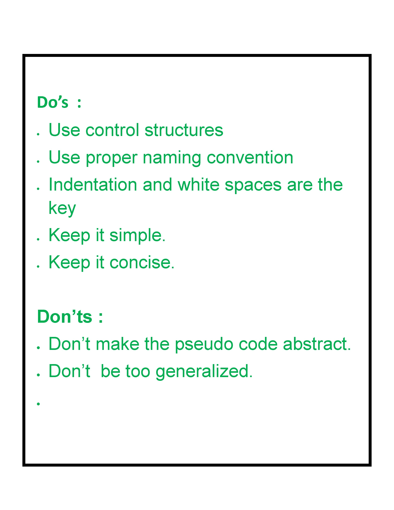

# 如何写伪代码？

> 原文:[https://www.geeksforgeeks.org/how-to-write-a-pseudo-code/](https://www.geeksforgeeks.org/how-to-write-a-pseudo-code/)

**伪代码**是一个经常在基于编程和算法的领域中使用的术语。这是一种允许程序员表示算法实现的方法。简单地说，我们可以说它是一个算法的精心制作的表示。通常情况下，算法是借助伪代码来表示的，因为无论程序员的编程背景或知识如何，他们都可以对算法进行解释。伪代码，顾名思义，是一种虚假代码或代码的表示，即使是有一些学校级别编程知识的外行也能理解。

**[算法](https://www.geeksforgeeks.org/fundamentals-of-algorithms/) :** 这是一个有组织的逻辑序列的行动或方法对一个特定的问题。程序员实现一种算法来解决问题。算法是用自然的语言表达的，但有些技术性的注释。

**伪代码:**简单来说就是一个算法的实现，其形式是用普通英语编写的注释和信息文本。它不像任何编程语言那样有语法，因此不能被计算机编译或解释。

### 伪代码的优点

*   提高任何方法的可读性。这是开始实现算法的最佳方法之一。
*   充当程序和算法或流程图之间的桥梁。也可以作为一个粗略的文档，所以当一个伪代码被写出来时，一个开发者的程序很容易被理解。在工业中，文档方法是必不可少的。这就是伪代码被证明至关重要的地方。
*   伪代码的主要目标是解释程序的每一行应该做什么，因此让程序员更容易进入代码构建阶段。

### 如何编写伪代码？

1.  安排任务的顺序，并相应地编写伪代码。
2.  Start with the statement of a pseudo code which establishes the main goal or the aim.

    **示例:**

    ```
    This program will allow the user to check
    the number whether it's even or odd.
    ```

3.  if-else，for，在程序中循环缩进的方式，同样缩进语句，因为它有助于理解决策控制和执行机制。它们也在很大程度上提高了可读性。

    ```
    Example:

    if "1"
        print response
            "I am case 1"

    if "2"
        print response
            "I am case 2"

    ```

4.  使用适当的命名约定。人类倾向于遵循我们所看到的方法。如果一个程序员通过一个伪代码，他的方法将是相同的，所以命名必须简单和独特。
5.  使用适当的句子大小写，例如方法使用 CamelCase，常量使用大写，变量使用小写。
6.  详细说明实际代码中将要发生的一切。不要让伪代码变得抽象。
7.  使用标准的编程结构，如“if-then”，“for”，“while”，“cases”我们在编程中使用它的方式。
8.  检查伪代码的所有部分是否完整、有限和清晰，以便理解和领会。
9.  不要以完整的编程方式编写伪代码。即使对于外行或客户来说，简单易懂也是必要的，因此不要包含太多的技术术语。

### 示例:

让我们看看这段代码

## Java 语言(一种计算机语言，尤用于创建网站)

```
// This program calculates the Lowest Common multiple
// for excessively long input values

import java.util.*;

public class LowestCommonMultiple {

    private static long
    lcmNaive(long numberOne, long numberTwo)
    {

        long lowestCommonMultiple;

        lowestCommonMultiple
            = (numberOne * numberTwo)
              / greatestCommonDivisor(numberOne,
                                      numberTwo);

        return lowestCommonMultiple;
    }

    private static long
    greatestCommonDivisor(long numberOne, long numberTwo)
    {

        if (numberTwo == 0)
            return numberOne;

        return greatestCommonDivisor(numberTwo,
                                     numberOne % numberTwo);
    }
    public static void main(String args[])
    {

        Scanner scanner = new Scanner(System.in);
        System.out.println("Enter the inputs");
        long numberOne = scanner.nextInt();
        long numberTwo = scanner.nextInt();

        System.out.println(lcmNaive(numberOne, numberTwo));
    }
}
```

同样的还有**伪代码**。

```
This program calculates the Lowest Common multiple 
for excessively long input values

function lcmNaive(Argument one, Argument two){

    Calculate the lowest common variable of Argument
    1 and Argument 2 by dividing their product by their
    Greatest common divisor product

    return lowest common multiple
end
}
function greatestCommonDivisor(Argument one, Argument two){
    if Argument two is equal to zero
        then return Argument one

    return the greatest common divisor

end
}

{
In the main function

   print prompt "Input two numbers"

   Take the first number from the user
   Take the second number from the user

   Send the first number and second number 
   to the lcmNaive function and print
   the result to the user   
}
```