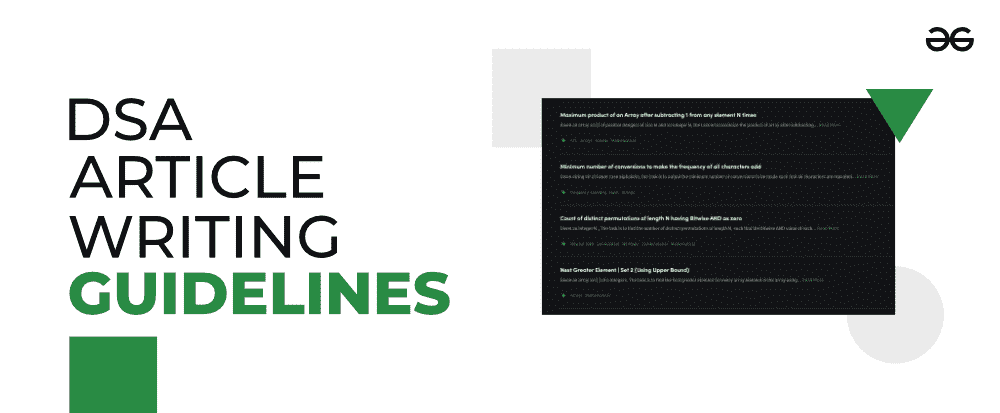
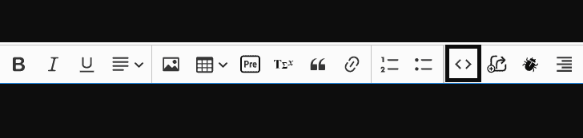
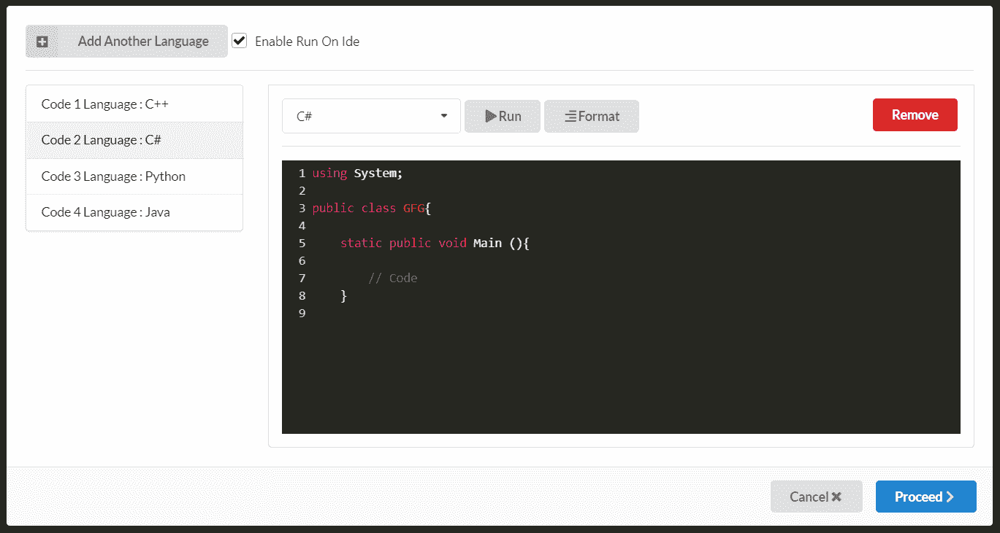
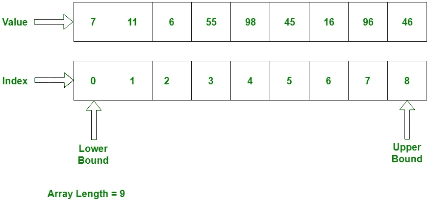

# 如何在极客博客上写 DSA 文章？

> 原文:[https://www . geesforgeeks . org/how-write-DSA-articles-on-geesforgeeks/](https://www.geeksforgeeks.org/how-to-write-dsa-articles-on-geeksforgeeks/)

GeeksforGeeks 为所有编码爱好者提供了一个机会，通过编写编码或基于 DSA 的文章来展示他们的编程和数据结构与算法技能。然而，许多人(尤其是大学生或初学者)发现很难清楚地表达他们的学习和技能，并在极客论坛上做出贡献。但是现在这个问题已经解决了，因为这篇文章将指导你完成在 GeeksforGeeks 写编程/DSA 文章的整个过程和指导方针。



*我们开始吧:*

首先，你需要知道**如何在 GFG** 开始文章写作，以及各种其他基本方面，比如*你为什么要投稿，在哪里写作，*等等。你可以查看这个 [**链接**](https://write.geeksforgeeks.org/how-to-write/) 全面了解这些细节。

## 如何验证能不能写文章？

现在，你需要检查你是否能写一篇关于特定主题/问题的文章。您可以按照下面提到的步骤进行操作:

1.  在极客网站的自定义搜索中搜索标题和问题陈述。如果存在，不要写。
2.  然后在谷歌上搜索标题、问题陈述和例子(一起和/或单独)，从其他网站找到相关的现有链接。如果同样的内容在某个地方也可以获得，这将导致剽窃，因此不能被接受。
3.  搜索一些基本的变体或一般化的问题陈述。如果被发现，将被视为抄袭。

*文章通过以上几点，文章就可以写了。*

## 编码文章格式和指南

接下来，让我们看看在 GeeksforGeeks 写一篇编码文章时需要遵循的格式和准则。编程文章应包含以下要点:

1.  问题陈述
2.  例子(二)。举例说明，以便正确理解我们是如何取得结果的。
3.  链接的先决条件的方法，如果有。
4.  用来解决问题的方法。
    1.  *首先，一个基本的想法或者直觉*
    2.  *然后逐步指出这种方法将如何工作*
    3.  *使用粗体、区块引用*、*或 pre 突出显示任何重要的观察点或点。*
5.  实现/代码。如果有多种语言的代码，顺序应该是 C++、Java、Python3、C#。请注意，不接受 Python 2 代码，但接受 Python 3 代码。
6.  时间复杂性和辅助空间，以及用于表达这些的术语的解释。

请尽量保持语言简单、具体，不要用我、你、我们等代词

## 方法格式

**如果进场是:**

> 我们创建一个布尔类型的标记[]数组。我们遍历字符串的所有字符，每当我们看到一个字符，我们就标记它。小写和大写被认为是相同的。所以‘A’和‘A’标记在索引 0 中，类似地‘Z’和‘Z’标记在索引 25 中。

**以上可以写成:**

> 这种方法基于**散列**。
> 
> 1.  创建大小为 26 的布尔类型的哈希数据结构，这样索引 0 代表字符“a”，1 代表字符“b”，依此类推。
> 2.  逐个字符遍历字符串，并将特定字符标记为哈希中存在的字符。
> 3.  在完成字符串的遍历和标记后，遍历哈希并查看是否所有字符都存在，即每个索引都为真。如果都标记了，那么返回真，否则返回假。

## 示例方法:

***问题–在 NxN 板上打印设置 N 件的所有唯一组合***

> **方法:**这个问题可以通过使用**递归**生成所有可能的解来解决。现在，按照以下步骤解决这个问题:
> 
> 1.  创建一个名为 **allCombinations** 的函数，它将生成所有可能的解。
> 2.  它将取一个整数**pieced**表示放置的总件数，整数 **N** 表示需要放置的件数，两个整数 **row** 和 **col** 表示当前件将要放置的行和列，以及一个字符串 **ans** 作为参数，用于存储放置件的矩阵。
> 3.  现在，对**所有组合**的初始调用将通过 **0** 作为**分段**、 **N** 、 **0** 和 **0** 作为**行**和**列**，以及一个空字符串作为**和**。
> 4.  在每次通话中，检查基本情况，即:
>     *   如果行变成 **N** 并且所有的片都被放置，即**片被放置=N** 。然后打印 **ans** 返回。否则如果**件**不是 **N** ，那么就从这个调用返回。
> 5.  现在打两个电话:
>     *   一个是在当前位置加一个**' ***，一个是离开该位置加 **'-'** 。
> 6.  之后，递归调用将打印所有可能的解决方案。

## 如何在文章中添加代码？

更进一步，现在您需要理解在文章中添加代码的过程。具体如下:

您可以使用“**添加代码”**按钮添加代码。



要以多种编程语言添加代码，您可以选择**添加另一种语言**选项，如下所示。之后点击**继续**按钮。



如果您的代码由于编译器不支持的库等任何原因而无法编译或运行，您希望演示错误等，请取消选中“启用 Ide 上的运行”选项，从代码中删除运行按钮。当您尝试使用“**追加输出**”按钮追加输出时，该按钮也避免了错误，该按钮位于“**添加代码**按钮旁边。

## 编码标准

您需要确保遵循下面提到的编码标准:

**1)** 函数和变量名遵循 camel 大小写。例如，getMin()、getMax()和 removeDuplicates()、isPresent 等。

**2)** 驱动程序代码(或主功能)不包含任何逻辑。它只包含输入/输出和函数调用。

**3)** 缩进应使用 4 个空格。

**4)** 一行最多 60 个字符，这样程序就可以在移动设备上阅读，而无需太多的水平滚动。

## C

```
// Below style should be avoided
int fun(int a, int sumSoFar, int currSum, char val, int *result)

// The above should be written as
int fun(int a, int sumSoFar, int currSum, char val,
        int *result)
```

## C++

```
// Below style should be avoided
 cout << "Sample code to understand coding style for more readability of millions of readers" << val;

// The above should be written as
cout << "Sample code to understand coding style for"
     << " more readability of millions of readers"
     << val;
```

**5)** 如果代码是用 Python、Java、C/C++等多种语言编写的，那么所有代码的输出应该是相同的。

**6)** 避免使用 scanf(或 cin)语句。

**7)** 如果，否则，为

## C

```
// There should be one space after while, no other
// spaces
while (i < 0)   

if (x < y)
{

}
```

**8)** 函数调用或函数声明不应有任何空格

## C

```
// No spaces after "reverse" or after "("
void reverse(char* str, int low, int high)
{
    while (low < high)
    {
        swap(&str[low], &str[high]);
        ++low;
        --high;
    }
}   

// Driver program to test above function
int main()
{
   char str[] =  "geeksforgeeks";
   reverse(str);
   return 0;
}
```

**9)** 避免使用 typdef。

**10)** 函数名的形式应为“ **m** axOfTwo()”，变量名的形式应为“max_of_two”或与函数名样式相同。类/结构名称的形式应该是“ **C** omplexNumber”或“ **S** uffixTreeNode”。宏名应该是大写字母，比如 MAX_SIZE。

**11)** 避免使用静态和全局变量。

**12)** 当我们使用 cout 时，必须使用 cout 与“< <”之间的空格以及两个“< <”之间的空格。例如:

## C++

```
cout << "Sample" << "Example"
```

**13)** 声明列表和参数传递中逗号后面要有空格。

## C

```
int x, y, z;

fun(x, y, z);
```

**14)** 赋值运算符中应该有空格

## C

```
// Should be avoided
int x, y=0;

// Should be followed
int x, y = 0;

// Should be avoided
x+=10;

// Should be followed
x += 10;
```

**15)** 请在每期节目开始时，写一行字，说出节目的目的:

## Java 语言(一种计算机语言，尤用于创建网站)

```
// Java program to illustrate sum of two numbers
```

**注意:**强烈建议在数据结构/算法文章中的代码后增加时间复杂度。

## 图像创建指南

图像创建指南如下:

*   图像的名称必须是**相关**。例如，如果图像描述了“:”使用链表添加两个数字，则图像的标题必须是:“使用链表添加两个数字”。
*   如果使用 packet tracer 构建图像，请尽可能发送屏幕记录来代替图像。
*   如果是截图，请在输出中的某个地方添加 GeeksforGeeks(或 GFG)。例如，它可能是文件夹名称、图像标题等。
*   必须使用一些图像绘制工具来创建自己的图像(例如:谷歌绘图、微软绘画、https://www.draw.io/)。不得从任何其他来源获取图像，以避免任何版权问题。您可以遵循以下准则来创建极客风格的图像:
    *   图像的边界/轮廓应为黑色。
    *   要写的文字应该是绿色的。
    *   我们的重点应该是使用白色背景，如果需要其他背景颜色，请使用绿色作为背景，白色在文本中。
    *   红色应该用来显示动作、表现、变化和其他事物。
    *   如果图片中需要更多的颜色，请联系 GeeksforGeeks 的审查者来指导您。

请参见下面的示例图像，以清楚了解阵列的图像创建:



### 要点(附示例)

**1。**如果方法非常简单或简洁，那么就没有必要提及解决问题的分步要点——解决问题的步骤可以在单个段落中介绍。例如–查看本文: [**将元素转换为正方形后对链表进行排序**](https://www.geeksforgeeks.org/sort-a-linked-list-after-converting-elements-to-their-squares/)

**2。**在数据结构/算法文章中的代码后添加时间复杂度和辅助空间。查看文章以供参考: [**在 NxN 板上打印设置 N 件的所有独特组合**](https://www.geeksforgeeks.org/print-all-unique-combinations-of-setting-n-pieces-on-an-nxn-board/)

**3。**在使用高效方法解决问题时，您首先需要说明为什么它比幼稚/旧方法更好。例如–查看本文: [**对(arr[i]，arr[j])进行计数，使得 arr[i] + j 和 arr[j] + i 相等**](https://www.geeksforgeeks.org/count-of-pairs-arri-arrj-such-that-arri-j-and-arrj-i-are-equal/)

**4。**再来几篇样文:

*   [**将跳跃索引选择的元素 arr[i]的总和最大化值 i**](https://www.geeksforgeeks.org/maximize-the-sum-of-elements-arri-selected-by-jumping-index-by-value-i/)
*   [**在给定的二进制数组中，如果连续三元组可被 3 整除，则通过删除中间元素来查找 0 是否被移除更多或 1**](https://www.geeksforgeeks.org/find-if-0-is-removed-more-or-1-by-deleting-middle-element-if-consecutive-triplet-is-divisible-by-3-in-given-binary-array/)
*   [**检查一个数是否可以表示为一个质数和一个合成数的乘积**](https://www.geeksforgeeks.org/check-if-a-number-can-be-expressed-as-product-of-a-prime-and-a-composite-number/)