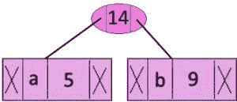
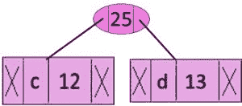
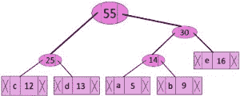
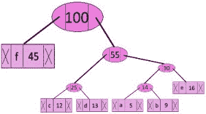
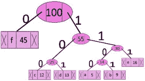

# 霍夫曼编码|贪婪算法-3

> 原文:[https://www.geeksforgeeks.org/huffman-coding-greedy-algo-3/](https://www.geeksforgeeks.org/huffman-coding-greedy-algo-3/)

霍夫曼编码是一种无损数据压缩算法。其思想是给输入字符分配可变长度的代码，分配代码的长度基于相应字符的频率。最频繁的字符得到最小的代码，最不频繁的字符得到最大的代码。
分配给输入字符的可变长度代码是[前缀代码](http://en.wikipedia.org/wiki/Prefix_code)，意味着代码(位序列)的分配方式是分配给一个字符的代码不是分配给任何其他字符的代码的前缀。这就是霍夫曼编码如何确保解码生成的比特流时没有歧义。
我们用一个反例来理解前缀码。假设有四个字符 a、b、c 和 d，它们对应的变长码是 00、01、0 和 1。这种编码会导致歧义，因为分配给 c 的代码是分配给 a 和 b 的代码的前缀，如果压缩比特流是 0001，则解压缩输出可能是“cccd”或“ccb”或“acd”或“ab”。
霍夫曼编码的应用见[本](http://en.wikipedia.org/wiki/Huffman_coding#Applications)。
霍夫曼编码主要有两大部分

1.  从输入字符建立霍夫曼树。
2.  遍历霍夫曼树，给字符分配代码。

***构建霍夫曼树的步骤***
输入的是一组独特的字符及其出现频率，输出的是霍夫曼树。

1.  为每个唯一字符创建一个叶节点，并为所有叶节点构建一个最小堆(最小堆用作优先级队列。频率字段的值用于比较最小堆中的两个节点。最初，最不频繁的字符是在根)
2.  从最小堆中提取具有最小频率的两个节点。

3.  创建一个新的内部节点，其频率等于两个节点频率之和。将第一个提取的节点作为其左子节点，将另一个提取的节点作为其右子节点。将此节点添加到最小堆中。
4.  重复步骤#2 和#3，直到堆只包含一个节点。剩下的节点是根节点，树是完整的。
    我们用一个例子来理解算法:

```
character   Frequency
    a            5
    b           9
    c           12
    d           13
    e           16
    f           45
```

**第一步。**构建一个包含 6 个节点的最小堆，其中每个节点代表一个具有单个节点的树的根。
**步骤 2** 从 min 堆中提取两个最小频率节点。添加频率为 5 + 9 = 14 的新内部节点。



现在最小堆包含 5 个节点，其中 4 个节点是每个元素的树根，一个堆节点是 3 个元素的树根

```
character           Frequency
       c               12
       d               13
 Internal Node         14
       e               16
       f                45
```

**步骤 3:** 从堆中提取两个最小频率节点。添加频率为 12 + 13 = 25 的新内部节点



现在，最小堆包含 4 个节点，其中 2 个节点是每个都有单个元素的树的根，两个堆节点是有多个节点的树的根

```
character           Frequency
Internal Node          14
       e               16
Internal Node          25
       f               45
```

**第四步:**提取两个最小频率节点。添加频率为 14 + 16 = 30 的新内部节点


现在最小堆包含 3 个节点。

```
character          Frequency
Internal Node         25
Internal Node         30
      f               45 
```

**第五步:**提取两个最小频率节点。添加频率为 25 + 30 = 55 的新内部节点



现在最小堆包含 2 个节点。

```
character     Frequency
       f         45
Internal Node    55
```

**第六步:**提取两个最小频率节点。添加频率为 45 + 55 = 100 的新内部节点



现在最小堆只包含一个节点。

```
character      Frequency
Internal Node    100
```

因为堆只包含一个节点，所以算法到此为止。

***从哈夫曼树打印代码的步骤:***
遍历从根开始形成的树。保持一个辅助阵列。移动到左边的子级时，将 0 写入数组。移动到右边的子级时，向数组中写入 1。遇到叶节点时打印数组。



代码如下:

```
character   code-word
    f          0
    c          100
    d          101
    a          1100
    b          1101
    e          111
```

下面是上述方法的实现:

## C

```
// C program for Huffman Coding
#include <stdio.h>
#include <stdlib.h>

// This constant can be avoided by explicitly
// calculating height of Huffman Tree
#define MAX_TREE_HT 100

// A Huffman tree node
struct MinHeapNode {

    // One of the input characters
    char data;

    // Frequency of the character
    unsigned freq;

    // Left and right child of this node
    struct MinHeapNode *left, *right;
};

// A Min Heap:  Collection of
// min-heap (or Huffman tree) nodes
struct MinHeap {

    // Current size of min heap
    unsigned size;

    // capacity of min heap
    unsigned capacity;

    // Array of minheap node pointers
    struct MinHeapNode** array;
};

// A utility function allocate a new
// min heap node with given character
// and frequency of the character
struct MinHeapNode* newNode(char data, unsigned freq)
{
    struct MinHeapNode* temp = (struct MinHeapNode*)malloc(
        sizeof(struct MinHeapNode));

    temp->left = temp->right = NULL;
    temp->data = data;
    temp->freq = freq;

    return temp;
}

// A utility function to create
// a min heap of given capacity
struct MinHeap* createMinHeap(unsigned capacity)

{

    struct MinHeap* minHeap
        = (struct MinHeap*)malloc(sizeof(struct MinHeap));

    // current size is 0
    minHeap->size = 0;

    minHeap->capacity = capacity;

    minHeap->array = (struct MinHeapNode**)malloc(
        minHeap->capacity * sizeof(struct MinHeapNode*));
    return minHeap;
}

// A utility function to
// swap two min heap nodes
void swapMinHeapNode(struct MinHeapNode** a,
                     struct MinHeapNode** b)

{

    struct MinHeapNode* t = *a;
    *a = *b;
    *b = t;
}

// The standard minHeapify function.
void minHeapify(struct MinHeap* minHeap, int idx)

{

    int smallest = idx;
    int left = 2 * idx + 1;
    int right = 2 * idx + 2;

    if (left < minHeap->size
        && minHeap->array[left]->freq
               < minHeap->array[smallest]->freq)
        smallest = left;

    if (right < minHeap->size
        && minHeap->array[right]->freq
               < minHeap->array[smallest]->freq)
        smallest = right;

    if (smallest != idx) {
        swapMinHeapNode(&minHeap->array[smallest],
                        &minHeap->array[idx]);
        minHeapify(minHeap, smallest);
    }
}

// A utility function to check
// if size of heap is 1 or not
int isSizeOne(struct MinHeap* minHeap)
{

    return (minHeap->size == 1);
}

// A standard function to extract
// minimum value node from heap
struct MinHeapNode* extractMin(struct MinHeap* minHeap)

{

    struct MinHeapNode* temp = minHeap->array[0];
    minHeap->array[0] = minHeap->array[minHeap->size - 1];

    --minHeap->size;
    minHeapify(minHeap, 0);

    return temp;
}

// A utility function to insert
// a new node to Min Heap
void insertMinHeap(struct MinHeap* minHeap,
                   struct MinHeapNode* minHeapNode)

{

    ++minHeap->size;
    int i = minHeap->size - 1;

    while (i
           && minHeapNode->freq
                  < minHeap->array[(i - 1) / 2]->freq) {

        minHeap->array[i] = minHeap->array[(i - 1) / 2];
        i = (i - 1) / 2;
    }

    minHeap->array[i] = minHeapNode;
}

// A standard function to build min heap
void buildMinHeap(struct MinHeap* minHeap)

{

    int n = minHeap->size - 1;
    int i;

    for (i = (n - 1) / 2; i >= 0; --i)
        minHeapify(minHeap, i);
}

// A utility function to print an array of size n
void printArr(int arr[], int n)
{
    int i;
    for (i = 0; i < n; ++i)
        printf("%d", arr[i]);

    printf("\n");
}

// Utility function to check if this node is leaf
int isLeaf(struct MinHeapNode* root)

{

    return !(root->left) && !(root->right);
}

// Creates a min heap of capacity
// equal to size and inserts all character of
// data[] in min heap. Initially size of
// min heap is equal to capacity
struct MinHeap* createAndBuildMinHeap(char data[],
                                      int freq[], int size)

{

    struct MinHeap* minHeap = createMinHeap(size);

    for (int i = 0; i < size; ++i)
        minHeap->array[i] = newNode(data[i], freq[i]);

    minHeap->size = size;
    buildMinHeap(minHeap);

    return minHeap;
}

// The main function that builds Huffman tree
struct MinHeapNode* buildHuffmanTree(char data[],
                                     int freq[], int size)

{
    struct MinHeapNode *left, *right, *top;

    // Step 1: Create a min heap of capacity
    // equal to size.  Initially, there are
    // modes equal to size.
    struct MinHeap* minHeap
        = createAndBuildMinHeap(data, freq, size);

    // Iterate while size of heap doesn't become 1
    while (!isSizeOne(minHeap)) {

        // Step 2: Extract the two minimum
        // freq items from min heap
        left = extractMin(minHeap);
        right = extractMin(minHeap);

        // Step 3:  Create a new internal
        // node with frequency equal to the
        // sum of the two nodes frequencies.
        // Make the two extracted node as
        // left and right children of this new node.
        // Add this node to the min heap
        // '{content}apos; is a special value for internal nodes, not
        // used
        top = newNode('{content}apos;, left->freq + right->freq);

        top->left = left;
        top->right = right;

        insertMinHeap(minHeap, top);
    }

    // Step 4: The remaining node is the
    // root node and the tree is complete.
    return extractMin(minHeap);
}

// Prints huffman codes from the root of Huffman Tree.
// It uses arr[] to store codes
void printCodes(struct MinHeapNode* root, int arr[],
                int top)

{

    // Assign 0 to left edge and recur
    if (root->left) {

        arr[top] = 0;
        printCodes(root->left, arr, top + 1);
    }

    // Assign 1 to right edge and recur
    if (root->right) {

        arr[top] = 1;
        printCodes(root->right, arr, top + 1);
    }

    // If this is a leaf node, then
    // it contains one of the input
    // characters, print the character
    // and its code from arr[]
    if (isLeaf(root)) {

        printf("%c: ", root->data);
        printArr(arr, top);
    }
}

// The main function that builds a
// Huffman Tree and print codes by traversing
// the built Huffman Tree
void HuffmanCodes(char data[], int freq[], int size)

{
    // Construct Huffman Tree
    struct MinHeapNode* root
        = buildHuffmanTree(data, freq, size);

    // Print Huffman codes using
    // the Huffman tree built above
    int arr[MAX_TREE_HT], top = 0;

    printCodes(root, arr, top);
}

// Driver code
int main()
{

    char arr[] = { 'a', 'b', 'c', 'd', 'e', 'f' };
    int freq[] = { 5, 9, 12, 13, 16, 45 };

    int size = sizeof(arr) / sizeof(arr[0]);

    HuffmanCodes(arr, freq, size);

    return 0;
}
```

## C++

```
// C++ program for Huffman Coding
#include <iostream>
#include <cstdlib>
using namespace std;

// This constant can be avoided by explicitly
// calculating height of Huffman Tree
#define MAX_TREE_HT 100

// A Huffman tree node
struct MinHeapNode {

    // One of the input characters
    char data;

    // Frequency of the character
    unsigned freq;

    // Left and right child of this node
    struct MinHeapNode *left, *right;
};

// A Min Heap: Collection of
// min-heap (or Huffman tree) nodes
struct MinHeap {

    // Current size of min heap
    unsigned size;

    // capacity of min heap
    unsigned capacity;

    // Array of minheap node pointers
    struct MinHeapNode** array;
};

// A utility function allocate a new
// min heap node with given character
// and frequency of the character
struct MinHeapNode* newNode(char data, unsigned freq)
{
    struct MinHeapNode* temp
        = (struct MinHeapNode*)malloc
(sizeof(struct MinHeapNode));

    temp->left = temp->right = NULL;
    temp->data = data;
    temp->freq = freq;

    return temp;
}

// A utility function to create
// a min heap of given capacity
struct MinHeap* createMinHeap(unsigned capacity)

{

    struct MinHeap* minHeap
        = (struct MinHeap*)malloc(sizeof(struct MinHeap));

    // current size is 0
    minHeap->size = 0;

    minHeap->capacity = capacity;

    minHeap->array
        = (struct MinHeapNode**)malloc(minHeap->
capacity * sizeof(struct MinHeapNode*));
    return minHeap;
}

// A utility function to
// swap two min heap nodes
void swapMinHeapNode(struct MinHeapNode** a,
                    struct MinHeapNode** b)

{

    struct MinHeapNode* t = *a;
    *a = *b;
    *b = t;
}

// The standard minHeapify function.
void minHeapify(struct MinHeap* minHeap, int idx)

{

    int smallest = idx;
    int left = 2 * idx + 1;
    int right = 2 * idx + 2;

    if (left < minHeap->size && minHeap->array[left]->
freq < minHeap->array[smallest]->freq)
        smallest = left;

    if (right < minHeap->size && minHeap->array[right]->
freq < minHeap->array[smallest]->freq)
        smallest = right;

    if (smallest != idx) {
        swapMinHeapNode(&minHeap->array[smallest],
                        &minHeap->array[idx]);
        minHeapify(minHeap, smallest);
    }
}

// A utility function to check
// if size of heap is 1 or not
int isSizeOne(struct MinHeap* minHeap)
{

    return (minHeap->size == 1);
}

// A standard function to extract
// minimum value node from heap
struct MinHeapNode* extractMin(struct MinHeap* minHeap)

{

    struct MinHeapNode* temp = minHeap->array[0];
    minHeap->array[0]
        = minHeap->array[minHeap->size - 1];

    --minHeap->size;
    minHeapify(minHeap, 0);

    return temp;
}

// A utility function to insert
// a new node to Min Heap
void insertMinHeap(struct MinHeap* minHeap,
                struct MinHeapNode* minHeapNode)

{

    ++minHeap->size;
    int i = minHeap->size - 1;

    while (i && minHeapNode->freq < minHeap->array[(i - 1) / 2]->freq) {

        minHeap->array[i] = minHeap->array[(i - 1) / 2];
        i = (i - 1) / 2;
    }

    minHeap->array[i] = minHeapNode;
}

// A standard function to build min heap
void buildMinHeap(struct MinHeap* minHeap)

{

    int n = minHeap->size - 1;
    int i;

    for (i = (n - 1) / 2; i >= 0; --i)
        minHeapify(minHeap, i);
}

// A utility function to print an array of size n
void printArr(int arr[], int n)
{
    int i;
    for (i = 0; i < n; ++i)
        cout<< arr[i];

    cout<<"\n";
}

// Utility function to check if this node is leaf
int isLeaf(struct MinHeapNode* root)

{

    return !(root->left) && !(root->right);
}

// Creates a min heap of capacity
// equal to size and inserts all character of
// data[] in min heap. Initially size of
// min heap is equal to capacity
struct MinHeap* createAndBuildMinHeap(char data[], int freq[], int size)

{

    struct MinHeap* minHeap = createMinHeap(size);

    for (int i = 0; i < size; ++i)
        minHeap->array[i] = newNode(data[i], freq[i]);

    minHeap->size = size;
    buildMinHeap(minHeap);

    return minHeap;
}

// The main function that builds Huffman tree
struct MinHeapNode* buildHuffmanTree(char data[], int freq[], int size)

{
    struct MinHeapNode *left, *right, *top;

    // Step 1: Create a min heap of capacity
    // equal to size. Initially, there are
    // modes equal to size.
    struct MinHeap* minHeap = createAndBuildMinHeap(data, freq, size);

    // Iterate while size of heap doesn't become 1
    while (!isSizeOne(minHeap)) {

        // Step 2: Extract the two minimum
        // freq items from min heap
        left = extractMin(minHeap);
        right = extractMin(minHeap);

        // Step 3: Create a new internal
        // node with frequency equal to the
        // sum of the two nodes frequencies.
        // Make the two extracted node as
        // left and right children of this new node.
        // Add this node to the min heap
        // '{content}apos; is a special value for internal nodes, not used
        top = newNode('{content}apos;, left->freq + right->freq);

        top->left = left;
        top->right = right;

        insertMinHeap(minHeap, top);
    }

    // Step 4: The remaining node is the
    // root node and the tree is complete.
    return extractMin(minHeap);
}

// Prints huffman codes from the root of Huffman Tree.
// It uses arr[] to store codes
void printCodes(struct MinHeapNode* root, int arr[], int top)

{

    // Assign 0 to left edge and recur
    if (root->left) {

        arr[top] = 0;
        printCodes(root->left, arr, top + 1);
    }

    // Assign 1 to right edge and recur
    if (root->right) {

        arr[top] = 1;
        printCodes(root->right, arr, top + 1);
    }

    // If this is a leaf node, then
    // it contains one of the input
    // characters, print the character
    // and its code from arr[]
    if (isLeaf(root)) {

        cout<< root->data <<": ";
        printArr(arr, top);
    }
}

// The main function that builds a
// Huffman Tree and print codes by traversing
// the built Huffman Tree
void HuffmanCodes(char data[], int freq[], int size)

{
    // Construct Huffman Tree
    struct MinHeapNode* root
        = buildHuffmanTree(data, freq, size);

    // Print Huffman codes using
    // the Huffman tree built above
    int arr[MAX_TREE_HT], top = 0;

    printCodes(root, arr, top);
}

// Driver code
int main()
{

    char arr[] = { 'a', 'b', 'c', 'd', 'e', 'f' };
    int freq[] = { 5, 9, 12, 13, 16, 45 };

    int size = sizeof(arr) / sizeof(arr[0]);

    HuffmanCodes(arr, freq, size);

    return 0;
}
```

## C++

```
// C++(STL) program for Huffman Coding with STL
#include <bits/stdc++.h>
using namespace std;

// A Huffman tree node
struct MinHeapNode {

    // One of the input characters
    char data;

    // Frequency of the character
    unsigned freq;

    // Left and right child
    MinHeapNode *left, *right;

    MinHeapNode(char data, unsigned freq)

    {

        left = right = NULL;
        this->data = data;
        this->freq = freq;
    }
};

// For comparison of
// two heap nodes (needed in min heap)
struct compare {

    bool operator()(MinHeapNode* l, MinHeapNode* r)

    {
        return (l->freq > r->freq);
    }
};

// Prints huffman codes from
// the root of Huffman Tree.
void printCodes(struct MinHeapNode* root, string str)
{

    if (!root)
        return;

    if (root->data != '{content}apos;)
        cout << root->data << ": " << str << "\n";

    printCodes(root->left, str + "0");
    printCodes(root->right, str + "1");
}

// The main function that builds a Huffman Tree and
// print codes by traversing the built Huffman Tree
void HuffmanCodes(char data[], int freq[], int size)
{
    struct MinHeapNode *left, *right, *top;

    // Create a min heap & inserts all characters of data[]
    priority_queue<MinHeapNode*, vector<MinHeapNode*>, compare> minHeap;

    for (int i = 0; i < size; ++i)
        minHeap.push(new MinHeapNode(data[i], freq[i]));

    // Iterate while size of heap doesn't become 1
    while (minHeap.size() != 1) {

        // Extract the two minimum
        // freq items from min heap
        left = minHeap.top();
        minHeap.pop();

        right = minHeap.top();
        minHeap.pop();

        // Create a new internal node with
        // frequency equal to the sum of the
        // two nodes frequencies. Make the
        // two extracted node as left and right children
        // of this new node. Add this node
        // to the min heap '{content}apos; is a special value
        // for internal nodes, not used
        top = new MinHeapNode('{content}apos;, left->freq + right->freq);

        top->left = left;
        top->right = right;

        minHeap.push(top);
    }

    // Print Huffman codes using
    // the Huffman tree built above
    printCodes(minHeap.top(), "");
}

// Driver Code
int main()
{

    char arr[] = { 'a', 'b', 'c', 'd', 'e', 'f' };
    int freq[] = { 5, 9, 12, 13, 16, 45 };

    int size = sizeof(arr) / sizeof(arr[0]);

    HuffmanCodes(arr, freq, size);

    return 0;
}

// This code is contributed by Aditya Goel
```

## Java 语言(一种计算机语言，尤用于创建网站)

```
import java.util.PriorityQueue;
import java.util.Scanner;
import java.util.Comparator;

// node class is the basic structure
// of each node present in the Huffman - tree.
class HuffmanNode {

    int data;
    char c;

    HuffmanNode left;
    HuffmanNode right;
}

// comparator class helps to compare the node
// on the basis of one of its attribute.
// Here we will be compared
// on the basis of data values of the nodes.
class MyComparator implements Comparator<HuffmanNode> {
    public int compare(HuffmanNode x, HuffmanNode y)
    {

        return x.data - y.data;
    }
}

public class Huffman {

    // recursive function to print the
    // huffman-code through the tree traversal.
    // Here s is the huffman - code generated.
    public static void printCode(HuffmanNode root, String s)
    {

        // base case; if the left and right are null
        // then its a leaf node and we print
        // the code s generated by traversing the tree.
        if (root.left
                == null
            && root.right
                   == null
            && Character.isLetter(root.c)) {

            // c is the character in the node
            System.out.println(root.c + ":" + s);

            return;
        }

        // if we go to left then add "0" to the code.
        // if we go to the right add"1" to the code.

        // recursive calls for left and
        // right sub-tree of the generated tree.
        printCode(root.left, s + "0");
        printCode(root.right, s + "1");
    }

    // main function
    public static void main(String[] args)
    {

        Scanner s = new Scanner(System.in);

        // number of characters.
        int n = 6;
        char[] charArray = { 'a', 'b', 'c', 'd', 'e', 'f' };
        int[] charfreq = { 5, 9, 12, 13, 16, 45 };

        // creating a priority queue q.
        // makes a min-priority queue(min-heap).
        PriorityQueue<HuffmanNode> q
            = new PriorityQueue<HuffmanNode>(n, new MyComparator());

        for (int i = 0; i < n; i++) {

            // creating a Huffman node object
            // and add it to the priority queue.
            HuffmanNode hn = new HuffmanNode();

            hn.c = charArray[i];
            hn.data = charfreq[i];

            hn.left = null;
            hn.right = null;

            // add functions adds
            // the huffman node to the queue.
            q.add(hn);
        }

        // create a root node
        HuffmanNode root = null;

        // Here we will extract the two minimum value
        // from the heap each time until
        // its size reduces to 1, extract until
        // all the nodes are extracted.
        while (q.size() > 1) {

            // first min extract.
            HuffmanNode x = q.peek();
            q.poll();

            // second min extract.
            HuffmanNode y = q.peek();
            q.poll();

            // new node f which is equal
            HuffmanNode f = new HuffmanNode();

            // to the sum of the frequency of the two nodes
            // assigning values to the f node.
            f.data = x.data + y.data;
            f.c = '-';

            // first extracted node as left child.
            f.left = x;

            // second extracted node as the right child.
            f.right = y;

            // marking the f node as the root node.
            root = f;

            // add this node to the priority-queue.
            q.add(f);
        }

        // print the codes by traversing the tree
        printCode(root, "");
    }
}

// This code is contributed by Kunwar Desh Deepak Singh
```

## 蟒蛇 3

```
# A Huffman Tree Node
class node:
    def __init__(self, freq, symbol, left=None, right=None):
        # frequency of symbol
        self.freq = freq

        # symbol name (character)
        self.symbol = symbol

        # node left of current node
        self.left = left

        # node right of current node
        self.right = right

        # tree direction (0/1)
        self.huff = ''

# utility function to print huffman
# codes for all symbols in the newly
# created Huffman tree

def printNodes(node, val=''):
    # huffman code for current node
    newVal = val + str(node.huff)

    # if node is not an edge node
    # then traverse inside it
    if(node.left):
        printNodes(node.left, newVal)
    if(node.right):
        printNodes(node.right, newVal)

        # if node is edge node then
        # display its huffman code
    if(not node.left and not node.right):
        print(f"{node.symbol} -> {newVal}")

# characters for huffman tree
chars = ['a', 'b', 'c', 'd', 'e', 'f']

# frequency of characters
freq = [ 5, 9, 12, 13, 16, 45]

# list containing unused nodes
nodes = []

# converting characters and frequencies
# into huffman tree nodes
for x in range(len(chars)):
    nodes.append(node(freq[x], chars[x]))

while len(nodes) > 1:
    # sort all the nodes in ascending order
    # based on theri frequency
    nodes = sorted(nodes, key=lambda x: x.freq)

    # pick 2 smallest nodes
    left = nodes[0]
    right = nodes[1]

    # assign directional value to these nodes
    left.huff = 0
    right.huff = 1

    # combine the 2 smallest nodes to create
    # new node as their parent
    newNode = node(left.freq+right.freq, left.symbol+right.symbol, left, right)

    # remove the 2 nodes and add their
    # parent as new node among others
    nodes.remove(left)
    nodes.remove(right)
    nodes.append(newNode)

# Huffman Tree is ready!
printNodes(nodes[0])
```

## java 描述语言

```
<script>

// node class is the basic structure
// of each node present in the Huffman - tree.
class HuffmanNode
{
    constructor()
    {
        this.data = 0;
        this.c = '';
        this.left = this.right = null;
    }
}

// recursive function to print the
    // huffman-code through the tree traversal.
    // Here s is the huffman - code generated.
    function printCode(root,s)
    {
        // base case; if the left and right are null
        // then its a leaf node and we print
        // the code s generated by traversing the tree.
        if (root.left == null
            && root.right == null
            && (root.c).toLowerCase() != (root.c).toUpperCase()) {

            // c is the character in the node
            document.write(root.c + ":" + s+"<br>");

            return;
        }

        // if we go to left then add "0" to the code.
        // if we go to the right add"1" to the code.

        // recursive calls for left and
        // right sub-tree of the generated tree.
        printCode(root.left, s + "0");
        printCode(root.right, s + "1");
    }

 // main function   
// number of characters.
        let n = 6;
        let charArray = [ 'a', 'b', 'c', 'd', 'e', 'f' ];
        let charfreq = [ 5, 9, 12, 13, 16, 45 ];

        // creating a priority queue q.
        // makes a min-priority queue(min-heap).
        let q = [];

        for (let i = 0; i < n; i++) {

            // creating a Huffman node object
            // and add it to the priority queue.
            let hn = new HuffmanNode();

            hn.c = charArray[i];
            hn.data = charfreq[i];

            hn.left = null;
            hn.right = null;

            // add functions adds
            // the huffman node to the queue.
            q.push(hn);
        }

        // create a root node
        let root = null;
          q.sort(function(a,b){return a.data-b.data;});

        // Here we will extract the two minimum value
        // from the heap each time until
        // its size reduces to 1, extract until
        // all the nodes are extracted.
        while (q.length > 1) {

            // first min extract.
            let x = q[0];
            q.shift();

            // second min extract.
            let y = q[0];
            q.shift();

            // new node f which is equal
            let f = new HuffmanNode();

            // to the sum of the frequency of the two nodes
            // assigning values to the f node.
            f.data = x.data + y.data;
            f.c = '-';

            // first extracted node as left child.
            f.left = x;

            // second extracted node as the right child.
            f.right = y;

            // marking the f node as the root node.
            root = f;

            // add this node to the priority-queue.
            q.push(f);
            q.sort(function(a,b){return a.data-b.data;});
        }

        // print the codes by traversing the tree
        printCode(root, "");

// This code is contributed by avanitrachhadiya2155
</script>
```

**输出:**

```
f: 0
c: 100
d: 101
a: 1100
b: 1101
e: 111
```

***时间复杂度:*** O(nlogn)，其中 n 为唯一字符数。如果有 n 个节点，则 extractMin()被调用 2 *(n–1)次。extractMin()需要 O(logn)时间，因为它调用了 minHeapify()。所以，整体复杂度是 O(nlogn)。
如果输入数组是排序的，则存在线性时间算法。我们很快会在下一篇文章中讨论。

#### 霍夫曼编码的应用:

1.  它们用于传输传真和文本。
2.  它们被传统的压缩格式使用，如 PKZIP、GZIP 等。

在有一系列频繁出现的字符的情况下，它很有用。

***参考:***
[http://en.wikipedia.org/wiki/Huffman_coding](http://en.wikipedia.org/wiki/Huffman_coding)
本文由[aashis Barnwal](https://www.facebook.com/barnwal.aashish)编辑，GeeksforGeeks 团队审核。如果你发现任何不正确的地方，或者你想分享更多关于上面讨论的话题的信息，请写评论。