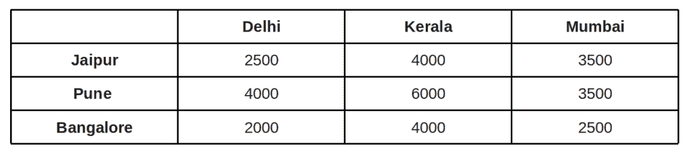
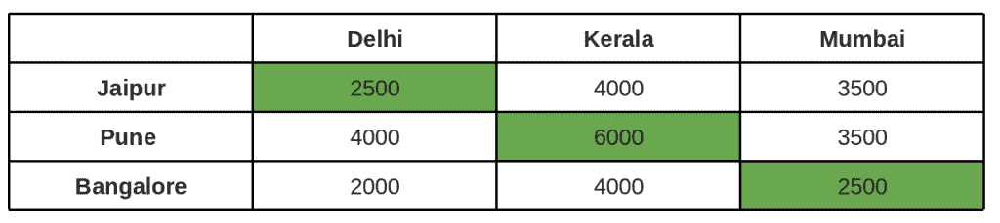

# 分配问题的匈牙利算法 | 系列 1（简介）

> 原文： [https://www.geeksforgeeks.org/hungarian-algorithm-assignment-problem-set-1-introduction/](https://www.geeksforgeeks.org/hungarian-algorithm-assignment-problem-set-1-introduction/)

设 n 个代理和 n 个任务。 可以分配任何座席以执行任何任务，这会产生一些费用，该费用可能会因座席任务分配而异。 要求执行所有任务，方法是将每个任务恰好分配给一个代理，将每个任务恰好分配给一个代理，以使分配的总成本最小化。

**示例**：您是一家芯片制造商的经理，目前您在与客户会面的路上有 3 个人。 您的销售人员在斋浦尔，浦那和班加罗尔，您希望他们飞往其他三个城市：德里，孟买和喀拉拉邦。 下表显示了城市之间以 INR 为单位的机票价格：



问题：您将把每个销售人员送到哪里以减少公平？

可能的分配：费用= 11000 INR



其他可能的分配：成本= **9500** INR，这是 **3 中最好的！** 可能的分配。


**蛮力解**是要考虑每个可能的赋值，意味着**Ω（n！）**的复杂度。

**匈牙利算法（又名 Munkres 分配算法**）针对多项式运行时复杂度（**最坏情况 O（n <sup>3</sup> ]** ）利用以下定理，并确保了最优性：[HTG6 *如果在成本矩阵的任何一行或一列的所有条目中添加或减去一个数字，则所得成本矩阵的最佳分配也就是原始成本矩阵的最佳分配。*

通过使用上述定理，我们将原始的权重矩阵简化为包含零。 我们尝试将任务分配给代理，以使每个代理仅执行一项任务，并且在每种情况下导致的损失为**零**。

**算法的核心（假设正方形矩阵）**：

1.  对于矩阵的每一行，找到最小的元素，并将其从其行中的每个元素中减去。

2.  对所有列执行相同的操作（作为步骤 1）。

3.  使用最少数量的水平和垂直线覆盖矩阵中的所有零。

4.  *最优性测试：*如果覆盖线的最小数量为 n，则可以进行最佳分配，然后完成。 否则，如果行数小于 n，则我们找不到最佳分配，必须继续执行第 5 步。

5.  确定没有任何行覆盖的最小条目。 从每个未覆盖的行中减去此条目，然后将其添加到每个覆盖的列中。 返回步骤 3。

**以上简单示例的说明**：

```

Below is the cost matrix of example given in above diagrams.
 2500  4000  3500
 4000  6000  3500
 2000  4000  2500

Step 1: Subtract minimum of every row.
2500, 3500 and 2000 are subtracted from rows 1, 2 and 
3 respectively.

   0   1500  1000
  500  2500   0
   0   2000  500

Step 2: Subtract minimum of every column.
0, 1500 and 0 are subtracted from columns 1, 2 and 3 
respectively.

   0    0   1000
  500  1000   0
   0   500  500

Step 3: Cover all zeroes with minimum number of 
horizontal and vertical lines.


Step 4:  Since we need 3 lines to cover all zeroes,
we have found the optimal assignment. 
 2500  4000  3500
 4000  6000  3500
 2000  4000  2500

So the optimal cost is 4000 + 3500 + 2000 = 9500

```

**不会在首次尝试中产生最佳值的示例**：

在上面的示例中，对最优性的第一次检查确实为我们提供了解决方案。 如果覆盖行数小于 n 怎么办。

```

cost matrix:
 1500  4000  4500
 2000  6000  3500
 2000  4000  2500

Step 1: Subtract minimum of every row.
1500, 2000 and 2000 are subtracted from rows 1, 2 and 
3 respectively.

  0    2500  3000
  0    4000  1500
  0    2000   500

Step 2: Subtract minimum of every column.
0, 2000 and 500 are subtracted from columns 1, 2 and 3 
respectively.

  0     500  2500
  0    2000  1000 
  0      0      0 

Step 3: Cover all zeroes with minimum number of 
horizontal and vertical lines.


Step 4:  Since we only need 2 lines to cover all zeroes,
we have NOT found the optimal assignment. 

Step 5:  We subtract the smallest uncovered entry 
from all uncovered rows. Smallest entry is 500.
 -500    0   2000
 -500  1500   500
   0     0      0

Then we add the smallest entry to all covered columns, we get
   0     0   2000
   0   1500   500
  500    0      0

Now we return to Step 3:. Here we cover again using
lines. and go to Step 4:. Since we need 3 lines to 
cover, we found the optimal solution.
 1500  4000  4500
 2000  6000  3500
 2000  4000  2500

So the optimal cost is 4000 + 2000 + 2500 = 8500

```

在下一篇文章中，我们将讨论上述算法的实现。 实施需要更多的步骤，因为我们需要使用程序来找到最小的行数以覆盖所有 0。

 **参考**：

[http://www.math.harvard.edu/archive/20_spring_05/handouts/assignment_overheads.pdf](http://www.math.harvard.edu/archive/20_spring_05/handouts/assignment_overheads.pdf)

[https：// /www.youtube.com/watch?v=dQDZNHwuuOY](https://www.youtube.com/watch?v=dQDZNHwuuOY)

本文由 **Yash Varyani** 提供。 如果发现任何不正确的地方，或者想分享有关上述主题的更多信息，请写评论。

