# TOC

中的假设(语言规律性)和算法(L 图到 NFA)

> 原文:[https://www . geesforgeks . org/假说-语言-规律性-和-算法-l-graph-to-nfa-in-toc/](https://www.geeksforgeeks.org/hypothesis-language-regularity-and-algorithm-l-graph-to-nfa-in-toc/)

先决条件–[有限自动机](https://www.geeksforgeeks.org/toc-finite-automata-introduction/)、[L-图以及它们所代表的](https://www.geeksforgeeks.org/theory-of-computation-l-graphs-and-what-they-represent/)、
L-图可以生成上下文相关的语言，但是编写上下文相关的语言比编写常规语言要困难得多。这就是为什么我提出了一个假设，关于什么样的 L 图可以生成一种规则的语言。但是首先，我需要向大家介绍我所说的迭代嵌套。

正如你所记得的，一个巢是一条中立的路径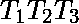，其中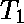和是周期，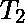路径是中立的。我们将称为迭代嵌套，如果、和路径多次打印同一个符号串，更准确的说打印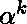、打印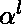、打印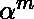、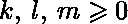和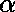是一串输入符号(最好是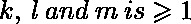中至少有一个)。
从这个定义中引出了下一个假设。

**假设–**如果在一个上下文无关的 L-图 G 中所有的嵌套都在迭代，那么这个 L-图 G 定义的语言 L(G)是正则的。
如果这个假设将在不久的将来被证明，它可以改变编程的许多方面，这将使创建新的简单的编程语言比现在容易得多。上面的假设引出了下一个算法，即将迭代嵌套的上下文无关 L 图转换为 NFA 图。

**算法–**将带有迭代补码的上下文无关 L 图转换为相应的 NFA
**输入–**带有迭代补码的上下文无关 L 图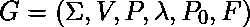
**输出–**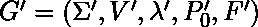

*   **第一步:**L 图和 NFA 的语言必须相同，因此，我们不需要新的字母表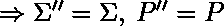。(注释:我们构建上下文无关的 L 图 G ' '，它等于起始图 G ' '，没有冲突的嵌套)
*   **Step-2:** Build Core(1, 1) for the graph G.
    V’’ := {(v, 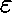) | v 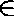 V of 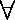 canon k  Core(1, 1), v 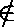 k}
    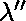 := { arcs 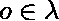 | start and final states 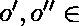 V’’}

    对于所有 k 核心(1，1):
    步骤 1’。v :=佳能第一州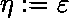。
    V ' '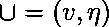T5【第二步】。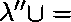弧从状态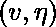跟随该弧进入新状态，新状态用以下规则定义:
    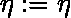，如果输入括号在该弧上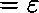；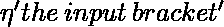，如果输入括号是开括号；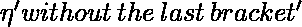，如果输入括号是闭合括号
    v :=佳能 k 的第二状态
    V'' 
    步骤 3’。重复步骤 2’，同时佳能中仍有弧线。

*   **第三步:**构建核心(1，2)。
    如果佳能连续有 2 个相等的弧:开始状态和最终状态匹配；我们把给定状态的弧线加入到自身中，利用这个弧线，达到。
    以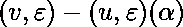的形式将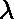弧 v–u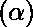中的剩余部分添加到中
*   **Step-4:** 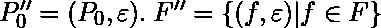
    (备注:以下是将上下文无关的 L-graph G ' '转换为 NFA G ' '的算法)
*   **第 5 步:**对 G“”中的每一个迭代补码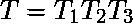
    做如下操作:添加一个新的状态 v .创建一个从状态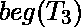开始的路径，等于。从 v 进入创建路径，等于。删除循环和。
*   **第 6 步:** G' = G ' '，其中弧没有加载括号。

所以上面的每一步都很清楚，我给你们看下一个例子。
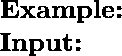上下文无关的 L 图，具有迭代补语
![G = ( \{a, b, c\}, \\*\{1, 2, 3\} \\*\{( (, ) ), ( [, ] )\}, \\*\\*\{ (: \{ 1 - a - 1 \}, \\*): \{ 2 - a - 2 \}, \\*\big[: \{ 1 - b - 2 \}, \\*\big]: \{ 2 - c - 3 \}, \\*\varepsilon: \{ 1 - a - 2 \} \}, \\*\\*1, \\*\{2, 3\} \}](img/6fe2d3327004bf838949431f97960e69.png "Rendered by QuickLaTeX.com")、
，确定了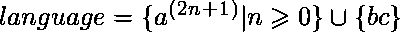
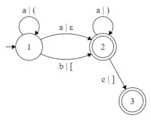开始图 G
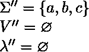
核心(1，1)= { 1–a–2；1–a，(1–1–a–2–a)，1–2；1–b，(2–2–c，)2–3 }
核心(1，2) =核心(1，1){ 1–a，(1–1–a)，(1–1–a–2–a，)1–2–a，)1–2 }
步骤 2:步骤 1’–步骤 3’
![\Rightarrow\\ V'' = \{(1, \varepsilon), (2, (_2), (3, \varepsilon), (1, (_1), (2, )_1), (2, \varepsilon)\}\\* \lambda'' = \{ \\*(: \{ (1, \varepsilon) - a - (1, (); (1, () - a - (1, () \}, \\*): \{ (2, )) - a - (2, )); (2, )) - a - (2, \varepsilon) \}, \\*\big[: \{ (1, \varepsilon) - b - (2, [) \}, \\*\big]: \{ (2, [) - c - (3, \varepsilon) \}, \\*\varepsilon: \{ (1, \varepsilon) - a - (2, \varepsilon); (1, () - a - (2, )) \} \}\\ P''_0 = (1, \varepsilon)\\ F'' = \{(2, \varepsilon), (3, \varepsilon)\}\\ G'' = (\Sigma'', V'', P'', \lambda'', P''_0, F'')](img/d1613b59e5c8c112a14e286b38941357.png "Rendered by QuickLaTeX.com")
中间图 G ' '

T21】NFA G’