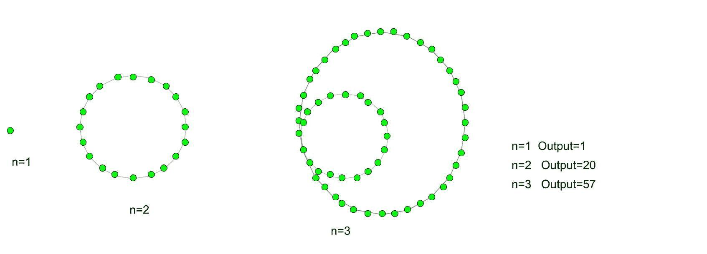

# 工效学数字

> 原文:[https://www.geeksforgeeks.org/icosagonal-number/](https://www.geeksforgeeks.org/icosagonal-number/)

给定一个数 n，任务是找到第 n 个 Icosagonal 数。
一个 Icosagonal 数是 20-gon 是一个 20 边的多边形。从比喻类导出的数字。这个号码中有不同的图案系列号码。这些点是可计数的，以特定的位置排列，并创建一个图表。所有的点都有一个公共的点，所有其他的点都连接到这个点，除了这个公共点，这些点都用它们各自的连续层连接到它们的第 I 个点。
**例:**

> 输入:3
> 输出:57
> 输入:8
> 输出:512



第 n 个椭圆数的公式:

## C++

```
// C++ program to find
// nth Icosagonal number
#include <bits/stdc++.h>
using namespace std;

// Function to calculate Icosagonal number
int icosagonal_poly(long int n)
{
    // Formula for finding
    // nth Icosagonal number
    return (18 * n * n - 16 * n) / 2;
}

// Drivers code
int main()
{
    long int n = 7;
    cout << n << "th Icosagonal number :"
               << icosagonal_poly(n);

    return 0;
}
```

## Java 语言(一种计算机语言，尤用于创建网站)

```
// Java program to find
// nth Icosagonal number

import java.io.*;

class GFG {

// Function to calculate Icosagonal number

static int icosagonal_poly(int n)
{
    // Formula for finding
    // nth Icosagonal number
    return (18 * n * n - 16 * n) / 2;
}

// Drivers code

    public static void main (String[] args) {

    int n = 7;

    System.out.print (n + "th Icosagonal number :");
    System.out.println(icosagonal_poly(n));
    }
}
// This code is contributed by aj_36
```

## 蟒蛇 3

```
# Python 3 program to find
# nth Icosagonal number

# Function to calculate
# Icosagonal number
def icosagonal_poly(n) :

    # Formula for finding
    # nth Icosagonal number
    return (18 * n * n -
            16 * n) // 2

# Driver Code
if __name__ == '__main__' :
    n = 7
    print(n,"th Icosagonal number : ",
                   icosagonal_poly(n))

# This code is contributed m_kit
```

## C#

```
// C# program to find
// nth Icosagonal number
using System;

class GFG
{

// Function to calculate
// Icosagonal number
static int icosagonal_poly(int n)
{
    // Formula for finding
    // nth Icosagonal number
    return (18 * n * n -
            16 * n) / 2;
}

// Driver code
static public void Main ()
{

int n = 7;

Console.Write(n + "th Icosagonal " +
                        "number :");
Console.WriteLine(icosagonal_poly(n));
}
}

// This code is contributed by ajit
```

## 服务器端编程语言（Professional Hypertext Preprocessor 的缩写）

```
<?php
// PHP program to find
// nth Icosagonal number

// Function to calculate
// Icosagonal number
function icosagonal_poly($n)
{
    // Formula for finding
    // nth Icosagonal number
    return (18 * $n *
            $n - 16 * $n) / 2;
}

// Driver Code
$n = 7;
echo $n , "th Icosagonal number :",
               icosagonal_poly($n);

// This code is contributed by ajit
?>
```

## java 描述语言

```
<script>
    // Javascript program to find nth Icosagonal number

    // Function to calculate
    // Icosagonal number
    function icosagonal_poly(n)
    {
        // Formula for finding
        // nth Icosagonal number
        return (18 * n * n - 16 * n) / 2;
    }

    let n = 7;

    document.write(n + "th Icosagonal number :");
    document.write(icosagonal_poly(n));

</script>
```

**输出:**

```
7th Icosagonal number :385
```

**时间复杂度:**O(1)
T3】辅助空间: O(1)

参考:[https://en.wikipedia.org/wiki/Polygonal_number](https://en.wikipedia.org/wiki/Polygonal_number)T2】