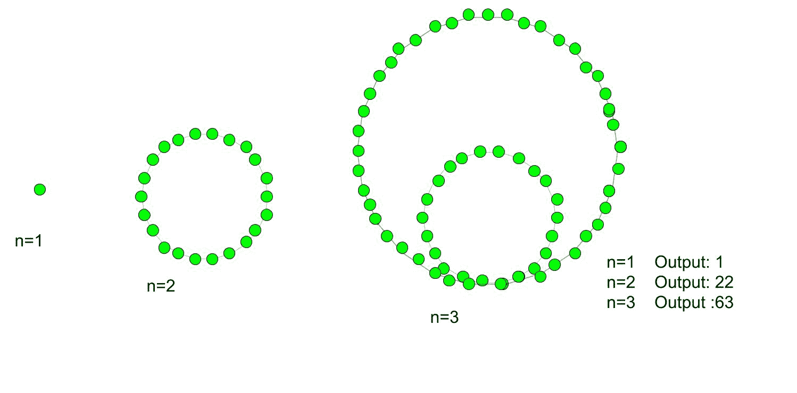

# icosidigional 号

> 原文:[https://www.geeksforgeeks.org/icosidigonal-number/](https://www.geeksforgeeks.org/icosidigonal-number/)

给定一个数字 n，任务是找到第 n 个 Icosidigonal 号码(Isdn)。
多边形有多少个边，取决于它们的边数级数。在数学中，有许多正交数，icosidigonal 数就是其中之一，这些数有 22 边多边形(icosidigon)。icosidigonal 数属于比喻数的范畴。它们有一个共同的点，其他点的图案排列成第 n 个嵌套的 icosidigon 图案。
**例:**

> 输入:2
> 输出:22
> 输入:6
> 输出:306



第 n 个 Icosidigonal 数的公式:

## C++

```
// C++ program to find nth Icosidigonal
// number
#include <bits/stdc++.h>
using namespace std;

// Function to calculate Icosidigonal number
int icosidigonal_num(long int n)
{
    // Formula for finding
    // nth Icosidigonal number
    return (20 * n * n - 18 * n) / 2;
}

// Driver function
int main()
{
    long int n = 4;
    cout << n << "th Icosidigonal number :" << icosidigonal_num(n);
    cout << endl;
    n = 8;
    cout << n << "th Icosidigonal number:" << icosidigonal_num(n);
    return 0;
}
```

## Java 语言(一种计算机语言，尤用于创建网站)

```
// Java program to find nth
// Icosidigonal number
import java.io.*;

class GFG
{

    // Function to calculate
    // Icosidigonal number
    static int icosidigonal_num(int n)
    {

    // Formula for finding
    // nth Icosidigonal number

    return (20 * n * n - 18 * n) / 2;
    }

// Driver Code
public static void main (String[] args)
{

    int n = 4;
    System.out.print (n + "th Icosidigonal number :");
    System.out.println (icosidigonal_num(n));

    n = 8;
    System.out.print (n + "th Icosidigonal number :");
    System.out.println (icosidigonal_num(n));
}
}

// This code is contributed by ajit
```

## 蟒蛇 3

```
# python 3 program to find
# nth Icosidigonal number

# Function to calculate
# Icosidigonal number
def icosidigonal_num(n) :

    # Formula for finding
    # nth Icosidigonal number
    return (20 * n * n -
            18 * n) // 2

# Driver Code
if __name__ == '__main__' :

    n = 4
    print(n,"th Icosidigonal " +
                    "number : ",
            icosidigonal_num(n))
    n = 8
    print(n,"th Icosidigonal " +
                    "number : ",
            icosidigonal_num(n))

# This code is contributed m_kit
```

## C#

```
// C# program to find nth
// Icosidigonal number
using System;

class GFG
{

    // Function to calculate
    // Icosidigonal number
    static int icosidigonal_num(int n)
    {

    // Formula for finding
    // nth Icosidigonal number
    return (20 * n * n -
            18 * n) / 2;
    }

// Driver Code
static public void Main ()
{
int n = 4;
Console.Write(n + "th Icosidigonal " +
                          "number :");
Console.WriteLine(icosidigonal_num(n));

n = 8;
Console.Write (n + "th Icosidigonal "+
                          "number :");
Console.WriteLine(icosidigonal_num(n));
}
}

// This code is contributed by ajit
```

## 服务器端编程语言（Professional Hypertext Preprocessor 的缩写）

```
<?php
// PHP program to find nth
// Icosidigonal number

// Function to calculate
// Icosidigonal number
function icosidigonal_num($n)
{
    // Formula for finding
    // nth Icosidigonal number
    return (20 * $n * $n - 18 * $n) / 2;
}

// Driver Code
$n = 4;
echo $n , "th Icosidigonal number : ",
                icosidigonal_num($n);
echo "\n";
$n = 8;
echo $n , "th Icosidigonal number : ",
               icosidigonal_num($n);

// This code is contributed by m_kit
?>
```

## java 描述语言

```
<script>

// JavaScript program to find nth Icosidigonal
// number

// Function to calculate Icosidigonal number
function icosidigonal_num(n)
{
    // Formula for finding
    // nth Icosidigonal number
    return parseInt((20 * n * n - 18 * n) / 2);
}

// Driver function
let n = 4;
document.write(n + "th Icosidigonal number :" + icosidigonal_num(n));
document.write("<br>");
n = 8;
document.write(n + "th Icosidigonal number :" + icosidigonal_num(n));

</script>
```

**输出:**

```
4th Icosidigonal number :124
8th Icosidigonal number:568
```

**时间复杂度:**O(1)
T3】辅助空间: O(1)

参考:[https://en.wikipedia.org/wiki/Polygonal_number](https://en.wikipedia.org/wiki/Polygonal_number)T2】