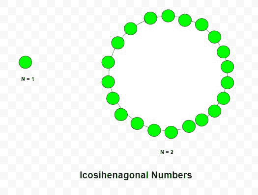

# 四六角数字

> 原文:[https://www.geeksforgeeks.org/icosihenagonal-number/](https://www.geeksforgeeks.org/icosihenagonal-number/)

给定一个数字 **N** ，任务是找到 **N <sup>第</sup>T5】个二正交数字。** 

> 二十进制数是一类图形数。它有一个 21 边的多边形，叫做 Icosihenagon。第 n 个 Icosihenagonal 数计算 21 个点的数量，所有其他点都被一个公共共享角包围并形成一个图案。前几个二十进制数字是 **1、21、60、118、195、291、406……**

**例:**

> **输入:** N = 2
> **输出:** 21
> **解释:**
> 第二个 Icosihenagonal 数为 21
> **输入:** N = 6
> **输出:** 291



**方法:**在数学中，第 N <sup>个</sup>二十进制数由公式给出:

以下是上述方法的实现:

## C++

```
// C++ program to find nth
// Icosihenagonal number

#include <bits/stdc++.h>
using namespace std;

// Function to find
// Icosihenagonal number
int Icosihenagonal_num(int n)
{
    // Formula to calculate nth
    // Icosihenagonal number
    return (19 * n * n - 17 * n) / 2;
}

// Driver Code
int main()
{
    int n = 3;
    cout << Icosihenagonal_num(n) << endl;

    n = 10;
    cout << Icosihenagonal_num(n) << endl;

    return 0;
}
```

## Java 语言(一种计算机语言，尤用于创建网站)

```
// Java program to find nth
// Icosihenagonal number
class GFG{

// Function to find
// Icosihenagonal number
static int Icosihenagonal_num(int n)
{
    // Formula to calculate nth
    // Icosihenagonal number
    return (19 * n * n - 17 * n) / 2;
}

// Driver Code
public static void main(String[] args)
{
    int n = 3;
    System.out.print(Icosihenagonal_num(n) + "\n");

    n = 10;
    System.out.print(Icosihenagonal_num(n) + "\n");
}
}

// This code is contributed by Rajput-Ji
```

## 蟒蛇 3

```
# Python3 program to find nth
# icosihenagonal number

# Function to find
# icosihenagonal number
def Icosihenagonal_num(n):

    # Formula to calculate nth
    # icosihenagonal number
    return (19 * n * n - 17 * n) / 2

# Driver Code
n = 3
print(int(Icosihenagonal_num(n)))

n = 10
print(int(Icosihenagonal_num(n)))

# This code is contributed by divyeshrabadiya07
```

## C#

```
// C# program to find nth
// Icosihenagonal number
using System;

class GFG{

// Function to find
// Icosihenagonal number
static int Icosihenagonal_num(int n)
{
    // Formula to calculate nth
    // Icosihenagonal number
    return (19 * n * n - 17 * n) / 2;
}

// Driver Code
public static void Main()
{
    int n = 3;
    Console.Write(Icosihenagonal_num(n) + "\n");

    n = 10;
    Console.Write(Icosihenagonal_num(n) + "\n");
}
}

// This code is contributed by Code_Mech
```

## java 描述语言

```
<script>

    // Javascript program to find nth
    // Icosihenagonal number

    // Function to find
    // Icosihenagonal number
    function Icosihenagonal_num(n)
    {
        // Formula to calculate nth
        // Icosihenagonal number
        return (19 * n * n - 17 * n) / 2;
    }

    let n = 3;
    document.write(Icosihenagonal_num(n) + "</br>");

    n = 10;
    document.write(Icosihenagonal_num(n));

</script>
```

**Output:** 

```
60
865
```

**参考:**T2】https://en.wikipedia.org/wiki/Polygonal_number