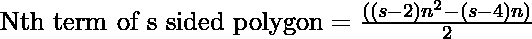
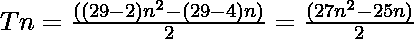

# icosikaienonegonal 编号

> 原文:[https://www.geeksforgeeks.org/icosikaienneagonal-number/](https://www.geeksforgeeks.org/icosikaienneagonal-number/)

一个**icosikaiennegonal 数**是一类图形数。它有 **29 边多边形**叫做 **icosikaienneagon** 。第 N 个 icosikaienneagonal 数字计数是 29 个点的数量，所有其他点都被一个公共共享角包围并形成一个图案。
前几个 icosikaienneagonol 数字是

> 1、29、84、166……

### 找到第 N <sup>个</sup>个 icosikaienneagonal 数

给定一个数字 **N** ，任务是找到**N<sup>th</sup>T5[icosikaiennegonal 数字](https://en.wikipedia.org/wiki/List_of_polygons)。
**举例:**** 

> **输入:** N = 2
> **输出:** 29
> **解释:**
> 第二个 icosikaienneagonol 数为 29。
> **输入:** N = 3
> **输出:** 84

**进场:**

*   在数学中，第 N 个 s 边多边形数由公式给出:
    

*   因此 29 边多边形的第 n 项为

> 

以下是上述方法的实现:

## C++

```
// C++ implementation for
// above approach

#include <iostream>
using namespace std;

// Function to Find the Nth
// icosikaienneagonal Number
int icosikaienneagonalNum(int n)
{
    return (27 * n * n - 25 * n) / 2;
}

// Driver Code
int main()
{
    int n = 3;
    cout << icosikaienneagonalNum(n);

    return 0;
}
```

## Java 语言(一种计算机语言，尤用于创建网站)

```
// Java implementation for
// above approach
class GFG{

// Function to Find the Nth
// icosikaienneagonal Number
static int icosikaienneagonalNum(int n)
{
    return (27 * n * n - 25 * n) / 2;
}

// Driver Code
public static void main(String args[])
{
    int n = 3;
    System.out.print(icosikaienneagonalNum(n));
}
}

// This code is contributed by Code_Mech
```

## 蟒蛇 3

```
# Python3 implementation for
# above approach

# Function to Find the Nth
# icosikaienneagonal Number
def icosikaienneagonalNum(n):
    return (27 * n * n - 25 * n) // 2

# Driver Code

# Given N
N = 3
print(icosikaienneagonalNum(N))

# This code is contributed by Vishal Maurya
```

## C#

```
// C# implementation for
// above approach
using System;
class GFG{

// Function to Find the Nth
// icosikaienneagonal Number
static int icosikaienneagonalNum(int n)
{
    return (27 * n * n - 25 * n) / 2;
}

// Driver Code
public static void Main()
{
    int n = 3;
    Console.Write(icosikaienneagonalNum(n));
}
}

// This code is contributed by Code_Mech
```

## java 描述语言

```
<script>
// Javascript implementation for
// above approach

    // Function to Find the Nth
    // icosikaienneagonal Number
    function icosikaienneagonalNum( n) {
        return (27 * n * n - 25 * n) / 2;
    }

    // Driver Code

    let n = 3;
    document.write(icosikaienneagonalNum(n));

// This code is contributed by Rajput-Ji
</script>
```

**Output:** 

```
84
```

***时间复杂度:** O(1)*

***辅助空间:** O(1)*