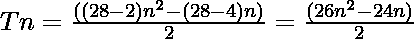

# icosikaioctogon 或 Icosioctagon 编号

> 原文:[https://www . geeksforgeeks . org/icosikaioctagon-or-icosioctagon-number/](https://www.geeksforgeeks.org/icosikaioctagon-or-icosioctagon-number/)

给定一个编号 **N** ，任务是找到**N<sup>th</sup>T5[icosiocatgon 编号](https://en.wikipedia.org/wiki/Icosioctagon)。** 

> 一个[icosiocatgon 数](https://en.wikipedia.org/wiki/Icosioctagon)是一类图形数。它有一个 28 边的多边形，叫做 icosikaioctagon。第 N 个 icosikaioctagonal 数字计数是 28 个点的数量，所有其他点都被一个公共共享角包围并形成一个图案。icosikaioctagonol 的前几个数字是 **1、28、81、160……**

**例:**

> **输入:** N = 2
> **输出:** 28
> **说明:**
> 第二个 icosikaioctagonol 号为 28。
> **输入:** N = 3
> **输出:** 81

**方法:**第 N 个 icosikaioctagonal 数由公式给出:

*   s 边多边形的第 n 项= 

*   因此 28 边多边形的第 n 项为

> 

以下是上述方法的实现:

## C++

```
// C++ program for above approach
#include <iostream>
using namespace std;

// Finding the nth icosikaioctagonal number
int icosikaioctagonalNum(int n)
{
    return (26 * n * n - 24 * n) / 2;
}

// Driver code
int main()
{
    int n = 3;

    cout << "3rd icosikaioctagonal Number is = "
         << icosikaioctagonalNum(n);

    return 0;
}

// This code is contributed by shubhamsingh10
```

## C

```
// C program for above approach
#include <stdio.h>
#include <stdlib.h>

// Finding the nth icosikaioctagonal Number
int icosikaioctagonalNum(int n)
{
    return (26 * n * n - 24 * n) / 2;
}

// Driver program to test above function
int main()
{
    int n = 3;
    printf("3rd icosikaioctagonal Number is = %d",
           icosikaioctagonalNum(n));

    return 0;
}
```

## Java 语言(一种计算机语言，尤用于创建网站)

```
// Java program for above approach
class GFG{

// Finding the nth icosikaioctagonal number
public static int icosikaioctagonalNum(int n)
{
    return (26 * n * n - 24 * n) / 2;
}

// Driver code
public static void main(String[] args)
{
    int n = 3;
    System.out.println("3rd icosikaioctagonal Number is = " +
                                    icosikaioctagonalNum(n));
}
}

// This code is contributed by divyeshrabadiya07
```

## 蟒蛇 3

```
# Python3 program for above approach

# Finding the nth icosikaioctagonal Number
def icosikaioctagonalNum(n):

    return (26 * n * n - 24 * n) // 2

# Driver Code
n = 3
print("3rd icosikaioctagonal Number is = ",
                   icosikaioctagonalNum(n))

# This code is contributed by divyamohan123
```

## C#

```
// C# program for above approach
using System;
class GFG{

// Finding the nth icosikaioctagonal number
public static int icosikaioctagonalNum(int n)
{
    return (26 * n * n - 24 * n) / 2;
}

// Driver code
public static void Main()
{
    int n = 3;
    Console.Write("3rd icosikaioctagonal Number is = " +
                               icosikaioctagonalNum(n));
}
}

// This code is contributed by Code_Mech
```

## java 描述语言

```
<script>

// JavaScript program for above approach

// Finding the nth icosikaioctagonal number
function icosikaioctagonalNum(n)
{
    return (26 * n * n - 24 * n) / 2;
}

// Driver code
var n = 3;
document.write("3rd icosikaioctagonal Number is = " + icosikaioctagonalNum(n));

</script>
```

**Output:** 

```
3rd icosikaioctagonal Number is = 81
```

***时间复杂度:** O(1)*

***辅助空间:** O(1)*

**参考资料:**[https://en . Wikipedia . org/wiki/icsiocitogon](https://en.wikipedia.org/wiki/Icosioctagon)