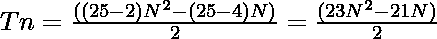

# Icosikaipentagon 编号

> 原文:[https://www.geeksforgeeks.org/icosikaipentagon-number/](https://www.geeksforgeeks.org/icosikaipentagon-number/)

给定一个编号 **N** ，任务是找到**N<sup>th</sup>T5[icosikaipentagon 编号](https://en.wikipedia.org/wiki/List_of_polygons)。**

> icosikaipentagon 数是一类图形数。它有一个 25 边的多边形，叫做 icosikaipentagon。第 N 个 icosikaipentagon 数字计数是 25 个点的数量，所有其他点被一个公共共享角包围并形成一个图案。前几个 icosikaipentagonol 数字是 **1、25、72、142……**

**示例:**

> **输入:** N = 2
> **输出:** 25
> **说明:**
> 第二个 icosikaipentagonol 数为 25。
> 
> **输入:**N = 3
> T3】输出: 72

**方法:**第 N 个 icosikaipentagon 数由下式给出:

*   S 边多边形的第 n 项= 
*   因此，25 边多边形的第 N 项由下式给出:

> 

下面是上述方法的实现:

## C++

```
// C++ program to find the N-th
// Icosikaipentagon Number

#include <bits/stdc++.h>
using namespace std;

// Function to find the N-th
// icosikaipentagon Number
int icosikaipentagonNum(int N)
{
    return (23 * N * N - 21 * N)
           / 2;
}

// Driver code
int main()
{
    int n = 3;
    cout << "3rd icosikaipentagon Number is "
         << icosikaipentagonNum(n);

    return 0;
}
```

## Java 语言(一种计算机语言，尤用于创建网站)

```
// Java program to find N-th
// icosikaipentagon number
class GFG{

// Function to find the nth
// icosikaipentagon number
static int icosikaipentagonNum(int N)
{
    return (23 * N * N - 21 * N) / 2;
}

// Driver code
public static void main(String[] args)
{
    int n = 3;
    System.out.print("3rd icosikaipentagon Number is " +
                                icosikaipentagonNum(n));
}
}

// This code is contributed by shubham
```

## 蟒蛇 3

```
# Python3 program to find the N-th
# icosikaipentagon number

# Function to find the N-th
# icosikaipentagon number
def icosikaipentagonNum(N):

    return (23 * N * N - 21 * N) // 2

# Driver code
n = 3
print("3rd icosikaipentagon Number is ",
                 icosikaipentagonNum(n))

# This code is contributed by yatinagg   
```

## C#

```
// C# program for the above approach
using System;
class GFG{

// Finding the nth chiliagon number
static int Icosikaipentagon(int n)
{
    return (23 * n * n - 21 * n) / 2;
}

// Driver code
public static void Main()
{
    int n = 3;
    Console.Write("3rd Icosikaipentagon Number is = " +
                                  Icosikaipentagon(n));
}
}

// This code is contributed by shivanisinghss2110
```

## java 描述语言

```
<script>
// Javascript program to find the N-th
// Icosikaipentagon Number

// Function to find the N-th
// icosikaipentagon Number
function icosikaipentagonNum(N)
{
    return parseInt((23 * N * N - 21 * N)
           / 2);
}

// Driver code
let n = 3;
document.write("3rd icosikaipentagon Number is "
    + icosikaipentagonNum(n));

    // This code is contributed by rishavmahato348.
</script>
```

**Output:** 

```
3rd icosikaipentagon Number is 72
```

**时间复杂度:** O(1)

**辅助空间:** O(1)

**参考:**T2】http://www.2dcurves.com/line/linep.html