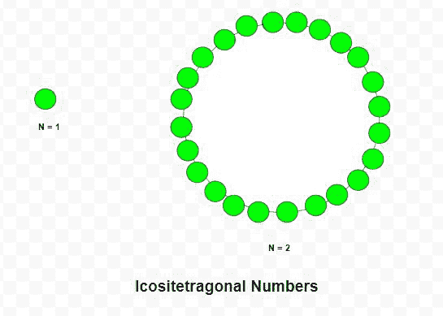

# 悲喜剧号

> 原文:[https://www.geeksforgeeks.org/icositetragonal-number/](https://www.geeksforgeeks.org/icositetragonal-number/)

给定一个数字 **N** ，任务是找到 **N <sup>第</sup>T5【悲喜剧号。**

> 一个**二部曲数**是一类图形数。它有一个 24 边的多边形，叫做 Icositetragon。第 N 个 Icositetragonal number count 是点的数量，所有其他点都被一个共同的共享角包围并形成一个图案。

**示例:**

> **输入:**N = 2
> T3】输出: 24
> 
> **输入:**N = 6
> T3】输出: 336



**方法:**第 N <sup>个</sup>悲喜剧数由公式给出:

下面是上述方法的实现:

## C++

```
// C++ program to find nth
// Icositetragonal number

#include <bits/stdc++.h>
using namespace std;

// Function to find
// Icositetragonal number
int Icositetragonal_num(int n)
{
    // Formula to calculate nth
    // Icositetragonal number
    return (22 * n * n - 20 * n) / 2;
}

// Driver Code
int main()
{
    int n = 3;

    cout << Icositetragonal_num(n) << endl;

    n = 10;

    cout << Icositetragonal_num(n);

    return 0;
}
```

## Java 语言(一种计算机语言，尤用于创建网站)

```
// Java program to find nth
// icositetragonal number
import java.util.*;

class GFG {

// Function to find
// icositetragonal number
static int Icositetragonal_num(int n)
{

    // Formula to calculate nth
    // icositetragonal number
    return (22 * n * n - 20 * n) / 2;
}

// Driver code
public static void main(String[] args)
{
    int n = 3;
    System.out.println(Icositetragonal_num(n));

    n = 10;
    System.out.println(Icositetragonal_num(n));
}
}

// This code is contributed by offbeat
```

## 蟒蛇 3

```
# Python3 program to find nth
# Icositetragonal number

# Function to find
# Icositetragonal number
def Icositetragonal_num(n):

    # Formula to calculate nth
    # Icositetragonal number
    return (22 * n * n - 20 * n) / 2

# Driver Code
n = 3
print(int(Icositetragonal_num(n)))

n = 10
print(int(Icositetragonal_num(n)))

# This code is contributed by divyeshrabadiya07
```

## C#

```
// C# program to find nth
// icositetragonal number
using System;

class GFG{

// Function to find
// icositetragonal number
static int Icositetragonal_num(int n)
{

    // Formula to calculate nth
    // icositetragonal number
    return (22 * n * n - 20 * n) / 2;
}

// Driver code
public static void Main(string[] args)
{
    int n = 3;
    Console.Write(Icositetragonal_num(n) + "\n");

    n = 10;
    Console.Write(Icositetragonal_num(n) + "\n");
}
}

// This code is contributed by rutvik_56
```

## java 描述语言

```
<script>

// Javascript program to find nth
// icositetragonal number

// Function to find
// icositetragonal number
function Icositetragonal_num(n)
{

    // Formula to calculate nth
    // icositetragonal number
    return (22 * n * n - 20 * n) / 2;
}

// Driver code
let n = 3;
document.write(Icositetragonal_num(n) + "</br>");

n = 10;
document.write(Icositetragonal_num(n));

// This code is contributed by Ankita saini

</script>
```

**Output:** 

```
69
1000
```

***时间复杂度:** O(1)*

***辅助空间:** O(1)*

**参考:**T2】https://en.wikipedia.org/wiki/Polygonal_number