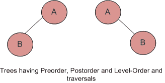

# 如果给你两个遍历序列，你能构造二叉树吗？

> 原文:[https://www . geesforgeks . org/如果给你两个遍历序列，你可以构建二叉树/](https://www.geeksforgeeks.org/if-you-are-given-two-traversal-sequences-can-you-construct-the-binary-tree/)

这取决于给出了哪些遍历。如果遍历方法之一是 Inorder，则可以构造树，否则不能。

**因此，以下组合可以唯一识别一棵树。**

订单和预订单。
有序和无序。
顺序和级别顺序。
 **及以下不可。**
后序和前序。
预订单和一级订单。
后置和水平顺序。

例如，对于上图中给出的树，前序、级序和后序遍历是相同的。

前序遍历= AB
后序遍历= BA
级-序遍历= AB

所以，即使给出了其中的三个(前、后、级)，树也无法构建。