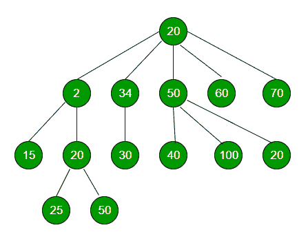

# N 元树中紧邻的较小元素

> 原文:[https://www . geesforgeks . org/immediate-small-element-n-ary-tree/](https://www.geeksforgeeks.org/immediate-smaller-element-n-ary-tree/)

给定一个元素 x，任务是找到它紧接的较小元素的值。



**示例:**

```
Input : x = 30 (for above tree)
Output : Immediate smaller element is 25

```

**解释:**元素 2、15、20 和 25 小于 x，即 30，但 25 是直接较小的元素，因此是答案。
**进场:**

*   让 ***res*** 作为结果节点。
*   将结果节点初始化为空。
*   对于每个节点，检查根节点的数据是否大于 res，但小于 x。如果是，则更新 res
*   递归地对给定类属树的所有节点执行相同的操作。
*   返回 res，res->key 将是紧接着的较小元素。

下面是上述方法的实现:

```
// C++ program to find immediate Smaller
// Element of a given element in a n-ary tree.
#include <bits/stdc++.h>
using namespace std;

// class of a node of an n-ary tree
class Node {

public:
    int key;
    vector<Node*> child;

    // constructor
    Node(int data)
    {
        key = data;
    }
};

// Function to find immediate Smaller Element
// of a given number x
void immediateSmallerElementUtil(Node* root, 
                            int x, Node** res)
{
    if (root == NULL)
        return;

    // if root is greater than res, but less
    // than x, then update res
    if (root->key < x)
        if (!(*res) || (*res)->key < root->key)
            *res = root; // Updating res

    // Number of children of root
    int numChildren = root->child.size();

    // Recursive calling for every child
    for (int i = 0; i < numChildren; i++)
        immediateSmallerElementUtil(root->child[i], x, res);

    return;
}

// Function to return immediate Smaller
// Element of x in tree
Node* immediateSmallerElement(Node* root, int x)
{
    // resultant node
    Node* res = NULL;

    // calling helper function and using
    // pass by reference
    immediateSmallerElementUtil(root, x, &res);

    return res;
}

// Driver program
int main()
{
    // Creating a generic tree
    Node* root = new Node(20);
    (root->child).push_back(new Node(2));
    (root->child).push_back(new Node(34));
    (root->child).push_back(new Node(50));
    (root->child).push_back(new Node(60));
    (root->child).push_back(new Node(70));
    (root->child[0]->child).push_back(new Node(15));
    (root->child[0]->child).push_back(new Node(20));
    (root->child[1]->child).push_back(new Node(30));
    (root->child[2]->child).push_back(new Node(40));
    (root->child[2]->child).push_back(new Node(100));
    (root->child[2]->child).push_back(new Node(20));
    (root->child[0]->child[1]->child).push_back(new Node(25));
    (root->child[0]->child[1]->child).push_back(new Node(50));

    int x = 30;

    cout << "Immediate smaller element of " << x << " is ";
    cout << immediateSmallerElement(root, x)->key << endl;

    return 0;
}
```

输出:

```
Immediate smaller element of 30 is 25

```

**时间复杂度:** O(N)，其中 N 为 N 元树中的节点数。
**辅助空间:** O(N)，用于递归调用(当一个节点有 N 个子节点时的最坏情况)