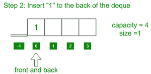
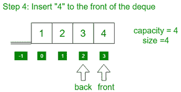
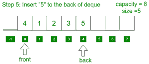
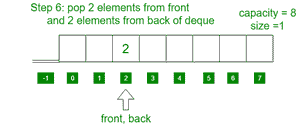
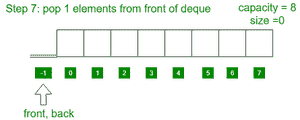

# 使用模板类和循环数组

实现动态去重

> 原文:[https://www . geeksforgeeks . org/implement-dynamic-deque-use-templates-class-and-a-circular-array/](https://www.geeksforgeeks.org/implement-dynamic-deque-using-templates-class-and-a-circular-array/)

任务是使用模板类和圆形[数组](https://www.geeksforgeeks.org/array-data-structure/)实现动态[德格](https://www.geeksforgeeks.org/deque-set-1-introduction-applications/)，具有以下功能:

*   **前置():**从德格获取前置项。
*   **back():** 从德格中获取最后一项。
*   **push_back(X):** 在 deque 结束时推 X。
*   **push_front(X):** 在下潜开始时按 X。
*   **pop_front():** 从 deque 的开始处删除一个元素。
*   **pop_back():** 从数据末尾删除一个元素
*   **空():**检查德格是否为空
*   **容量():**当前德奎可以存储的最大元素数量
*   **大小():**德格中的元素数量

下面是一步一步的图解:

*   最初，德格是空的


*   在 deque 后面插入 1



*   将元素 2、3 插入到 deque 的后面


*   在德格的前面插入 4



*   在 deque 后面插入 5



*   从正面弹出 2 个元素，从背面弹出 2 个元素



*   从德格前面弹出 1 个元素



**方法:**想法是将每次数组容量满时使用的数组[大小加倍](https://www.geeksforgeeks.org/how-to-determine-length-or-size-of-an-array-in-java/)，并将之前数组的元素复制到新数组中。按照以下步骤解决问题:

*   初始化 4 个变量 **frontIndex** 、 **backIndex** 、 **sizeVar** 和 **capacityVar** ，一个数组**arr【】**来实现 deque。
*   定义一个函数，比如 **capacity()** 来查找当前数组的[大小，并返回变量 **capacityVar** 的值。](https://www.geeksforgeeks.org/how-to-determine-length-or-size-of-an-array-in-java/)
*   定义一个函数，比如说 **size()** 来计算元素的数量并返回变量的值， **sizeVar。**
*   定义一个函数，说 **full()** 来查找 [deque 是否已满](https://www.geeksforgeeks.org/deque-set-1-introduction-applications/)，如果 **sizeVar** 等于 **capacityVar** 则返回 true。否则，返回 false。
*   定义一个函数，说 **empty()** 来查找 deque 是否为空，如果 **frontIndex** 和 **backIndex** 等于 **-1** 则返回 true。否则，返回 false。
*   定义一个函数，比如 **Front()** 来打印德格的 [front 元素。如果 deque 不为空()，打印**arr【front index】**元素。](https://www.geeksforgeeks.org/dequefront-dequeback-c-stl/)
*   定义一个函数说 **Back()** 打印出[最后一个元素的德格](https://www.geeksforgeeks.org/dequefront-dequeback-c-stl/)。如果 deque 不为空()，打印 **arr【回溯】**元素。
*   定义一个函数，比如 **push_back(X)** 在数据末尾插入一个元素:
    *   如果 deque 已满，则将当前数组的大小加倍，并将前一个数组的元素复制到新数组中。
    *   如果 deque 为**空()**，则分配 **frontIndex = backIndex = 0** ，然后将 **X** 分配给**arr【front index】**和**arr【back index】**，然后将 **sizeVar** 递增 1。
    *   否则，将**回溯索引**更新为**回溯索引=(回溯索引+1) %capacityVar** ，然后将 **X** 分配给 **arr【回溯索引】**并将 **sizeVar** 递增 1。
*   定义一个函数，比如 **push_front(X)** 在开始的地方插入一个元素:
    *   如果 deque 已满，则将当前数组的大小加倍，并将前一个数组的元素复制到新数组中。
    *   如果 deque 为**空()**，则分配 **frontIndex = backIndex = 0** ，然后将 **X** 分配给**arr【front index】**和**arr【back index】**，然后将 **sizeVar** 递增 1。
    *   否则，将 **frontIndex** 更新为**front index =(front index-1+capacity var)% capacity var**，然后将 **X** 分配给**arr【front index】**并将 **sizeVar** 递增 1。
*   定义一个函数，比如 **pop_front()** 来删除一个元素:
    *   如果德格为空，打印**“下溢”**。
    *   否则如果**大小 Var** 等于 1，则将 **-1** 分配给**前置索引**和**后置索引**，然后将**大小 Var** 减 1。
    *   否则，将 **frontIndex** 更新为**front index =(front index+1)% capacity var**，并将 **sizeVar** 减 1。
*   定义一个函数，比如 **pop_back()** 来删除页面前面的元素:
    *   如果德格为空，打印**“下溢”**。
    *   否则如果**大小 Var** 等于 **1** ，则将 **-1** 分配给**前置索引**和**后置索引**，然后将**大小 Var** 减 1。
    *   否则，将**回溯索引**更新为**回溯索引=(回溯索引-1 +电容值)%**

下面是上述方法的实现:

## C++

```
// C++ program for the above approach
#include <bits/stdc++.h>
using namespace std;

// Class definition of the deque
template <class X>
class Deque {

private:
    // Stores the frontIndex
    int frontIndex;

    // Stores the backIndex
    int backIndex;

    // Stores the array
    X* arr;

    // Stores the size of deque
    int sizeVar;

    // Stores the size of array
    int capacityVar = 4;

public:
    // Deque class constructor
    Deque()
    {
        arr = new X[capacityVar];
        frontIndex = backIndex = -1;
        sizeVar = 0;
    }

    // Function methods
    bool empty();
    bool full();
    void push_back(X x);
    void push_front(X x);
    void pop_front();
    void pop_back();
    X front();
    X back();
    int capacity();
    int size();
};

// Function to find the capacity of the deque
template <class X>
int Deque<X>::capacity()
{
    return capacityVar;
}

// Function to find the number of elements
// present in deque
template <class X>
int Deque<X>::size() { return sizeVar; }

// Function to check if deque is empty or not
template <class X>
bool Deque<X>::empty()
{
    if (frontIndex == -1 && backIndex == -1)
        return true;
    else
        return false;
}

// Function to check if deque is full or not
template <class X>
bool Deque<X>::full()
{
    if (sizeVar == capacityVar)
        return true;
    else
        return false;
}

// Function to find the front element of the deque
template <class X>
X Deque<X>::front()
{
    // If deque is empty
    if (empty()) {
        cout << "Deque underflow" << endl;
        abort();
    }
    return arr[frontIndex];
}

// Function to find the last element of the deque
template <class X>
X Deque<X>::back()
{
    // If deque is empty
    if (empty()) {
        cout << "Deque underflow" << endl;
        abort();
    }
    return arr[backIndex];
}

// Function to insert the element
// to the back of the deque
template <class X>
void Deque<X>::push_back(X x)
{
    if (full()) {

        // If the deque is full, then
        // double the capacity
        capacityVar = capacityVar * 2;

        // Initialize new array of
        // double size
        X* temp = new X[capacityVar];

        // Copy the elements of the
        // previous array
        int i = frontIndex;
        int j = 0;
        while (i != backIndex) {
            temp[j] = arr[i];
            i = (i + 1) % sizeVar;
            j++;
        }
        temp[j] = arr[i];

        frontIndex = 0;
        backIndex = sizeVar - 1;

        // Deallocate the memory
        // of previous array
        delete[] arr;
        arr = temp;
    }

    // If size is zero
    if (empty()) {
        frontIndex = backIndex = 0;
        arr[backIndex] = x;
        sizeVar++;
        return;
    }

    // Increment back index cyclically
    backIndex = (backIndex + 1) % capacityVar;
    arr[backIndex] = x;
    sizeVar++;
    return;
}

// Function to insert the element
// to the front of the deque
template <class X>
void Deque<X>::push_front(X x)
{
    if (full()) {

        // If the deque is full, then
        // double the capacity
        capacityVar = capacityVar * 2;

        // Initialize new array of
        // double size
        X* temp = new X[capacityVar];

        // Copy the elements of the
        // previous array
        int i = frontIndex;
        int j = 0;
        while (i != backIndex) {
            temp[j] = arr[i];
            i = (i + 1) % sizeVar;
            j++;
        }
        temp[j] = arr[i];

        frontIndex = 0;
        backIndex = sizeVar - 1;

        // Deallocate the memory
        // of previous array
        delete[] arr;
        arr = temp;
    }

    // If size is zero
    if (empty()) {
        frontIndex = backIndex = 0;
        arr[backIndex] = x;
        sizeVar++;
        return;
    }

    // Decrement front index cyclically
    frontIndex
        = (frontIndex - 1 + capacityVar) % capacityVar;
    arr[frontIndex] = x;
    sizeVar++;
    return;
}

// Function to delete the element
// from the front of the deque
template <class X>
void Deque<X>::pop_front()
{
    // If deque is empty
    if (empty()) {
        cout << "Deque underflow" << endl;
        abort();
    }

    // If there is only one character
    if (frontIndex == backIndex) {

        // Mark deque as empty
        // and decrement sizeVar
        frontIndex = backIndex = -1;
        sizeVar--;
        return;
    }

    // Increment frontIndex cyclically
    frontIndex = (frontIndex + 1) % capacityVar;
    sizeVar--;
    return;
}

// Function to delete the element
// from the back of the deque
template <class X>
void Deque<X>::pop_back()
{
    // If deque is empty
    if (empty()) {
        cout << "Deque underflow" << endl;
        abort();
    }

    // If there is only one character
    if (frontIndex == backIndex) {

        // Mark deque as empty
        // and decrement sizeVar
        frontIndex = backIndex = -1;
        sizeVar--;
        return;
    }

    // Decrement backIndex cyclically
    backIndex = (backIndex - 1 + capacityVar) % capacityVar;
    sizeVar--;
    return;
}

// Driver Code
int main()
{
    // Deque initialization
    Deque<int> q;

    // Iterate range [1, 100],
    // push even numbers at the back
    // and push odd numbers at the front
    for (int i = 1; i < 10; i++)
        if (i % 2 == 0)
            q.push_back(i);
        else
            q.push_front(i);

    // Print the current capacity
    cout << "Current capacity " << q.capacity() << endl;

    // Print the current size
    cout << "Current size " << q.size() << endl;

    // Print front elements of deque
    cout << "Front element " << q.front() << endl;

    // Print last element of the deque
    cout << "Rear element " << q.back() << endl;

    cout << endl;

    cout << "Pop an element from front" << endl;

    // Pop an element from the front of deque
    q.pop_front();

    cout << "Pop an element from back" << endl;

    // Pop an element from the back of deque
    q.pop_back();

    cout << endl;

    // Print the current capacity
    cout << "Current capacity " << q.capacity() << endl;

    // Print current size
    cout << "Current size " << q.size() << endl;

    // Print front elements of deque
    cout << "Front element " << q.front() << endl;

    // Print last element of the deque
    cout << "Rear element " << q.back() << endl;

    return 0;
}
```

**Output**

```
Current capacity 16
Current size 9
Front element 9
Rear element 8

Pop an element from front
Pop an element from back

Current capacity 16
Current size 7
Front element 7
Rear element 6
```

***时间复杂度:**O(N)*
T5**辅助空间:** O(N)