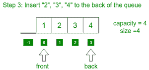
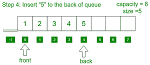
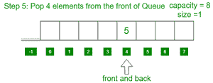
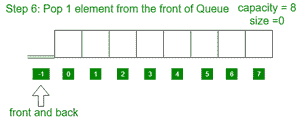

# 使用模板类和循环数组实现动态队列

> 原文:[https://www . geesforgeks . org/implement-dynamic-queue-use-templates-class-and-a-circular-array/](https://www.geeksforgeeks.org/implement-dynamic-queue-using-templates-class-and-a-circular-array/)

在本文中，我们将讨论如何使用具有以下功能的循环[数组](https://www.geeksforgeeks.org/sort-array-wave-form-2/)创建动态[循环队列](https://www.geeksforgeeks.org/circular-queue-set-1-introduction-array-implementation/):

*   **前置():**从队列中获取前置项。
*   **Back():** 从队列中获取最后一个项目。
*   **推(X):** 将队列中的 X 推至队列末尾。
*   **Pop():** 从队列中删除一个元素。

下面是一步一步的图解:

*   最初，队列是空的。


*   将元素 **1** 插入队列的后面。


*   将元素 **2、3、4** 插入队列的后面。



*   将元素 **5** 插入队列的后面。



*   从队列中弹出 4 个元素。



*   从队列中弹出 1 个元素。



**方法:**想法是将每次数组容量满时使用的数组[大小加倍](https://www.geeksforgeeks.org/how-to-determine-length-or-size-of-an-array-in-java/)，并将之前数组的元素复制到新数组中。按照以下步骤解决问题:

*   初始化 4 个变量 **frontIndex，backIndex，sizeVar，**和 **capacity** 以及一个数组**arr【】**来实现队列，
*   定义一个函数，比如 **Capacity()** 来计算当前数组的[大小:](https://www.geeksforgeeks.org/how-to-determine-length-or-size-of-an-array-in-java/)
    *   返回**容量**。
*   定义一个函数，比如 **size()** 来计算队列中元素的数量:
    *   返回变量**大小变量。**
*   定义一个函数说**已满()**来查找[队列是否已满:](https://www.geeksforgeeks.org/circular-queue-set-1-introduction-array-implementation/)
    *   如果**大小 Var 等于**容量**，则返回**真**。否则，返回 false。**
*   定义一个函数，比如**空()**来判断[队列是否为空:](https://www.geeksforgeeks.org/queueempty-queuesize-c-stl/)
    *   如果**前置索引**和**后置索引**等于 **-1** ，则返回真。否则，返回 false。
*   定义一个函数说 **Front()** 打印队列的 [front 元素:](https://www.geeksforgeeks.org/queuefront-queueback-c-stl/)
    *   如果[队列不为**空()**](https://www.geeksforgeeks.org/queueempty-queuesize-c-stl/) **，则打印**arr【front index】**的元素。**
*   定义一个函数说 **Back()** 打印队列的最后一个[元素:](https://www.geeksforgeeks.org/queuefront-queueback-c-stl/)
    *   如果队列不为空，打印**arr【back index】**的元素()。
*   定义一个函数，比如**推(X)** ，在队列的末尾插入一个元素:
    *   如果队列已满**，则将当前数组的大小增加一倍，并将先前数组的元素复制到新数组中。**
    *   **如果队列为**空()**则分配 **frontIndex = backIndex = 0** ，然后将 **X** 分配给**arr【front index】**和**arr【back index】**，然后将 **sizeVar** 递增 1。**
    *   **否则，将**回溯索引**更新为**回溯索引=(回溯索引+1)%容量**，然后将 **X** 分配给 **arr【回溯索引】**，并将 **sizeVar** 递增 1。**
*   **定义一个函数，比如 **Pop()** 来删除队列前面的元素:

    *   如果队列为空，打印**“下溢”。**
    *   否则如果**大小 Var** 等于 **1** ，则将 **-1** 分配给**前置索引**和**后置索引**，然后将**大小 Var** 减 1。
    *   否则，将 **frontIndex** 更新为**front index =(front index+1)%容量**，并将 **sizeVar** 减 1。** 

**下面是上述方法的实现:**

## **C++**

```
// C++ program for the above approach
#include <bits/stdc++.h>
using namespace std;

// Class defination for queue
template <class X>
class Queue {

private:
    // Stores the frontIndex
    int frontIndex;

    // Stores the back Index
    int backIndex;

    // Stores the array
    X* arr;

    // Stores the sizeof queue
    int sizeVar;

    // Stores the size of array
    int capacityVar = 4;

public:
    // Queue class constructor
    Queue()
    {
        arr = new X[capacityVar];
        frontIndex = backIndex = -1;
        sizeVar = 0;
    }

    // Function Methods
    bool empty();
    bool full();
    void push(X x);
    void pop();
    X front();
    X back();
    int capacity();
    int size();
};

// Find the capacity of queue
template <class X>
int Queue<X>::capacity()
{
    return capacityVar;
}

// Find the number of elements
// present in Queue
template <class X>
int Queue<X>::size()
{
    return sizeVar;
}

// Function to check if
// Queue is empty or not
template <class X>
bool Queue<X>::empty()
{
    if (frontIndex == -1
        && backIndex == -1)
        return true;
    else
        return false;
}

// Function to check if the queue
// is full or not
template <class X>
bool Queue<X>::full()
{
    if (sizeVar == capacityVar)
        return true;
    else
        return false;
}

// Function to find the front element
// of the queue
template <class X>
X Queue<X>::front()
{
    // If queue is empty
    if (empty()) {
        cout << "Queue underflow"
             << endl;
        abort();
    }

    return arr[frontIndex];
}

// Function to find the last element
// of the Queue
template <class X>
X Queue<X>::back()
{
    if (empty()) {
        cout << "Queue underflow"
             << endl;
        abort();
    }
    return arr[backIndex];
}

// Function to insert the element
// to the rear end of the queue
template <class X>
void Queue<X>::push(X x)
{
    if (full()) {

        // If the queue is full, then
        // double the capacity
        capacityVar = capacityVar * 2;

        // Initialize new array of
        // double size
        X* temp = new X[capacityVar];

        // Copy the elements of the
        // previous array
        for (int i = 0; i < sizeVar; i++)
            temp[i] = arr[i];

        // Deallocate the memory
        // of previous array
        delete[] arr;
        arr = temp;
    }

    // If size is zero
    if (empty()) {

        frontIndex = backIndex = 0;
        arr[backIndex] = x;
        sizeVar++;
        return;
    }

    // Increment the backIndex
    backIndex = (backIndex + 1) % capacityVar;
    arr[backIndex] = x;
    sizeVar++;

    return;
}

// Function to pop an element from
// front end of the queue
template <class X>
void Queue<X>::pop()
{
    // If queue is empty
    if (empty()) {
        cout << "Queue underflow"
             << endl;
        abort();
    }

    // If there is only one character
    if (frontIndex == backIndex) {

        // Mark Queue as empty
        // and decrement sizeVar
        frontIndex = backIndex = -1;
        sizeVar--;
        return;
    }

    // Increment frontIndex cyclically
    // using modulo arithmetic
    frontIndex = (frontIndex + 1) % capacityVar;
    sizeVar--;

    return;
}

// Driver Code
int main()
{
    // Queue initialization
    Queue<int> q;

    // Iterate the range [1, 100]
    for (int i = 1; i < 100; i++)
        q.push(i);

    // Print the current capacity
    cout << "Current capacity "
         << q.capacity() << endl;

    // Print current size
    cout << "Current size "
         << q.size() << endl;

    // Print front elements of queue
    cout << "Front element "
         << q.front() << endl;

    // Print last element of the queue
    cout << "Rear element "
         << q.back() << endl;

    cout << endl;

    cout << "Pop an element" << endl;

    // Pop an element from the queue
    q.pop();

    cout << "Pop an element" << endl;

    // Pop an element from the queue
    q.pop();

    cout << endl;

    // Print the current capacity
    cout << "Current capacity "
         << q.capacity() << endl;

    // Print current size
    cout << "Current size "
         << q.size() << endl;

    // Print front elements of queue
    cout << "Front element "
         << q.front() << endl;

    // Print last element of the queue
    cout << "Rear element "
         << q.back() << endl;

    return 0;
}
```

****Output:** 

```
Current capacity 128
Current size 99
Front element 1
Rear element 99

Pop an element
Pop an element

Current capacity 128
Current size 97
Front element 3
Rear element 99
```** 

*****时间复杂度:**O(N)*
T5**辅助空间:** O(N)**