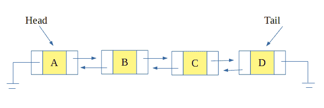
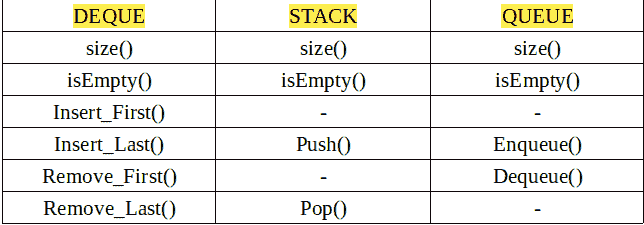

# 使用德格

实现堆栈和队列

> 原文:[https://www . geesforgeks . org/implement-stack-queue-use-deque/](https://www.geeksforgeeks.org/implement-stack-queue-using-deque/)

Deque 也称**双增队列**，顾名思义就是一种特殊的队列，在这种队列中，插入和删除可以在最后进行，也可以在开始进行。

deque 的链接列表表示是这样的，即每个节点指向下一个节点以及前一个节点。因此插入和删除在开始和最后都需要恒定的时间。



现在，deque 可以用来实现堆栈和队列。人们只需要了解如何使 deque 作为一个堆栈或队列工作。

下面列出了 deque 调整它们作为堆栈和队列的功能。



**示例:堆叠**

```
Input : Stack : 1 2 3
        Push(4)
Output : Stack : 1 2 3 4

Input : Stack : 1 2 3
        Pop()
Output : Stack : 1 2
```

**示例:队列**

```
Input: Queue : 1 2 3
       Enqueue(4)
Output: Queue : 1 2 3 4

Input: Queue : 1 2 3
       Dequeue()
Output: Queue : 2 3
```

## C++

```
// C++ Program to implement stack and queue using Deque
#include <bits/stdc++.h>
using namespace std;

// structure for a node of deque
struct DQueNode {
    int value;
    DQueNode* next;
    DQueNode* prev;
};

// Implementation of deque class
class Deque {
private:

    // pointers to head and tail of deque
    DQueNode* head;
    DQueNode* tail;

public:
    // constructor
    Deque()
    {
        head = tail = NULL;
    }

    // if list is empty
    bool isEmpty()
    {
        if (head == NULL)
            return true;
        return false;
    }

    // count the number of nodes in list
    int size()
    {
        // if list is not empty
        if (!isEmpty()) {
            DQueNode* temp = head;
            int len = 0;
            while (temp != NULL) {
                len++;
                temp = temp->next;
            }
            return len;
        }
        return 0;
    }

    // insert at the first position
    void insert_first(int element)
    {
        // allocating node of DQueNode type
        DQueNode* temp = new DQueNode[sizeof(DQueNode)];
        temp->value = element;

        // if the element is first element
        if (head == NULL) {
            head = tail = temp;
            temp->next = temp->prev = NULL;
        }
        else {
            head->prev = temp;
            temp->next = head;
            temp->prev = NULL;
            head = temp;
        }
    }

    // insert at last position of deque
    void insert_last(int element)
    {
        // allocating node of DQueNode type
        DQueNode* temp = new DQueNode[sizeof(DQueNode)];
        temp->value = element;

        // if element is the first element
        if (head == NULL) {
            head = tail = temp;
            temp->next = temp->prev = NULL;
        }
        else {
            tail->next = temp;
            temp->next = NULL;
            temp->prev = tail;
            tail = temp;
        }
    }

    // remove element at the first position
    void remove_first()
    {
        // if list is not empty
        if (!isEmpty()) {
            DQueNode* temp = head;
            head = head->next;
            if(head) head->prev = NULL;
            delete temp;
            if(head == NULL) tail = NULL;
            return;
        }
        cout << "List is Empty" << endl;
    }

    // remove element at the last position
    void remove_last()
    {
        // if list is not empty
        if (!isEmpty()) {
            DQueNode* temp = tail;
            tail = tail->prev;
            if(tail) tail->next = NULL;
            delete temp;
            if(tail == NULL) head = NULL;
            return;
        }
        cout << "List is Empty" << endl;
    }

    // displays the elements in deque
    void display()
    {
        // if list is not empty
        if (!isEmpty()) {
            DQueNode* temp = head;
            while (temp != NULL) {
                cout << temp->value << " ";
                temp = temp->next;
            }
            cout << endl;
            return;
        }
        cout << "List is Empty" << endl;
    }
};

// Class to implement stack using Deque
class Stack : public Deque {
public:
    // push to push element at top of stack
    // using insert at last function of deque
    void push(int element)
    {
        insert_last(element);
    }

    // pop to remove element at top of stack
    // using remove at last function of deque
    void pop()
    {
        remove_last();
    }
};

// class to implement queue using deque
class Queue : public Deque {
public:
    // enqueue to insert element at last
    // using insert at last function of deque
    void enqueue(int element)
    {
        insert_last(element);
    }

    // dequeue to remove element from first
    // using remove at first function of deque
    void dequeue()
    {
        remove_first();
    }
};

// Driver Code
int main()
{
    // object of Stack
    Stack stk;

    // push 7 and 8 at top of stack
    stk.push(7);
    stk.push(8);
    cout << "Stack: ";
    stk.display();

    // pop an element
    stk.pop();
    cout << "Stack: ";
    stk.display();

    // object of Queue
    Queue que;

    // insert 12 and 13 in queue
    que.enqueue(12);
    que.enqueue(13);
    cout << "Queue: ";
    que.display();

    // delete an element from queue
    que.dequeue();
    cout << "Queue: ";
    que.display();

    cout << "Size of Stack is " << stk.size() << endl;
    cout << "Size of Queue is " << que.size() << endl;
    return 0;
}
```

## Java 语言(一种计算机语言，尤用于创建网站)

```
// Java program to implement stack and
// queue using Deque
class GFG{

// Class for a node of deque
static class DQueNode
{
    int value;
    DQueNode next;
    DQueNode prev;
}

// Implementation of deque class
static class deque
{

    // Pointers to head and tail of deque
    private DQueNode head;
    private DQueNode tail;

    // Constructor
    public deque()
    {
        head = tail = null;
    }

    // If list is empty
    boolean isEmpty()
    {
        if (head == null)
            return true;

        return false;
    }

    // count the number of nodes in list
    int size()
    {

        // If list is not empty
        if (!isEmpty())
        {
            DQueNode temp = head;
            int len = 0;

            while (temp != null)
            {
                len++;
                temp = temp.next;
            }
            return len;
        }
        return 0;
    }

    // Insert at the first position
    void insert_first(int element)
    {

        // Allocating node of DQueNode type
        DQueNode temp = new DQueNode();
        temp.value = element;

        // If the element is first element
        if (head == null)
        {
            head = tail = temp;
            temp.next = temp.prev = null;
        }
        else
        {
            head.prev = temp;
            temp.next = head;
            temp.prev = null;
            head = temp;
        }
    }

    // Insert at last position of deque
    void insert_last(int element)
    {

        // Allocating node of DQueNode type
        DQueNode temp = new DQueNode();
        temp.value = element;

        // If element is the first element
        if (head == null)
        {
            head = tail = temp;
            temp.next = temp.prev = null;
        }
        else
        {
            tail.next = temp;
            temp.next = null;
            temp.prev = tail;
            tail = temp;
        }
    }

    // Remove element at the first position
    void remove_first()
    {

        // If list is not empty
        if (!isEmpty())
        {
            DQueNode temp = head;
            head = head.next;
            head.prev = null;

            return;
        }
        System.out.print("List is Empty");
    }

    // Remove element at the last position
    void remove_last()
    {

        // If list is not empty
        if (!isEmpty())
        {
            DQueNode temp = tail;
            tail = tail.prev;
            tail.next = null;

            return;
        }
        System.out.print("List is Empty");
    }

    // Displays the elements in deque
    void display()
    {

        // If list is not empty
        if (!isEmpty())
        {
            DQueNode temp = head;

            while (temp != null)
            {
                System.out.print(temp.value + " ");
                temp = temp.next;
            }

            return;
        }
        System.out.print("List is Empty");
    }
}

// Class to implement stack using Deque
static class Stack
{
    deque d = new deque();

    // push to push element at top of stack
    // using insert at last function of deque
    public void push(int element)
    {
        d.insert_last(element);
    }

    // Returns size
    public int size()
    {
        return d.size();
    }

    // pop to remove element at top of stack
    // using remove at last function of deque
    public void pop()
    {
        d.remove_last();
    }

    // Display
    public void display()
    {
        d.display();
    }
}

// Class to implement queue using deque
static class Queue
{
    deque d = new deque();

    // enqueue to insert element at last
    // using insert at last function of deque
    public void enqueue(int element)
    {
        d.insert_last(element);
    }

    // dequeue to remove element from first
    // using remove at first function of deque
    public void dequeue()
    {
        d.remove_first();
    }

    // display
    public void display()
    {
        d.display();
    }

    // size
    public int size()
    {
        return d.size();
    }
}

// Driver Code
public static void main(String[] args)
{

    // Object of Stack
    Stack stk = new Stack();

    // push 7 and 8 at top of stack
    stk.push(7);
    stk.push(8);
    System.out.print("Stack: ");
    stk.display();

    // For new line
    System.out.println();

    // pop an element
    stk.pop();
    System.out.print("Stack: ");
    stk.display();

    // For new line
    System.out.println();

    // Object of Queue
    Queue que = new Queue();

    // Insert 12 and 13 in queue
    que.enqueue(12);
    que.enqueue(13);
    System.out.print("Queue: ");
    que.display();

    // New line
    System.out.println();

    // Delete an element from queue
    que.dequeue();
    System.out.print("Queue: ");
    que.display();

    // New line
    System.out.println();
    System.out.println("Size of stack is " +
                       stk.size());
    System.out.println("Size of queue is " +
                       que.size());
}
}

// This code is contributed by sujitmeshram
```

## C#

```
// C# program to implement stack and
// queue using Deque
using System;
class GFG
{

    // Class for a node of deque
    public

        class DQueNode {
        public

            int value;
        public
            DQueNode next;
        public
            DQueNode prev;
    }

    // Implementation of deque class
    public class deque {

        // Pointers to head and tail of deque
        private DQueNode head;
        private DQueNode tail;

        // Constructor
        public deque() { head = tail = null; }

        // If list is empty
        public

            bool
            isEmpty()
        {
            if (head == null)
                return true;

            return false;
        }

        // count the number of nodes in list
        public

            int
            size()
        {

            // If list is not empty
            if (!isEmpty()) {
                DQueNode temp = head;
                int len = 0;

                while (temp != null) {
                    len++;
                    temp = temp.next;
                }
                return len;
            }
            return 0;
        }

        // Insert at the first position
        public

            void
            insert_first(int element)
        {

            // Allocating node of DQueNode type
            DQueNode temp = new DQueNode();
            temp.value = element;

            // If the element is first element
            if (head == null) {
                head = tail = temp;
                temp.next = temp.prev = null;
            }
            else {
                head.prev = temp;
                temp.next = head;
                temp.prev = null;
                head = temp;
            }
        }

        // Insert at last position of deque
        public

            void
            insert_last(int element)
        {

            // Allocating node of DQueNode type
            DQueNode temp = new DQueNode();
            temp.value = element;

            // If element is the first element
            if (head == null) {
                head = tail = temp;
                temp.next = temp.prev = null;
            }
            else {
                tail.next = temp;
                temp.next = null;
                temp.prev = tail;
                tail = temp;
            }
        }

        // Remove element at the first position
        public

            void
            remove_first()
        {

            // If list is not empty
            if (!isEmpty()) {
                head = head.next;
                head.prev = null;

                return;
            }
            Console.Write("List is Empty");
        }

        // Remove element at the last position
        public

            void
            remove_last()
        {

            // If list is not empty
            if (!isEmpty()) {
                tail = tail.prev;
                tail.next = null;

                return;
            }
            Console.Write("List is Empty");
        }

        // Displays the elements in deque
        public

            void
            display()
        {

            // If list is not empty
            if (!isEmpty()) {
                DQueNode temp = head;

                while (temp != null) {
                    Console.Write(temp.value + " ");
                    temp = temp.next;
                }

                return;
            }
            Console.Write("List is Empty");
        }
    }

    // Class to implement stack using Deque
    public class Stack {
        deque d = new deque();

        // push to push element at top of stack
        // using insert at last function of deque
        public void push(int element)
        {
            d.insert_last(element);
        }

        // Returns size
        public int size() { return d.size(); }

        // pop to remove element at top of stack
        // using remove at last function of deque
        public void pop() { d.remove_last(); }

        // Display
        public void display() { d.display(); }
    }

    // Class to implement queue using deque
    class Queue {
        deque d = new deque();

        // enqueue to insert element at last
        // using insert at last function of deque
        public void enqueue(int element)
        {
            d.insert_last(element);
        }

        // dequeue to remove element from first
        // using remove at first function of deque
        public void dequeue() { d.remove_first(); }

        // display
        public void display() { d.display(); }

        // size
        public int size() { return d.size(); }
    }

    // Driver Code
    public static void Main(String[] args)
    {

        // Object of Stack
        Stack stk = new Stack();

        // push 7 and 8 at top of stack
        stk.push(7);
        stk.push(8);
        Console.Write("Stack: ");
        stk.display();

        // For new line
        Console.WriteLine();

        // pop an element
        stk.pop();
        Console.Write("Stack: ");
        stk.display();

        // For new line
        Console.WriteLine();

        // Object of Queue
        Queue que = new Queue();

        // Insert 12 and 13 in queue
        que.enqueue(12);
        que.enqueue(13);
        Console.Write("Queue: ");
        que.display();

        // New line
        Console.WriteLine();

        // Delete an element from queue
        que.dequeue();
        Console.Write("Queue: ");
        que.display();

        // New line
        Console.WriteLine();
        Console.WriteLine("Size of stack is " + stk.size());
        Console.WriteLine("Size of queue is " + que.size());
    }
}

// This code contributed by gauravrajput1
```

## java 描述语言

```
<script>
// Javascript program to implement stack and
// queue using Deque

// Class for a node of deque
class DQueNode
{
    constructor()
    {
        this.value = 0;
         this.next = null;
        this.prev = null;
    }
}

// Implementation of deque class
class deque
{
     // Constructor
    constructor()
    {
        this.head = this.tail=null;
    }

    // If list is empty
    isEmpty()
    {
        if (this.head == null)
            return true;

        return false;
    }

    // count the number of nodes in list
    size()
    {
        // If list is not empty
        if (!this.isEmpty())
        {
            let temp = this.head;
            let len = 0;

            while (temp != null)
            {
                len++;
                temp = temp.next;
            }
            return len;
        }
        return 0;
    }

    // Insert at the first position
    insert_first(element)
    {

        // Allocating node of DQueNode type
        let temp = new DQueNode();
        temp.value = element;

        // If the element is first element
        if (this.head == null)
        {
            this.head = this.tail = temp;
            temp.next = temp.prev = null;
        }
        else
        {
            this.head.prev = temp;
            temp.next = this.head;
            temp.prev = null;
            this.head = temp;
        }
    }

    // Insert at last position of deque
    insert_last(element)
    {
        // Allocating node of DQueNode type
        let temp = new DQueNode();
        temp.value = element;

        // If element is the first element
        if (this.head == null)
        {
            this.head = this.tail = temp;
            temp.next = temp.prev = null;
        }
        else
        {
            this.tail.next = temp;
            temp.next = null;
            temp.prev = this.tail;
            this.tail = temp;
        }
    }

    // Remove element at the first position
    remove_first()
    {

        // If list is not empty
        if (!this.isEmpty())
        {
            let temp = this.head;
            this.head = this.head.next;
            this.head.prev = null;

            return;
        }
        document.write("List is Empty");
    }

    // Remove element at the last position
    remove_last()
    {
        // If list is not empty
        if (!this.isEmpty())
        {
            let temp = this.tail;
            this.tail = this.tail.prev;
            this.tail.next = null;

            return;
        }
        document.write("List is Empty");
    }

    // Displays the elements in deque
    display()
    {
        // If list is not empty
        if (!this.isEmpty())
        {
            let temp = this.head;

            while (temp != null)
            {
                document.write(temp.value + " ");
                temp = temp.next;
            }

            return;
        }
        document.write("List is Empty");
    }
}

// Class to implement stack using Deque
class Stack
{
    constructor()
    {
        this.d= new deque();   
    }

    // push to push element at top of stack
    // using insert at last function of deque
    push(element)
    {
        this.d.insert_last(element);
    }

    // Returns size
    size()
    {
        return this.d.size();
    }

    // pop to remove element at top of stack
    // using remove at last function of deque
    pop()
    {
        this.d.remove_last();
    }

    // Display
    display()
    {
        this.d.display();
    }
}

// Class to implement queue using deque
class Queue
{
    constructor()
    {
        this.d = new deque();
    }
    // enqueue to insert element at last
    // using insert at last function of deque
    enqueue(element)
    {
        this.d.insert_last(element);
    }

    // dequeue to remove element from first
    // using remove at first function of deque
    dequeue()
    {
        this.d.remove_first();
    }

    // display
    display()
    {
        this.d.display();
    }

    // size
    size()
    {
        return this.d.size();
    }
}

// Driver Code
// Object of Stack
let stk = new Stack();

// push 7 and 8 at top of stack
stk.push(7);
stk.push(8);
document.write("Stack: ");
stk.display();

// For new line
document.write("<br>");

// pop an element
stk.pop();
document.write("Stack: ");
stk.display();

// For new line
document.write("<br>");

// Object of Queue
let que = new Queue();

// Insert 12 and 13 in queue
que.enqueue(12);
que.enqueue(13);
document.write("Queue: ");
que.display();

// New line
document.write("<br>");

// Delete an element from queue
que.dequeue();
document.write("Queue: ");
que.display();

// New line
document.write("<br>");
document.write("Size of stack is " +
                   stk.size()+"<br>");
document.write("Size of queue is " +
                   que.size()+"<br>");

// This code is contributed by patel2127
</script>
```

**输出:**

```
Stack: 7 8
Stack: 7
Queue: 12 13
Queue: 13
Size of Stack is 1
Size of Queue is 1
```