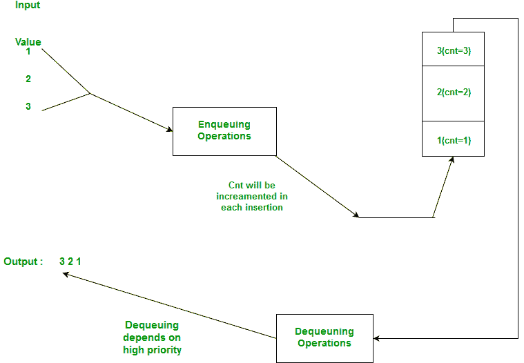

# 如何利用优先级队列或堆实现栈？

> 原文:[https://www . geesforgeks . org/implement-stack-use-priority-queue-or-heap/](https://www.geeksforgeeks.org/implement-stack-using-priority-queue-or-heap/)

如何使用优先级队列(使用最小堆)实现堆栈？。

**问于:微软、Adobe。**

**解决方案:**

在优先级队列中，我们为正在推送的元素分配优先级。堆栈要求以后进先出的方式处理元素。其思想是关联一个计数，该计数决定它何时被推送。此计数作为优先级队列的关键字。

所以堆栈的实现使用一个优先级队列对，第一个元素作为关键字。

```
pair <int, int> (key, value)
```

**看下图更好理解**



下面是 C++实现的思路。

```
// C++ program to implement a stack using
// Priority queue(min heap)
#include<bits/stdc++.h>
using namespace std;

typedef pair<int, int> pi;

// User defined stack class
class Stack{

    // cnt is used to keep track of the number of
    //elements in the stack and also serves as key
    //for the priority queue.
    int cnt;
    priority_queue<pair<int, int> > pq;
public:
    Stack():cnt(0){}
    void push(int n);
    void pop();
    int top();
    bool isEmpty();
};

// push function increases cnt by 1 and
// inserts this cnt with the original value. 
void Stack::push(int n){
    cnt++;
    pq.push(pi(cnt, n));
}

// pops element and reduces count.
void Stack::pop(){
    if(pq.empty()){ cout<<"Nothing to pop!!!";}
    cnt--;
    pq.pop();
}

// returns the top element in the stack using
// cnt as key to determine top(highest priority),
// default comparator for pairs works fine in this case 
int Stack::top(){
    pi temp=pq.top();
    return temp.second;
}

// return true if stack is empty
bool Stack::isEmpty(){
    return pq.empty();
}

// Driver code
int main()
{
    Stack* s=new Stack();
    s->push(1);
    s->push(2);
    s->push(3);
    while(!s->isEmpty()){
        cout<<s->top()<<endl;
        s->pop();
    }
}
```

输出:

```
 3
 2
 1

```

现在，正如我们所看到的，这个实现对于推送和弹出操作都需要 O(log n)时间。这可以通过使用优先级队列的斐波那契堆实现来稍微优化，这将给我们推送操作带来 O(1)的时间复杂度，但是 pop 仍然需要 O(log n)的时间。

本文由 Somesh Awasthi 先生供稿。如果你喜欢 GeeksforGeeks 并想投稿，你也可以使用[contribute.geeksforgeeks.org](http://www.contribute.geeksforgeeks.org)写一篇文章或者把你的文章邮寄到 contribute@geeksforgeeks.org。看到你的文章出现在极客博客主页上，帮助其他极客。

如果你发现任何不正确的地方，或者你想分享更多关于上面讨论的话题的信息，请写评论。