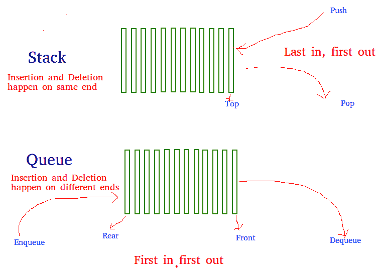

# 使用队列实现堆栈

> 原文:[https://www.geeksforgeeks.org/implement-stack-using-queue/](https://www.geeksforgeeks.org/implement-stack-using-queue/)

问题与[这个](https://www.geeksforgeeks.org/queue-using-stacks/)帖子相反。我们得到了一个队列数据结构，它支持标准操作，如入队()和出列()。我们需要只使用队列实例和实例上允许的队列操作来实现堆栈数据结构。



一个堆栈可以使用两个队列来实现。让要实现的堆栈为“s”，用于实现的队列为“q1”和“q2”。堆栈可以通过两种方式实现:
**方法 1(通过使推送操作代价高昂)**
该方法确保新输入的元素始终位于“q1”的前面，这样 pop 操作就刚好从“q1”出列。“q2”用于将每个新元素放在“q1”的前面。

1.  **推(s，x)** 操作步骤如下:
    *   将 x 排队到 q2
    *   一个接一个地将 q1 中的所有内容出队，并入队到 q2。
    *   交换 q1 和 q2 的名称
2.  **pop**操作的功能描述如下:
    *   将一个项目从第一季度出列并返回。

以下是上述方法的实现:

## C++

```
/* Program to implement a stack using
two queue */
#include <bits/stdc++.h>

using namespace std;

class Stack {
    // Two inbuilt queues
    queue<int> q1, q2;

    // To maintain current number of
    // elements
    int curr_size;

public:
    Stack()
    {
        curr_size = 0;
    }

    void push(int x)
    {
        curr_size++;

        // Push x first in empty q2
        q2.push(x);

        // Push all the remaining
        // elements in q1 to q2.
        while (!q1.empty()) {
            q2.push(q1.front());
            q1.pop();
        }

        // swap the names of two queues
        queue<int> q = q1;
        q1 = q2;
        q2 = q;
    }

    void pop()
    {

        // if no elements are there in q1
        if (q1.empty())
            return;
        q1.pop();
        curr_size--;
    }

    int top()
    {
        if (q1.empty())
            return -1;
        return q1.front();
    }

    int size()
    {
        return curr_size;
    }
};

// Driver code
int main()
{
    Stack s;
    s.push(1);
    s.push(2);
    s.push(3);

    cout << "current size: " << s.size()
         << endl;
    cout << s.top() << endl;
    s.pop();
    cout << s.top() << endl;
    s.pop();
    cout << s.top() << endl;

    cout << "current size: " << s.size()
         << endl;
    return 0;
}
// This code is contributed by Chhavi
```

## Java 语言(一种计算机语言，尤用于创建网站)

```
/* Java Program to implement a stack using
two queue */
import java.util.*;

class GfG {

    static class Stack {
        // Two inbuilt queues
        static Queue<Integer> q1 = new LinkedList<Integer>();
        static Queue<Integer> q2 = new LinkedList<Integer>();

        // To maintain current number of
        // elements
        static int curr_size;

        Stack()
        {
            curr_size = 0;
        }

        static void push(int x)
        {
            curr_size++;

            // Push x first in empty q2
            q2.add(x);

            // Push all the remaining
            // elements in q1 to q2.
            while (!q1.isEmpty()) {
                q2.add(q1.peek());
                q1.remove();
            }

            // swap the names of two queues
            Queue<Integer> q = q1;
            q1 = q2;
            q2 = q;
        }

        static void pop()
        {

            // if no elements are there in q1
            if (q1.isEmpty())
                return;
            q1.remove();
            curr_size--;
        }

        static int top()
        {
            if (q1.isEmpty())
                return -1;
            return q1.peek();
        }

        static int size()
        {
            return curr_size;
        }
    }

    // driver code
    public static void main(String[] args)
    {
        Stack s = new Stack();
        s.push(1);
        s.push(2);
        s.push(3);

        System.out.println("current size: " + s.size());
        System.out.println(s.top());
        s.pop();
        System.out.println(s.top());
        s.pop();
        System.out.println(s.top());

        System.out.println("current size: " + s.size());
    }
}
// This code is contributed by Prerna
```

## 蟒蛇 3

```
# Program to implement a stack using
# two queue
from queue import Queue

class Stack:

    def __init__(self):

        # Two inbuilt queues
        self.q1 = Queue()
        self.q2 = Queue()

        # To maintain current number
        # of elements
        self.curr_size = 0

    def push(self, x):
        self.curr_size += 1

        # Push x first in empty q2
        self.q2.put(x)

        # Push all the remaining
        # elements in q1 to q2.
        while (not self.q1.empty()):
            self.q2.put(self.q1.queue[0])
            self.q1.get()

        # swap the names of two queues
        self.q = self.q1
        self.q1 = self.q2
        self.q2 = self.q

    def pop(self):

        # if no elements are there in q1
        if (self.q1.empty()):
            return
        self.q1.get()
        self.curr_size -= 1

    def top(self):
        if (self.q1.empty()):
            return -1
        return self.q1.queue[0]

    def size(self):
        return self.curr_size

# Driver Code
if __name__ == '__main__':
    s = Stack()
    s.push(1)
    s.push(2)
    s.push(3)

    print("current size: ", s.size())
    print(s.top())
    s.pop()
    print(s.top())
    s.pop()
    print(s.top())

    print("current size: ", s.size())

# This code is contributed by PranchalK
```

## C#

```
/* C# Program to implement a stack using
two queue */
using System;
using System.Collections;

class GfG {

    public class Stack {
        // Two inbuilt queues
        public Queue q1 = new Queue();
        public Queue q2 = new Queue();

        // To maintain current number of
        // elements
        public int curr_size;

        public Stack()
        {
            curr_size = 0;
        }

        public void push(int x)
        {
            curr_size++;

            // Push x first in empty q2
            q2.Enqueue(x);

            // Push all the remaining
            // elements in q1 to q2.
            while (q1.Count > 0) {
                q2.Enqueue(q1.Peek());
                q1.Dequeue();
            }

            // swap the names of two queues
            Queue q = q1;
            q1 = q2;
            q2 = q;
        }

        public void pop()
        {

            // if no elements are there in q1
            if (q1.Count == 0)
                return;
            q1.Dequeue();
            curr_size--;
        }

        public int top()
        {
            if (q1.Count == 0)
                return -1;
            return (int)q1.Peek();
        }

        public int size()
        {
            return curr_size;
        }
    };

    // Driver code
    public static void Main(String[] args)
    {
        Stack s = new Stack();
        s.push(1);
        s.push(2);
        s.push(3);
        Console.WriteLine("current size: " + s.size());
        Console.WriteLine(s.top());
        s.pop();
        Console.WriteLine(s.top());
        s.pop();
        Console.WriteLine(s.top());
        Console.WriteLine("current size: " + s.size());
    }
}

// This code is contributed by Arnab Kundu
```

**输出:**

```
current size: 3
3
2
1
current size: 1
```

**方法 2(通过使 pop 操作代价高昂)**
在推送操作中，新元素总是排队到 q1。在 pop()操作中，如果 q2 为空，则除最后一个元素之外的所有元素都将移动到 q2。最后，最后一个元素从 q1 出列并返回。

1.  **推(s，x)** 操作:
    *   将 x 排队到 q1(假设 q1 的大小不受限制)。
2.  **弹出**操作:
    *   一个接一个地将 q1 中除最后一个元素之外的所有元素出列，并入队到 q2。
    *   使 q1 的最后一个项目出列，出列的项目是结果，存储它。
    *   交换 q1 和 q2 的名称
    *   返回步骤 2 中存储的项目。

## C++

```
/* Program to implement a stack
using two queue */
#include <bits/stdc++.h>
using namespace std;

class Stack {
    queue<int> q1, q2;
    int curr_size;

public:
    Stack()
    {
        curr_size = 0;
    }

    void pop()
    {
        if (q1.empty())
            return;

        // Leave one element in q1 and
        // push others in q2.
        while (q1.size() != 1) {
            q2.push(q1.front());
            q1.pop();
        }

        // Pop the only left element
        // from q1
        q1.pop();
        curr_size--;

        // swap the names of two queues
        queue<int> q = q1;
        q1 = q2;
        q2 = q;
    }

    void push(int x)
    {
        q1.push(x);
        curr_size++;
    }

    int top()
    {
        if (q1.empty())
            return -1;

        while (q1.size() != 1) {
            q2.push(q1.front());
            q1.pop();
        }

        // last pushed element
        int temp = q1.front();

        // to empty the auxiliary queue after
        // last operation
        q1.pop();

        // push last element to q2
        q2.push(temp);

        // swap the two queues names
        queue<int> q = q1;
        q1 = q2;
        q2 = q;
        return temp;
    }

    int size()
    {
        return curr_size;
    }
};

// Driver code
int main()
{
    Stack s;
    s.push(1);
    s.push(2);
    s.push(3);
    s.push(4);

    cout << "current size: " << s.size()
         << endl;
    cout << s.top() << endl;
    s.pop();
    cout << s.top() << endl;
    s.pop();
    cout << s.top() << endl;
    cout << "current size: " << s.size()
         << endl;
    return 0;
}
// This code is contributed by Chhavi
```

## Java 语言(一种计算机语言，尤用于创建网站)

```
/* Java Program to implement a stack
using two queue */
import java.util.*;

class Stack {
    Queue<Integer> q1 = new LinkedList<>(), q2 = new LinkedList<>();
    int curr_size;

    public Stack()
    {
        curr_size = 0;
    }

    void remove()
    {
        if (q1.isEmpty())
            return;

        // Leave one element in q1 and
        // push others in q2.
        while (q1.size() != 1) {
            q2.add(q1.peek());
            q1.remove();
        }

        // Pop the only left element
        // from q1
        q1.remove();
        curr_size--;

        // swap the names of two queues
        Queue<Integer> q = q1;
        q1 = q2;
        q2 = q;
    }

    void add(int x)
    {
        q1.add(x);
        curr_size++;
    }

    int top()
    {
        if (q1.isEmpty())
            return -1;

        while (q1.size() != 1) {
            q2.add(q1.peek());
            q1.remove();
        }

        // last pushed element
        int temp = q1.peek();

        // to empty the auxiliary queue after
        // last operation
        q1.remove();

        // push last element to q2
        q2.add(temp);

        // swap the two queues names
        Queue<Integer> q = q1;
        q1 = q2;
        q2 = q;
        return temp;
    }

    int size()
    {
        return curr_size;
    }

    // Driver code
    public static void main(String[] args)
    {
        Stack s = new Stack();
        s.add(1);
        s.add(2);
        s.add(3);
        s.add(4);

        System.out.println("current size: " + s.size());
        System.out.println(s.top());
        s.remove();
        System.out.println(s.top());
        s.remove();
        System.out.println(s.top());
        System.out.println("current size: " + s.size());
    }
}

// This code is contributed by Princi Singh
```

## 蟒蛇 3

```
# Program to implement a stack using
# two queue
from queue import Queue

class Stack:

    def __init__(self):

        # Two inbuilt queues
        self.q1 = Queue()
        self.q2 = Queue()

        # To maintain current number
        # of elements
        self.curr_size = 0

    def push(self, x):
        self.q1.put(x)
        self.curr_size += 1

    def pop(self):
        # if no elements are there in q1
        if (self.q1.empty()):
            return
        # Leave one element in q1 and push others in q2
        while(self.q1.qsize() != 1):
            self.q2.put(self.q1.get())

        # Pop the only left element from q1
        popped = self.q1.get()
        self.curr_size -= 1

        # swap the names of two queues
        self.q = self.q1
        self.q1 = self.q2
        self.q2 = self.q

    def top(self):
        # if no elements are there in q1
        if (self.q1.empty()):
            return
        # Leave one element in q1 and push others in q2
        while(self.q1.qsize() != 1):
            self.q2.put(self.q1.get())

        # Pop the only left element from q1 to q2
        top = self.q1.queue[0]
        self.q2.put(self.q1.get())

        # swap the names of two queues
        self.q = self.q1
        self.q1 = self.q2
        self.q2 = self.q

        return top

    def size(self):
        return self.curr_size

# Driver Code
if __name__ == '__main__':
    s = Stack()
    s.push(1)
    s.push(2)
    s.push(3)
    s.push(4)

    print("current size: ", s.size())
    print(s.top())
    s.pop()
    print(s.top())
    s.pop()
    print(s.top())

    print("current size: ", s.size())

# This code is contributed by jainlovely450
```

## C#

```
using System;
using System.Collections;
class GfG
{
    public class Stack
    {
        public Queue q1 = new Queue();
        public Queue q2 = new Queue();
        //Just enqueue the new element to q1
        public void Push(int x) => q1.Enqueue(x);

        //move all elements from q1 to q2 except the rear of q1.
        //Store the rear of q1
        //swap q1 and q2
        //return the stored result
        public int Pop()
        {
            if (q1.Count == 0)
                return -1;
            while (q1.Count > 1)
            {
                q2.Enqueue(q1.Dequeue());
            }
            int res = (int)q1.Dequeue();
            Queue temp = q1;
            q1 = q2;
            q2 = temp;
            return res;
        }

        public int Size() => q1.Count;

        public int Top()
        {
            if (q1.Count == 0)
                return -1;
            while (q1.Count > 1)
            {
                q2.Enqueue(q1.Dequeue());
            }
            int res = (int)q1.Dequeue();
            q2.Enqueue(res);
            Queue temp = q1;
            q1 = q2;
            q2 = temp;
            return res;
        }
    };
    public static void Main(String[] args)
    {
        Stack s = new Stack();
    s.Push(1);
    Console.WriteLine("Size of Stack: " + s.Size() + "\tTop : " + s.Top());
    s.Push(7);
    Console.WriteLine("Size of Stack: " + s.Size() + "\tTop : " + s.Top());
    s.Push(9);
    Console.WriteLine("Size of Stack: " + s.Size() + "\tTop : " + s.Top());

    s.Pop();
    Console.WriteLine("Size of Stack: " + s.Size() + "\tTop : " + s.Top());
    s.Pop();
    Console.WriteLine("Size of Stack: " + s.Size() + "\tTop : " + s.Top());

    s.Push(5);
    Console.WriteLine("Size of Stack: " + s.Size() + "\tTop : " + s.Top());
    }
}
//Submitted by Sakti Prasad

//Size of Stack: 1 Top : 1
//Size of Stack: 2 Top : 7
//Size of Stack: 3 Top : 9
//Size of Stack: 2 Top : 7
//Size of Stack: 1 Top : 1
//Size of Stack: 2 Top : 5
```

**输出:**

```
current size: 4
4
3
2
current size: 2
```

**参考文献:**
[使用两个队列](http://stackoverflow.com/questions/688276/implement-stack-using-two-queues)
实现堆栈本文由 **Sumit Jain** 整理，GeeksforGeeks 团队审核。如果你发现任何不正确的地方，或者你想分享更多关于上面讨论的话题的信息，请写评论。