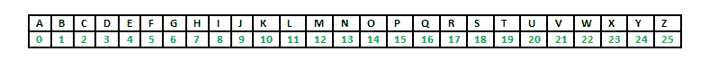
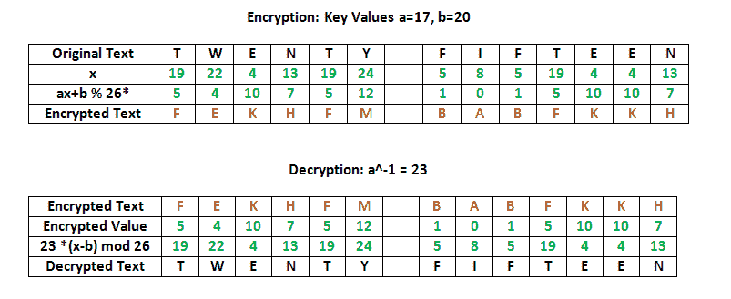

# 仿射密码的实现

> 原文:[https://www.geeksforgeeks.org/implementation-affine-cipher/](https://www.geeksforgeeks.org/implementation-affine-cipher/)

仿射密码是一种单字母替代密码，其中字母表中的每个字母都被映射到其数字等价物，使用简单的数学函数加密，并转换回字母。使用的公式意味着每个字母加密成另一个字母，然后再加密回来，这意味着密码本质上是一个标准的替代密码，有一个规则来控制哪个字母去哪个。
整个过程依赖于工作模 m(所用字母表的长度)。在仿射密码中，大小为 m 的字母表的字母首先被映射到 0 … m-1 范围内的整数。

仿射密码的“密钥”由两个数字组成，我们称之为 a 和 b。下面的讨论假设使用 26 个字符的字母表(m = 26)。a 应该被选择为相对于 m 是质数(即 a 应该与 m 没有共同的因素)。



**加密**

它使用模运算将每个明文字母对应的整数转换成另一个对应密文字母的整数。单个字母的加密功能是

```
 E ( x ) = ( a x + b ) mod m 
modulus m: size of the alphabet
a and b: key of the cipher.
a must be chosen such that a and m are coprime.
```

**解密**

在解密密文时，我们必须对密文执行相反(或相反)的函数来检索明文。同样，第一步是将每个密文字母转换成它们的整数值。解密功能是

```
D ( x ) = a^-1 ( x - b ) mod m
a^-1 : modular multiplicative inverse of a modulo m. i.e., it satisfies the equation
1 = a a^-1 mod m .
```

**求乘法逆**

我们需要找到一个数 x，这样:
如果我们找到数 x，这样方程为真，那么 x 是 a 的倒数，我们称之为 a^-1.求解这个方程最简单的方法是搜索数字 1 到 25，看看哪一个满足这个方程。

```
[g,x,d] = gcd(a,m);    % we can ignore g and d, we dont need them
x = mod(x,m);      
```

如果你现在把 x 和 a 相乘，然后把结果缩小(mod 26)，你会得到答案 1。记住，这只是逆的定义，即如果 a*x = 1 (mod 26)，那么 x 是 a 的逆(a 是 x 的逆)

**示例:**



## C++

```
//CPP program to illustrate Affine Cipher

#include<bits/stdc++.h>
using namespace std;

//Key values of a and b
const int a = 17;
const int b = 20;

string encryptMessage(string msg)
{
    ///Cipher Text initially empty
    string cipher = "";
    for (int i = 0; i < msg.length(); i++)
    {
        // Avoid space to be encrypted
        if(msg[i]!=' ')
            /* applying encryption formula ( a x + b ) mod m
            {here x is msg[i] and m is 26} and added 'A' to
            bring it in range of ascii alphabet[ 65-90 | A-Z ] */
            cipher = cipher +
                        (char) ((((a * (msg[i]-'A') ) + b) % 26) + 'A');
        else
            //else simply append space character
            cipher += msg[i];    
    }
    return cipher;
}

string decryptCipher(string cipher)
{
    string msg = "";
    int a_inv = 0;
    int flag = 0;

    //Find a^-1 (the multiplicative inverse of a
        //in the group of integers modulo m.)
    for (int i = 0; i < 26; i++)
    {
        flag = (a * i) % 26;

        //Check if (a*i)%26 == 1,
                //then i will be the multiplicative inverse of a
        if (flag == 1)
        {
            a_inv = i;
        }
    }
    for (int i = 0; i < cipher.length(); i++)
    {
        if(cipher[i]!=' ')
            /*Applying decryption formula a^-1 ( x - b ) mod m
            {here x is cipher[i] and m is 26} and added 'A'
            to bring it in range of ASCII alphabet[ 65-90 | A-Z ] */
            msg = msg +
                       (char) (((a_inv * ((cipher[i]+'A' - b)) % 26)) + 'A');
        else
            //else simply append space character
            msg += cipher[i];
    }

    return msg;
}

//Driver Program
int main(void)
{
    string msg = "AFFINE CIPHER";

    //Calling encryption function
    string cipherText = encryptMessage(msg);
    cout << "Encrypted Message is : " << cipherText<<endl;

    //Calling Decryption function
    cout << "Decrypted Message is: " << decryptCipher(cipherText);

    return 0;
}
```

## Java 语言(一种计算机语言，尤用于创建网站)

```
// Java program to illustrate Affine Cipher

class GFG
{

    // Key values of a and b
    static int a = 17;
    static int b = 20;

    static String encryptMessage(char[] msg)
    {
        /// Cipher Text initially empty
        String cipher = "";
        for (int i = 0; i < msg.length; i++)
        {
            // Avoid space to be encrypted
            /* applying encryption formula ( a x + b ) mod m
            {here x is msg[i] and m is 26} and added 'A' to
            bring it in range of ascii alphabet[ 65-90 | A-Z ] */
            if (msg[i] != ' ')
            {
                cipher = cipher
                        + (char) ((((a * (msg[i] - 'A')) + b) % 26) + 'A');
            } else // else simply append space character
            {
                cipher += msg[i];
            }
        }
        return cipher;
    }

    static String decryptCipher(String cipher)
    {
        String msg = "";
        int a_inv = 0;
        int flag = 0;

        //Find a^-1 (the multiplicative inverse of a
        //in the group of integers modulo m.)
        for (int i = 0; i < 26; i++)
        {
            flag = (a * i) % 26;

            // Check if (a*i)%26 == 1,
            // then i will be the multiplicative inverse of a
            if (flag == 1)
            {
                a_inv = i;
            }
        }
        for (int i = 0; i < cipher.length(); i++)
        {
            /*Applying decryption formula a^-1 ( x - b ) mod m
            {here x is cipher[i] and m is 26} and added 'A'
            to bring it in range of ASCII alphabet[ 65-90 | A-Z ] */
            if (cipher.charAt(i) != ' ')
            {
                msg = msg + (char) (((a_inv *
                        ((cipher.charAt(i) + 'A' - b)) % 26)) + 'A');
            }
            else //else simply append space character
            {
                msg += cipher.charAt(i);
            }
        }

        return msg;
    }

    // Driver code
    public static void main(String[] args)
    {
        String msg = "AFFINE CIPHER";

        // Calling encryption function
        String cipherText = encryptMessage(msg.toCharArray());
        System.out.println("Encrypted Message is : " + cipherText);

        // Calling Decryption function
        System.out.println("Decrypted Message is: " + decryptCipher(cipherText));

    }
}

// This code contributed by Rajput-Ji
```

## 计算机编程语言

```
# Implementation of Affine Cipher in Python

# Extended Euclidean Algorithm for finding modular inverse
# eg: modinv(7, 26) = 15
def egcd(a, b):
    x,y, u,v = 0,1, 1,0
    while a != 0:
        q, r = b//a, b%a
        m, n = x-u*q, y-v*q
        b,a, x,y, u,v = a,r, u,v, m,n
    gcd = b
    return gcd, x, y

def modinv(a, m):
    gcd, x, y = egcd(a, m)
    if gcd != 1:
        return None  # modular inverse does not exist
    else:
        return x % m

# affine cipher encryption function
# returns the cipher text
def affine_encrypt(text, key):
    '''
    C = (a*P + b) % 26
    '''
    return ''.join([ chr((( key[0]*(ord(t) - ord('A')) + key[1] ) % 26)
                  + ord('A')) for t in text.upper().replace(' ', '') ])

# affine cipher decryption function
# returns original text
def affine_decrypt(cipher, key):
    '''
    P = (a^-1 * (C - b)) % 26
    '''
    return ''.join([ chr((( modinv(key[0], 26)*(ord(c) - ord('A') - key[1]))
                    % 26) + ord('A')) for c in cipher ])

# Driver Code to test the above functions
def main():
    # declaring text and key
    text = 'AFFINE CIPHER'
    key = [17, 20]

    # calling encryption function
    affine_encrypted_text = affine_encrypt(text, key)

    print('Encrypted Text: {}'.format( affine_encrypted_text ))

    # calling decryption function
    print('Decrypted Text: {}'.format
    ( affine_decrypt(affine_encrypted_text, key) ))

if __name__ == '__main__':
    main()
# This code is contributed by
# Bhushan Borole
```

## C#

```
// C# program to illustrate Affine Cipher
using System;

class GFG
{

    // Key values of a and b
    static int a = 17;
    static int b = 20;

    static String encryptMessage(char[] msg)
    {
        /// Cipher Text initially empty
        String cipher = "";
        for (int i = 0; i < msg.Length; i++)
        {
            // Avoid space to be encrypted
            /* applying encryption formula ( a x + b ) mod m
            {here x is msg[i] and m is 26} and added 'A' to
            bring it in range of ascii alphabet[ 65-90 | A-Z ] */
            if (msg[i] != ' ')
            {
                cipher = cipher
                        + (char) ((((a * (msg[i] - 'A')) + b) % 26) + 'A');
            } else // else simply append space character
            {
                cipher += msg[i];
            }
        }
        return cipher;
    }

    static String decryptCipher(String cipher)
    {
        String msg = "";
        int a_inv = 0;
        int flag = 0;

        //Find a^-1 (the multiplicative inverse of a
        //in the group of integers modulo m.)
        for (int i = 0; i < 26; i++)
        {
            flag = (a * i) % 26;

            // Check if (a*i)%26 == 1,
            // then i will be the multiplicative inverse of a
            if (flag == 1)
            {
                a_inv = i;
            }
        }
        for (int i = 0; i < cipher.Length; i++)
        {
            /*Applying decryption formula a^-1 ( x - b ) mod m
            {here x is cipher[i] and m is 26} and added 'A'
            to bring it in range of ASCII alphabet[ 65-90 | A-Z ] */
            if (cipher[i] != ' ')
            {
                msg = msg + (char) (((a_inv *
                        ((cipher[i] + 'A' - b)) % 26)) + 'A');
            }
            else //else simply append space character
            {
                msg += cipher[i];
            }
        }

        return msg;
    }

    // Driver code
    public static void Main(String[] args)
    {
        String msg = "AFFINE CIPHER";

        // Calling encryption function
        String cipherText = encryptMessage(msg.ToCharArray());
        Console.WriteLine("Encrypted Message is : " + cipherText);

        // Calling Decryption function
        Console.WriteLine("Decrypted Message is: " + decryptCipher(cipherText));

    }
}

/* This code contributed by PrinciRaj1992 */
```

**输出:**

```
Encrypted Message is : UBBAHK CAPJKX
Decrypted Message is : AFFINE CIPHER
```

本文由**亚辛·扎法尔**供稿。如果你喜欢 GeeksforGeeks 并想投稿，你也可以使用[write.geeksforgeeks.org](https://write.geeksforgeeks.org)写一篇文章或者把你的文章邮寄到 review-team@geeksforgeeks.org。看到你的文章出现在极客博客主页上，帮助其他极客。
如果你发现任何不正确的地方，或者你想分享更多关于上面讨论的话题的信息，请写评论。