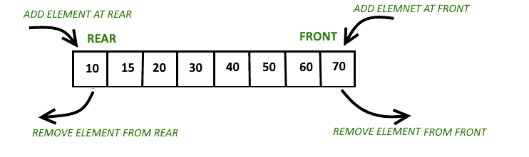
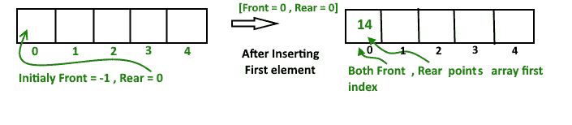
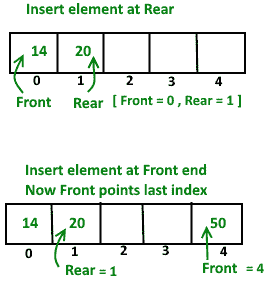
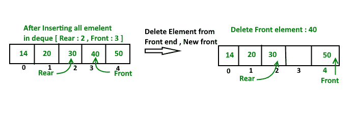

# 使用圆形阵列实现德格

> 原文:[https://www . geeksforgeeks . org/implementation-deque-use-circular-array/](https://www.geeksforgeeks.org/implementation-deque-using-circular-array/)

[去重或双端队列](https://www.geeksforgeeks.org/deque-set-1-introduction-applications/)是[队列数据结构](https://www.geeksforgeeks.org/queue-set-1introduction-and-array-implementation/)的一般化版本，允许在两端插入和删除。在前一篇文章中，我们已经讨论了德客的介绍。现在，在这篇文章中，我们看到了如何使用循环数组实现 deque。
**对得克的操作:**
主要对队列进行以下四个基本操作:
**【insertFront()】**:在得克前面增加一个项目。
**插入后置()**:在德格后面增加一项。
**删除前置()**:从德清前面删除一个项目。
**删除后方()**:从德清后方删除一个物品。
除以上操作外，还支持以下操作
**getFront()** :从队列中获取前置项。
**getRear()** :从队列中获取最后一个项目。
**isEmpty()** :检查德格是否为空。
**为 Full()** :检查德格是否已满。



**圆阵实现德清**
为了实现德清，我们需要跟踪前后两个指标。我们在 qedue 的后端或前端排队(推送)一个项目，并从后端和前端出列(弹出)一个项目。
**工作**
1。创建一个大小为“n”
的空数组“arr”，初始化 **front = -1** ， **rear = 0**
在 deque 中插入第一个元素，无论是在前还是在后，都会得到相同的结果。



在插入**前**点= 0 和**后**点= 0
**后，在后端**
插入元素

```
a). First we check deque if Full or Not 
b). IF Rear == Size-1 
       then reinitialize Rear = 0 ;
    Else increment Rear by '1'
    and push current key into Arr[ rear ] = key 
Front remain same.      
```

**在前端插入元素**

```
a). First we check deque if Full or Not
b). IF Front == 0 || initial position, move Front
                     to points last index of array
       front = size - 1
    Else decremented front by '1' and push 
         current key into Arr[ Front] = key 
Rear remain same. 
```



**从后端删除元素**

```
a). first Check deque is Empty or Not
b).  If deque has only one element
        front = -1 ; rear =-1 ;
    Else IF Rear points to the first index of array
         it's means we have to move rear to points 
         last index [ now first inserted element at 
         front end become rear end ]  
            rear = size-1 ;
    Else || decrease rear by '1'  
            rear = rear-1;
```

**从前端删除元素**

```
a). first Check deque is Empty or Not
b).  If deque has only one element
            front = -1 ; rear =-1 ;
    Else IF front points to the last index of the array
         it's means we have no more elements in array so 
          we move front to points first index of array
            front = 0 ;
    Else || increment Front by '1'  
            front = front+1;
```



以下是上述想法的实现。

## C++

```
// C++ implementation of De-queue using circular
// array
#include<iostream>
using namespace std;

// Maximum size of array or Dequeue
#define MAX 100

// A structure to represent a Deque
class Deque
{
    int  arr[MAX];
    int  front;
    int  rear;
    int  size;
public :
    Deque(int size)
    {
        front = -1;
        rear = 0;
        this->size = size;
    }

    // Operations on Deque:
    void  insertfront(int key);
    void  insertrear(int key);
    void  deletefront();
    void  deleterear();
    bool  isFull();
    bool  isEmpty();
    int  getFront();
    int  getRear();
};

// Checks whether Deque is full or not.
bool Deque::isFull()
{
    return ((front == 0 && rear == size-1)||
            front == rear+1);
}

// Checks whether Deque is empty or not.
bool Deque::isEmpty ()
{
    return (front == -1);
}

// Inserts an element at front
void Deque::insertfront(int key)
{
    // check whether Deque if  full or not
    if (isFull())
    {
        cout << "Overflow\n" << endl;
        return;
    }

    // If queue is initially empty
    if (front == -1)
    {
        front = 0;
        rear = 0;
    }

    // front is at first position of queue
    else if (front == 0)
        front = size - 1 ;

    else // decrement front end by '1'
        front = front-1;

    // insert current element into Deque
    arr[front] = key ;
}

// function to inset element at rear end
// of Deque.
void Deque ::insertrear(int key)
{
    if (isFull())
    {
        cout << " Overflow\n " << endl;
        return;
    }

    // If queue is initially empty
    if (front == -1)
    {
        front = 0;
        rear = 0;
    }

    // rear is at last position of queue
    else if (rear == size-1)
        rear = 0;

    // increment rear end by '1'
    else
        rear = rear+1;

    // insert current element into Deque
    arr[rear] = key ;
}

// Deletes element at front end of Deque
void Deque ::deletefront()
{
    // check whether Deque is empty or not
    if (isEmpty())
    {
        cout << "Queue Underflow\n" << endl;
        return ;
    }

    // Deque has only one element
    if (front == rear)
    {
        front = -1;
        rear = -1;
    }
    else
        // back to initial position
        if (front == size -1)
            front = 0;

        else // increment front by '1' to remove current
            // front value from Deque
            front = front+1;
}

// Delete element at rear end of Deque
void Deque::deleterear()
{
    if (isEmpty())
    {
        cout << " Underflow\n" << endl ;
        return ;
    }

    // Deque has only one element
    if (front == rear)
    {
        front = -1;
        rear = -1;
    }
    else if (rear == 0)
        rear = size-1;
    else
        rear = rear-1;
}

// Returns front element of Deque
int Deque::getFront()
{
    // check whether Deque is empty or not
    if (isEmpty())
    {
        cout << " Underflow\n" << endl;
        return -1 ;
    }
    return arr[front];
}

// function return rear element of Deque
int Deque::getRear()
{
    // check whether Deque is empty or not
    if(isEmpty() || rear < 0)
    {
        cout << " Underflow\n" << endl;
        return -1 ;
    }
    return arr[rear];
}

// Driver program to test above function
int main()
{
    Deque dq(5);
    cout << "Insert element at rear end  : 5 \n";
    dq.insertrear(5);

    cout << "insert element at rear end : 10 \n";
    dq.insertrear(10);

    cout << "get rear element " << " "
         << dq.getRear() << endl;

    dq.deleterear();
    cout << "After delete rear element new rear"
         << " become " << dq.getRear() << endl;

    cout << "inserting element at front end \n";
    dq.insertfront(15);

    cout << "get front element " << " "
         << dq.getFront() << endl;

    dq.deletefront();

    cout << "After delete front element new "
       << "front become " << dq.getFront() << endl;
    return 0;
}
```

## Java 语言(一种计算机语言，尤用于创建网站)

```
// Java implementation of De-queue using circular
// array

// A structure to represent a Deque
class Deque
{
    static final int MAX = 100;
    int  arr[];
    int  front;
    int  rear;
    int  size;

    public Deque(int size)
    {
        arr = new int[MAX];
        front = -1;
        rear = 0;
        this.size = size;
    }

    /*// Operations on Deque:
    void  insertfront(int key);
    void  insertrear(int key);
    void  deletefront();
    void  deleterear();
    bool  isFull();
    bool  isEmpty();
    int  getFront();
    int  getRear();*/

    // Checks whether Deque is full or not.
    boolean isFull()
    {
        return ((front == 0 && rear == size-1)||
            front == rear+1);
    }

    // Checks whether Deque is empty or not.
    boolean isEmpty ()
    {
        return (front == -1);
    }

    // Inserts an element at front
    void insertfront(int key)
    {
        // check whether Deque if  full or not
        if (isFull())
        {
            System.out.println("Overflow"); 
            return;
        }

        // If queue is initially empty
        if (front == -1)
        {
            front = 0;
            rear = 0;
        }

        // front is at first position of queue
        else if (front == 0)
            front = size - 1 ;

        else // decrement front end by '1'
            front = front-1;

        // insert current element into Deque
        arr[front] = key ;
    }

    // function to inset element at rear end
    // of Deque.
    void insertrear(int key)
    {
        if (isFull())
        {
            System.out.println(" Overflow ");
            return;
        }

        // If queue is initially empty
        if (front == -1)
        {
            front = 0;
            rear = 0;
        }

        // rear is at last position of queue
        else if (rear == size-1)
            rear = 0;

        // increment rear end by '1'
        else
            rear = rear+1;

        // insert current element into Deque
        arr[rear] = key ;
    }

    // Deletes element at front end of Deque
    void deletefront()
    {
        // check whether Deque is empty or not
        if (isEmpty())
        {
            System.out.println("Queue Underflow\n");
            return ;
        }

        // Deque has only one element
        if (front == rear)
        {
            front = -1;
            rear = -1;
        }
        else
            // back to initial position
            if (front == size -1)
                front = 0;

            else // increment front by '1' to remove current
                // front value from Deque
                front = front+1;
    }

    // Delete element at rear end of Deque
    void deleterear()
    {
        if (isEmpty())
        {
            System.out.println(" Underflow");
            return ;
        }

        // Deque has only one element
        if (front == rear)
        {
            front = -1;
            rear = -1;
        }
        else if (rear == 0)
            rear = size-1;
        else
            rear = rear-1;
    }

    // Returns front element of Deque
    int getFront()
    {
        // check whether Deque is empty or not
        if (isEmpty())
        {
            System.out.println(" Underflow");
            return -1 ;
        }
        return arr[front];
    }

    // function return rear element of Deque
    int getRear()
    {
        // check whether Deque is empty or not
        if(isEmpty() || rear < 0)
        {
            System.out.println(" Underflow\n");
            return -1 ;
        }
        return arr[rear];
    }

    // Driver program to test above function
    public static void main(String[] args)
    {

         Deque dq = new Deque(5);

         System.out.println("Insert element at rear end  : 5 ");
         dq.insertrear(5);

         System.out.println("insert element at rear end : 10 ");
         dq.insertrear(10);

         System.out.println("get rear element : "+ dq.getRear());

         dq.deleterear();
         System.out.println("After delete rear element new rear become : " + 
                                dq.getRear());

         System.out.println("inserting element at front end");
         dq.insertfront(15);

         System.out.println("get front element: " +dq.getFront());

         dq.deletefront();

         System.out.println("After delete front element new front become : " +
                                    +  dq.getFront());

    }
}
```

## 蟒蛇 3

```
# Python implementation of De-queue using circular
# array

# A structure to represent a Deque
MAX = 100;

class Deque:
    def __init__(self, size):
        self.arr = [0] * MAX
        self.front = -1;
        self.rear = 0;
        self.size = size;

    ''' Operations on Deque:
    void  insertfront(int key);
    void  insertrear(int key);
    void  deletefront();
    void  deleterear();
    bool  isFull();
    bool  isEmpty();
    int  getFront();
    int  getRear(); '''

    # Checks whether Deque is full or not.
    def isFull(self):
        return ((self.front == 0 and self.rear == self.size-1) or self.front == self.rear + 1)

    # Checks whether Deque is empty or not.
    def isEmpty (self):
        return (self.front == -1);

    # Inserts an element at front
    def insertfront(self, key):

        # check whether Deque if  full or not
        if (self.isFull()):
            print("Overflow");
            return;

        # If queue is initially empty
        if (self.front == -1):
            self.front = 0;
            self.rear = 0;

        # front is at first position of queue
        elif (self.front == 0):
            self.front = self.size - 1 ;

        else: # decrement front end by '1'
            self.front = self.front-1;

        # insert current element into Deque
        self.arr[self.front] = key ;

    # function to inset element at rear end
    # of Deque.
    def insertrear(self, key):
        if (self.isFull()):
            print(" Overflow");
            return;

        # If queue is initially empty
        if (self.front == -1):
            self.front = 0;
            self.rear = 0;

        # rear is at last position of queue
        elif (self.rear == self.size-1):
            self.rear = 0;

        # increment rear end by '1'
        else:
            self.rear = self.rear+1;

        # insert current element into Deque
        self.arr[self.rear] = key ;

    # Deletes element at front end of Deque
    def deletefront(self):
        # check whether Deque is empty or not
        if (self.isEmpty()):
            print("Queue Underflow");
            return ;

        # Deque has only one element
        if (self.front == self.rear):
            self.front = -1;
            self.rear = -1;

        else:
            # back to initial position
            if (self.front == self.size -1):
                self.front = 0;

            else: # increment front by '1' to remove current
                # front value from Deque
                self.front = self.front+1;

    # Delete element at rear end of Deque
    def deleterear(self):
        if (self.isEmpty()):
            print(" Underflow");
            return ;

        # Deque has only one element
        if (self.front == self.rear):
            self.front = -1;
            self.rear = -1;

        elif (self.rear == 0):
            self.rear = self.size-1;
        else:
            self.rear = self.rear-1;

    # Returns front element of Deque
    def getFront(self):
        # check whether Deque is empty or not
        if (self.isEmpty()):
            print(" Underflow");
            return -1 ;

        return self.arr[self.front];

    # function return rear element of Deque
    def getRear(self):
        # check whether Deque is empty or not
        if(self.isEmpty() or self.rear < 0):
            print(" Underflow");
            return -1 ;

        return self.arr[self.rear];

# Driver program to test above function
dq = Deque(5);

print("Insert element at rear end  : 5 ");
dq.insertrear(5);

print("insert element at rear end : 10 ");
dq.insertrear(10);

print(f"get rear element : {dq.getRear()}");

dq.deleterear();
print(f"After delete rear element new rear become : {dq.getRear()}");

print("inserting element at front end");
dq.insertfront(15);

print(f"get front element: {dq.getFront()}");

dq.deletefront();

print(f"After delete front element new front become : {dq.getFront()}");

# This code is contributed by _saurabh_jaiswal
```

## C#

```
// C# implementation of De-queue using circular
// array
using System;

// A structure to represent a Deque
public class Deque
{
    static readonly int MAX = 100;
    int  []arr;
    int  front;
    int  rear;
    int  size;

    public Deque(int size)
    {
        arr = new int[MAX];
        front = -1;
        rear = 0;
        this.size = size;
    }

    /*// Operations on Deque:
    void  insertfront(int key);
    void  insertrear(int key);
    void  deletefront();
    void  deleterear();
    bool  isFull();
    bool .Count!=0;
    int  getFront();
    int  getRear();*/

    // Checks whether Deque is full or not.
    bool isFull()
    {
        return ((front == 0 && rear == size - 1)||
            front == rear + 1);
    }

    // Checks whether Deque is empty or not.
    bool isEmpty ()
    {
        return (front == -1);
    }

    // Inserts an element at front
    void insertfront(int key)
    {

        // check whether Deque if  full or not
        if (isFull())
        {
            Console.WriteLine("Overflow"); 
            return;
        }

        // If queue is initially empty
        if (front == -1)
        {
            front = 0;
            rear = 0;
        }

        // front is at first position of queue
        else if (front == 0)
            front = size - 1 ;

        else // decrement front end by '1'
            front = front - 1;

        // insert current element into Deque
        arr[front] = key ;
    }

    // function to inset element at rear end
    // of Deque.
    void insertrear(int key)
    {
        if (isFull())
        {
            Console.WriteLine(" Overflow ");
            return;
        }

        // If queue is initially empty
        if (front == -1)
        {
            front = 0;
            rear = 0;
        }

        // rear is at last position of queue
        else if (rear == size - 1)
            rear = 0;

        // increment rear end by '1'
        else
            rear = rear+1;

        // insert current element into Deque
        arr[rear] = key ;
    }

    // Deletes element at front end of Deque
    void deletefront()
    {

        // check whether Deque is empty or not
        if (isEmpty())
        {
            Console.WriteLine("Queue Underflow\n");
            return ;
        }

        // Deque has only one element
        if (front == rear)
        {
            front = -1;
            rear = -1;
        }
        else
            // back to initial position
            if (front == size - 1)
                front = 0;

            else // increment front by '1' to remove current
                // front value from Deque
                front = front + 1;
    }

    // Delete element at rear end of Deque
    void deleterear()
    {
        if (isEmpty())
        {
            Console.WriteLine(" Underflow");
            return ;
        }

        // Deque has only one element
        if (front == rear)
        {
            front = -1;
            rear = -1;
        }
        else if (rear == 0)
            rear = size - 1;
        else
            rear = rear - 1;
    }

    // Returns front element of Deque
    int getFront()
    {
        // check whether Deque is empty or not
       if (isEmpty())
        {
            Console.WriteLine(" Underflow");
            return -1 ;
        }
        return arr[front];
    }

    // function return rear element of Deque
    int getRear()
    {

        // check whether Deque is empty or not
       if (isEmpty() || rear < 0)
        {
            Console.WriteLine(" Underflow\n");
            return -1 ;
        }
        return arr[rear];
    }

    // Driver code
    public static void Main(String[] args)
    {

         Deque dq = new Deque(5);       
         Console.WriteLine("Insert element at rear end  : 5 ");
         dq.insertrear(5);        
         Console.WriteLine("insert element at rear end : 10 ");
         dq.insertrear(10);       
         Console.WriteLine("get rear element : "+ dq.getRear());       
         dq.deleterear();
         Console.WriteLine("After delete rear element new rear become : " + 
                                dq.getRear());        
         Console.WriteLine("inserting element at front end");
         dq.insertfront(15);     
         Console.WriteLine("get front element: " +dq.getFront());      
         dq.deletefront();     
         Console.WriteLine("After delete front element new front become : " +
                                    +  dq.getFront());
    }
}

// This code is contributed by aashish1995 
```

## java 描述语言

```
<script>
// Javascript implementation of De-queue using circular
// array

// A structure to represent a Deque
let MAX = 100;
class Deque
{
    constructor(size)
    {
        this.arr = new Array(MAX);
        this.front = -1;
        this.rear = 0;
        this.size = size;
    }

    /*// Operations on Deque:
    void  insertfront(int key);
    void  insertrear(int key);
    void  deletefront();
    void  deleterear();
    bool  isFull();
    bool  isEmpty();
    int  getFront();
    int  getRear();*/

    // Checks whether Deque is full or not.
    isFull()
    {
        return ((this.front == 0 && this.rear == this.size-1)||
            this.front == this.rear+1);
    }

    // Checks whether Deque is empty or not.
    isEmpty ()
    {
        return (this.front == -1);
    }

    // Inserts an element at front
    insertfront(key)
    {
        // check whether Deque if  full or not
        if (this.isFull())
        {
            document.write("Overflow<br>");
            return;
        }

        // If queue is initially empty
        if (this.front == -1)
        {
            this.front = 0;
            this.rear = 0;
        }

        // front is at first position of queue
        else if (this.front == 0)
            this.front = this.size - 1 ;

        else // decrement front end by '1'
            this.front = this.front-1;

        // insert current element into Deque
        this.arr[this.front] = key ;
    }

    // function to inset element at rear end
    // of Deque.
    insertrear(key)
    {
        if (this.isFull())
        {
            document.write(" Overflow <br>");
            return;
        }

        // If queue is initially empty
        if (this.front == -1)
        {
            this.front = 0;
            this.rear = 0;
        }

        // rear is at last position of queue
        else if (this.rear == this.size-1)
            this.rear = 0;

        // increment rear end by '1'
        else
            this.rear = this.rear+1;

        // insert current element into Deque
        this.arr[this.rear] = key ;
    }

    // Deletes element at front end of Deque
    deletefront()
    {
        // check whether Deque is empty or not
        if (this.isEmpty())
        {
            document.write("Queue Underflow<br>");
            return ;
        }

        // Deque has only one element
        if (this.front == this.rear)
        {
            this.front = -1;
            this.rear = -1;
        }
        else
            // back to initial position
            if (this.front == this.size -1)
                this.front = 0;

            else // increment front by '1' to remove current
                // front value from Deque
                this.front = this.front+1;
    }

    // Delete element at rear end of Deque
    deleterear()
    {
        if (this.isEmpty())
        {
            document.write(" Underflow<br>");
            return ;
        }

        // Deque has only one element
        if (this.front == this.rear)
        {
            this.front = -1;
            this.rear = -1;
        }
        else if (this.rear == 0)
            this.rear = this.size-1;
        else
            this.rear = this.rear-1;
    }

    // Returns front element of Deque
    getFront()
    {
        // check whether Deque is empty or not
        if (this.isEmpty())
        {
            document.write(" Underflow<br>");
            return -1 ;
        }
        return this.arr[this.front];
    }

    // function return rear element of Deque
    getRear()
    {
        // check whether Deque is empty or not
        if(this.isEmpty() || this.rear < 0)
        {
            document.write(" Underflow<br>");
            return -1 ;
        }
        return this.arr[this.rear];
    }

}

// Driver program to test above function
let dq = new Deque(5);

document.write("Insert element at rear end  : 5 <br>");
dq.insertrear(5);

document.write("insert element at rear end : 10 <br>");
dq.insertrear(10);

document.write("get rear element : "+ dq.getRear()+"<br>");

dq.deleterear();
document.write("After delete rear element new rear become : " +
                   dq.getRear()+"<br>");

document.write("inserting element at front end<br>");
dq.insertfront(15);

document.write("get front element: " +dq.getFront()+"<br>");

dq.deletefront();

document.write("After delete front element new front become : " +
                   +  dq.getFront()+"<br>");

// This code is contributed by avanitrachhadiya2155
</script>
```

输出:

```
insert element at rear end  : 5
insert element at rear end : 10
get rear element : 10
After delete rear element new rear become : 5
inserting element at front end
get front element : 15
After delete front element new front become : 5
```

时间复杂度:像 insertfront()、insertlast()、deletefront()、deletelast()等所有操作的时间复杂度都是 O(1)。
在 mext 帖子中，我们将讨论使用双链表的 deque 实现。
本文由 [**尼尚辛格**](https://practice.geeksforgeeks.org/user-profile.php?user=_code) 供稿。如果你喜欢 GeeksforGeeks 并想投稿，你也可以使用[write.geeksforgeeks.org](https://write.geeksforgeeks.org)写一篇文章或者把你的文章邮寄到 review-team@geeksforgeeks.org。看到你的文章出现在极客博客主页上，帮助其他极客。
如果发现有不正确的地方，或者想分享更多关于上述话题的信息，请写评论。