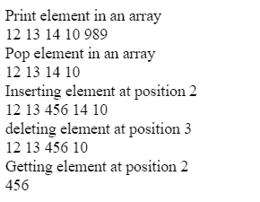

# JavaScript 中数组类的实现

> 原文:[https://www . geesforgeks . org/JavaScript 中数组类的实现/](https://www.geeksforgeeks.org/implementation-of-array-class-in-javascript/)

本文使用 JavaScript 实现数组。[数组](https://www.geeksforgeeks.org/array-data-structure/)是一种简单的数据结构，其中元素存储在连续的存储位置。数组的实现执行各种操作，如推送(添加元素)、弹出(删除元素)数组末尾的元素、从特定索引中获取元素、从特定索引中插入和删除元素。

**JavaScript 中的数组类:**

```
// User defined class Array
class Array {

    // Create constructor
    constructor() {  

        // It store the length of array.
        this.length = 0; 

        // Object to store elements.
        this.data = {}; 
    }
}
```

在上例中，创建一个类**数组**，它包含两个属性，即*长度*和*数据*，其中*长度*将存储数组的长度，而*数据*是一个用于存储元素的对象。

**数组中的函数:**数组中有很多函数，如下所示:

*   推送()
*   Pop()
*   insertAt（）
*   deleteAt()
*   getelemontatindex_)

**推送(元素):**该功能用于推送数组末尾的一个元素。

```
push(element) {
    this.data[this.length] = element;
    this.length++;
    return this.data;
}
```

**Pop():** 用于删除数组末尾的一个元素。

```
pop() {
    let item = this.data[this.length-1];
    delete this.data[this.length-1];
    this.length--;
    return this.data;
}
```

在上例中，*项*变量将存储来自*数据*对象的最后一个元素，并执行最后一个元素的删除，然后，它将长度减少 1 并返回该对象。

**insertAt():** 这个函数用于在给定的索引处插入一个元素。

```
insertAt(item, index) {
    for(let i=this.length;i>=index;i--) {
      this.data[i]=this.data[i-1];
    }
    this.data[index]=item;
    this.length++; 
    return this.data;
}
```

这个函数接受两个参数项和索引。索引号表示要插入数据的位置，项是要在索引处插入的值。

**deleteAt(index):** 该函数用于删除数据对象中给定索引或属性处的元素。

```
deleteAt(index) {
    for(let i = index; i < this.length - 1; i++) {
      this.data[i] = this.data[i+1];
    }
    delete this.data[this.length-1];
    this.length--;
    return this.data;
}
```

在上述功能中，使用循环到达索引处直至结束，并在*索引处*复制下一个元素，循环结束时存在最后一个元素的两个副本，通过**删除**操作符删除最后一个元素。

**getElementAtIndex(索引):**它返回给定索引处的元素。

```
getElementAtIndex(index) {
    return this.data[index];
}
```

**示例:**该函数描述数组类的实现及其各种操作。

```
<!DOCTYPE html>
<html>

<head>
    <title>
        Implementation of array
    </title>
</head>

<body>
    <script>
        class Array{
      constructor(){
        this.length=0;
        this.data={};
      }
      getElementAtIndex(index){
        return this.data[index];
      }
      push(element){
        this.data[this.length]=element;
        this.length++;
        return this.length;
      }
      pop(){
        const item= this.data[this.length-1];
        delete this.data[this.length-1];
        this.length--;
        return this.data;
      }
      deleteAt(index){
        for(let i=index; i<this.length-1;i++){
          this.data[i]=this.data[i+1];
        }
        delete this.data[this.length-1];
        this.length--;
        return this.data;
      }
      insertAt(item, index){
        for(let i=this.length;i>=index;i--){
          this.data[i]=this.data[i-1];
        }
        this.data[index]=item;
        this.length++;
        return this.data;
      }
    }
    const array= new Array(); //we are instantiating an object of Array class
    array.push(12);
    array.push(13); //pushing element 
    array.push(14);
    array.push(10);
    array.push(989);
    document.write("<div>Print element in an array</div>");
    for(var key in array.data){
      document.write("<span>"+array.data[key]+" "+"</span>"); 
    }

    document.write("<div>Pop element in an array</div>");
    array.pop(); //Popping element 989
    for(var key in array.data){
      document.write("<span>"+array.data[key]+" "+"</span>"); 
    }

    document.write("<div>Inserting element at position 2</div>");
    array.insertAt(456, 2); //Inserting element 456
    for(var key in array.data){
      document.write("<span>"+array.data[key]+" "+"</span>"); 
    }

    document.write("<div>deleting element at position 3</div>");
    array.deleteAt(3); //Deleting 14
    for(var key in array.data){
      document.write("<span>"+array.data[key]+" "+"</span>"); 
    }

    document.write("<div>Getting  element at position 2</div>");
    document.write("<div>"+array.getElementAtIndex(2)+"</div>");
    </script>
</body>
</html>                    
```

**输出:**
