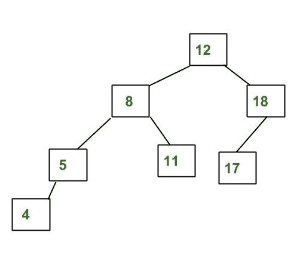
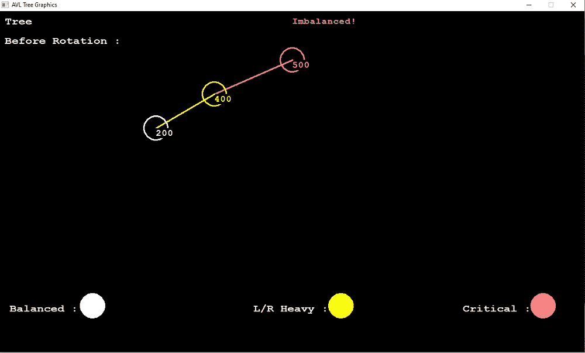
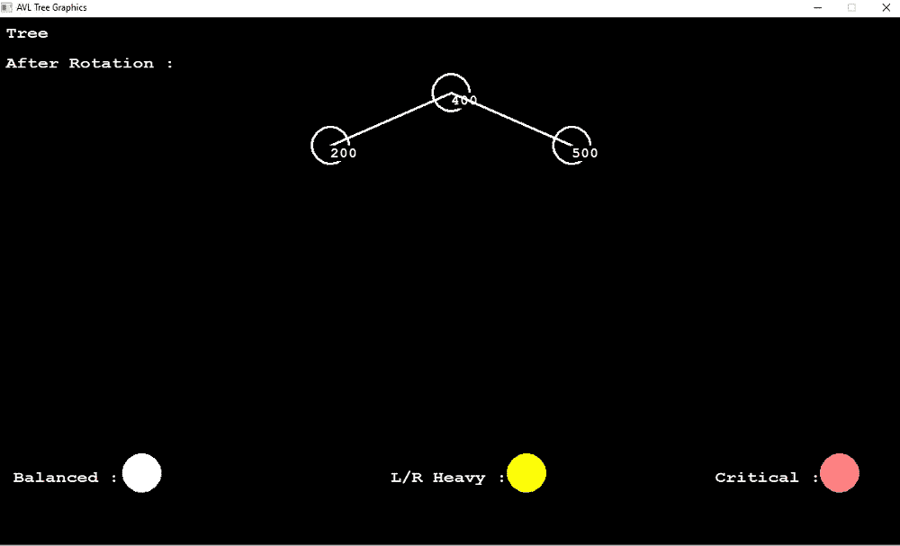
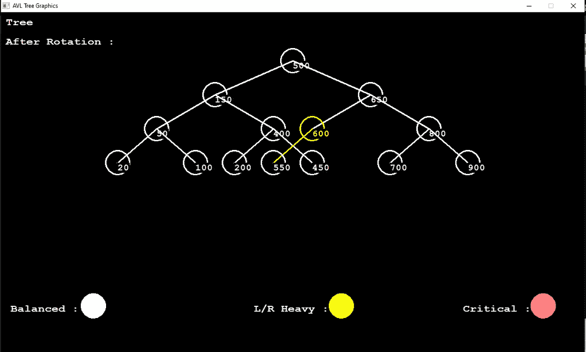

# 用 C++中的图形实现 AVL 树

> 原文:[https://www . geesforgeks . org/implementation-of-AVL-tree-using-graphics-in-CPP/](https://www.geeksforgeeks.org/implementation-of-avl-tree-using-graphics-in-cpp/)

[AVL 树](https://www.geeksforgeeks.org/avl-tree-set-1-insertion/)是自平衡[二分搜索法树](https://www.geeksforgeeks.org/binary-search-tree-data-structure/)，其中左右子树的高度差对于所有节点不能大于 1。以下是自动车辆定位树的示例:

[](https://media.geeksforgeeks.org/wp-content/cdn-uploads/AVL-Tree1.jpg)

在本文中，我们将使用 c++中的[图形来实现 **AVL 树**的概念。作为先决条件，必须设置图形。他们的编辑。使用此链接在代码块](https://www.geeksforgeeks.org/basic-graphic-programming-in-c/)中安装 [graphics.h。](https://www.youtube.com/watch?v=VEkAj-xVTKQ)

以下是本文将介绍的功能:

*   动态插入
*   显示树形结构(输出窗口和图形显示中的 2D 打印)
*   AVL 旋转
*   顺序、前序和后序遍历。
*   代码只接受整数值，因此包含当用户输入无效值时抛出错误消息的函数。

**示例:**

> **输入:** 500、400、200、150、100、700、650、600、900、450、550、50、20、800
> **输出:**
> 
>                                           900
> 
> eight hundred
> 
>                                           700
> 
>                       650
> 
>                                 600
> 
>                                           550
> 
> 根-> 500
> 
>                                           450
> 
> four hundred
> 
>                                           200
> 
>                       150
> 
>                                           100
> 
>                                 50
> 
>                                           20
> 
> **订单号:**500 200 100 50 20 150 400 450 650 600 550 800 700 900
> T3】订单号:20 50 100 150 200 400 450 500 550 600 650 700 800 900
> T620 100 50 200 450 450

下面是图形中使用 AVL 旋转的[自平衡 BST](https://www.geeksforgeeks.org/self-balancing-binary-search-trees-comparisons/) 的实现和执行:

## C++

```
// C++ program for the implementation
// and execution of a self-balancing
// BST using rotations and graphics

#include <algorithm>
#include <bits/stdc++.h>
#include <cstdio>
#include <graphics.h>
#include <iostream>
#include <sstream>
#include <string>
using namespace std;

#define pow2(n) (1 << (n))
const int x = 600;
const int y = 100;

// Node Declaration
struct avl_node {
    int data;
    int height;
    struct avl_node* left;
    struct avl_node* right;

} * root, *temp1;

// Class Declaration
class avlTree {
public:
    int height(avl_node*);
    int diff(avl_node*);
    avl_node* rr_rotation(avl_node*);
    avl_node* ll_rotation(avl_node*);
    avl_node* lr_rotation(avl_node*);
    avl_node* rl_rotation(avl_node*);
    avl_node* balance(avl_node*);
    avl_node* balanceTree(avl_node*);
    avl_node* insert(avl_node*, int);
    void display(avl_node*, int);
    void drawNode(avl_node*, int, int, int);
    void drawTree(avl_node*, int, int);
    void inorder(avl_node*);
    void preorder(avl_node*);
    void postorder(avl_node*);
    int validate(string s);
    bool checkInput(string s);
    avlTree()
    {
        root = NULL;
        temp1 = NULL;
    }
};

// Driver Code
int main()
{
    int choice, item, bf;
    int c;
    string str;
    avlTree avl;

    // Graphics
    int gd = DETECT;
    int gm;
    initwindow(1200, 700, "AVL Tree Graphics",
               0, 0, false, true);

    cout << "\n---------------------"
         << endl;
    cout << "AVL Tree Implementation"
         << endl;
    cout << "\n---------------------"
         << endl;
    cout << "1.Insert Element into the tree"
         << endl;
    cout << "3.Balance Tree"
         << endl;
    cout << "4.PreOrder traversal"
         << endl;
    cout << "5.InOrder traversal"
         << endl;
    cout << "6.PostOrder traversal"
         << endl;
    cout << "7.Exit" << endl;

    while (1) {
        cout << "\nEnter your Choice: ";
        cin >> choice;
        switch (choice) {
        case 1:

            // Accept input as string
            cout << "Enter the value "
                 << "to be inserted: ";
            cin >> str;

            // Function call to check
            // if input is valid or not
            c = avl.validate(str);

            if (c == 100) {
                item = std::stoi(
                    str);
                root = avl.insert(root, item);
                cleardevice();
                settextstyle(10, HORIZ_DIR, 3);
                if (root == NULL) {
                    cout << "Tree is Empty"
                         << endl;
                    outtextxy(400, 10,
                              "Tree is Empty");
                }

                outtextxy(10, 50,
                          "Before Rotation : ");
                avl.drawTree(root, x, y);
            }
            else
                cout << "\n\t\tInvalid Input!"
                     << endl;

            break;
        case 2:

            // Tree structure in
            // the graphics window
            if (root == NULL) {
                cout << "Tree is Empty"
                     << endl;
            }
            avl.display(root, 1);
            cleardevice();
            avl.drawTree(root, x, y);

            break;
        case 3:

            // Balance Tree
            root = avl.balanceTree(root);

            cleardevice();
            settextstyle(
                10, HORIZ_DIR, 3);
            outtextxy(10, 50,
                      "After Rotation : ");
            avl.drawTree(root, x, y);

            break;
        case 4:
            cout << "Preorder Traversal : ";
            avl.preorder(root);
            cout << endl;
            break;
        case 5:
            cout << "Inorder Traversal:"
                 << endl;
            avl.inorder(root);
            cout << endl;
            break;
        case 6:
            cout << "Postorder Traversal:"
                 << endl;
            avl.postorder(root);
            cout << endl;
            break;
        case 7:
            exit(1);
            break;
        default:
            cout << "Wrong Choice"
                 << endl;
        }
    }
    getch();
    closegraph();
    return 0;
}

// Function to find the height
// of the AVL Tree
int avlTree::height(avl_node* temp)
{
    int h = 0;
    if (temp != NULL) {
        int l_height = height(temp->left);
        int r_height = height(temp->right);
        int max_height = max(l_height, r_height);
        h = max_height + 1;
    }
    return h;
}

// Function to find the difference
// between the left and the right
// height of any node of the tree
int avlTree::diff(avl_node* temp)
{
    int l_height = height(temp->left);
    int r_height = height(temp->right);
    int b_factor = l_height - r_height;

    return b_factor;
}

// Function to perform the Right
// Right Rotation
avl_node* avlTree::rr_rotation(
    avl_node* parent)
{
    avl_node* temp;
    temp = parent->right;
    parent->right = temp->left;

    temp->left = parent;

    return temp;
}

// Function to perform the Left
// Left Rotation
avl_node* avlTree::ll_rotation(
    avl_node* parent)
{

    avl_node* temp;
    temp = parent->left;
    parent->left = temp->right;
    temp->right = parent;

    return temp;
}

// Function to perform the Left
// Right Rotation
avl_node* avlTree::lr_rotation(
    avl_node* parent)
{
    avl_node* temp;
    temp = parent->left;
    parent->left = rr_rotation(temp);
    return ll_rotation(parent);
}

// Function to perform the Right
// Left Rotation
avl_node* avlTree::rl_rotation(
    avl_node* parent)
{
    avl_node* temp;
    temp = parent->right;
    parent->right = ll_rotation(temp);
    return rr_rotation(parent);
}

// Function to balance the tree
avl_node* avlTree::balance(avl_node* temp)
{
    int bal_factor = diff(temp);

    if (bal_factor > 1) {
        if (diff(temp->left) > 0) {

            temp = ll_rotation(temp);
        }

        else {
            temp = lr_rotation(temp);
        }
    }
    else if (bal_factor < -1) {
        if (diff(temp->right) > 0) {
            temp = rl_rotation(temp);
        }

        else

        {
            temp = rr_rotation(temp);
        }
    }

    return temp;
}

// Function to display the AVL Tree
void avlTree::display(avl_node* ptr, int level)
{
    int i;
    if (ptr != NULL) {
        display(ptr->right, level + 1);
        printf("\n");
        if (ptr == root)
            cout << "Root -> ";
        for (i = 0; i < level && ptr != root; i++) {

            cout << "        ";
        }
        int j;

        cout << ptr->data;
        display(ptr->left, level + 1);
    }
}

// Function to balance the tree
avl_node* avlTree::balanceTree(avl_node* root)
{
    int choice;
    if (root == NULL) {
        return NULL;
    }

    root->left = balanceTree(root->left);

    root->right = balanceTree(root->right);

    root = balance(root);
    return root;
}

// Function to create the node
// int the AVL tree
void avlTree::drawNode(avl_node* root,
                       int x, int y,
                       int noderatio)
{
    int bf = diff(root);
    if (bf > 1 || bf < -1) {
        setcolor(12);
        outtextxy(600, 10, "Imbalanced!");
        circle(x, y, 25);
        setfillstyle(SOLID_FILL, 12);
    }
    else if (bf == 1 || bf == -1) {
        setcolor(14);
        circle(x, y, 25);
        setfillstyle(SOLID_FILL, 14);
        floodfill(x, y, YELLOW);
    }
    else {
        setcolor(15);
        circle(x, y, 25);
        setfillstyle(SOLID_FILL, 15);
        floodfill(x, y, WHITE);
    }

    char arr[5];
    itoa(root->data, arr, 10);
    outtextxy(x, y, arr);

    if (root->left != NULL) {
        line(x, y, x - 20 * noderatio, y + 70);
        drawNode(root->left, x - 20 * noderatio, y + 70,
                 noderatio - 2);
    }
    if (root->right != NULL) {
        line(x, y, x + 20 * noderatio, y + 70);
        drawNode(root->right, x + 20 * noderatio, y + 70,
                 noderatio - 2);
    }
}

// Function to draw the AVL tree
void avlTree::drawTree(avl_node* root, int x, int y)
{
    settextstyle(10, HORIZ_DIR, 3);
    outtextxy(10, 10, "Tree");
    outtextxy(20, 600, "Balanced : ");
    circle(190, 605, 10);

    // Floodfill(190, 605, WHITE);
    outtextxy(520, 600, "L/R Heavy : ");
    setcolor(14);
    circle(700, 605, 10);

    // Floodfill(700, 605, YELLOW);
    setcolor(15);
    outtextxy(950, 600, "Critical : ");
    setcolor(12);
    circle(1115, 605, 10);

    // Floodfill(1115, 605, RED);

    settextstyle(10, HORIZ_DIR, 2);
    drawNode(root, x, y, 8);
}

// Function to insert element
// in the tree
avl_node* avlTree::insert(
    avl_node* root, int value)
{

    if (root == NULL) {
        root = new avl_node;
        root->data = value;
        root->left = NULL;
        root->right = NULL;

        return root;
    }

    if (value < root->data) {
        root->left = insert(
            root->left, value);
    }

    else if (value > root->data) {
        root->right = insert(
            root->right, value);
    }
    else
        cout << "\n\tValue already"
             << " exists!" << endl;

    return root;
}

// Function to perform the Inorder
// Traversal of AVL Tree
void avlTree::inorder(avl_node* root)
{
    if (root == NULL)
        return;
    inorder(root->left);
    cout << root->data << "  ";

    inorder(root->right);
}

// Function to perform the Preorder
// Traversal of AVL Tree
void avlTree::preorder(avl_node* root)
{
    if (root == NULL)
        return;

    cout << root->data << "  ";
    preorder(root->left);
    preorder(root->right);
}

// Function to perform the Postorder
// Traversal of AVL Tree
void avlTree::postorder(avl_node* root)
{
    if (root == NULL)
        return;
    postorder(root->left);
    postorder(root->right);
    cout << root->data << "  ";
}

// Function to check the input
// validation
bool avlTree::checkInput(string str)
{
    for (int i = 0; i < str.length(); i++)
        if (isdigit(str[i]) == false)
            return false;
    return true;
}

// Function to validate AVL Tree
int avlTree::validate(string str)
{
    if (checkInput(str))
        return 100;
    else
        return 10;
}
```

**输出:**

[](https://media.geeksforgeeks.org/wp-content/uploads/20210711132130/bf.jpg)

不平衡树–旋转前

[](https://media.geeksforgeeks.org/wp-content/uploads/20210711132129/af.jpg)

平衡树–旋转后

[](https://media.geeksforgeeks.org/wp-content/uploads/20210711132128/finaltree.jpg)

最终树