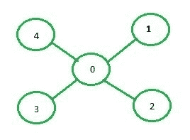

# 利用邻接矩阵实现 DFS

> 原文:[https://www . geeksforgeeks . org/implementation-of-DFS-use-邻接矩阵/](https://www.geeksforgeeks.org/implementation-of-dfs-using-adjacency-matrix/)

深度优先搜索(DFS)在[这篇](https://www.geeksforgeeks.org/depth-first-search-or-dfs-for-a-graph/)文章中已经讨论过了，它使用邻接表来表示图形。在本文中，邻接矩阵将用于表示该图。
**邻接矩阵表示:**在图的邻接矩阵表示中，大小为 n*n(其中 n 为顶点数)的矩阵**mat【】【】**将表示图的边，其中 **mat[i][j] = 1** 表示顶点 **i** 和 **j** 之间有边，而 **mat[i][i] = 0** 表示顶点**之间没有边** 



下图是上图所示图形的邻接矩阵表示:

```
   0 1 2 3 4
0  0 1 1 1 1
1  1 0 0 0 0
2  1 0 0 0 0
3  1 0 0 0 0
4  1 0 0 0 0
```

**例:**

```
Input: source = 0
```


```
Output: 0 1 3 2

Input: source = 0
```


```
Output: 0 1 2 3 4
```

**进场:**

*   创建一个大小为 n*n 的矩阵，其中每个元素都是 0，表示图中没有边。
*   现在，对于顶点 I 和 j 之间的图的每条边，集合 mat[i][j] = 1。
*   创建并填充邻接矩阵后，调用源的递归函数，即顶点 0，它将递归调用与其相邻的所有顶点的相同函数。
*   此外，保持一个数组来跟踪被访问的顶点，即被访问的[i] = true 表示顶点 I 以前被访问过，并且不需要调用某些已经被访问的节点的 DFS 函数。

以下是上述方法的实现:

## C++

```
// C++ implementation of the approach
#include <bits/stdc++.h>
using namespace std;

// adjacency matrix
vector<vector<int> > adj;

// function to add edge to the graph
void addEdge(int x, int y)
{
    adj[x][y] = 1;
    adj[y][x] = 1;
}

// function to perform DFS on the graph
void dfs(int start, vector<bool>& visited)
{

    // Print the current node
    cout << start << " ";

    // Set current node as visited
    visited[start] = true;

    // For every node of the graph
    for (int i = 0; i < adj[start].size(); i++) {

        // If some node is adjacent to the current node
        // and it has not already been visited
        if (adj[start][i] == 1 && (!visited[i])) {
            dfs(i, visited);
        }
    }
}

int main()
{
    // number of vertices
    int v = 5;

    // number of edges
    int e = 4;

    // adjacency matrix
    adj = vector<vector<int> >(v, vector<int>(v, 0));

    addEdge(0, 1);
    addEdge(0, 2);
    addEdge(0, 3);
    addEdge(0, 4);

    // Visited vector to so that
    // a vertex is not visited more than once
    // Initializing the vector to false as no
    // vertex is visited at the beginning
    vector<bool> visited(v, false);

    // Perform DFS
    dfs(0, visited);
}
```

## 蟒蛇 3

```
# Python3 implementation of the approach
class Graph:

    adj = []

    # Function to fill empty adjacency matrix
    def __init__(self, v, e):

        self.v = v
        self.e = e
        Graph.adj = [[0 for i in range(v)]
                        for j in range(v)]

    # Function to add an edge to the graph
    def addEdge(self, start, e):

        # Considering a bidirectional edge
        Graph.adj[start][e] = 1
        Graph.adj[e][start] = 1

    # Function to perform DFS on the graph
    def DFS(self, start, visited):

        # Print current node
        print(start, end = ' ')

        # Set current node as visited
        visited[start] = True

        # For every node of the graph
        for i in range(self.v):

            # If some node is adjacent to the
            # current node and it has not
            # already been visited
            if (Graph.adj[start][i] == 1 and
                    (not visited[i])):
                self.DFS(i, visited)

# Driver code
v, e = 5, 4

# Create the graph
G = Graph(v, e)
G.addEdge(0, 1)
G.addEdge(0, 2)
G.addEdge(0, 3)
G.addEdge(0, 4)

# Visited vector to so that a vertex
# is not visited more than once
# Initializing the vector to false as no
# vertex is visited at the beginning
visited = [False] * v

# Perform DFS
G.DFS(0, visited);

# This code is contributed by ng24_7
```

**Output:** 

```
0 1 2 3 4
```