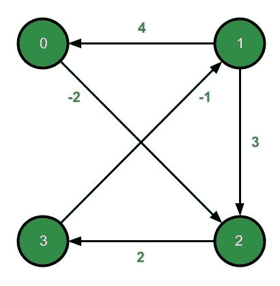

# 约翰逊全对最短路径算法的实现

> 原文:[https://www . geeksforgeeks . org/实现所有对的约翰逊算法最短路径/](https://www.geeksforgeeks.org/implementation-of-johnsons-algorithm-for-all-pairs-shortest-paths/)

[约翰逊算法](https://www.geeksforgeeks.org/johnsons-algorithm/)在[加权有向图](https://www.geeksforgeeks.org/shortest-path-weighted-graph-weight-edge-1-2/)中找到所有顶点对之间的最短路径。它允许某些边权重为负数，但可能不存在负权重循环。它使用[贝尔曼-福特算法](https://www.geeksforgeeks.org/bellman-ford-algorithm-dp-23/)重新加权原始图形，去除所有负权重。[将 Dijkstra 算法](https://www.geeksforgeeks.org/dijkstras-shortest-path-algorithm-greedy-algo-7/)应用于重新加权图，计算所有顶点对之间的最短路径。

**算法描述**

使用[迪克斯特拉算法](https://www.geeksforgeeks.org/dijkstras-shortest-path-algorithm-greedy-algo-7/)，可以找到 *O(V <sup>2</sup> logV)* 中所有顶点对之间的最短路径。但是，Dijkstra 不适用于负权重。为了避免这个问题，约翰逊的算法使用了一种叫做 [*重新加权*](https://www.geeksforgeeks.org/what-are-the-differences-between-bellman-fords-and-dijkstras-algorithms/) 的技术。

重新加权是一个过程，通过这个过程，每个边的权重被改变以满足两个属性-

*   对于图中的所有顶点对 u，v，如果在重新加权之前这些顶点之间存在最短路径，那么它也必须是重新加权之后这些顶点之间的最短路径。
*   对于所有边， **(u，v)** ，在图中，它们必须具有非负权重 **(u，v)** 。

约翰逊的算法使用贝尔曼-福特重新加权边缘。贝尔曼-福特还能够检测到负重量循环(如果原始图表中存在)。

**图形表示**

[邻接表](https://www.geeksforgeeks.org/graph-and-its-representations/)修改一位表示图形。对于每个源顶点*，其每个相邻顶点都有两个相关属性:*

1.  **目的地**
2.  **重量**

***考虑图表–***

**

*源顶点 **0** 有一个相邻顶点，其*目的地*为**2***权重*为**-2** 。使用 [*静态*](https://www.geeksforgeeks.org/static-class-in-java/) **邻居**类封装每个相邻顶点。*

## *Java 语言(一种计算机语言，尤用于创建网站)*

```
*private static class Neighbour {
    int destination;
    int weight;

    Neighbour(int destination, int weight)
    {
        this.destination = destination;
        this.weight = weight;
    }
}*
```

#### *伪代码*

*按照以下步骤解决问题:*

*   *向图中添加一个新节点 **q** ，通过零权重边连接到所有其他节点。*
*   *使用贝尔曼-福特算法，从新顶点 q 开始，为每个顶点 v 寻找从 q 到 v 的路径的最小权重 **h(v)** 。如果该步骤检测到负循环，则算法终止。*
*   *使用贝尔曼-福特算法计算的值重新加权原始图形的边:从 u 到 v 的边，长度 **w(u，v)** 重新加权为 **w(u，v)+h(u)-h(v)**。*
*   *移除 **q** 并应用 Dijkstra 算法寻找从每个节点 s 到重加权图中每隔一个顶点的最短路径。*
*   *通过将**h(v)-h(u)**加到由迪克斯特拉算法返回的距离上，计算原始图形中的距离。*

*下面是上述方法的实现:*

## *Java 语言(一种计算机语言，尤用于创建网站)*

```
*// Java program for the above approach
import java.util.ArrayList;
import java.util.Arrays;

public class Graph {
    private static class Neighbour {
        int destination;
        int weight;

        Neighbour(int destination, int weight)
        {
            this.destination = destination;
            this.weight = weight;
        }
    }

    private int vertices;
    private final ArrayList<ArrayList<Neighbour> >
        adjacencyList;

    // On using the below constructor,
    // edges must be added manually
    // to the graph using addEdge()
    public Graph(int vertices)
    {
        this.vertices = vertices;

        adjacencyList = new ArrayList<>(vertices);
        for (int i = 0; i < vertices; i++)
            adjacencyList.add(new ArrayList<>());
    }

    // On using the below constructor,
    // edges will be added automatically
    // to the graph using the adjacency matrix
    public Graph(int vertices, int[][] adjacencyMatrix)
    {
        this(vertices);

        for (int i = 0; i < vertices; i++) {
            for (int j = 0; j < vertices; j++) {
                if (adjacencyMatrix[i][j] != 0)
                    addEdge(i, j, adjacencyMatrix[i][j]);
            }
        }
    }

    public void addEdge(int source, int destination,
                        int weight)
    {
        adjacencyList.get(source).add(
            new Neighbour(destination, weight));
    }

    // Time complexity of this
    // implementation of dijkstra is O(V^2).
    public int[] dijkstra(int source)
    {
        boolean[] isVisited = new boolean[vertices];
        int[] distance = new int[vertices];

        Arrays.fill(distance, Integer.MAX_VALUE);
        distance = 0;

        for (int vertex = 0; vertex < vertices; vertex++) {
            int minDistanceVertex = findMinDistanceVertex(
                distance, isVisited);
            isVisited[minDistanceVertex] = true;

            for (Neighbour neighbour :
                 adjacencyList.get(minDistanceVertex)) {
                int destination = neighbour.destination;
                int weight = neighbour.weight;

                if (!isVisited[destination]
                    && distance[minDistanceVertex] + weight
                           < distance[destination])
                    distance[destination]
                        = distance[minDistanceVertex]
                          + weight;
            }
        }

        return distance;
    }

    // Method used by `int[] dijkstra(int)`
    private int findMinDistanceVertex(int[] distance,
                                      boolean[] isVisited)
    {
        int minIndex = -1,
            minDistance = Integer.MAX_VALUE;

        for (int vertex = 0; vertex < vertices; vertex++) {
            if (!isVisited[vertex]
                && distance[vertex] <= minDistance) {
                minDistance = distance[vertex];
                minIndex = vertex;
            }
        }

        return minIndex;
    }

    // Returns null if
    // negative weight cycle is detected
    public int[] bellmanford(int source)
    {
        int[] distance = new int[vertices];

        Arrays.fill(distance, Integer.MAX_VALUE);
        distance = 0;

        for (int i = 0; i < vertices - 1; i++) {
            for (int currentVertex = 0;
                 currentVertex < vertices;
                 currentVertex++) {
                for (Neighbour neighbour :
                     adjacencyList.get(currentVertex)) {
                    if (distance[currentVertex]
                            != Integer.MAX_VALUE
                        && distance[currentVertex]
                                   + neighbour.weight
                               < distance
                                     [neighbour
                                          .destination]) {
                        distance[neighbour.destination]
                            = distance[currentVertex]
                              + neighbour.weight;
                    }
                }
            }
        }

        for (int currentVertex = 0;
             currentVertex < vertices; currentVertex++) {
            for (Neighbour neighbour :
                 adjacencyList.get(currentVertex)) {
                if (distance[currentVertex]
                        != Integer.MAX_VALUE
                    && distance[currentVertex]
                               + neighbour.weight
                           < distance[neighbour
                                          .destination])
                    return null;
            }
        }

        return distance;
    }

    // Returns null if negative
    // weight cycle is detected
    public int[][] johnsons()
    {
        // Add a new vertex q to the original graph,
        // connected by zero-weight edges to
        // all the other vertices of the graph

        this.vertices++;
        adjacencyList.add(new ArrayList<>());
        for (int i = 0; i < vertices - 1; i++)
            adjacencyList.get(vertices - 1)
                .add(new Neighbour(i, 0));

        // Use bellman ford with the new vertex q
        // as source, to find for each vertex v
        // the minimum weight h(v) of a path
        // from q to v.
        // If this step detects a negative cycle,
        // the algorithm is terminated.

        int[] h = bellmanford(vertices - 1);
        if (h == null)
            return null;

        // Re-weight the edges of the original graph using the
        // values computed by the Bellman-Ford algorithm.
        // w'(u, v) = w(u, v) + h(u) - h(v).

        for (int u = 0; u < vertices; u++) {
            ArrayList<Neighbour> neighbours
                = adjacencyList.get(u);

            for (Neighbour neighbour : neighbours) {
                int v = neighbour.destination;
                int w = neighbour.weight;

                // new weight
                neighbour.weight = w + h[u] - h[v];
            }
        }

        // Step 4: Remove edge q and apply Dijkstra
        // from each node s to every other vertex
        // in the re-weighted graph

        adjacencyList.remove(vertices - 1);
        vertices--;

        int[][] distances = new int[vertices][];

        for (int s = 0; s < vertices; s++)
            distances[s] = dijkstra(s);

        // Compute the distance in the original graph
        // by adding h[v] - h[u] to the
        // distance returned by dijkstra

        for (int u = 0; u < vertices; u++) {
            for (int v = 0; v < vertices; v++) {

                // If no edge exist, continue
                if (distances[u][v] == Integer.MAX_VALUE)
                    continue;

                distances[u][v] += (h[v] - h[u]);
            }
        }

        return distances;
    }

    // Driver Code
    public static void main(String[] args)
    {
        final int vertices = 4;
        final int[][] matrix = { { 0, 0, -2, 0 },
                                 { 4, 0, 3, 0 },
                                 { 0, 0, 0, 2 },
                                 { 0, -1, 0, 0 } };

        // Initialization
        Graph graph = new Graph(vertices, matrix);

        // Function Call
        int[][] distances = graph.johnsons();

        if (distances == null) {
            System.out.println(
                "Negative weight cycle detected.");
            return;
        }

        // The code fragment below outputs
        // an formatted distance matrix.
        // Its first row and first
        // column represent vertices
        System.out.println("Distance matrix:");

        System.out.print("   \t");
        for (int i = 0; i < vertices; i++)
            System.out.printf("%3d\t", i);

        for (int i = 0; i < vertices; i++) {
            System.out.println();
            System.out.printf("%3d\t", i);
            for (int j = 0; j < vertices; j++) {
                if (distances[i][j] == Integer.MAX_VALUE)
                    System.out.print(" X\t");
                else
                    System.out.printf("%3d\t",
                                      distances[i][j]);
            }
        }
    }
}*
```

***Output**

```
Distance matrix:
         0      1      2      3    
  0      0     -1     -2      0    
  1      4      0      2      4    
  2      5      1      0      2    
  3      3     -1      1      0    
```* 

****时间复杂度:** O(V <sup>2</sup> log V + VE)，当图形*完成时*(对于完整的图形 E = O(V <sup>2</sup> )约翰逊算法的时间复杂度变为**与* [*相同。但是对于稀疏图，该算法的性能要比*](https://www.geeksforgeeks.org/floyd-warshall-algorithm-dp-16/) [*弗洛伊德·沃肖尔*](https://www.geeksforgeeks.org/floyd-warshall-algorithm-dp-16/) *好得多。*
***辅助空间:** O(V*V)**