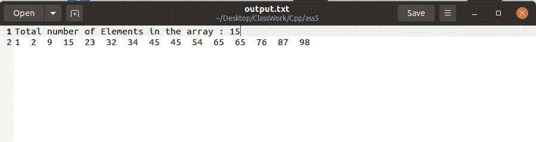
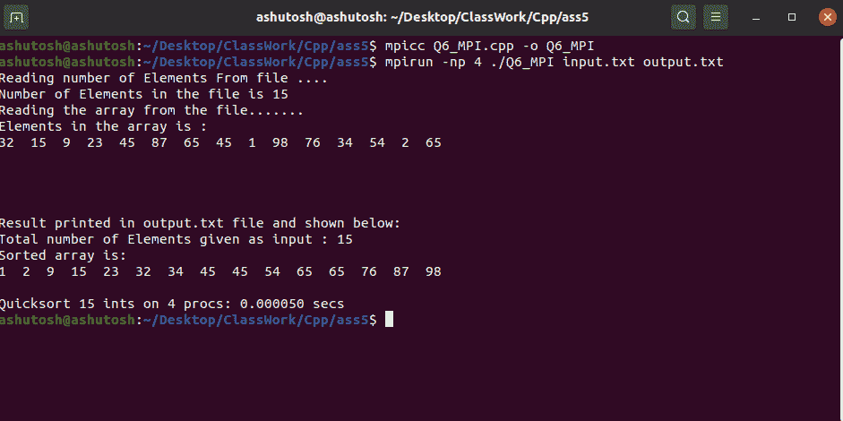
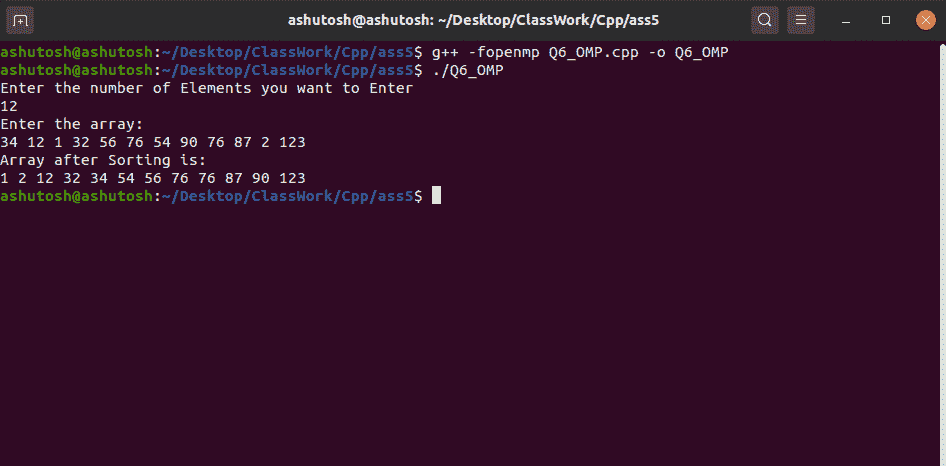
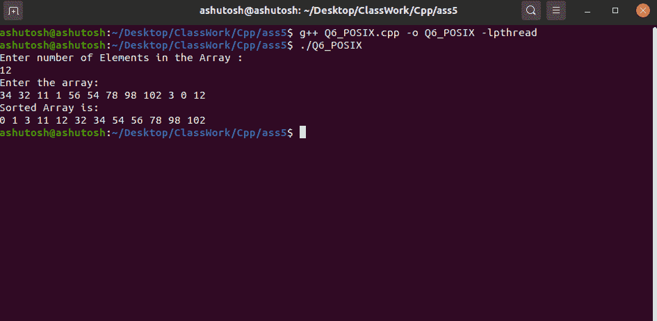

# 使用 MPI、OMP 和 Posix 线程实现快速排序

> 原文:[https://www . geesforgeks . org/implementation-of-quick-sort-use-MPI-OMP-and-POSIX-thread/](https://www.geeksforgeeks.org/implementation-of-quick-sort-using-mpi-omp-and-posix-thread/)

[快速排序](https://www.geeksforgeeks.org/quick-sort/)是一个[分治算法](https://www.geeksforgeeks.org/divide-and-conquer-introduction/)。它选取一个元素作为[轴](https://www.geeksforgeeks.org/dual-pivot-quicksort/)，并围绕选取的轴分割[阵列](https://www.geeksforgeeks.org/array-data-structure/)。有许多方法可以选择轴心元素。它们是:

*   始终选取第一个元素作为轴。
*   始终选择最后一个元素作为轴心(如下所示)
*   选择一个随机元素作为轴心。
*   选择中线作为支点。

**MPI:** [MPI](https://www.geeksforgeeks.org/mpi-distributed-computing-made-easy/) 代表消息传递接口。这里的信息是数据。MPI 允许数据在[分布式内存](https://www.geeksforgeeks.org/architecture-of-distributed-shared-memorydsm/)环境中的进程之间传递。在 C 语言中，“mpi.h”是一个[头文件](https://www.geeksforgeeks.org/header-files-in-c-cpp-and-its-uses/)，它包含了 mpi 的所有[数据结构](https://www.geeksforgeeks.org/data-structures/)、例程和常量。使用“mpi.h”并行化了快速排序算法。下面是使用 MPI 实现快速排序的 [C 程序](https://www.geeksforgeeks.org/c/):

## C

```
// C program to implement the Quick Sort
// Algorithm using MPI
#include <mpi.h>
#include <stdio.h>
#include <stdlib.h>
#include <time.h>
#include <unistd.h>
using namespace std;

// Function to swap two numbers
void swap(int* arr, int i, int j)
{
    int t = arr[i];
    arr[i] = arr[j];
    arr[j] = t;
}

// Function that performs the Quick Sort
// for an array arr[] starting from the
// index start and ending at index end
void quicksort(int* arr, int start, int end)
{
    int pivot, index;

    // Base Case
    if (end <= 1)
        return;

    // Pick pivot and swap with first
    // element Pivot is middle element
    pivot = arr[start + end / 2];
    swap(arr, start, start + end / 2);

    // Partitioning Steps
    index = start;

    // Iterate over the range [start, end]
    for (int i = start + 1; i < start + end; i++) {

        // Swap if the element is less
        // than the pivot element
        if (arr[i] < pivot) {
            index++;
            swap(arr, i, index);
        }
    }

    // Swap the pivot into place
    swap(arr, start, index);

    // Recursive Call for sorting
    // of quick sort function
    quicksort(arr, start, index - start);
    quicksort(arr, index + 1, start + end - index - 1);
}

// Function that merges the two arrays
int* merge(int* arr1, int n1, int* arr2, int n2)
{
    int* result = (int*)malloc((n1 + n2) * sizeof(int));
    int i = 0;
    int j = 0;
    int k;

    for (k = 0; k < n1 + n2; k++) {
        if (i >= n1) {
            result[k] = arr2[j];
            j++;
        }
        else if (j >= n2) {
            result[k] = arr1[i];
            i++;
        }

        // Indices in bounds as i < n1
        // && j < n2
        else if (arr1[i] < arr2[j]) {
            result[k] = arr1[i];
            i++;
        }

        // v2[j] <= v1[i]
        else {
            result[k] = arr2[j];
            j++;
        }
    }
    return result;
}

// Driver Code
int main(int argc, char* argv[])
{
    int number_of_elements;
    int* data = NULL;
    int chunk_size, own_chunk_size;
    int* chunk;
    FILE* file = NULL;
    double time_taken;
    MPI_Status status;

    if (argc != 3) {
        printf("Desired number of arguments are not their "
               "in argv....\n");
        printf("2 files required first one input and "
               "second one output....\n");
        exit(-1);
    }

    int number_of_process, rank_of_process;
    int rc = MPI_Init(&argc, &argv);

    if (rc != MPI_SUCCESS) {
        printf("Error in creating MPI "
               "program.\n "
               "Terminating......\n");
        MPI_Abort(MPI_COMM_WORLD, rc);
    }

    MPI_Comm_size(MPI_COMM_WORLD, &number_of_process);
    MPI_Comm_rank(MPI_COMM_WORLD, &rank_of_process);

    if (rank_of_process == 0) {
        // Opening the file
        file = fopen(argv[1], "r");

        // Printing Error message if any
        if (file == NULL) {
            printf("Error in opening file\n");
            exit(-1);
        }

        // Reading number of Elements in file ...
        // First Value in file is number of Elements
        printf(
            "Reading number of Elements From file ....\n");
        fscanf(file, "%d", &number_of_elements);
        printf("Number of Elements in the file is %d \n",
               number_of_elements);

        // Computing chunk size
    chunk_size = (number_of_elements %
                  number_of_process == 0) ?
                  (number_of_elements /
                   number_of_process) :
                  (number_of_elements /
                  (number_of_process - 1);

    data = (int *)malloc(number_of_process *
                         chunk_size *
                         sizeof(int));

    // Reading the rest elements in which
    // operation is being performed
    printf("Reading the array from the file.......\n");
    for(int i = 0; i < number_of_elements; i++)
    {
            fscanf(file, "%d", &data[i]);
    }

    // Padding data with zero
    for(int i = number_of_elements;
            i < number_of_process *
                chunk_size; i++)
    {
            data[i] = 0;
    }

    // Printing the array read from file
      printf("Elements in the array is : \n");
      for(int i = 0; i < number_of_elements; i++)
      {
            printf("%d  ", data[i]);
      }

      printf("\n");

      fclose(file);
      file = NULL;
    }

    // Blocks all process until reach this point
    MPI_Barrier(MPI_COMM_WORLD);

    // Starts Timer
    time_taken -= MPI_Wtime();

    // BroadCast the Size to all the
    // process from root process
    MPI_Bcast(&number_of_elements, 1, MPI_INT, 0,
              MPI_COMM_WORLD);

    // Computing chunk size
  chunk_size= (number_of_elements %
               number_of_process == 0) ?
              (number_of_elements /
               number_of_process) :
              (number_of_elements /
              (number_of_process - 1);

  // Calculating total size of chunk
  // according to bits
  chunk = (int *)malloc(chunk_size *
                        sizeof(int));

  // Scatter the chuck size data to all process
  MPI_Scatter(data, chunk_size, MPI_INT, chunk,
              chunk_size, MPI_INT, 0, MPI_COMM_WORLD);
  free(data);
  data = NULL;

  // Compute size of own chunk and
               // then sort them
  // using quick sort

  own_chunk_size = (number_of_elements >=
                    chunk_size*(rank_of_process + 1)) ?
                    chunk_size : (number_of_elements -
                                  chunk_size*rank_of_process);

  // Sorting array with quick sort for every
  // chunk as called by process
  quicksort(chunk, 0, own_chunk_size);

  for(int step = 1; step < number_of_process; step = 2 * step)
  {
        if (rank_of_process % (2 * step) != 0) {
            MPI_Send(chunk, own_chunk_size, MPI_INT,
                     rank_of_process - step, 0,
                     MPI_COMM_WORLD);
            break;
        }

        if (rank_of_process + step < number_of_process) {
            int received_chunk_size
                = (number_of_elements
                   >= chunk_size
                          * (rank_of_process + 2 * step))
                      ? (chunk_size * step)
                      : (number_of_elements
                         - chunk_size
                               * (rank_of_process + step));
            int* chunk_received;
            chunk_received = (int*)malloc(
                received_chunk_size * sizeof(int));
            MPI_Recv(chunk_received, received_chunk_size,
                     MPI_INT, rank_of_process + step, 0,
                     MPI_COMM_WORLD, &status);

            data = merge(chunk, own_chunk_size,
                         chunk_received,
                         received_chunk_size);

            free(chunk);
            free(chunk_received);
            chunk = data;
            own_chunk_size
                = own_chunk_size + received_chunk_size;
        }
  }

  // Stop the timer
  time_taken += MPI_Wtime();

  // Opening the other file as taken form input
  // and writing it to the file and giving it
  // as the output
  if(rank_of_process == 0)
  {
        // Opening the file
        file = fopen(argv[2], "w");

        if (file == NULL) {
            printf("Error in opening file... \n");
            exit(-1);
        }

        // Printing total number of elements
        // in the file
        fprintf(
            file,
            "Total number of Elements in the array : %d\n",
            own_chunk_size);

        // Printing the value of array in the file
        for (int i = 0; i < own_chunk_size; i++) {
            fprintf(file, "%d  ", chunk[i]);
        }

        // Closing the file
        fclose(file);

        printf("\n\n\n\nResult printed in output.txt file "
               "and shown below: \n");

        // For Printing in the terminal
        printf("Total number of Elements given as input : "
               "%d\n",
               number_of_elements);
        printf("Sorted array is: \n");

        for (int i = 0; i < number_of_elements; i++) {
            printf("%d  ", chunk[i]);
        }

        printf(
            "\n\nQuicksort %d ints on %d procs: %f secs\n",
            number_of_elements, number_of_process,
            time_taken);
  }

  MPI_Finalize();
  return 0;
}
```

**输出:**

  

**OMP:** OMP 为[开放多处理](https://www.geeksforgeeks.org/openmp-introduction-with-installation-guide/)。这是一个[应用程序接口(API)](https://www.geeksforgeeks.org/introduction-to-apis/) ，可以用来明确地指导多线程，共享内存并行。在 [C/ C++](https://www.geeksforgeeks.org/c-plus-plus/) 中，“omp.h”是一个头文件，包含所有与 omp 相关的指令。使用“omp.h”并行快速排序。下面是实现上述概念的 C++程序:

## C++

```
// C++ program to implement the Quick Sort
// using OMI
#include <bits/stdc++.h>
#include <omp.h>
using namespace std;

// Function to swap two numbers a and b
void swap(int* a, int* b)
{
    int t = *a;
    *a = *b;
    *b = t;
}

// Function to perform the partitioning
// of array arr[]
int partition(int arr[], int start, int end)
{
    // Declaration
    int pivot = arr[end];
    int i = (start - 1);

    // Rearranging the array
    for (int j = start; j <= end - 1; j++) {
        if (arr[j] < pivot) {
            i++;
            swap(&arr[i], &arr[j]);
        }
    }
    swap(&arr[i + 1], &arr[end]);

    // Returning the respective index
    return (i + 1);
}

// Function to perform QuickSort Algorithm
// using openmp
void quicksort(int arr[], int start, int end)
{
    // Declaration
    int index;

    if (start < end) {

        // Getting the index of pivot
        // by partitioning
        index = partition(arr, start, end);

// Parallel sections
#pragma omp parallel sections
        {
#pragma omp section
            {
                // Evaluating the left half
                quicksort(arr, start, index - 1);
            }
#pragma omp section
            {
                // Evaluating the right half
                quicksort(arr, index + 1, end);
            }
        }
    }
}

// Driver Code
int main()
{
    // Declaration
    int N;

    // Taking input the number of
    // elements we wants
    cout << "Enter the number of elements"
         << " you want to Enter\n";
    cin >> N;

    // Declaration of array
    int arr[N];

    cout << "Enter the array: \n";

    // Taking input that array
    for (int i = 0; i < N; i++) {
        cin >> arr[i];
    }

    // Calling quicksort having parallel
    // code implementation
    quicksort(arr, 0, N - 1);

    // Printing the sorted array
    cout << "Array after Sorting is: \n";

    for (int i = 0; i < N; i++) {
        cout << arr[i] << " ";
    }

    return 0;
}
```

**输出:**



**POSIX 线程:**[POSIX 线程库](https://www.geeksforgeeks.org/posix-threads-in-os/)是基于标准的 C/C++线程 API。它支持创建新的并发流程。它在[多处理器](https://www.geeksforgeeks.org/introduction-of-multiprocessor-and-multicomputer/)或[多核系统](https://www.geeksforgeeks.org/difference-between-multicore-and-multiprocessor-system/)上运行良好，在这些系统中，处理流程可能被安排在另一个处理器上执行，通过并行或分布式处理提高速度。下面是使用 POSIX 线程实现快速排序的 [C++程序](https://www.geeksforgeeks.org/c-plus-plus/):

## C++14

```
// C++ program to implement the Quick Sort
// using POSIX Thread
#include <bits/stdc++.h>
#include <pthread.h>
using namespace std;

// Structure
struct data_set {
    int start_index;
    int end_index;
    int* data;
};

// Function to perform swap operations
void swap(int* a, int* b)
{
    int t = *a;
    *a = *b;
    *b = t;
}

// Partition function for making
// partition in array
int partition(int arr[], int left_index,
              int right_index)
{
    // Declaration and initialization
    // choosing pivot element form which
    // we make partition

    // Here pivot is last element of
    // the array
    int pivot = arr[right_index];
    int i = left_index - 1;

    // Making array as per requirement
    // arranging element smaller than
    // pivot on left side and larger
    // then pivot on right side
    for (int j = left_index;
         j <= right_index - 1; j++) {

        if (arr[j] < pivot) {
            i++;
            swap(&arr[i], &arr[j]);
        }
    }

    swap(&arr[i + 1], &arr[right_index]);

    // Returning the partition index
    return i + 1;
}

// Quicksort Function for sorting
// array
void* quick_sort(void* data)
{
    // Retrieving back the data sent
    // from thread
    struct data_set* info = (struct data_set*)data;

    // Declaration of left index
    int left_index, right_index, index;

    // Initialization of left and
    // right index
    left_index = info->start_index;
    right_index = info->end_index;

    // Recursive call of quick_sort
    // function
    if (left_index < right_index) {

        // Declaration of pthread and
        // pthread attribute type object
        pthread_attr_t attr;
        pthread_t first_thread;
        pthread_t second_thread;

        // Making two pointers of type
        // data_set for making again
        // call form thread
        struct data_set* info1 = new data_set;
        struct data_set* info2 = new data_set;

        // Their initialization
        info1->data = info->data;
        info2->data = info->data;

        // Initialize of pthread attribute
        pthread_attr_init(&attr);

        // For setting the set detach
        // state of attribute
        pthread_attr_setdetachstate(
            &attr, PTHREAD_CREATE_JOINABLE);

        // Partition the array for any
        // recursive call
        index = partition(info->data,
                          left_index,
                          right_index);

        info1->start_index = left_index;
        info1->end_index = index - 1;

        // Create pthread type object and
        // printing the error if any
        if (pthread_create(&first_thread,
                           &attr, quick_sort,
                           info1)) {
            cout << "Error in creating thread "
                 << endl;

            // Exiting in case of not
            // creation of thread
            exit(-1);
        }

        info2->start_index = index + 1;
        info2->end_index = right_index;

        // Creating pthread type object
        // and print the error
        if (pthread_create(&second_thread,
                           &attr, quick_sort,
                           info2)) {
            cout << "Error in creating thread "
                 << endl;

            // Exiting in case of not
            // creation of thread
            exit(-1);
        }

        // Joining the threads
        pthread_join(first_thread, NULL);
        pthread_join(second_thread, NULL);
    }

    return NULL;
}

// Driver Code
int main()
{
    // Declaration of Number of threads
    int N;

    struct data_set* info = new data_set;

    // Taking number of elements as input
    cout << "Enter number of elements"
         << " in the array: \n";
    cin >> N;

    // Declaration of array
    int A[N];

    // Initialization of array
    cout << "Enter the array: " << endl;
    for (int i = 0; i < N; i++) {
        cin >> A[i];
    }

    // Initialize of structure of
    // data_set type
    info->data = A;
    info->start_index = 0;
    info->end_index = N - 1;

    // Declaration of pthread object
    pthread_t thread_id;

    // Creating and pthread object and
    // printing the array of any
    if (pthread_create(&thread_id, NULL,
                       quick_sort,
                       info)) {
        cout << "Error in creating thread"
             << endl;

        // Exit in case of error
        exit(-1);
    }

    // Joining the pthread object
    int r1 = pthread_join(thread_id, NULL);

    // Printing the array if any in case
    // of joining
    if (r1) {
        cout << "Error in Joinging thread"
             << endl;

        // Exiting in case of error
        exit(-1);
    }

    // Printing the array after sorting
    cout << "Sorted Array is: " << endl;

    for (int i = 0; i < N; i++) {
        cout << A[i] << " ";
    }
    cout << endl;

    // Exiting from pthread programming
    pthread_exit(NULL);

    return 0;
}
```

**输出:**

