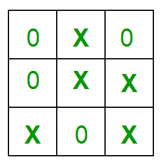

# 实施井字游戏

> 原文:[https://www . geeksforgeeks . org/implementation-of-TIC-tac-toe-game/](https://www.geeksforgeeks.org/implementation-of-tic-tac-toe-game/)

**游戏规则**

*   游戏将在两个人之间进行(在这个程序中是人类和计算机之间)。
*   其中一个玩家选择“O”，另一个选择“X”来标记他们各自的细胞。
*   游戏从其中一个玩家开始，当其中一个玩家有一整行/一列/一条对角线填充了他/她各自的角色(“O”或“X”)时，游戏结束。
*   If no one wins, then the game is said to be draw.
    
    **Implementation**
    In our program the moves taken by the computer and the human are chosen randomly. We use rand() function for this.

    **程序中还能做什么？**
    由于招式是随机选择的，双方都没有最佳发挥。该程序可以很容易地修改，使双方球员发挥最佳(这将属于人工智能的范畴)。也可以修改程序，使用户自己给出输入(使用 scanf()或 cin)。
    以上改动留给读者做练习。

    **获胜策略——一个有趣的事实**
    如果双方都打得很好，那么你注定永远不会输(“尽管比赛仍然可以平局”)。打第一还是第二不重要。从另一个角度来说——“两个专家玩家总是会打平”。
    这不是很有意思吗？

    ```
    // A C++ Program to play tic-tac-toe

    #include<bits/stdc++.h>
    using namespace std;

    #define COMPUTER 1
    #define HUMAN 2

    #define SIDE 3 // Length of the board

    // Computer will move with 'O'
    // and human with 'X'
    #define COMPUTERMOVE 'O'
    #define HUMANMOVE 'X'

    // A function to show the current board status
    void showBoard(char board[][SIDE])
    {
        printf("\n\n");

        printf("\t\t\t  %c | %c  | %c  \n", board[0][0],
                                 board[0][1], board[0][2]);
        printf("\t\t\t--------------\n");
        printf("\t\t\t  %c | %c  | %c  \n", board[1][0],
                                 board[1][1], board[1][2]);
        printf("\t\t\t--------------\n");
        printf("\t\t\t  %c | %c  | %c  \n\n", board[2][0],
                                 board[2][1], board[2][2]);

        return;
    }

    // A function to show the instructions
    void showInstructions()
    {
        printf("\t\t\t  Tic-Tac-Toe\n\n");
        printf("Choose a cell numbered from 1 to 9 as below"
                " and play\n\n");

        printf("\t\t\t  1 | 2  | 3  \n");
        printf("\t\t\t--------------\n");
        printf("\t\t\t  4 | 5  | 6  \n");
        printf("\t\t\t--------------\n");
        printf("\t\t\t  7 | 8  | 9  \n\n");

        printf("-\t-\t-\t-\t-\t-\t-\t-\t-\t-\n\n");

        return;
    }

    // A function to initialise the game 
    void initialise(char board[][SIDE], int moves[])
    {
        // Initiate the random number generator so that 
        // the same configuration doesn't arises
        srand(time(NULL)); 

        // Initially the board is empty
        for (int i=0; i<SIDE; i++)
        {
            for (int j=0; j<SIDE; j++)
                board[i][j] = ' ';
        }

        // Fill the moves with numbers
        for (int i=0; i<SIDE*SIDE; i++)
            moves[i] = i;

        // randomise the moves
        random_shuffle(moves, moves + SIDE*SIDE);

        return;
    }

    // A function to declare the winner of the game
    void declareWinner(int whoseTurn)
    {
        if (whoseTurn == COMPUTER)
            printf("COMPUTER has won\n");
        else
            printf("HUMAN has won\n");
        return;
    }

    // A function that returns true if any of the row
    // is crossed with the same player's move
    bool rowCrossed(char board[][SIDE])
    {
        for (int i=0; i<SIDE; i++)
        {
            if (board[i][0] == board[i][1] &&
                board[i][1] == board[i][2] && 
                board[i][0] != ' ')
                return (true);
        }
        return(false);
    }

    // A function that returns true if any of the column
    // is crossed with the same player's move
    bool columnCrossed(char board[][SIDE])
    {
        for (int i=0; i<SIDE; i++)
        {
            if (board[0][i] == board[1][i] &&
                board[1][i] == board[2][i] && 
                board[0][i] != ' ')
                return (true);
        }
        return(false);
    }

    // A function that returns true if any of the diagonal
    // is crossed with the same player's move
    bool diagonalCrossed(char board[][SIDE])
    {
        if (board[0][0] == board[1][1] &&
            board[1][1] == board[2][2] && 
            board[0][0] != ' ')
            return(true);

        if (board[0][2] == board[1][1] &&
            board[1][1] == board[2][0] &&
             board[0][2] != ' ')
            return(true);

        return(false);
    }

    // A function that returns true if the game is over
    // else it returns a false
    bool gameOver(char board[][SIDE])
    {
        return(rowCrossed(board) || columnCrossed(board)
                || diagonalCrossed(board) );
    }

    // A function to play Tic-Tac-Toe
    void playTicTacToe(int whoseTurn)
    {
        // A 3*3 Tic-Tac-Toe board for playing 
        char board[SIDE][SIDE];

        int moves[SIDE*SIDE];

        // Initialise the game
        initialise(board, moves);

        // Show the instructions before playing
        showInstructions();

        int moveIndex = 0, x, y;

        // Keep playing till the game is over or it is a draw
        while (gameOver(board) == false && 
                moveIndex != SIDE*SIDE)
        {
            if (whoseTurn == COMPUTER)
            {
                x = moves[moveIndex] / SIDE;
                y = moves[moveIndex] % SIDE;
                board[x][y] = COMPUTERMOVE;
                printf("COMPUTER has put a %c in cell %d\n",
                        COMPUTERMOVE, moves[moveIndex]+1);
                showBoard(board);
                moveIndex ++;
                whoseTurn = HUMAN;
            }

            else if (whoseTurn == HUMAN)
            {
                x = moves[moveIndex] / SIDE;
                y = moves[moveIndex] % SIDE;
                board[x][y] = HUMANMOVE;
                printf ("HUMAN has put a %c in cell %d\n",
                        HUMANMOVE, moves[moveIndex]+1);
                showBoard(board);
                moveIndex ++;
                whoseTurn = COMPUTER;
            }
        }

        // If the game has drawn
        if (gameOver(board) == false && 
                moveIndex == SIDE * SIDE)
            printf("It's a draw\n");
        else
        {
            // Toggling the user to declare the actual
            // winner
            if (whoseTurn == COMPUTER)
                whoseTurn = HUMAN;
            else if (whoseTurn == HUMAN)
                whoseTurn = COMPUTER;

            // Declare the winner
            declareWinner(whoseTurn);
        }
        return;
    }

    // Driver program
    int main()
    {
        // Let us play the game with COMPUTER starting first
        playTicTacToe(COMPUTER);

        return (0);
    }
    ```

    输出:

    ```
                    Tic-Tac-Toe

    Choose a cell numbered from 1 to 9 as below and play

                  1 | 2  | 3  
                --------------
                  4 | 5  | 6  
                --------------
                  7 | 8  | 9  

    -    -    -    -    -    -    -    -    -    -

    COMPUTER has put a O in cell 6

                    |    |    
                --------------
                    |    | O  
                --------------
                    |    |    

    HUMAN has put a X in cell 7

                    |    |    
                --------------
                    |    | O  
                --------------
                  X |    |    

    COMPUTER has put a O in cell 5

                    |    |    
                --------------
                    | O  | O  
                --------------
                  X |    |    

    HUMAN has put a X in cell 1

                  X |    |    
                --------------
                    | O  | O  
                --------------
                  X |    |    

    COMPUTER has put a O in cell 9

                  X |    |    
                --------------
                    | O  | O  
                --------------
                  X |    | O  

    HUMAN has put a X in cell 8

                  X |    |    
                --------------
                    | O  | O  
                --------------
                  X | X  | O  

    COMPUTER has put a O in cell 4

                  X |    |    
                --------------
                  O | O  | O  
                --------------
                  X | X  | O  

    COMPUTER has won

    ```

    **这款游戏的一个有趣的变种**
    如上所述，如果两个有经验的玩家在玩井字游戏，那么游戏总是会打平。
    这款游戏还有另一个病毒变种——终极井字游戏，旨在让正常的井字游戏变得更有趣、更不可预测。
    看一下这里的游戏- [Link1](https://mathwithbaddrawings.com/2013/06/16/ultimate-tic-tac-toe/) [Link2](http://www.geek.com/games/tic-tac-toe-made-much-more-interesting-with-a-simple-tweak-1559289/)

    上面的文章实现了简单的井字游戏，其中移动是随机进行的。请参考下面的文章，看看如何进行最佳移动。
    [博弈论中的极小极大算法|集合 3(井字游戏 AI–寻找最佳移动)](https://www.geeksforgeeks.org/minimax-algorithm-in-game-theory-set-3-tic-tac-toe-ai-finding-optimal-move/)

    **关于“赢/不输”战略的精彩讨论**
    [【Quora】](https://www.quora.com/Is-there-a-way-to-never-lose-at-Tic-Tac-Toe)
    [Wikihow](http://www.wikihow.com/Win-at-Tic-Tac-Toe#Never_Losing_when_Playing_Second_sub)

    本文由**拉希特·贝尔瓦亚尔**供稿。如果你喜欢 GeeksforGeeks 并想投稿，你也可以使用[contribute.geeksforgeeks.org](http://www.contribute.geeksforgeeks.org)写一篇文章或者把你的文章邮寄到 contribute@geeksforgeeks.org。看到你的文章出现在极客博客主页上，帮助其他极客。

    如果你发现任何不正确的地方，或者你想分享更多关于上面讨论的话题的信息，请写评论。