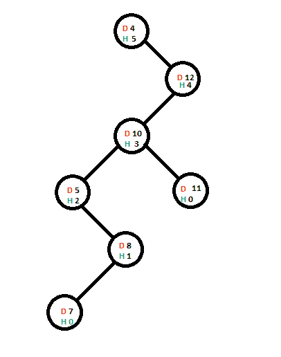
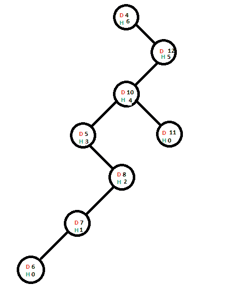
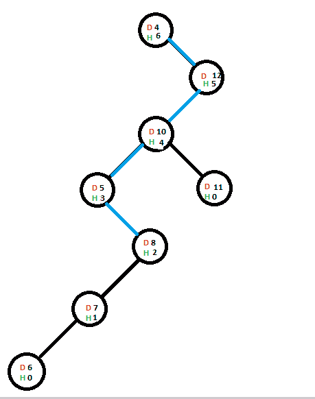
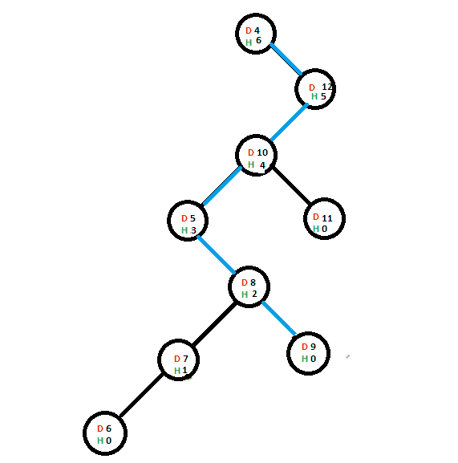

# 实现一个 BST，其中每个节点存储路径中直到任何叶子的最大节点数

> 原文:[https://www . geeksforgeeks . org/implementing-a-BST-其中每个节点存储路径中的最大节点数直到任何叶子/](https://www.geeksforgeeks.org/implementing-a-bst-where-every-node-stores-the-maximum-number-of-nodes-in-the-path-till-any-leaf/)

给定一组值。任务是使用数组的值实现二叉查找树，其中每个节点存储路径中从节点本身开始到树的任何叶子结束的最大节点数。

**注**:BST 中从任意节点到任意叶节点的路径中的最大节点数是以该节点为根的子树的高度。

**示例:**

> **输入:** arr[] = {1，2，3，4，5，6，7}
> **输出:**
> 数据= 1 高度= 6
> 数据= 2 高度= 5
> 数据= 3 高度= 4
> 数据= 4 高度= 3
> 数据= 5 高度= 2
> 数据= 6 高度= 1
> 数据= 7 高度= 0
> 
> **输入:** arr[] = {4，12，10，5，11，8，7，6，9}
> **输出:**
> 数据= 4 高度= 6
> 数据= 5 高度= 3
> 数据= 6 高度= 0
> 数据= 7 高度= 1
> 数据= 8 高度= 2
> 数据= 9 高度= 0
> 数据= 10 高度= 4
> 数据= 11 高度= 0
> 数据

想法是以 BST 的方式添加节点。只有当新节点被添加到子树中时，父节点的高度才会被更新，这有助于父节点的高度，并且(逻辑)在添加新节点之后，子树的高度也增加了。

假设现有的树是(节点数据为红色，节点当前高度为绿色):



现在我们要添加一个包含值 6 的新节点，节点为了被添加而采用的路由已经用蓝色突出显示:


随着新节点的添加，其直接父节点的高度将会增加(仅当包含 6 的节点的直接父节点的高度受到此添加的影响时，在本例中为真)。一旦父树的高度增加，它将检查父树所在的子树是否是有该子树作为子树的节点高度的主要贡献者，如果是，则该节点的高度将增加——简而言之，如果向上传播，高度增加。



现在，我们将添加另一个包含值 9 的节点&添加到其最终位置所需的路径是蓝色的:



由于包含值 9 的节点的直接父节点的高度不会受到此加法的影响，因此其父节点的高度不会受到影响，并且高度增量不会向上传播。



下面是上述方法的实现:

## C++

```
// C++ implementation of above approach
#include<bits/stdc++.h>
using namespace std;

// Structure containing basic template od a node
struct node {

    // Stores the data and current height of the node
    int data;
    int height;
    struct node* right;
    struct node* left;
};

int indicator = 0;
void left_insert(struct node*, struct node*);
void right_insert(struct node*, struct node*);

// Inorder traversal of the tree
void traverse(struct node* head)
{
    if (head != NULL) {
        traverse(head->left);
        cout << " data   = " << head->data;
        cout<< " height = " << head->height << endl;
        traverse(head->right);
    }
}

// Insertion to the left sub-tree
void left_insert(struct node* head, struct node* temp)
{
    // Child node of Current head
    struct node* child = NULL;

    if (head->data > temp->data) {
        if (head->left == NULL) {
            indicator = 1;
            child = head->left = temp;
        }
        else {
            left_insert(head->left, temp);
            child = head->left;
        }
    }
    else {
        right_insert(head, temp);
    }

    if ((indicator == 1) && (child != NULL)) {
        if (head->height > child->height) {
            // Ending propagation to height of above nodes
            indicator = 0;
        }
        else {
            head->height += 1;
        }
    }
}

// Insertion to the right sub-tree
void right_insert(struct node* head, struct node* temp)
{
    // Child node of Current head
    struct node* child = NULL;

    if (head->data < temp->data) {
        if (head->right == NULL) {
            indicator = 1;
            child = head->right = temp;
        }
        else {
            right_insert(head->right, temp);
            child = head->right;
        }
    }
    else {
        left_insert(head, temp);
    }

    if ((indicator == 1) && (child != NULL)) {
        if (head->height > child->height) {

            // Ending propagation to height of above nodes
            indicator = 0;
        }
        else {
            head->height += 1;
        }
    }
}

// Function to create node and push
// it to its appropriate position
void add_nodes(struct node** head, int value)
{
    struct node *temp_head = *head, *temp;

    if (*head == NULL) {
        // When first node is added
        *head = new node();
        (*head)->data = value;
        (*head)->height = 0;
        (*head)->right = (*head)->left = NULL;
    }
    else {
        temp = new node();
        temp->data = value;
        temp->height = 0;
        temp->right = temp->left = NULL;
        left_insert(temp_head, temp);
        temp_head = *head;
        indicator = 0;
    }
}

// Driver Code
int main()
{
    struct node *head = NULL, *temp_head = NULL;

    add_nodes(&head, 4);
    add_nodes(&head, 12);
    add_nodes(&head, 10);
    add_nodes(&head, 5);
    add_nodes(&head, 11);
    add_nodes(&head, 8);
    add_nodes(&head, 7);
    add_nodes(&head, 6);
    add_nodes(&head, 9);

    temp_head = head;

    // Traversing the tree to display
    // the updated height values
    traverse(temp_head);
    return 0;
}

// This code is contributed by rrrtnx.
```

## C

```
// C implementation of above approach
#include <stdio.h>
#include <stdlib.h>

// Structure containing basic template od a node
struct node {

    // Stores the data and current height of the node
    int data;
    int height;
    struct node* right;
    struct node* left;
};

int indicator = 0;
void left_insert(struct node*, struct node*);
void right_insert(struct node*, struct node*);

// Inorder traversal of the tree
void traverse(struct node* head)
{
    if (head != NULL) {
        traverse(head->left);
        printf(" data   = %d", head->data);
        printf(" height = %d\n", head->height);
        traverse(head->right);
    }
}

// Insertion to the left sub-tree
void left_insert(struct node* head, struct node* temp)
{
    // Child node of Current head
    struct node* child = NULL;

    if (head->data > temp->data) {
        if (head->left == NULL) {
            indicator = 1;
            child = head->left = temp;
        }
        else {
            left_insert(head->left, temp);
            child = head->left;
        }
    }
    else {
        right_insert(head, temp);
    }

    if ((indicator == 1) && (child != NULL)) {
        if (head->height > child->height) {
            // Ending propagation to height of above nodes
            indicator = 0;
        }
        else {
            head->height += 1;
        }
    }
}

// Insertion to the right sub-tree
void right_insert(struct node* head, struct node* temp)
{
    // Child node of Current head
    struct node* child = NULL;

    if (head->data < temp->data) {
        if (head->right == NULL) {
            indicator = 1;
            child = head->right = temp;
        }
        else {
            right_insert(head->right, temp);
            child = head->right;
        }
    }
    else {
        left_insert(head, temp);
    }

    if ((indicator == 1) && (child != NULL)) {
        if (head->height > child->height) {

            // Ending propagation to height of above nodes
            indicator = 0;
        }
        else {
            head->height += 1;
        }
    }
}

// Function to create node and push
// it to its appropriate position
void add_nodes(struct node** head, int value)
{
    struct node *temp_head = *head, *temp;

    if (*head == NULL) {
        // When first node is added
        *head = malloc(sizeof(**head));
        (*head)->data = value;
        (*head)->height = 0;
        (*head)->right = (*head)->left = NULL;
    }
    else {
        temp = malloc(sizeof(*temp));
        temp->data = value;
        temp->height = 0;
        temp->right = temp->left = NULL;
        left_insert(temp_head, temp);
        temp_head = *head;
        indicator = 0;
    }
}

// Driver Code
int main()
{
    struct node *head = NULL, *temp_head = NULL;

    add_nodes(&head, 4);
    add_nodes(&head, 12);
    add_nodes(&head, 10);
    add_nodes(&head, 5);
    add_nodes(&head, 11);
    add_nodes(&head, 8);
    add_nodes(&head, 7);
    add_nodes(&head, 6);
    add_nodes(&head, 9);

    temp_head = head;

    // Traversing the tree to display
    // the updated height values
    traverse(temp_head);
    return 0;
}
```

## Java 语言(一种计算机语言，尤用于创建网站)

```
// Java implementation of above approach
class GFG
{

// Structure containing basic template od a node
static class node
{

    // Stores the data and current height of the node
    int data;
    int height;
    node right;
    node left;
}

static int indicator = 0;

// Inorder traversal of the tree
static void traverse(node head)
{
    if (head != null)
    {
        traverse(head.left);
        System.out.printf(" data = %d", head.data);
        System.out.printf(" height = %d\n", head.height);
        traverse(head.right);
    }
}

// Insertion to the left sub-tree
static void left_insert(node head, node temp)
{
    // Child node of Current head
    node child = null;

    if (head.data > temp.data)
    {
        if (head.left == null)
        {
            indicator = 1;
            child = head.left = temp;
        }
        else
        {
            left_insert(head.left, temp);
            child = head.left;
        }
    }
    else
    {
        right_insert(head, temp);
    }

    if ((indicator == 1) && (child != null))
    {
        if (head.height > child.height)
        {

            // Ending propagation to height of above nodes
            indicator = 0;
        }
        else
        {
            head.height += 1;
        }
    }
}

// Insertion to the right sub-tree
static void right_insert(node head, node temp)
{
    // Child node of Current head
    node child = null;

    if (head.data < temp.data)
    {
        if (head.right == null)
        {
            indicator = 1;
            child = head.right = temp;
        }
        else
        {
            right_insert(head.right, temp);
            child = head.right;
        }
    }
    else
    {
        left_insert(head, temp);
    }

    if ((indicator == 1) && (child != null))
    {
        if (head.height > child.height)
        {

            // Ending propagation to height of above nodes
            indicator = 0;
        }
        else
        {
            head.height += 1;
        }
    }
}

// Function to create node and push
// it to its appropriate position
static node add_nodes(node head, int value)
{
    node temp_head = head, temp;

    if (head == null)
    {
        // When first node is added
        head = new node();
        (head).data = value;
        (head).height = 0;
        (head).right = (head).left = null;
    }
    else
    {
        temp = new node();
        temp.data = value;
        temp.height = 0;
        temp.right = temp.left = null;
        left_insert(temp_head, temp);
        temp_head = head;
        indicator = 0;
    }
    return head;
}

// Driver Code
public static void main(String args[])
{
    node head = null, temp_head = null;

    head = add_nodes(head, 4);
    head = add_nodes(head, 12);
    head = add_nodes(head, 10);
    head = add_nodes(head, 5);
    head = add_nodes(head, 11);
    head = add_nodes(head, 8);
    head = add_nodes(head, 7);
    head = add_nodes(head, 6);
    head = add_nodes(head, 9);

    temp_head = head;

    // Traversing the tree to display
    // the updated height values
    traverse(temp_head);
}
}

// This code is contributed by Arnab Kundu
```

## 蟒蛇 3

```
# Python implementation of above approach

# Structure containing basic template od a node
class node:
    def __init__(self) -> None:

        # Stores the data and current height of the node
        self.data = 0
        self.height = 0
        self.right = None
        self.left = None

# Inorder traversal of the tree
def traverse(head: node) -> None:

    if (head != None):
        traverse(head.left)
        print(" data = {}".format(head.data), end="")
        print(" height = {}".format(head.height))
        traverse(head.right)

# Insertion to the left sub-tree
def left_insert(head: node, temp: node) -> None:
    global indicator

    # Child node of Current head
    child = None
    if (head.data > temp.data):
        if (head.left == None):
            indicator = 1
            child = head.left = temp
        else:
            left_insert(head.left, temp)
            child = head.left
    else:
        right_insert(head, temp)

    if ((indicator == 1) and (child != None)):
        if (head.height > child.height):

            # Ending propagation to height of above nodes
            indicator = 0

        else:
            head.height += 1

# Insertion to the right sub-tree
def right_insert(head: node, temp: node) -> None:
    global indicator

    # Child node of Current head
    child = None

    if (head.data < temp.data):
        if (head.right == None):
            indicator = 1
            child = head.right = temp

        else:
            right_insert(head.right, temp)
            child = head.right

    else:
        left_insert(head, temp)

    if ((indicator == 1) and (child != None)):
        if (head.height > child.height):

            # Ending propagation to height of above nodes
            indicator = 0

        else:
            head.height += 1

# Function to create node and push
# it to its appropriate position
def add_nodes(head: node, value: int) -> node:
    global indicator
    temp_head = head
    temp = None

    if (head == None):
        # When first node is added
        head = node()
        (head).data = value
        (head).height = 0
        (head).right = (head).left = None

    else:
        temp = node()
        temp.data = value
        temp.height = 0
        temp.right = temp.left = None
        left_insert(temp_head, temp)
        temp_head = head
        indicator = 0
    return head

# Driver Code
if __name__ == "__main__":
    indicator = 0
    head = None
    temp_head = None

    head = add_nodes(head, 4)
    head = add_nodes(head, 12)
    head = add_nodes(head, 10)
    head = add_nodes(head, 5)
    head = add_nodes(head, 11)
    head = add_nodes(head, 8)
    head = add_nodes(head, 7)
    head = add_nodes(head, 6)
    head = add_nodes(head, 9)

    temp_head = head

    # Traversing the tree to display
    # the updated height values
    traverse(temp_head)

# This code is contributed by sanjeev2552
```

## java 描述语言

```
<script>

// Javascript implementation of above approach

// Structure containing basic template od a node
class node
{
    constructor()
    {
        this.left;
        this.right;
        this.data;
        this.height;
    }
}

let indicator = 0;

// Inorder traversal of the tree
function traverse(head)
{
    if (head != null)
    {
        traverse(head.left);
        document.write(" data = " + head.data);
        document.write(" height = "+
                       head.height + "</br>");
        traverse(head.right);
    }
}

// Insertion to the left sub-tree
function left_insert(head, temp)
{

    // Child node of Current head
    let child = null;

    if (head.data > temp.data)
    {
        if (head.left == null)
        {
            indicator = 1;
            child = head.left = temp;
        }
        else
        {
            left_insert(head.left, temp);
            child = head.left;
        }
    }
    else
    {
        right_insert(head, temp);
    }

    if ((indicator == 1) && (child != null))
    {
        if (head.height > child.height)
        {

            // Ending propagation to height
            // of above nodes
            indicator = 0;
        }
        else
        {
            head.height += 1;
        }
    }
}

// Insertion to the right sub-tree
function right_insert(head, temp)
{

    // Child node of Current head
    let child = null;

    if (head.data < temp.data)
    {
        if (head.right == null)
        {
            indicator = 1;
            child = head.right = temp;
        }
        else
        {
            right_insert(head.right, temp);
            child = head.right;
        }
    }
    else
    {
        left_insert(head, temp);
    }

    if ((indicator == 1) && (child != null))
    {
        if (head.height > child.height)
        {

            // Ending propagation to height
            // of above nodes
            indicator = 0;
        }
        else
        {
            head.height += 1;
        }
    }
}

// Function to create node and push
// it to its appropriate position
function add_nodes(head, value)
{
    let temp_head = head, temp;

    if (head == null)
    {

        // When first node is added
        head = new node();
        (head).data = value;
        (head).height = 0;
        (head).right = (head).left = null;
    }
    else
    {
        temp = new node();
        temp.data = value;
        temp.height = 0;
        temp.right = temp.left = null;
        left_insert(temp_head, temp);
        temp_head = head;
        indicator = 0;
    }
    return head;
}

// Driver code
let head = null, temp_head = null;

head = add_nodes(head, 4);
head = add_nodes(head, 12);
head = add_nodes(head, 10);
head = add_nodes(head, 5);
head = add_nodes(head, 11);
head = add_nodes(head, 8);
head = add_nodes(head, 7);
head = add_nodes(head, 6);
head = add_nodes(head, 9);

temp_head = head;

// Traversing the tree to display
// the updated height values
traverse(temp_head);

// This code is contributed by divyeshrabadiya07

</script>
```

**Output:** 

```
 data   = 4 height = 6
 data   = 5 height = 3
 data   = 6 height = 0
 data   = 7 height = 1
 data   = 8 height = 2
 data   = 9 height = 0
 data   = 10 height = 4
 data   = 11 height = 0
 data   = 12 height = 5
```

**时间复杂度:**O(N)
T3】辅助空间: O(N)