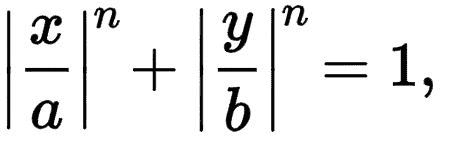
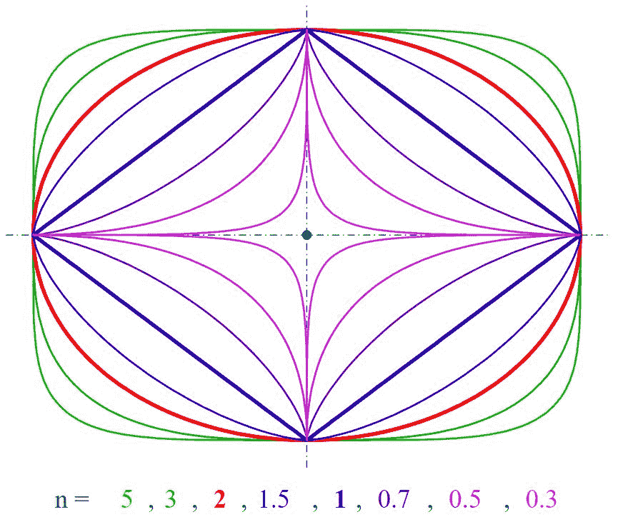
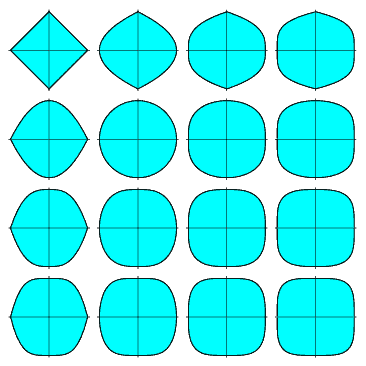
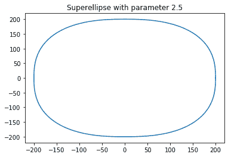
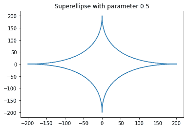

# 实现超完美

> 原文:[https://www.geeksforgeeks.org/implementing-a-superellipse/](https://www.geeksforgeeks.org/implementing-a-superellipse/)

**什么是超椭圆**
超椭圆(superellipse)，也就是加布里埃尔·拉米(Gabriel Lamé)之后的拉米曲线，是一条类似椭圆的闭合曲线，保留了半长轴和半短轴的几何特征，以及关于它们的对称性，但整体形状不同。
在笛卡儿坐标系中，曲线上所有点(x，y)的集合满足方程


其中 n、a、b 为正数，数字周围的竖线| |表示数字的绝对值。



a = 1，b = 0.75

如下图所示，有许多超线性的具体情况:

这些可以通过改变方程中 n 的值来实现。所以现在我们尝试用 python 实现它，为此我们需要一些库。

**所需模块:**

*   **matplotlib** :绘制方程的曲线。这是一个 python 的第三方库，如果你想安装它，请点击这里的。
*   **数学**:这是一个内置的 python 库，几乎拥有所有的数学工具。

```
# Python program to implement 
# Superellipse

# importing the required libraries
import matplotlib.pyplot as plt
from math import sin, cos, pi

def sgn(x):
    return ((x>0)-(x<0))*1

# parameter for marking the shape  
a, b, n = 200, 200, 2.5
na = 2 / n
# defining the accuracy
step = 100 
piece =(pi * 2)/step
xp =[];yp =[]

t = 0
for t1 in range(step + 1):
    # because sin ^ n(x) is mathematically the same as (sin(x))^n...
    x =(abs((cos(t)))**na)*a * sgn(cos(t))
    y =(abs((sin(t)))**na)*b * sgn(sin(t))
    xp.append(x);yp.append(y)
    t+= piece

plt.plot(xp, yp) # plotting all point from array xp, yp
plt.title("Superellipse with parameter "+str(n))
plt.show()
```

输出:



当 n = 2.5 时

现在让我们看看当我们将 n 的值改为 0.5 时会发生什么

```
# Python program to implement 
# Superellipse
# importing the required libraries
import matplotlib.pyplot as plt
from math import sin, cos, pi

def sgn(x):
    return ((x>0)-(x<0))*1

# parameter for marking the shape  
a, b, n = 200, 200, 0.5
na = 2 / n
# defining the accuracy
step = 100 
piece =(pi * 2)/step
xp =[];yp =[]

t = 0
for t1 in range(step + 1):
    # because sin ^ n(x) is mathematically the same as (sin(x))^n...
    x =(abs((cos(t)))**na)*a * sgn(cos(t))
    y =(abs((sin(t)))**na)*b * sgn(sin(t))
    xp.append(x);yp.append(y)
    t+= piece

plt.plot(xp, yp) # plotting all point from array xp, yp
plt.title("Superellipse with parameter "+str(n))
plt.show()
```

输出:



**程序的 Java 源代码。**

```
// Java program to implement
// Superellipse
import java.awt.*;
import java.awt.geom.Path2D;
import static java.lang.Math.pow;
import java.util.Hashtable;
import javax.swing.*;
import javax.swing.event.*;

public class SuperEllipse extends JPanel implements ChangeListener {
    private double exp = 2.5;

    public SuperEllipse()
    {
        setPreferredSize(new Dimension(650, 650));
        setBackground(Color.white);
        setFont(new Font("Serif", Font.PLAIN, 18));
    }

    void drawGrid(Graphics2D g)
    {
        g.setStroke(new BasicStroke(2));
        g.setColor(new Color(0xEEEEEE));

        int w = getWidth();
        int h = getHeight();
        int spacing = 25;

        for (int i = 0; i < w / spacing; i++) {
            g.drawLine(0, i * spacing, w, i * spacing);
            g.drawLine(i * spacing, 0, i * spacing, w);
        }
        g.drawLine(0, h - 1, w, h - 1);

        g.setColor(new Color(0xAAAAAA));
        g.drawLine(0, w / 2, w, w / 2);
        g.drawLine(w / 2, 0, w / 2, w);
    }

    void drawLegend(Graphics2D g)
    {
        g.setColor(Color.black);
        g.setFont(getFont());
        g.drawString("n = " + String.valueOf(exp), getWidth() - 150, 45);
        g.drawString("a = b = 200", getWidth() - 150, 75);
    }

    void drawEllipse(Graphics2D g)
    {

        final int a = 200; // a = b
        double[] points = new double[a + 1];

        Path2D p = new Path2D.Double();
        p.moveTo(a, 0);

        // calculate first quadrant
        for (int x = a; x >= 0; x--) {
            points[x] = pow(pow(a, exp) - pow(x, exp), 1 / exp); // solve for y
            p.lineTo(x, -points[x]);
        }

        // mirror to others
        for (int x = 0; x <= a; x++)
            p.lineTo(x, points[x]);

        for (int x = a; x >= 0; x--)
            p.lineTo(-x, points[x]);

        for (int x = 0; x <= a; x++)
            p.lineTo(-x, -points[x]);

        g.translate(getWidth() / 2, getHeight() / 2);
        g.setStroke(new BasicStroke(2));

        g.setColor(new Color(0x25B0C4DE, true));
        g.fill(p);

        g.setColor(new Color(0xB0C4DE)); // LightSteelBlue
        g.draw(p);
    }

    @Override
    public void paintComponent(Graphics gg)
    {
        super.paintComponent(gg);
        Graphics2D g = (Graphics2D)gg;
        g.setRenderingHint(RenderingHints.KEY_ANTIALIASING,
                           RenderingHints.VALUE_ANTIALIAS_ON);
        g.setRenderingHint(RenderingHints.KEY_TEXT_ANTIALIASING,
                           RenderingHints.VALUE_TEXT_ANTIALIAS_ON);

        drawGrid(g);
        drawLegend(g);
        drawEllipse(g);
    }

    @Override
    public void stateChanged(ChangeEvent e)
    {
        JSlider source = (JSlider)e.getSource();
        exp = source.getValue() / 2.0;
        repaint();
    }

    public static void main(String[] args)
    {
        SwingUtilities.invokeLater(() -> {
            JFrame f = new JFrame();
            f.setDefaultCloseOperation(JFrame.EXIT_ON_CLOSE);
            f.setTitle("Super Ellipse");
            f.setResizable(false);
            SuperEllipse panel = new SuperEllipse();
            f.add(panel, BorderLayout.CENTER);

            JSlider exponent = new JSlider(JSlider.HORIZONTAL, 1, 9, 5);
            exponent.addChangeListener(panel);
            exponent.setMajorTickSpacing(1);
            exponent.setPaintLabels(true);
            exponent.setBackground(Color.white);
            exponent.setBorder(BorderFactory.createEmptyBorder(20, 20, 20, 20));

            Hashtable<Integer, JLabel> labelTable = new Hashtable<>();
            for (int i = 1; i < 10; i++)
                labelTable.put(i, new JLabel(String.valueOf(i * 0.5)));
            exponent.setLabelTable(labelTable);

            f.add(exponent, BorderLayout.SOUTH);

            f.pack();
            f.setLocationRelativeTo(null);
            f.setVisible(true);
        });
    }
}
```

输出:

<video class="wp-video-shortcode" id="video-165620-1" width="656" height="758" preload="metadata" controls=""><source type="video/mp4" src="https://media.geeksforgeeks.org/wp-content/uploads/2017-10-31-at-13-31-08.mp4?_=1">[https://media.geeksforgeeks.org/wp-content/uploads/2017-10-31-at-13-31-08.mp4](https://media.geeksforgeeks.org/wp-content/uploads/2017-10-31-at-13-31-08.mp4)</video>

**参考链接:**

1\. **[【维基百科】](https://en.wikipedia.org/wiki/Superellipse)**
【2 .**[【钨数学世界】](http://mathworld.wolfram.com/Superellipse.html)** 的超椭圆

本文由 [**Subhajit Saha**](https://www.linkedin.com/in/subhajit-saha-06aa29131/) 供稿。如果你喜欢 GeeksforGeeks 并想投稿，你也可以使用[contribute.geeksforgeeks.org](http://www.contribute.geeksforgeeks.org)写一篇文章或者把你的文章邮寄到 contribute@geeksforgeeks.org。看到你的文章出现在极客博客主页上，帮助其他极客。

如果你发现任何不正确的地方，或者你想分享更多关于上面讨论的话题的信息，请写评论。