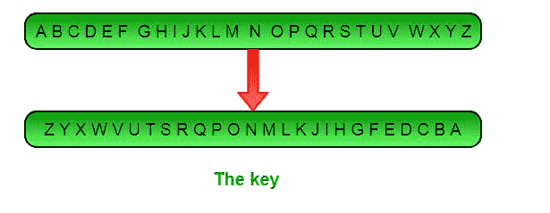

# 实现 Atbash 密码

> 原文:[https://www.geeksforgeeks.org/implementing-atbash-cipher/](https://www.geeksforgeeks.org/implementing-atbash-cipher/)

**定义:** Atbash 密码是一种只有一个特定密钥的替换密码，其中所有字母都是颠倒的，即 **A 到 Z** 和 **Z 到 A** 。它最初用于编码希伯来语字母，但它可以被修改为编码任何字母。

**与仿射的关系:** Atbash 密码可以认为是[仿射密码](https://www.geeksforgeeks.org/implementation-affine-cipher/)的特例，两个密钥均为 25，即 **a = 25 & b = 25**



阿特巴什键

**算法:**在 Atbash 算法中使用了以下键

```
ABCDEFGHIJKLMNOPQRSTUVWXYZ
ZYXWVUTSRQPONMLKJIHGFEDCBA

```

**加密**

要加密信息，在最上面一行找到你想加密的字母，然后用最下面一行的字母替换它。
在下面的例子中，我们对消息“极客对极客”进行加密。我们要加密的第一个字母是‘G’，它在‘T’之上，所以第一个密文字母是‘T’。下一个字母是“E”，它在“V”的上面，所以接下来是这个。整个消息被加密为:

```
GEEKS FOR GEEKS
TVVPH ULI TVVPH

```

**解密**

类似地，如果我们想解密说‘ULI TVVPH’我们会把第一个字母‘T’替换成‘G’。第二个字母“V”替换为“E”，以此类推，用“S”替换所有字母，包括最后一个“H”。破译的信息将是:

```
TVVPH ULI TVVPH
GEEKS FOR GEEKS

```

**方法:**在这里，每个元素的映射是针对字典中的“键值”对进行的，然后每当您想要加密单个字符时，它就被用作查找表。

**代码:**

```
# Python program to implement Atbash Cipher

# This script uses dictionaries to lookup various alphabets
lookup_table = {'A' : 'Z', 'B' : 'Y', 'C' : 'X', 'D' : 'W', 'E' : 'V',
        'F' : 'U', 'G' : 'T', 'H' : 'S', 'I' : 'R', 'J' : 'Q',
        'K' : 'P', 'L' : 'O', 'M' : 'N', 'N' : 'M', 'O' : 'L',
        'P' : 'K', 'Q' : 'J', 'R' : 'I', 'S' : 'H', 'T' : 'G',
        'U' : 'F', 'V' : 'E', 'W' : 'D', 'X' : 'C', 'Y' : 'B', 'Z' : 'A'}

def atbash(message):
    cipher = ''
    for letter in message:
        # checks for space
        if(letter != ' '):
            #adds the corresponding letter from the lookup_table
            cipher += lookup_table[letter]
        else:
            # adds space
            cipher += ' '

    return cipher

# Driver function to run the program
def main():
    #encrypt the given message
    message = 'GEEKS FOR GEEKS'
    print(atbash(message.upper()))

    #decrypt the given message
    message = 'TVVPH ULI TVVPH'
    print(atbash(message.upper()))

# Executes the main function
if __name__ == '__main__':
    main()
```

```
Output:
TVVPH ULI TVVPH
GEEKS FOR GEEKS

```

**优点:**由于它只是一个 a = 25 = b 的仿射密码，所以我们不需要编写单独的函数进行加密和解密。我们可以为这两个目的重用同一个函数。

**分析:**它有一个常量密钥，是最容易破解的密码，几乎不提供安全性。任何人都可以假设它是 atbash，并通过颠倒字母来解密消息。

本文由 [Palash Nigam](https://www.linkedin.com/in/palash25) 供稿。如果你喜欢 GeeksforGeeks 并想投稿，你也可以使用[contribute.geeksforgeeks.org](http://www.contribute.geeksforgeeks.org)写一篇文章或者把你的文章邮寄到 contribute@geeksforgeeks.org。看到你的文章出现在极客博客主页上，帮助其他极客。

如果你发现任何不正确的地方，或者你想分享更多关于上面讨论的话题的信息，请写评论。