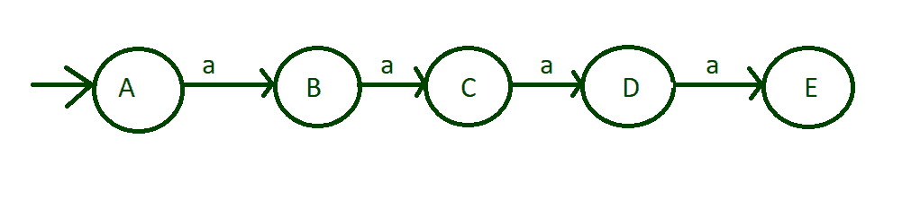
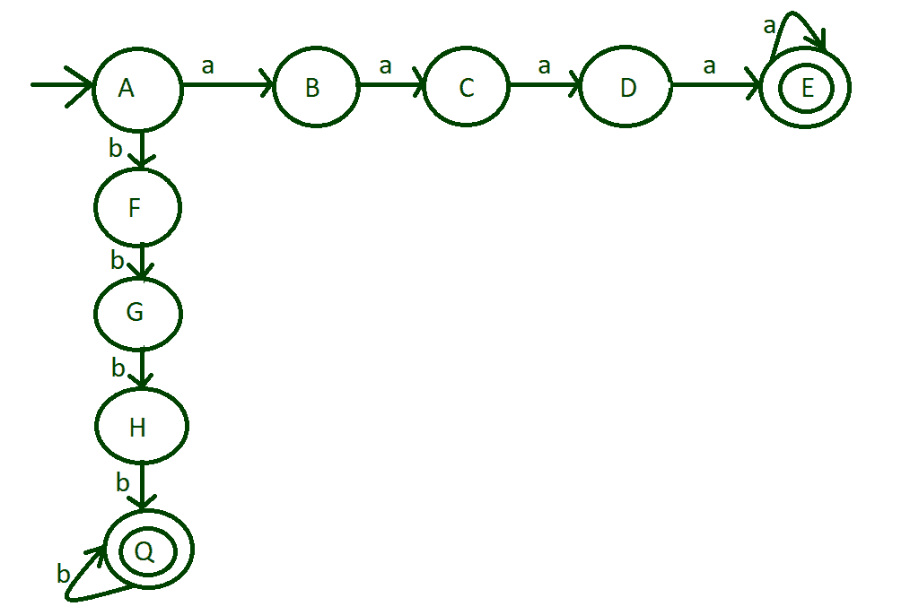
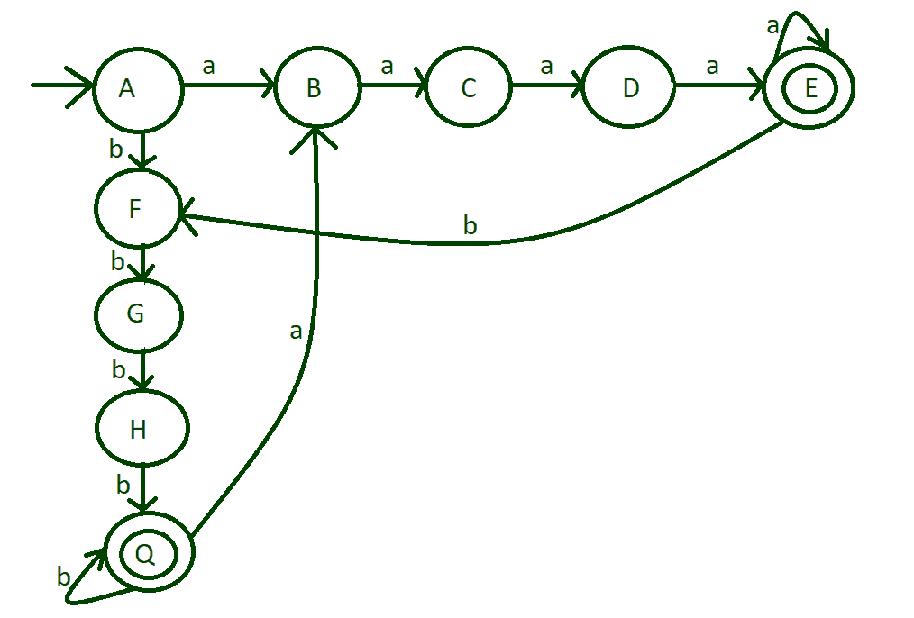
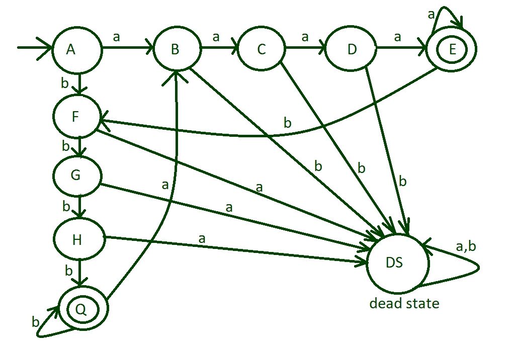
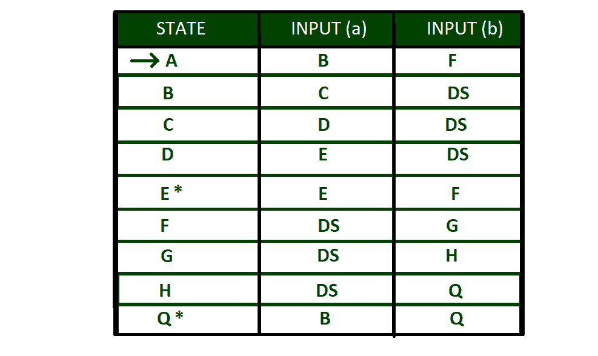

# 对输入(a，b)的长度不小于 4 的运行实施 DFA

> 原文:[https://www . geesforgeks . org/implementing-DFA-for-no-runs-length-小于 4 for-input-ab/](https://www.geeksforgeeks.org/implementing-dfa-for-no-runs-of-length-less-than-4-for-input-ab/)

[**DFA 或确定性有限自动机**](https://www.geeksforgeeks.org/introduction-of-finite-automata/) 是一种有限状态机，其中根据字符串接受的需要，根据一组定义的规则，在每个输入字母表上完成从一个状态到另一个状态的转换。
在这个特殊的问题中，**跑长度**是需要考虑的因素。输入字母为{a，b}。长度不小于 4 的运行意味着任何输入字母至少重复 4 次。

**示例:**

> **输入:**n = " aaabab "
> T3】输出:字符串不接受
> T6】说明:起始字母 a 至少不重复 4 次。因此 DFA 失败了。
> 
> **输入:**n =“aaababbaabaabaaa”
> 输出:字符串接受
> **解释:**a 和 b 的每个唯一出现至少重复 4 次。于是 DFA 通过了。

**一步一步设计 DFA:**
**第一步:**首先我们要考虑输入的是什么输入字母表。因为这至少有 4 段长度。取输入字母为‘A’on 的状态“A”，并将该状态标记为初始状态。输入“a”发生以下转换:

*   从状态“A”到状态“B”
*   从状态“B”到状态“C”
*   从状态“C”到状态“D”
*   从状态“D”到状态“E”



长度为 4 的游程输入

**步骤-2:** 与上述步骤一样，至少输入 4 a，这是可以接受的，因此使状态“E”成为最终状态。长度超过 4 的跑步也是可以接受的，所以把“a”的自我循环放在最终状态“E”上。


将状态“E”标记为最终状态

**步骤 3:** 到目前为止，机器设计都是用输入字母‘a’完成的。但输入字母“b”的状态“A”则留给处理。现在对状态“A”上的输入字母“b”执行相同的过程。输入“b”发生以下转换:

*   从状态“A”到状态“F”
*   从状态“F”到状态“G”
*   从状态“G”到状态“H”
*   从状态“H”到状态“Q”

将状态“Q”标记为最终状态。长度超过 4 的跑步也是可以接受的，所以把自我循环放到最终状态“Q”。



输入字母“b”转换

**步骤-4:** 到目前为止，我们只处理了单个输入 a 或 b，即 aaaa 和 bbbb，但现在处理两个输入，如 aaaabbbb 或 aaaabbbbaaaaa 等。
对于输入‘B’从状态“E”到状态“F”的转换以及输入‘a’从状态“Q”到状态“B”的转换。



**步骤 5:** 现在处理剩余的输入字母，到目前为止，设计的机器已经覆盖了所有可能的可接受情况，并且剩余的输入字母都不会进入死状态“DS”。



完工图纸

**上述 DFA 的过渡表:**
这里“A”是初始状态，“E”和“Q”是最终状态。DS 被称为死状态



过渡表

**上述 DFA 的 Python 实现:**

## 蟒蛇 3

```
def checkStateA(n):
    # if length of is 0
    # print string not accepted
    if(len(n)== 0):
        print("string not accepted")

    else:
        # if 'a' is found
        # call stateB function
        # else call stateF
        # function
        if(n[0]=='a'):
            stateB(n[1:])
        else:
            stateF(n[1:])

def stateB(n):
    # if length of is 0
    # print string not accepted
    if (len(n)== 0):
        print("string not accepted")

    else:   
        # if 'a' is found
        # call stateC function
        # print string not
        # accepted
        if(n[0]=='a'):
            stateC(n[1:])
        else:
            print("string not accepted")

def stateC(n):
    # if length of is 0
    # print string not accepted
    if (len(n)== 0):
        print("string not accepted")

    else:  
        # if 'a' is found
        # call stateD function
        # print string not
        # accepted
        if(n[0]=='a'):
            stateD(n[1:])
        else:
            print("string not accepted")

def stateD(n):
    # if length of is 0
    # print string not accepted
    if(len(n)== 0):
        print("string not accepted")

    else:   
        # if 'a' is found
        # call stateE function
        # print string not
        # accepted
        if(n[0]=='a'):
            stateE(n[1:])
        else:
            print("string not accepted")

def stateE(n):
    # if length of is 0
    # print string accepted
    if(len(n)== 0):
        print("string accepted")

    # if 'a' is found
    # call stateE function
    # if 'b' is found
    # call stateF function   
    elif(n[0]=='a'):
        stateE(n[1:])
    elif(n[0]=='b'):
        stateF(n[1:])

def stateF(n):
    # if length of is 0
    # print string not accepted
    if(len(n)== 0):
        print("string not accepteed")

    else:
        # if 'b' is found
        # call stateG function
        # print string not
        # accepted
        if(n[0]=='b'):
            stateG(n[1:])
        else:
            print("string not accepted")

def stateG(n):
    # if length of is 0
    # print string not accepted
    if(len(n)== 0):
        print("string not accepteed")

    else:   
        # if 'b' is found
        # call stateHfunction
        # print string not
        # accepted
        if(n[0]=='b'):
            stateH(n[1:])
        else:
            print("string not accepted")

def stateH(n):
    # if length of is 0
    # print string not accepted
    if(len(n)== 0):
        print("string not accepteed")

    else: 
        # if 'b' is found
        # call stateQ function
        # print string not
        # accepted
        if(n[0]=='b'):
            stateQ(n[1:])
        else:
            print("string not accepted") 

def stateQ(n):
    # if length of is 0
    # print string accepted
    if(len(n)== 0):
        print("string accepteed")

    else:  
        # if 'b' is found
        # call stateQ function
        # else call stateB function
        if(n[0]=='b'):
            stateQ(n[1:])
        elif(n[0]=='a'):
            stateB(n[1:])           

# Driver code
if __name__ == '__main__':

    # input string 1
    n ="aaaabbbbbaaaa"

    # function call to check the string
    checkStateA(n)

    # input string 2
    n ="aaaabbb"

    # function call to check the string
    checkStateA(n)
```

**Output:**

```
string accepted
string not accepteed
```