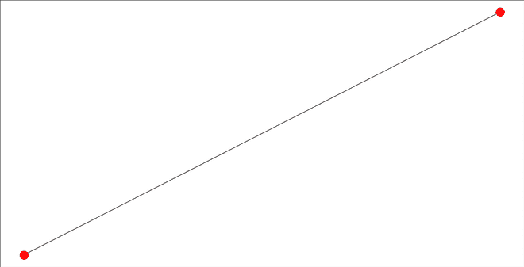
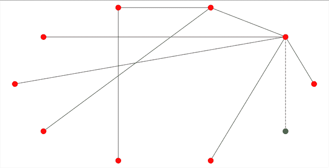

# 用 Python 中的巴拉巴斯艾伯特模型实现富起来变富现象

> 原文:[https://www . geeksforgeeks . org/impering-rich-变富-现象-使用-bara basi-Albert-model-in-python/](https://www.geeksforgeeks.org/implementing-rich-getting-richer-phenomenon-using-barabasi-albert-model-in-python/)

**先决条件-** [社交网络入门](https://www.geeksforgeeks.org/introduction-to-social-networks-using-networkx-in-python/)[巴拉巴斯阿尔伯特图](https://www.geeksforgeeks.org/barabasi-albert-graph-scale-free-models/)

在社交网络中，有一种现象叫做“越来越富”，也叫“优先依恋”。在优先依附中，一个已经富有的人得到的越来越多，一个拥有的越来越少的人得到的越来越少。这就是所谓的富人越来越富现象或优先依附。

例如，假设一个班级里有一些学生，每个学生都是一些学生的朋友，这被称为它的学位，即一个学生的学位是它有多少朋友。现在学历高的学生有钱，学历低的学生穷。现在假设班上来了一个新同学，他/她要交 m 个朋友，那么他/她会选择学历高的同学，和他们成为朋友，这样就增加了富裕程度。这叫**富起来越富**或者**优惠附加**。

巴拉巴斯·艾伯特模型是优先依附的实现。

**逻辑–**以下是巴拉巴斯阿尔伯特模型背后的逻辑:

1.  取一个 n <sub>0</sub> 个节点的随机图，以每个节点至少有 1 条链路为条件，随机连接。
2.  每次我们添加一个小于或等于 n <sub>0</sub> 链路的新节点 n，它将把新节点连接到网络中已经存在的 n 个节点。
3.  现在一个节点连接到一个特定节点的概率将取决于它的程度。(优先附件)。

**方法–**以下是实施巴拉巴斯阿尔伯特模型的步骤:

1.  取一个有 n 个节点的图。
2.  从用户处获取 m，即要连接到新节点的边数。
3.  取 m0，即初始节点数，使得 m<=m0。
4.  现在添加 n-m0 节点。
5.  现在根据优先附件向这些 n-m0 节点添加边。

下面是巴拉巴斯阿尔伯特模型的实现。

## 蟒蛇 3

```
import networkx as nx
import random
import matplotlib.pyplot as plt

def display(g, i, ne):
    pos = nx.circular_layout(g)

    if i == '' and ne == '':
        new_node = []
        rest_nodes = g.nodes()
        new_edges = []
        rest_edges = g.edges()
    else:
        new_node = [i]
        rest_nodes = list(set(g.nodes()) - set(new_node))
        new_edges = ne
        rest_edges = list(set(g.edges()) - set(new_edges) - set([(b, a) for (a, b) in new_edges]))
    nx.draw_networkx_nodes(g, pos, nodelist=new_node, node_color='g')
    nx.draw_networkx_nodes(g, pos, nodelist=rest_nodes, node_color='r')
    nx.draw_networkx_edges(g, pos, edgelist=new_edges, style='dashdot')
    nx.draw_networkx_edges(g, pos, edgelist=rest_edges,)
    plt.show()

def barabasi_add_nodes(g, n, m0):
    m = m0 - 1

    for i in range(m0 + 1, n + 1):
        g.add_node(i)
        degrees = nx.degree(g)
        node_prob = {}

        s = 0
        for j in degrees:
            s += j[1]
        print(g.nodes())

        for each in g.nodes():
            node_prob[each] = (float)(degrees[each]) / s

        node_probabilities_cum = []
        prev = 0

        for n, p in node_prob.items():
            temp = [n, prev + p]
            node_probabilities_cum.append(temp)
            prev += p

        new_edges = []
        num_edges_added = 0
        target_nodes = []

        while (num_edges_added < m):
            prev_cum = 0
            r = random.random()
            k = 0

            while (not (r > prev_cum and r <= node_probabilities_cum[k][1])):
                prev_cum = node_probabilities_cum[k][1]
                k = k + 1
            target_node = node_probabilities_cum[k][0]

            if target_node in target_nodes:
                continue

            else:
                target_nodes.append(target_node)
            g.add_edge(i, target_node)
            num_edges_added += 1
            new_edges.append((i, target_node))

        print(num_edges_added, ' edges added')

    display(g, i, new_edges)
    return g

def plot_deg_dist(g):
    all_degrees = []

    for i in nx.degree(g):
        all_degrees.append(i[1])
    unique_degrees = list(set(all_degrees))
    unique_degrees.sort()
    count_of_degrees = []

    for i in unique_degrees:
        c = all_degrees.count(i)
        count_of_degrees.append(c)

    print(unique_degrees)
    print(count_of_degrees)

    plt.plot(unique_degrees, count_of_degrees, 'ro-')
    plt.xlabel('Degrees')
    plt.ylabel('Number of Nodes')
    plt.title('Degree Distribution')
    plt.show()

N = 10
m0 = random.randint(2, N / 5)
g = nx.path_graph(m0)
display(g, '', '')

g = barabasi_add_nodes(g, N, m0)
plot_deg_dist(g)
```

**输出:**

```
Enter the value of n: 10
3
[0, 1, 3]
1  edges added
[0, 1, 3, 4]
1  edges added
[0, 1, 3, 4, 5]
1  edges added
[0, 1, 3, 4, 5, 6]
1  edges added
[0, 1, 3, 4, 5, 6, 7]
1  edges added
[0, 1, 3, 4, 5, 6, 7, 8]
1  edges added
[0, 1, 3, 4, 5, 6, 7, 8, 9]
1  edges added
[0, 1, 3, 4, 5, 6, 7, 8, 9, 10]
1  edges added
[1, 2, 3, 6]
[7, 1, 1, 1]

```



具有 m0 节点的初始图



添加了新节点的最终节点


分布图