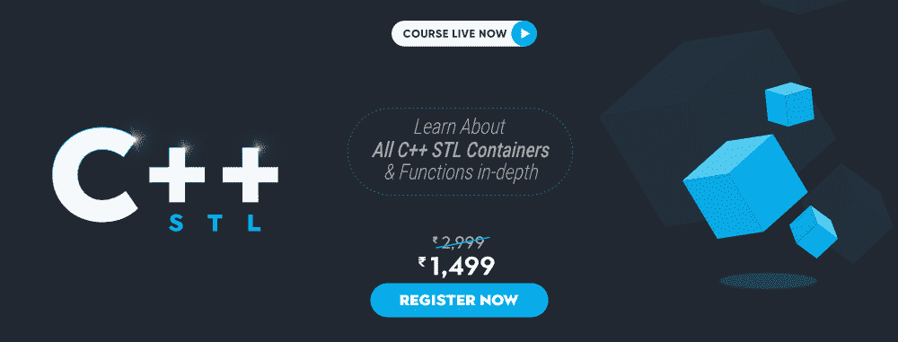

# c++中 STL 组件的重要功能

> 原文:[https://www . geesforgeks . org/重要功能-STL-of-components-in-c/](https://www.geeksforgeeks.org/important-functions-of-stl-components-in-c/)

## C++

```
// C++ code
#include <iostream>
#include <utility>
using namespace std;

int main()
{
    // Declaring the PAIR1 of int and char
    // IF pair is not initialized then ,
    // default value of int/double is 0 and
    // for string/char it is NULL
    pair<int, char> PAIR1;
    cout << PAIR1.first << " ";

    // NULL value therefore, not displayed
    cout << PAIR1.second
         << endl;

    // Initializing the pair during it's Declaration
    pair<string, double> PAIR2("GeeksForGeeks", 1.23);
    cout << PAIR2.first << " ";
    cout << PAIR2.second << endl;

    pair<string, double> PAIR3;

    // Inserting Value in pair using make_pair function
    PAIR3 = make_pair("GeeksForGeeks is Best", 4.56);
    cout << PAIR3.first << " ";
    cout << PAIR3.second << endl;

    pair<int, int> PAIR4;

    // Inserting Value in pair using {}(curly brackets)
    PAIR4 = { 4, 8 };
    cout << PAIR4.first << " ";
    cout << PAIR4.second << endl;

    return 0;
}
```

STL 提供了一系列在各种场景中非常有用的数据结构。很多数据结构都是基于现实应用的。它是容器类、算法和迭代器的库。它是一个通用库，因此，它的组件是参数化的。

[](https://practice.geeksforgeeks.org/courses/cpp-stl)

### **最常用的数据结构是:**

1.  [矢量](https://www.geeksforgeeks.org/vector-in-cpp-stl/)
2.  [堆叠](https://www.geeksforgeeks.org/stack-in-cpp-stl/)
3.  队列
4.  [优先级队列](https://www.geeksforgeeks.org/priority-queue-set-1-introduction/)
5.  [设置](https://www.geeksforgeeks.org/set-in-cpp-stl/)
6.  [列表](https://www.geeksforgeeks.org/list-cpp-stl/)
7.  [有序地图](https://www.geeksforgeeks.org/map-associative-containers-the-c-standard-template-library-stl/)
8.  [无序地图](https://www.geeksforgeeks.org/unordered_map-in-cpp-stl/)

容器或容器类存储对象和数据。总共有七个标准的“一级”容器类和三个容器适配器类，只有七个头文件提供对这些容器或容器适配器的访问。

**注意:**我们可以只包含一个库，即**#包含<位/stdc++。h >** 包括所有的 [STL](https://www.geeksforgeeks.org/the-c-standard-template-library-stl/) 库，但是在某些比赛中，包括这个库会让代码变慢。为了克服这个问题，我们可以添加特定的库来访问 **STL** 的特定数据结构。此外，在移除元素时，需要注意数据结构是否为空。对空数据结构调用 remove 函数会导致错误。以下是一些[数据结构](https://www.geeksforgeeks.org/data-structures/)及其图示

1.  [**向量**](https://www.geeksforgeeks.org/vector-in-cpp-stl/) **:** 使用数组时的主要问题是我们必须指定大小。向量克服了这个缺点。向量在内部作为动态分配的数组工作，这是我们如何在不指定向量大小的情况下添加元素的主要原因。当向量的大小等于容量时，向量的容量增加，因此我们可以添加更多的元素。

**头文件:**

> #包括

**语法:**

> 向量<data type="">变量 _ 名称；</data>

**向量最常见的函数:**

1.  [push_back():](https://www.geeksforgeeks.org/vectorpush_back-vectorpop_back-c-stl/) 用于推送向量末尾的元素。要获得更快的方法，请使用[定位 _ 后退()](https://www.geeksforgeeks.org/vectoremplace_back-c-stl/)。
2.  [pop_back():](https://www.geeksforgeeks.org/vectorpush_back-vectorpop_back-c-stl/) 用于从向量中移除最后一个元素。
3.  [size()](https://www.geeksforgeeks.org/vectorempty-vectorsize-c-stl/) :返回向量的大小。
4.  [清除()](https://www.geeksforgeeks.org/vector-erase-and-clear-in-cpp/):删除矢量的所有内容。
5.  [erase()](https://www.geeksforgeeks.org/vector-erase-and-clear-in-cpp/) :删除指定的索引或数据。
6.  [空()](https://www.geeksforgeeks.org/vectorempty-vectorsize-c-stl/):如果向量为空，返回布尔值 True，否则返回 False。
7.  [迭代器下界](https://www.geeksforgeeks.org/lower_bound-in-cpp/)(迭代器第一，迭代器最后，常量 val):下界返回一个迭代器，指向范围[第一，最后]中值不小于‘val’的第一个元素。
8.  [迭代器上界](https://www.geeksforgeeks.org/upper_bound-in-cpp/)(迭代器第一，迭代器最后，常量 val):上界返回一个迭代器，指向范围【第一，最后】中的第一个元素，该元素的值大于**“val”。**

## C++

```
// C++ program to illustrate the
// function of vector in C++
#include <iostream>

// Header file for vector if
// <bits/stdc++.h> not included
#include <vector>
using namespace std;

// Function to print the vector
void print(vector<int> vec)
{

    // vec.size() gives the size
    // of the vector
    for (int i = 0; i < vec.size(); i++) {
        cout << vec[i] << " ";
    }

    cout << endl;
}

// Driver Code
int main()
{
    // Defining a vector
    vector<int> vec;

    // Put all natural numbers
    // from 1 to 10 in vector
    for (int i = 1; i <= 10; i++) {
        vec.push_back(i);
    }

    cout << "Initial vector: ";

    // print the vector
    print(vec);

    // Size of vector
    cout << "Vector size: " << vec.size() << "\n";

    // Check of vector is empty
    if (vec.empty() == false)
        cout << "Is vector is"
             << " empty: False\n";

    // Popping out 10 form the vector
    vec.pop_back();
    cout << "Vector after popping: ";
    print(vec);

    // Deleting the first element
    // from the vector using erase()
    vec.erase(vec.begin());
    cout << "Vector after erase"
         << " first element: ";
    print(vec);

    // Clear the vector
    vec.clear();
    cout << "Vector after "
         << "clearing: None ";
    print(vec);

    // Check if vector is empty
    if (vec.empty() == true)
        cout << "Is vector is"
             << " empty: True\n";
}
```

**Output**

```
Initial vector: 1 2 3 4 5 6 7 8 9 10 
Vector size: 10
Is vector is empty: False
Vector after popping: 1 2 3 4 5 6 7 8 9 
Vector after erase first element: 2 3 4 5 6 7 8 9 
Vector after clearing: None 
Is vector is empty: True
```

[**2。堆栈**](https://www.geeksforgeeks.org/stack-data-structure/) **:** 是后进先出(LIFO)数据结构。它可以使用数组、链表和向量来实现。一些问题，如元素或字符串的反转、括号检查、打印下一个更大的元素、后缀表达式等，可以使用堆栈类来完成，而不是让所有的函数都使用它的内置函数。
**头文件:**

> #包括<stack></stack>

**语法:**

> 栈<data_type>变量 _ 名称；</data_type>

**堆栈最常见的功能:**

1.  [push():](https://www.geeksforgeeks.org/stack-push-and-pop-in-c-stl/) 用于推栈顶元素。
2.  [pop():](https://www.geeksforgeeks.org/stack-push-and-pop-in-c-stl/) 删除栈顶元素，但不返回。
3.  [top():](https://www.geeksforgeeks.org/stack-top-c-stl/) 返回堆栈的顶部元素。
4.  [empty():](https://www.geeksforgeeks.org/stack-empty-and-stack-size-in-c-stl/) 返回布尔值，即如果堆栈为空则为 True，否则返回 false。
5.  [size():](https://www.geeksforgeeks.org/stack-empty-and-stack-size-in-c-stl/) 返回堆栈的大小。

## C++

```
// C++ program to illustrate the
// function of stack in C++
#include <iostream>

// Header file for stack
#include <stack>
using namespace std;

// Function to print the stack
void print(stack<char> s)
{

    // Loops runs till stack
    // becomes empty
    while (s.empty() == false) {

        // Prints the top element
        cout << s.top() << " ";

        // Now pops the same top element
        s.pop();
    }

    cout << "\n";
}

// Driver Code
int main()
{
    // Given char array
    char array[]
        = { 'G', 'E', 'E', 'K',
            'S', 'F', 'O', 'R', 'G',
            'E', 'E', 'K', 'S' };

    // Defining stack
    stack<char> s;

    // Check if stack is empty
    if (s.empty() == true) {
        cout << "Stack is currently Empty"
            << "\n";
    }
    else {
        cout << "Stack is not empty"
            << "\n";
    }

    // Push elements in stack
    for (int i = sizeof(array) / sizeof(array[0]) - 1;
        i >= 0; i--) {
        s.push(array[i]);
    }

    // Size of stack
    cout << "Size of stack: "
        << s.size() << "\n";

    // Content of stack
    cout << "Stack initially: ";
    print(s);

    // Returning the top
    // element of the stack
    cout << "Top element: "
        << s.top() << "\n";

    // Popping the top
    // element in stack
    s.pop();

    cout << "Stack after 1"
        << "pop operation: ";
    print(s);

    // Now checking the top element
    cout << "Top element after popping: "
        << s.top() << "\n";

    // Size of stack
    cout << "Size of stack"
        << "after popping: "
        << s.size() << "\n";

    // Again checking if the
    // stack is empty
    if (s.empty() == true) {
        cout << "Stack is currently Empty"
            << "\n";
    }
    else {
        cout << "Stack is not empty"
            << "\n";
    }
    return 0;
}
```

**Output**

```
Stack is currently Empty
Size of stack: 13
Stack initially: G E E K S F O R G E E K S 
Top element: G
Stack after 1pop operation: E E K S F O R G E E K S 
Top element after popping: E
Size of stackafter popping: 12
Stack is not empty
```

[**3。队列**](https://www.geeksforgeeks.org/queue-data-structure/) **:** 是先进先出(FIFO)数据结构。我们要求队列的原因是使用了大量先进先出的实际应用，以及何时不需要提前处理数据。例如，在购买演出门票的队列中，先进入队列的人会先拿到门票。它可以像堆栈一样使用数组、链表和向量来实现。队列的一些应用包括树和图的级序遍历，资源共享等。
**头文件:**

> #包括

**语法:**

> 队列<data type="">变量 _ 名称；</data>

**队列最常见的功能:**

1.  [push():](https://www.geeksforgeeks.org/queuepush-and-queuepop-in-cpp-stl/) 用于推送队列后面的元素
2.  [pop():](https://www.geeksforgeeks.org/queuepush-and-queuepop-in-cpp-stl/) 删除队列的前元素，但不返回。
3.  [front():](https://www.geeksforgeeks.org/queuefront-queueback-c-stl/) 返回队列的前元素，或行中第一个元素。
4.  [empty():](https://www.geeksforgeeks.org/queueempty-queuesize-c-stl/) 返回布尔值，即如果队列为空，则返回 True，否则返回 false
5.  [back():](https://www.geeksforgeeks.org/queuefront-queueback-c-stl/) 返回队列的最后一个元素。
6.  [size():](https://www.geeksforgeeks.org/queueempty-queuesize-c-stl/) 返回队列的大小。

## C++

```
// C++ program to illustrate the
// function of vector in C++
#include <iostream>

// Header file for queue
#include <queue>
using namespace std;

// Function to print the queue
void print(queue<char> q)
{
    for (int i = 0; i < q.size(); i++) {

        // Printing the front element
        cout << q.front() << " ";

        // Popping the front element
        q.pop();
    }

    cout << "\n";
}

// Driver Code
int main()
{
    // Given array
    char array[]
        = { 'G', 'E', 'E', 'K', 'S' };

    // Defining queue
    queue<char> q;

    if (q.empty() == true) {
        cout << "Queue is empty\n";
    }

    for (int i = 0; i < 5; i++) {
        q.push(array[i]);
    }

    cout << "Queue Initially: ";
    print(q);

    // Front element
    cout << "Front element: "
        << q.front() << "\n";

    // Back element
    cout << "Back Element: "
        << q.back() << "\n";

    // Size of queue
    cout << "Size of queue: "
        << q.size() << "\n";

    // Empty
    if (q.empty() == false) {
        cout << "Queue is not empty\n";
    }
    return 0;
}
```

**Output**

```
Queue is empty
Queue Initially: G E E 
Front element: G
Back Element: S
Size of queue: 5
Queue is not empty

```