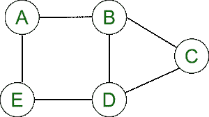
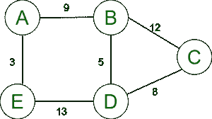
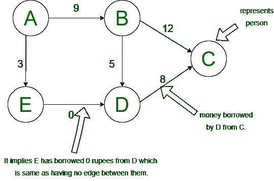
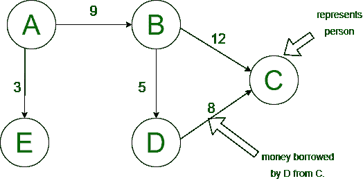
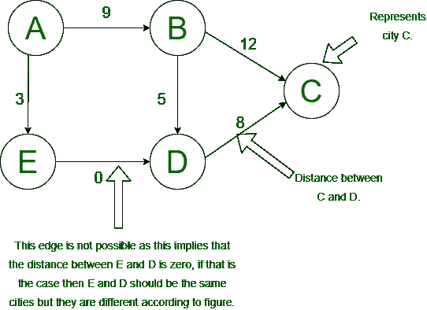

# 在加权图中，是否允许零作为边的权重？

> 原文:[https://www . geesforgeks . org/in-a-weighted-graph-is-zero-allowed-as-edges-weight/](https://www.geeksforgeeks.org/in-a-weighted-graph-is-zero-allowed-as-an-edges-weight/)

在本文中，我们将讨论[图](https://www.geeksforgeeks.org/graph-data-structure-and-algorithms/)的概述，并将重点讨论一个场景，其中加权图“零”被允许作为边的权重。下面我们一个一个来讨论。

**概述:**
图被定义为 G(V，E)，其中 V 是一组顶点，E 是一组边。从一个对象到另一个对象的互连点称为顶点，将顶点从一个对象连接到另一个对象的链接称为边。

**例–**
请看下图如下。



图形的图形表示。

在上图中，G(V，E)如下。

```
Vertices(V)  = {A,B,C,D,E}
Edges(E)     = {AB,AE,ED,BD,BC,CD}
```

**加权图:**
加权图是这样一种图，其中每条边都标有一个数字，称为该边的权重。



加权图的图形表示

**示例–**
例如，上图的顶点可能代表印度的某些城镇，而边可能代表城镇之间的道路，并标记了它们的分离距离。

**在加权图中，是否允许零作为边的权重:**
上面问题的简单答案是，如果零加权边对你有帮助，你可以自由使用它们，但一定要让读者知道。下面两种情况代表了零加权边能不能用取决于情况。

**CASE-1:** **允许零加权边–**

**第一步:**
假设在你的图中，顶点代表一个人。边重表示一个人向另一个人借的钱。



图 1



图 2

**Step-2 :**
那么，在这种情况下，零加权边将代表 person-1 向 person-2 借了钱 0，这将意味着 person-1 没有向 person-2 借任何钱，这与没有边是一样的。

**Step-3 :**
所以，从上面的图中，我们可以看到图-1 和图-2 是一样的。在这种情况下，允许零权重边。

**CASE-2 :**
**不允许零加权边–**

**Step-1 :**
假设在你的图中，顶点代表城市，边代表这些城市之间的道路，边权重代表两个城市之间的距离。



图 3

**Step-2 :**
在这种情况下，零加权边是不允许的，因为城市 E 和 D 之间的距离为零，所以 E 和 D 应该是相同的城市，这意味着 E 应该等于 D，但这是不可能的，它们是不同的，所以这里我们不能使用零加权边。

**第三步:**
我们不能在这里使用零加权边。