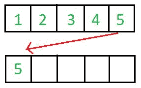
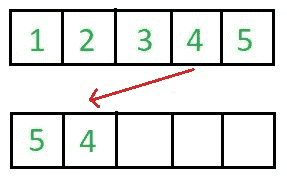
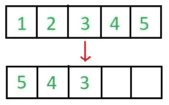
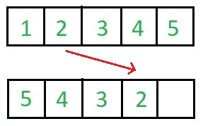
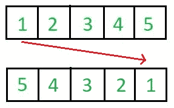
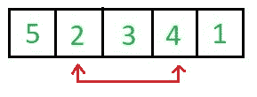
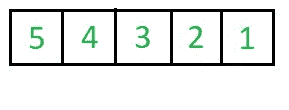

# 原位算法

> 原文:[https://www.geeksforgeeks.org/in-place-algorithm/](https://www.geeksforgeeks.org/in-place-algorithm/)

就地有多个定义。一**严格定义**是。

> 就地算法是一种不需要额外空间的算法，通过“就地”转换输入，在包含数据的同一内存中产生输出。但是，允许为变量使用小的常量额外空间。

更宽泛的定义是，

> 就地意味着算法不使用额外的空间来操纵输入，但可能需要很小但非恒定的额外空间来操作。通常，这个空间是 O(对数 n)，尽管有时 O(n)(小于线性)中的任何东西都是允许的。

一个**不在原位**实现反转一个数组

## C++

```
// An Not in-place C++ program to reverse an array
#include <bits/stdc++.h>
using namespace std;

/* Function to reverse arr[] from start to end*/
void revereseArray(int arr[], int n)
{
   // Create a copy array and store reversed
   // elements
   int rev[n];
   for (int i=0; i<n; i++)
       rev[n-i-1] = arr[i];

   // Now copy reversed elements back to arr[]
   for (int i=0; i<n; i++)
       arr[i] = rev[i];
}     

/* Utility function to print an array */
void printArray(int arr[], int size)
{
   for (int i = 0; i < size; i++)
      cout << arr[i] << " "; 
   cout << endl;
} 

/* Driver function to test above functions */
int main() 
{
    int arr[] = {1, 2, 3, 4, 5, 6};     
    int n = sizeof(arr)/sizeof(arr[0]);
    printArray(arr, n);     
    revereseArray(arr, n);     
    cout << "Reversed array is" << endl;
    printArray(arr, n);     
    return 0;
}
```

## Java 语言(一种计算机语言，尤用于创建网站)

```
// An Not in-place Java program
// to reverse an array
import java.util.*;

class GFG
{
    /* Function to reverse arr[]
       from start to end*/
    public static void revereseArray(int []arr, 
                                     int n)
    {
        // Create a copy array
        // and store reversed
        // elements
        int []rev = new int[n];
        for (int i = 0; i < n; i++)
            rev[n - i - 1] = arr[i];

        // Now copy reversed 
        // elements back to arr[]
        for (int i = 0; i < n; i++)
            arr[i] = rev[i];
    } 

    /* Utility function to
       print an array */
    public static void printArray(int []arr, 
                                  int size)
    {
    for (int i = 0; i < size; i++)
        System.out.print(arr[i] + " ");
    System.out.println("");
    } 

    // Driver code
    public static void main(String[] args) 
    {
        int arr[] = {1, 2, 3, 4, 5, 6}; 
        int n = arr.length;
        printArray(arr, n); 
        revereseArray(arr, n); 
        System.out.println("Reversed array is");
        printArray(arr, n); 
    }
}

// This code is contributed
// by Harshit Saini
```

## 蟒蛇 3

```
# An Not in-place Python program 
# to reverse an array

''' Function to reverse arr[]
    from start to end '''
def revereseArray(arr, n):

    # Create a copy array 
    # and store reversed
    # elements
    rev = n * [0]
    for i in range(0, n):
        rev[n - i - 1] = arr[i]

    # Now copy reversed
    # elements back to arr[]
    for i in range(0, n):
        arr[i] = rev[i]

# Driver code
if __name__ == "__main__":
    arr = [1, 2, 3, 4, 5, 6]
    n = len(arr)
    print(*arr) 
    revereseArray(arr, n); 
    print("Reversed array is")
    print(*arr) 

# This code is contributed
# by Harshit Saini
```

## C#

```
// An Not in-place C# program
// to reverse an array
using System;

class GFG
{
    /* Function to reverse arr[]
    from start to end*/
    public static void revereseArray(int[] arr, 
                                    int n)
    {
        // Create a copy array
        // and store reversed
        // elements
        int[] rev = new int[n];
        for (int i = 0; i < n; i++)
            rev[n - i - 1] = arr[i];

        // Now copy reversed 
        // elements back to arr[]
        for (int i = 0; i < n; i++)
            arr[i] = rev[i];
    } 

    /* Utility function to
    print an array */
    public static void printArray(int[] arr, 
                                int size)
    {
    for (int i = 0; i < size; i++)
        Console.Write(arr[i] + " ");
    Console.Write("\n");
    } 

    // Driver code
    public static void Main() 
    {
        int[] arr = {1, 2, 3, 4, 5, 6}; 
        int n = arr.Length;
        printArray(arr, n); 
        revereseArray(arr, n); 
        Console.WriteLine("Reversed array is");
        printArray(arr, n); 
    }
}

// This code is contributed by Ita_c.
```

## java 描述语言

```
<script>
// An Not in-place Javascript program
// to reverse an array

    /* Function to reverse arr[]
       from start to end*/
    function revereseArray(arr,n)
    {
        // Create a copy array
        // and store reversed
        // elements
        let rev = new Array(n);
        for (let i = 0; i < n; i++)
            rev[n - i - 1] = arr[i];

        // Now copy reversed 
        // elements back to arr[]
        for (let i = 0; i < n; i++)
            arr[i] = rev[i];
    }

    /* Utility function to
       print an array */
    function printArray(arr,size)
    {
        for (let i = 0; i < size; i++)
            document.write(arr[i] + " ");
        document.write("<br>");
    }

    // Driver code
    let arr=[1, 2, 3, 4, 5, 6];
    let n = arr.length;
    printArray(arr, n); 
    revereseArray(arr, n); 
    document.write("Reversed array is<br>");
    printArray(arr, n); 

    // This code is contributed by rag2127
</script>
```

**Output:** 

```
1 2 3 4 5 6 
Reversed array is
6 5 4 3 2 1
```

  





这需要 O(n)个额外空间，是一个不在位算法的例子。
一个**原位**实现的反转阵列。

## C++

```
// An in-place C++ program to reverse an array
#include <bits/stdc++.h>
using namespace std;

/* Function to reverse arr[] from start to end*/
void revereseArray(int arr[], int n)
{
   for (int i=0; i<n/2; i++)
     swap(arr[i], arr[n-i-1]);
}     

/* Utility function to print an array */
void printArray(int arr[], int size)
{
   for (int i = 0; i < size; i++)
      cout << arr[i] << " "; 
   cout << endl;
} 

/* Driver function to test above functions */
int main() 
{
    int arr[] = {1, 2, 3, 4, 5, 6}; 
    int n = sizeof(arr)/sizeof(arr[0]); 
    printArray(arr, n);     
    revereseArray(arr, n);     
    cout << "Reversed array is" << endl;
    printArray(arr, n);     
    return 0;
}
```

## Java 语言(一种计算机语言，尤用于创建网站)

```
// An in-place Java program
// to reverse an array
import java.util.*;

class GFG
{
    public static int __(int x, int y) {return x;}

    /* Function to reverse arr[] 
       from start to end*/
    public static void revereseArray(int []arr, 
                                     int n)
    {
        for (int i = 0; i < n / 2; i++)
            arr[i] = __(arr[n - i - 1], 
                        arr[n - i - 1] = arr[i]);
    } 

    /* Utility function to 
       print an array */
    public static void printArray(int []arr, 
                                  int size)
    {
        for (int i = 0; i < size; i++)
            System.out.print(Integer.toString(arr[i]) + " "); 
        System.out.println("");
    } 

    // Driver code
    public static void main(String[] args) 
    {
        int []arr = new int[]{1, 2, 3, 4, 5, 6}; 
        int n = arr.length;
        printArray(arr, n); 
        revereseArray(arr, n); 
        System.out.println("Reversed array is");
        printArray(arr, n); 
    }
}

// This code is contributed 
// by Harshit Saini
```

## 蟒蛇 3

```
# An in-place Python program
# to reverse an array

''' Function to reverse arr[]
    from start to end'''
def revereseArray(arr, n):

    for i in range(0, int(n / 2)):
        arr[i], arr[n - i - 1] = arr[n - i - 1], arr[i]

# Driver code
if __name__ == "__main__":

    arr = [1, 2, 3, 4, 5, 6]
    n = len(arr)
    print(*arr)
    revereseArray(arr, n) 
    print("Reversed array is")
    print(*arr)

# This code is contributed 
# by Harshit Saini
```

## C#

```
// An in-place C# program
// to reverse an array
using System; 

class GFG
{
    public static int __(int x, int y) {return x;}

    /* Function to reverse arr[] 
    from start to end*/
    public static void revereseArray(int []arr, 
                                    int n)
    {
        for (int i = 0; i < n / 2; i++)
            arr[i] = __(arr[n - i - 1], 
                        arr[n - i - 1] = arr[i]);
    } 

    /* Utility function to 
    print an array */
    public static void printArray(int []arr, 
                                int size)
    {
        for (int i = 0; i < size; i++)
            Console.Write(arr[i] + " "); 
        Console.WriteLine("");
    } 

    // Driver code
    public static void Main(String[] args) 
    {
        int []arr = new int[]{1, 2, 3, 4, 5, 6}; 
        int n = arr.Length;
        printArray(arr, n); 
        revereseArray(arr, n); 
        Console.WriteLine("Reversed array is");
        printArray(arr, n); 
    }
}

/* This code is contributed by PrinciRaj1992 */
```

## java 描述语言

```
<script>
// An in-place Javascript program
// to reverse an array

    function  __(x,y)
    {
        return x;
    }

    /* Function to reverse arr[]
       from start to end*/
    function revereseArray(arr,n)
    {
        for (let i = 0; i < n / 2; i++)
            arr[i] = __(arr[n - i - 1],
                        arr[n - i - 1] = arr[i]);
    }

    /* Utility function to
       print an array */
    function printArray(arr,size)
    {
        for (let i = 0; i < size; i++)
            document.write(arr[i] + " ");
        document.write("<br>");
    }

    // Driver code
    let arr=[1, 2, 3, 4, 5, 6];
    let n = arr.length;
    printArray(arr, n);
    revereseArray(arr, n);
    document.write("Reversed array is<br>");
    printArray(arr, n);

// This code is contributed by avanitrachhadiya2155
</script>
```

**Output:** 

```
1 2 3 4 5 6 
Reversed array is
6 5 4 3 2 1
```

  

这需要 O(1)个额外的空间来交换元素，是就地算法的一个例子。
**哪些排序算法到位，哪些不到位？**
就位:[冒泡排序](https://www.geeksforgeeks.org/bubble-sort/)[选择排序](https://www.geeksforgeeks.org/selection-sort/)[插入排序](https://www.geeksforgeeks.org/insertion-sort/)[堆积排序](https://www.geeksforgeeks.org/heap-sort/)。
不在位:[合并排序](https://www.geeksforgeeks.org/merge-sort/)。请注意，合并排序需要 O(n)个额外空间。
**那么** [**快速排序**](https://www.geeksforgeeks.org/quick-sort/) **呢？为什么叫就地？**
快速排序使用额外的空间进行递归函数调用。根据宽泛的定义，它被就地调用，因为所需的额外空间不用于操作输入，而仅用于递归调用。