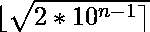

# N 位数最小三角数索引

> 原文:[https://www . geesforgeks . org/n 位数最小三角数索引/](https://www.geeksforgeeks.org/index-of-smallest-triangular-number-with-n-digits/)

给定一个数字 **N** ，任务是用 **N 位数**找到最小[三角数](https://www.geeksforgeeks.org/triangular-numbers/)的索引。

> 如果我们能以点的三角形网格的形式来表示一个数，使得这些点形成一个等边三角形，并且每行包含与行号一样多的点，即第一行有一个点，第二行有两个点，第三行有三个点，以此类推，那么这个数就被称为三角形数。起始三角数是 1、3、6、10、15、21、28…………

**例:**

> **输入:** N = 2
> **输出:**4
> 2 位数最小三角数= 10，4 为 10 的索引。
> **输入:** N = 3
> **输出:** 14
> 最小三角数，其中
> 3 位数= 105，14 为 105 的索引。

**方法:**问题中的关键观察是 N 位数的最小三角数的索引组成一个数列–

```
1, 4, 14, 45, 141...
```

N 位最小三角数指标的项为
以下为上述方法的实施:

## C++

```
// C++ implementation of
// the above approach

#include <bits/stdc++.h>
using namespace std;

// Function to return index of smallest
// triangular no n digits
int findIndex(int n)
{
    float x = sqrt(2 * pow(10, (n - 1)));
    return round(x);
}

// Driver Code
int main()
{
    int n = 3;
    cout << findIndex(n);

    return 0;
}
```

## Java 语言(一种计算机语言，尤用于创建网站)

```
// Java implementation of the above approach
class GFG{

// Function to return index of smallest
// triangular no n digits
static double findIndex(int n)
{
    double x = Math.sqrt(2 * Math.pow(10, (n - 1)));
    return Math.round(x);
}

// Driver code
public static void main(String[] args)
{
    int n = 3;
    System.out.print(findIndex(n));
}
}

// This code is contributed by shubham
```

## 蟒蛇 3

```
# Python3 implementation of
# the above approach
import math

# Function to return index of smallest
# triangular no n digits
def findIndex(n):

    x = math.sqrt(2 * math.pow(10, (n - 1)));
    return round(x);

# Driver Code
n = 3;
print(findIndex(n));

# This code is contributed by Code_Mech
```

## C#

```
// C# implementation of the above approach
using System;
class GFG{

// Function to return index of smallest
// triangular no n digits
static double findIndex(int n)
{
    double x = Math.Sqrt(2 * Math.Pow(10, (n - 1)));
    return Math.Round(x);
}

// Driver code
public static void Main(String[] args)
{
    int n = 3;
    Console.Write(findIndex(n));
}
}

// This code is contributed by AbhiThakur
```

## java 描述语言

```
<script>

// Javascript implementation of the above approach

    // Function to return index of smallest
    // triangular no n digits
    function findIndex( n) {
        let x = Math.sqrt(2 * Math.pow(10, (n - 1)));
        return Math.round(x);
    }

    // Driver code

        let n = 3;
        document.write(findIndex(n));

// This code is contributed by todaysgaurav

</script>
```

**Output:** 

```
14
```